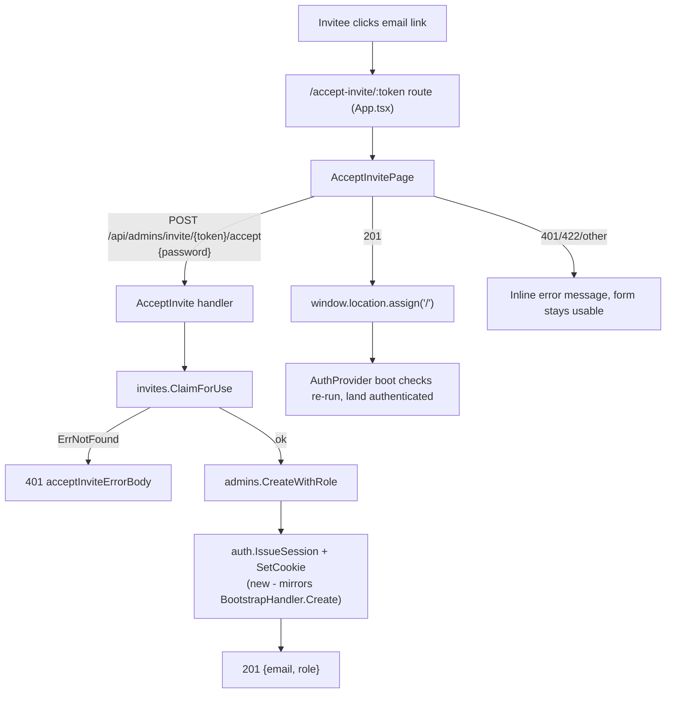

# Accept Invite Page Design

**Spec**: `.specs/features/accept-invite-page/spec.md`
**Status**: Draft

---

## Architecture Overview

No new architectural pattern - this is a straightforward extension of two existing, already-proven pieces: `BootstrapPage.tsx`'s "public password-creation form → full reload" pattern (frontend) and `BootstrapHandler.Create`'s "create account → `SetCookie` → 200" pattern (backend), applied to the already-implemented `AcceptInvite` handler. Single approach, no alternatives worth presenting.

---

## Code Reuse Analysis

### Existing Components to Leverage

| Component | Location | How to Use |
| --------- | -------- | ---------- |
| `BootstrapPage.tsx`'s form/layout/error-handling shape | `web/src/features/auth/BootstrapPage.tsx:1-70` (state, `handleSubmit`, `ApiError` branching) and its JSX layout (brand panel + form panel) | Copy the pattern for `AcceptInvitePage.tsx` - password/confirm state, mismatch check, `submitting` boolean, same branded two-column layout (reuse `useBrandLogoUrl`), same `Field`/`Button` components |
| `sessionCookie(value, maxAge, secure)` | `internal/api/auth_handler.go:99-109` | Call as-is from `AcceptInvite` after `CreateWithRole` succeeds, mirroring `bootstrap_handler.go:113-119` exactly (`auth.IssueSession` → `http.SetCookie`) |
| `apiFetch` with `skipUnauthorizedHandler: true` | `web/src/lib/apiClient.ts:58-91`, used at `BootstrapPage.tsx:40-44` | Same call shape for the accept-invite POST - this is a public, session-less endpoint, so a 401 must not trigger the global "session expired" modal |
| `chi.URLParam(r, "token")` | `internal/api/admins.go:230` (`AcceptInvite`, already extracts the token) | No backend change needed here - only the post-success `SetCookie` is new |
| React Router `useParams` | already used by other routed pages in this app (e.g. any `:id` route) | `AcceptInvitePage` reads `token` via `useParams<{ token: string }>()` |
| `Field`, `Button` UI components | `web/src/components/ui/` | Same components `BootstrapPage` already uses for password/confirm inputs and the submit button |

### Integration Points

| System | Integration Method |
| ------ | ------------------- |
| `App.tsx` route table | New `<Route path="/accept-invite/:token" element={<AcceptInvitePage />} />`, outside `RequireAuth`/`RedirectToBootstrapIfNeeded` - same un-guarded placement as `/status/:id`, per the confirmed "no guard" assumption |
| `AcceptInvite` handler | Gains a `sessionSecret string` + `secureCookies bool` field on `AdminsHandler` (constructor grows accordingly, same pattern already accepted in `admin-invite-resend-cancel`'s design for `emailSvc`/`companySettings`); after `CreateWithRole` succeeds, issues a session and sets the cookie before writing the 201 body |
| `internal/cli/routes.go` | `NewAdminsHandler(...)` call site passes `cfg.SessionSecret` and `cfg.SecureCookies` (both already loaded into `cfg` and already passed to `api.NewAuthHandler`/`api.NewBootstrapHandler` at that same call site) |
| MSW test mocks | New handler for `POST /api/admins/invite/:token/accept` in `web/src/test/msw/handlers.ts`, extending the existing `adminInvitesState` (already populated by the `admin-invite-resend-cancel` mocks) to support claim-and-consume semantics |

---

## Components

### `AcceptInvitePage` (new)

- **Purpose**: Public page at `/accept-invite/:token` - invitee sets a password, backend creates their admin account and authenticates them.
- **Location**: `web/src/features/auth/AcceptInvitePage.tsx`
- **Interfaces**: Default export, no props (reads `token` from the route via `useParams`)
- **Dependencies**: `apiFetch`/`ApiError` (`web/src/lib/apiClient.ts`), `Field`/`Button` (`web/src/components/ui/`), `useBrandLogoUrl` (`web/src/lib/branding.ts`), `react-i18next`
- **Reuses**: `BootstrapPage.tsx`'s exact structure (state shape, mismatch check, submit handler, branded layout) - no `hooks.ts`, matching the Assumptions decision

### `AdminsHandler.AcceptInvite` (modified)

- **Purpose**: Unchanged responsibility (validate password, claim invite, create admin) plus one addition: authenticate the newly created admin before responding.
- **Location**: `internal/api/admins.go` (modify `AcceptInvite`, `AdminsHandler` struct, `NewAdminsHandler`)
- **Interfaces**: `NewAdminsHandler(pool *db.Pool, admins *db.AdminRepository, invites *db.AdminInviteRepository, emailSvc *email.Service, companySettings *db.CompanySettingsRepository, auditLog *audit.Log, logger *zap.Logger, devTokenLogging, httpsEnabled bool, sessionSecret string, secureCookies bool) *AdminsHandler`
- **Dependencies**: `auth.IssueSession`, `sessionCookie` (both already implemented, `internal/auth`/`internal/api`)
- **Reuses**: `bootstrap_handler.go:113-119`'s exact issue-then-set-cookie sequence

---

## Data Models

None new. `AcceptInvite`'s request/response bodies are unchanged (`acceptAdminInviteRequest{Password}` in, `acceptAdminInviteResponse{Email,Role}` out) - only a response *header* (`Set-Cookie`) is added.

---

## Error Handling Strategy

| Error Scenario | Handling | User Impact |
| --------------- | -------- | ----------- |
| Password/confirm mismatch (client-side) | Blocked before any network call, same as `BootstrapPage` | Inline message, form stays interactive |
| `401` (invalid/expired/used/empty token) | `ApiError` caught, generic message shown (no cause distinction, matches backend's anti-enumeration design) | "This invite link is invalid or has expired. Ask your admin to send a new one." |
| `422` (missing password / weak password) | `ApiError` caught, `err.message` shown verbatim (server's exact string) | Server's exact validation message |
| Network failure / non-`ApiError` throw / 5xx | Generic fallback message (i18n key, mirrors `bootstrap.genericError`) | Non-blank, non-raw-JSON fallback text |
| Double-submit while request in flight | `submitting` boolean disables the submit button | No duplicate `POST`, no duplicate-account race exposed to the UI |

---

## Risks & Concerns

| Concern | Location (file:line) | Impact | Mitigation |
| ------- | --------------------- | ------ | ---------- |
| `AdminsHandler`'s constructor keeps growing (9 params today → 11) | `internal/api/admins.go` (`NewAdminsHandler`) | Readability cost, not a correctness risk - already flagged and accepted in `admin-invite-resend-cancel`'s design | Accepted again here for the same reason (YAGNI on a config-struct refactor); if a *third* feature needs to grow this constructor, that refactor stops being premature |
| `AcceptInvite` currently has no test asserting response headers at all (only body/status) | `internal/api/admins_test.go` (existing `TestAcceptInvite_*` tests) | The new `Set-Cookie` behavior has zero existing coverage to extend from - must be asserted fresh | New task's tests read `rec.Result().Cookies()` directly (same technique `TestLogin_*` in `auth_handler_test.go` presumably already uses for the login cookie - verify during Tasks) |
| No frontend precedent yet for "read a route param and call an unauthenticated POST that sets a cookie, then hard-reload" combined in one page | `web/src/features/auth/` | First page to combine all three; a wrong reload timing (before the `Set-Cookie` response header is fully processed by the browser) could race | `window.location.assign` only runs in the `try` block's success path, after `await apiFetch(...)` resolves - the browser has already committed the `Set-Cookie` header by the time the JS continues, same ordering `BootstrapPage` already relies on safely |

> No security, data-loss, or perf concerns found beyond the above.

---

## Tech Decisions

| Decision | Choice | Rationale |
| -------- | ------ | --------- |
| Where the page lives | `web/src/features/auth/AcceptInvitePage.tsx` | Same directory as `BootstrapPage`/`LoginPage`/`PasswordResetRequestPage` - all public, session-less auth-adjacent pages already live here; no new feature directory needed for one file |
| Cookie issuance location | Inside `AcceptInvite` itself, not a separate "login after accept" endpoint | Matches `BootstrapHandler.Create`'s precedent exactly - one atomic handler action, no two-network-call dance from the frontend |
| No `hooks.ts` for this feature | Inline `apiFetch` call in the page component | Single one-shot mutation, no shared state to manage across components - same reasoning `BootstrapPage` already applies |
| Route placement (guard-free) | Registered alongside `/status/:id`, outside every guard block in `App.tsx` | Confirmed with user; matches existing precedent, avoids inventing a new guard type for one route |

---
