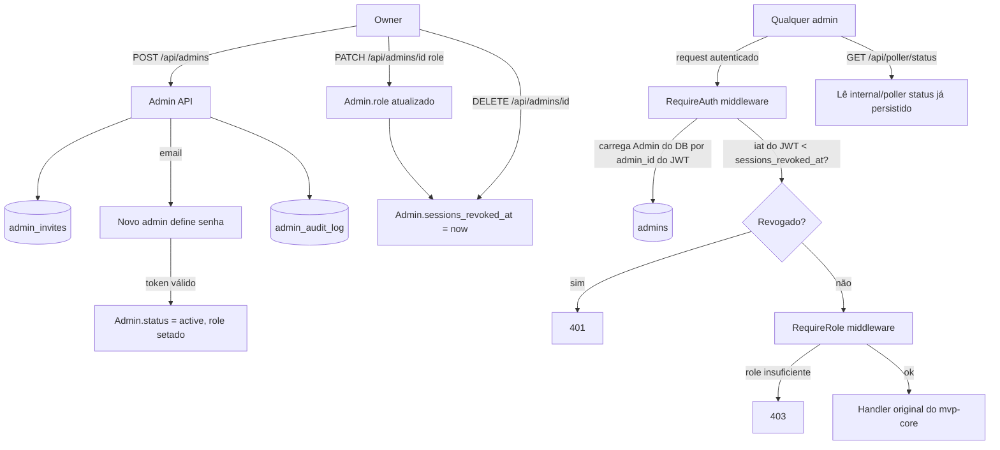

# Admin Dashboard Design

**Spec**: `.specs/features/admin-dashboard/spec.md`
**Status**: Draft

---

## Architecture Overview

Extensão do backend já desenhado em `mvp-core` (Go, chi, pgx/v5, jwt/v5) — sem novo serviço, sem novo processo. Adiciona: coluna de papel e coluna de revogação de sessão no `Admin`, middleware de autorização por papel sobre as rotas já existentes, tabela de convite de admin (mesmo padrão de `password_reset_tokens`), tabela de audit log append-only, e endpoint de leitura de status do poller reaproveitando dado já persistido pelo `internal/poller`.



---

## Code Reuse Analysis

### Existing Components to Leverage

| Component | Location | How to Use |
| --- | --- | --- |
| `password_reset_tokens` + fluxo de token por email | `internal/db/migrations` + `internal/api` (T13/T14 do mvp-core) | Mesmo padrão pro convite de admin: tabela de token com hash, expira em 1h, endpoint de "consumir token e definir senha" |
| `RequireAuth` middleware (T12) | `internal/api/middleware.go` | Estendido, não substituído — passa a carregar o `Admin` do Postgres (não só validar assinatura/exp do JWT) pra checar `role` e `sessions_revoked_at` atuais |
| `internal/poller` (status já calculado por integração) | `internal/poller/` (T22-T25 do mvp-core) | Endpoint novo só lê o dado que o poller já persiste (`Integration.LastCheckedAt`, `LastError`, `Status`) — nenhuma lógica de fetch nova |
| Convenção de erro HTTP (nunca vazar erro cru) | `internal/api` (mvp-core) | Mesma convenção nos novos endpoints de admin |

### Integration Points

| System | Integration Method |
| --- | --- |
| `internal/auth` (jwt/v5) | Sem mudança no formato do JWT — `iat` já existe por padrão na lib; comparação é feita no middleware, não no token |
| Postgres | 1 migration adicionando colunas em `admins` + 2 tabelas novas (`admin_invites`, `admin_audit_log`) |

---

## Components

### `internal/auth` (extensão)

- **Purpose**: Middleware `RequireAuth` passa a carregar o `Admin` atual do banco (por `admin_id` do claim do JWT) e rejeitar se o token foi emitido antes da última revogação. Novo middleware `RequireRole` checa o papel carregado contra os papéis permitidos pra rota.
- **Location**: `internal/api/middleware.go`
- **Interfaces**:
  - `RequireAuth(next http.Handler) http.Handler` - valida JWT, carrega `Admin`, rejeita com 401 se `token.iat < admin.SessionsRevokedAt`, injeta `Admin` no `context`
  - `RequireRole(roles ...string) func(http.Handler) http.Handler` - lê `Admin` do `context` (setado por `RequireAuth`), rejeita com 403 se `Admin.Role` não estiver em `roles`
- **Dependencies**: `internal/db` (repositório de Admin), `jwt/v5`
- **Reuses**: `RequireAuth` já existente (T12) — estende, não duplica

### `internal/api/admins.go`

- **Purpose**: Handlers REST de gestão de admin — convite, mudança de papel, remoção, consumo de token de convite.
- **Location**: `internal/api/admins.go`
- **Interfaces**:
  - `POST /api/admins` (role: owner) - convida admin (email + role)
  - `POST /api/admins/invite/{token}/accept` (público) - define senha, ativa conta
  - `PATCH /api/admins/{id}/role` (role: owner) - muda papel, revoga sessões do afetado
  - `DELETE /api/admins/{id}` (role: owner) - remove admin, revoga sessões
  - `GET /api/admins` (role: owner) - lista admins e papéis
- **Dependencies**: `internal/db`, envio de email (mesmo mecanismo do reset de senha do mvp-core)
- **Reuses**: padrão de `password_reset_tokens` (T13/T14) adaptado pra `admin_invites`

### `internal/api/poller_status.go`

- **Purpose**: Expor leitura do status do poller pro dashboard.
- **Location**: `internal/api/poller_status.go`
- **Interfaces**:
  - `GET /api/poller/status` (role: owner, operator, viewer) - retorna, por `Integration`, `last_checked_at`, `status`, `last_error`
- **Dependencies**: `internal/db` (repositório de `Integration`, já existente no mvp-core)
- **Reuses**: `Integration.LastCheckedAt`/`LastError`/`Status` já persistidos pelo poller (T24 do mvp-core) — sem novo cálculo

### `internal/audit`

- **Purpose**: Registrar ações sensíveis de gestão de admin, append-only.
- **Location**: `internal/audit/log.go`
- **Interfaces**:
  - `Record(ctx, actorID, targetID, action string) error` - insere linha em `admin_audit_log`
- **Dependencies**: `internal/db`
- **Reuses**: nenhum — componente novo, mas trivial (1 insert)

---

## Data Models

```go
// Admin (mvp-core) recebe 2 colunas novas:
type Admin struct {
    ID                string
    Email             string
    PasswordHash      string
    Role              string     // "owner" | "operator" | "viewer" - default "owner" pro primeiro admin criado
    SessionsRevokedAt *time.Time // nil = nenhuma sessão revogada; JWT com iat < este valor é rejeitado
    CreatedAt         time.Time
}

type AdminInvite struct {
    ID            string
    Email         string
    Role          string // papel que o convite vai atribuir na ativação
    TokenHash     string
    InvitedByID   string
    ExpiresAt     time.Time
    UsedAt        *time.Time
    CreatedAt     time.Time
}

type AdminAuditLog struct {
    ID         string
    ActorID    string // admin que executou a ação
    TargetID   string // admin afetado
    Action     string // "invited" | "role_changed" | "removed"
    CreatedAt  time.Time
}
```

**Relationships**: `AdminInvite.InvitedByID` → `Admin.ID`. `AdminAuditLog.ActorID`/`TargetID` → `Admin.ID`. Sem cascade delete em `AdminAuditLog` — remover um admin não remove o histórico de auditoria que o cita.

**Constraint de lockout**: aplicada em código (transação: contar `Admin` com `Role = 'owner'` e sem revogação pendente antes de aplicar `DELETE`/`PATCH role`), não em constraint de banco — a regra depende de contagem cross-row, não de um único registro.

---

## Error Handling Strategy

| Error Scenario | Handling | User Impact |
| --- | --- | --- |
| Convite duplicado pro mesmo email (pending) | Invalida `AdminInvite` anterior, cria novo token | Admin recebe novo link; link antigo passa a retornar 410 |
| Token de convite expirado/usado | Rejeita com 401 no accept | Novo admin vê mensagem específica, pede novo convite ao owner |
| Ação resultaria em zero `owner` ativo | Rejeita antes de aplicar, 409 | Owner vê mensagem explicando que precisa de outro owner antes |
| `viewer` tenta ação de escrita em endpoint do mvp-core | `RequireRole` rejeita antes do handler original rodar | 403 uniforme, mesma convenção de erro do mvp-core |
| JWT com `iat` anterior à revogação | `RequireAuth` rejeita | 401, força novo login |

---

## Risks & Concerns

| Concern | Location (file:line) | Impact | Mitigation |
| --- | --- | --- | --- |
| `RequireAuth` (T12 do mvp-core) hoje só valida assinatura/expiração do JWT, sem tocar o banco — carregar `Admin` do Postgres em toda requisição autenticada é 1 query extra por request | `internal/api/middleware.go` (T12, mvp-core) | Aceitável na escala de instalação self-hosted single-tenant (poucos admins, baixo volume); não é gargalo real, mas é uma mudança de comportamento do middleware existente | Documentar explicitamente que `RequireAuth` passa a depender do banco a partir desta feature — sem esse fetch não há como checar `Role` atual nem `SessionsRevokedAt` (colocar isso como nota no PR/commit que estende T12) |
| Checagem de lockout (zero owners) precisa ser atômica (contagem + ação numa mesma transação), senão duas requisições concorrentes podem remover os 2 últimos owners ao mesmo tempo | `internal/api/admins.go` (novo) | Em teoria abre uma janela de corrida que zera os owners, mesmo com a regra implementada | Usar transação com `SELECT ... FOR UPDATE` na contagem de owners antes do `UPDATE`/`DELETE` do admin afetado |
| Primeiro admin do sistema (bootstrap, fora do fluxo de convite) precisa nascer com `role = "owner"` — mvp-core não especificou isso porque não existia conceito de papel ainda | `internal/db/migrations` (T8, mvp-core) | Sem isso, o sistema pode nascer sem nenhum owner e cair no próprio bloqueio de lockout já no primeiro login | Migration desta feature seta `role = 'owner'` como default da coluna E faz backfill explícito pro admin já existente (se a migration do mvp-core já rodou antes) |

---

## Tech Decisions

| Decision | Choice | Rationale |
| --- | --- | --- |
| Mecanismo de revogação de sessão | Coluna única `sessions_revoked_at` no `Admin`, comparada contra `iat` do JWT | Resolve exatamente o requisito (revogar todas as sessões de 1 admin) sem denylist crescente e sem abandonar JWT stateless (mantém AD-001) — ver comparação de abordagens discutida e aprovada com o usuário |
| Formato do papel | Coluna `role` (`text` com `CHECK` constraint nos 3 valores), não tabela separada de roles/permissions | 3 papéis fixos no MVP (AD-003) — tabela separada só faria sentido se permissão fosse configurável, o que está fora de escopo |
| Checagem de lockout | Em código, com `SELECT FOR UPDATE`, não em constraint de banco | Regra depende de contagem cross-row (quantos owners existem), não expressável como constraint simples de coluna/linha |

---

## Open Follow-ups (não bloqueiam esta feature, mas precisam de decisão antes da Task correspondente)

- Confirmar, na Task de migration, se o(s) admin(s) já existentes de instalações que rodaram o `mvp-core` antes desta feature precisam de backfill manual de `role = 'owner'` (ambiente de desenvolvimento atual do zeep-vane ainda não tem código implementado, então provavelmente não há dado real a migrar — validar no momento da Task).
