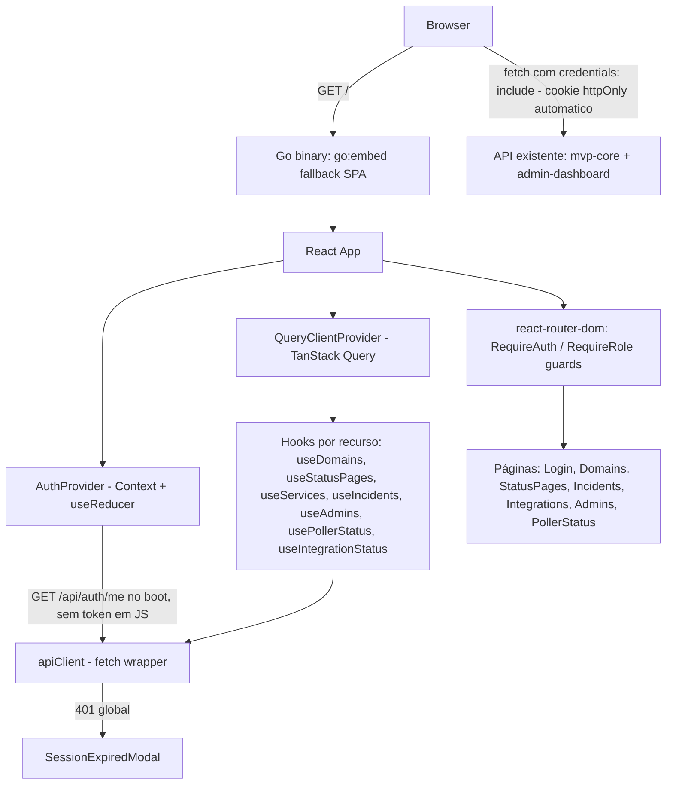

# Admin Frontend Design

**Spec**: `.specs/features/admin-frontend/spec.md`
**Context**: `.specs/features/admin-frontend/context.md`
**Status**: Draft

---

## Approach Exploration

Context.md já trava a stack (Vite + React 18 + TS + Radix + Tailwind v4 + TanStack Query + react-router-dom + sonner + i18next) e o padrão de embed (`go:embed`, reuso de `zeep-orbit/internal/dashboard/embed.go`). A decisão de arquitetura real em aberto era **onde vive o token de sessão no client** — revisada a pedido explícito do usuário para usar cookie, não `sessionStorage`/`localStorage`.

| Approach | Como funciona | Trade-off |
| --- | --- | --- |
| **A — Token em `sessionStorage`/`localStorage`, lido pelo JS** | Client guarda o token retornado no corpo do login e injeta `Authorization: Bearer` manualmente em cada fetch | Simples, mas qualquer XSS bem-sucedido consegue ler o token via JS — rejeitado por decisão explícita do usuário |
| **B — Cookie `httpOnly` (escolhido)** | Login passa a também setar um cookie `httpOnly`/`Secure`/`SameSite=Strict` com o mesmo token; browser anexa o cookie sozinho em cada requisição same-origin; JavaScript nunca tem acesso de leitura ao token | Elimina a superfície de XSS-rouba-token por completo (JS não lê cookie `httpOnly`); exige mudança aditiva no backend (login seta cookie além do corpo, `RequireAuth` aceita cookie além do header, novo endpoint de logout) |
| **C — Cookie sem o corpo `{token}` atual (substituindo, não aditando)** | Login para de retornar o token no corpo, só seta o cookie | Mais "limpo", mas quebra qualquer teste/consumidor que hoje dependa de `{token}` no corpo do login (`internal/api/auth_handler_test.go`) — reabre risco de regressão sem necessidade, quando dá pra ser 100% aditivo |

**Escolha: Approach B, de forma aditiva (não C).** O login passa a fazer as duas coisas — mantém `{token}` no corpo (retrocompatível com o que já existe e está testado) **e** seta o cookie `httpOnly` (o que a SPA de fato usa). `RequireAuth` passa a aceitar token vindo do cookie **ou** do header `Authorization` (aditivo — testes existentes que usam header continuam passando sem alteração). Isso resolve o pedido do usuário sem reabrir nem quebrar o contrato de login já validado (PASS).

**Atributos do cookie**: `httpOnly` (JS não lê), `Secure` (só enviado sobre HTTPS — consistente com CertMagic/TLS já obrigatório em produção via AD-001), `SameSite=Strict` (não é enviado em requisição cross-site, elimina a maior parte do risco de CSRF numa API JSON same-origin), `Path=/`, `Max-Age` igual ao `exp` do JWT (24h, mesma TTL já usada).

Isto revisa `AD-004` (registrada anteriormente como "token em `sessionStorage`") — ver Tech Decisions e STATE.md.

---

## Architecture Overview

SPA React servida pelo mesmo binário Go (`go:embed`, reuso de `zeep-orbit/embed.go` adaptado para o path da SPA admin já definido em `mvp-core/design.md`). Same-origin com a API — sem CORS. Todo dado de servidor passa por TanStack Query; autenticação vive num Context próprio que envolve a árvore de rotas protegidas.



---

## Code Reuse Analysis

### Existing Components to Leverage

| Component | Location | How to Use |
| --- | --- | --- |
| Stack de referência (Vite+React+Radix+Tailwind+TanStack Query+react-router-dom+sonner+i18next) | `zeep-orbit/internal/dashboard/ui/package.json` | Copiar as mesmas dependências e versões como ponto de partida do `web/package.json` deste projeto |
| Padrão de embed + fallback SPA | `zeep-orbit/internal/dashboard/embed.go` | Adaptar para servir a SPA admin deste projeto a partir de `internal/webui/static` (path já previsto em `mvp-core/design.md:109`) — mesma lógica de `fs.Sub` + fallback pra `index.html`, sem reescrever do zero |
| `buildAdminRouter` (rotas reais da API) | `internal/cli/routes.go` | Contrato consumido pelo `apiClient` — todas as rotas de leitura/escrita já mapeadas (ver Data Models e Components) |
| Middleware `RequireAuth`/`RequireRole` | `internal/api` (via `routes.go:45-48`) | Os 3 novos endpoints de leitura (AF-34/35/36/38) usam os mesmos middlewares já existentes (`requireAuth` + `anyRole`/`ownerOnly`), sem novo padrão de autorização |

### Integration Points

| System | Integration Method |
| --- | --- |
| API REST existente (mvp-core + admin-dashboard) | `fetch` same-origin com header `Authorization: Bearer <token>`, JSON in/out conforme contratos extraídos de `internal/api/*.go` |
| Backend — 4 endpoints novos (AF-34 a AF-38) | Adição pura de leitura em `internal/api` + `internal/cli/routes.go`, reaproveitando repositórios/middlewares já existentes; não altera nenhum endpoint atual |

---

## Backend Additions (pré-requisito das telas — AF-34 a AF-41)

Antes de qualquer tela React, adições pequenas e **aditivas** no backend Go, seguindo exatamente os padrões já validados (PASS) em `mvp-core`/`admin-dashboard`:

1. **`GET /api/auth/me`** — novo handler em `internal/api`, atrás de `requireAuth` (qualquer papel). Lê o `Admin` já carregado no contexto pelo `RequireAuth` (o middleware já busca o admin do Postgres por request — reuso direto, sem nova query) e retorna `{ id, email, role }`.
2. **`GET /api/domains`** — novo método `List` em `internal/db` (repositório de domínio, mesmo padrão do `List` já adicionado em `IntegrationRepository` na feature anterior) + handler `anyRole`.
3. **`GET /api/status-pages`** — novo método `List` no repositório de status page + handler `anyRole`.
4. **`GET /api/admins` estendido** — novo método `List` em `AdminInviteRepository` (retorna convites não usados e não expirados); `AdminsHandler.List` passa a mesclar admins ativos + convites pendentes, cada item com campo `status`.
5. **`Login` passa a setar cookie além do corpo** — `AuthHandler.Login` (`internal/api/auth_handler.go:49`) ganha uma linha extra que seta `http.Cookie{Name: "vane_session", Value: token, HttpOnly: true, Secure: true, SameSite: http.SameSiteStrictMode, Path: "/", MaxAge: <mesmo TTL do JWT>}` via `http.SetCookie`, mantendo o corpo `{token}` inalterado — nenhum teste existente de login quebra.
6. **`RequireAuth` aceita cookie além do header** — `bearerToken` (`internal/api/middleware.go:53/84`) passa a, na ausência do header `Authorization`, tentar ler o cookie `vane_session` via `r.Cookie("vane_session")`. Testes existentes que setam o header continuam passando sem alteração (comportamento aditivo, header tem prioridade).
7. **`POST /api/auth/logout`** — novo handler, atrás de `requireAuth` (qualquer papel), que seta o mesmo cookie com `MaxAge: -1` (expira imediatamente) e responde 200. Não precisa de nova query — é limpeza de cookie pura, a revogação de sessão real (`sessions_revoked_at`) já existe para os casos de remoção/rebaixamento de admin.
8. **`GET /api/integrations/datadog/slos?query=`** — novo handler + novo método `SearchSLOs(ctx, query string) ([]SLOSummary, error)` em `internal/connectors/datadog/client.go`, reaproveitando `sloSearchPath` (mesmo endpoint já usado por `FetchSLOStatus`/`ValidateCredentials`) trocando o filtro `id:<sloID>` por uma query de nome livre (`query:"<term>"` ou equivalente aceito pela API de busca de SLO do Datadog — confirmar sintaxe exata na Tasks/Execute via doc oficial do Datadog, não inventar). Handler decodifica só `{id, name}` de cada resultado.

Cada um vira uma task Go normal na fase de Tasks (com teste de integração próprio, gate `go test`, commit atômico) — não é código React. Itens 5-7 tocam código já coberto por `middleware_test.go`/`auth_handler_test.go` (ambos PASS) — a task correspondente deve rodar a suíte existente sem alterá-la, além de adicionar os testes novos do comportamento de cookie.

---

## Components

### `web/src/lib/apiClient.ts`

- **Purpose**: Único ponto de chamada HTTP ao backend — sempre com `credentials: "include"` (envia o cookie `httpOnly` automaticamente), centraliza parsing de erro, detecta 401 global. Nunca lê nem escreve token — o navegador cuida do cookie sozinho.
- **Location**: `web/src/lib/apiClient.ts`
- **Interfaces**:
  - `apiFetch<T>(path: string, init?: RequestInit): Promise<T>` — sempre passa `credentials: "include"`; lança `ApiError { status, message }` em não-2xx; em 401, dispara `onUnauthorized()` (callback registrado pelo `AuthProvider`) antes de rejeitar.
- **Dependencies**: nenhuma — sem getter de token, sem estado próprio (diferença chave da versão anterior deste design, que injetava token manualmente).
- **Reuses**: nenhum código existente (é o primeiro client HTTP do projeto) — segue o mesmo formato de erro `{ error: string }` já usado em todos os handlers Go lidos.

### `web/src/auth/AuthProvider.tsx`

- **Purpose**: Guarda só `{ admin: {id,email,role} | null, status: "loading"|"authenticated"|"anonymous" }` — nunca um token (o cookie `httpOnly` é invisível ao JS por design). Hidrata via `GET /api/auth/me` no boot (o cookie, se existir e for válido, já autentica essa chamada sozinho); expõe `login`, `logout`, `hasRole`.
- **Location**: `web/src/auth/AuthProvider.tsx`
- **Interfaces**:
  - `useAuth(): { admin, status, login(email,password), logout(), hasRole(roles: Role[]): boolean }` — `login` chama `POST /api/auth/login` (cookie é setado pelo backend como efeito colateral da resposta), lê do corpo **apenas** os campos de identidade (`id`/`email`/`role`) pra atualizar `admin`, e descarta explicitamente qualquer campo `token` do corpo sem atribuí-lo a variável, estado ou storage algum; `logout` chama `POST /api/auth/logout` (backend expira o cookie) e limpa `admin` local.
- **Dependencies**: `apiClient`.
- **Reuses**: nomenclatura `hasRole`/papéis espelha `RequireRole` do backend (`internal/api`) — mesmo vocabulário em ambas as pontas.

### `web/src/auth/SessionExpiredModal.tsx`

- **Purpose**: Modal bloqueante disparado pelo callback `onUnauthorized` do `apiClient`; ao confirmar, limpa sessão e redireciona para `/login`.
- **Location**: `web/src/auth/SessionExpiredModal.tsx`
- **Interfaces**: sem props — lê estado global de "sessão expirada" do `AuthProvider`.
- **Dependencies**: `AuthProvider`, `react-router-dom` (`navigate`).
- **Reuses**: componente `Dialog` do Radix (já na stack de referência).

### `web/src/routes/RequireRole.tsx`

- **Purpose**: Guard de rota — redireciona para `/login` se não autenticado, ou para a home do dashboard se o papel não está na lista permitida (edge case: acesso direto por URL a rota restrita).
- **Location**: `web/src/routes/RequireRole.tsx`
- **Interfaces**: `<RequireRole roles={["owner"]}><Outlet/></RequireRole>` (padrão de rota aninhada do `react-router-dom`).
- **Dependencies**: `useAuth`.
- **Reuses**: mesmo conceito de `writeRoles`/`anyRole`/`ownerOnly` do backend (`routes.go:46-48`), só que client-side.

### Hooks por recurso (`web/src/features/*/hooks.ts`)

- **Purpose**: Um hook TanStack Query por recurso — `useDomains`, `useStatusPages`, `useServices`, `useIncidents`, `useAdmins`, `usePollerStatus`, `useIntegrationStatus` — e as mutations correspondentes (`useCreateDomain`, `useCreateStatusPage`, `useInviteAdmin`, etc).
- **Location**: `web/src/features/domains/hooks.ts`, `web/src/features/status-pages/hooks.ts`, etc (um diretório por recurso).
- **Interfaces**: cada hook segue `useX(): UseQueryResult<X[]>`; mutations seguem `useCreateX(): UseMutationResult<X, ApiError, CreateXInput>`, com `onSuccess` invalidando a query correspondente.
- **Dependencies**: `apiClient`, `@tanstack/react-query`.
- **Reuses**: `apiClient` como única camada de transporte.

### `web/src/features/status-pages/StatusPageDetail.tsx`

- **Purpose**: Tela de detalhe de uma status page — implementa o polling de 10s enquanto `state` não for `"published"` nem `"tls_failed"` (AF-14).
- **Location**: `web/src/features/status-pages/StatusPageDetail.tsx`
- **Interfaces**: usa `useStatusPages` com `refetchInterval: (query) => isTerminal(query.state.data?.state) ? false : 10_000`.
- **Dependencies**: `useStatusPages` (ou um `useStatusPage(id)` derivado do cache da lista).
- **Reuses**: mesmo hook de listagem, sem endpoint dedicado de detalhe (API só expõe lista, ver Data Models).

### Visual/Design System Layer (Nocturne)

Handoff de design de alta fidelidade recebido em `dashboard-handoff/README.md` + `dashboard-handoff/nocturne-styles.css` — dark-mode, tokens exatos (cores, type scale, spacing, radius, shadows), 8 componentes-base. O README do próprio handoff instrui recriar os valores no framework alvo, não linkar o CSS do handoff no app real ("recreate ... reading colors/spacing from the token list, not by linking the CSS file into a real app") — os componentes abaixo consomem os tokens, nunca o arquivo `nocturne-styles.css` diretamente.

- **`web/src/styles/tokens.css`** — Purpose: única fonte de verdade dos tokens visuais (cores bg/surface/text/accent/accent-2, ramps neutral/accent 100-900, 3 semânticos estendidos em OKLCH — success/warning/critical —, type scale Inter, spacing 2.8-22.4px, radius sm/md/lg, shadows sm/md/lg). Location: `web/src/styles/tokens.css` + `@theme` do Tailwind v4. Dependencies: nenhuma. Reuses: valores (não o arquivo) de `dashboard-handoff/nocturne-styles.css`.
- **`Button`** — Purpose: variantes primary (outline accent, nunca fill sólido)/secondary (outline divider)/ghost (texto accent, sem borda)/icon (36×36, sem label); hover tint um passo, press tint mais fundo, disabled 45% opacidade. Location: `web/src/components/ui/Button.tsx`. Dependencies: tokens.
- **`Input`/`Field`** — Purpose: label acima, 36px min-height, fundo surface, borda divider, borda accent + sem outline-offset extra no focus. Location: `web/src/components/ui/{Input,Field}.tsx`. Dependencies: tokens.
- **`Tag`** — Purpose: pill 11px — variantes accent (filled)/neutral (filled)/outline (borda accent); os 3 tags de status semânticos usam `color-mix()` tintado (fundo+texto), nunca fill saturado. Location: `web/src/components/ui/Tag.tsx`. Dependencies: tokens.
- **`Table`** — Purpose: linhas simples, header uppercase 11px tracked, hairline rows que esmaecem (fade) 48px de cada borda — assinatura Nocturne, nunca borda sólida full-width. Location: `web/src/components/ui/Table.tsx`. Dependencies: tokens.
- **`Card`** — Purpose: fundo surface, radius 8px, `elev-sm/md/lg`. Location: `web/src/components/ui/Card.tsx`. Dependencies: tokens.
- **`Dialog`** — Purpose: wrapper sobre `Dialog` do Radix (behavior) + estilo Nocturne (28px padding interno, `shadow-lg` com ring `--color-divider` em vez de neutral-500, max-width 360-440px conforme conteúdo); aceita prop para desabilitar dismiss por clique no backdrop (necessário pro modal de sessão expirada). Location: `web/src/components/ui/Dialog.tsx`. Dependencies: Radix `Dialog`, tokens, `Button`.
- **`Seg`** — Purpose: segmented control (papel na tela Admins, tabs Ativos/Resolvidos em Incidentes); segmento ativo com texto accent + ring inset accent, borda divider 1px. Location: `web/src/components/ui/Seg.tsx`. Dependencies: tokens.
- **`IconRoleSelector`** — Purpose: 3 ícones inline-SVG (shield/wrench/eye) por linha de admin; papel atual renderiza em accent + fundo tintado, os outros 2 a 40% opacidade; dispara só `onSelect(role)`, sem confirmação embutida (confirmação é responsabilidade de quem consome, na `AdminsPage`). Location: `web/src/components/ui/IconRoleSelector.tsx`. Dependencies: tokens.

Ícones: Phosphor (`@phosphor-icons/react`), peso regular, ~15-17px em UI — substitui os SVGs desenhados à mão do protótipo do handoff.

### `web/src/features/poller/PollerBanner.tsx`

- **Purpose**: Banner global fixo no topo da SPA, visível em qualquer rota autenticada, quando `usePollerStatus` retorna algum item com `status !== "active"` (nome real do campo confirmado em `GET /api/poller/status`, ver Data Models).
- **Location**: `web/src/features/poller/PollerBanner.tsx`
- **Interfaces**: sem props — monta acima do `<Outlet/>` no layout autenticado.
- **Dependencies**: `usePollerStatus` (com `refetchInterval` fixo, ex. 30s, consistente com o ciclo de polling do backend de 2 minutos sem sobrecarregar).
- **Reuses**: mesmo hook usado pela página dedicada "Status do Poller" (AF-31/32) — sem duplicar fetch, consistente com a decisão já registrada no `admin-dashboard/spec.md` (ADM-14) de não duplicar lógica de fetch.

---

## Data Models

TypeScript, espelhando 1:1 os contratos JSON confirmados em `internal/api/*.go` (nenhum campo inventado):

```typescript
type Role = "owner" | "operator" | "viewer"

interface Admin {
  id: string
  email: string
  role: Role
  status: "active" | "pending" // "pending" só existe após AF-38 (extensão de GET /api/admins)
}

interface Domain {
  id: string
  hostname: string
  created_at: string // RFC3339
}

interface Service {
  id: string
  name: string
  slo_id: string
  current_status: "not_configured" | "operational" | "degraded"
  last_status_change_at: string
}

interface Incident {
  id: string
  title: string
  status: "investigating" | "identified" | "monitoring" | "resolved"
  created_at: string
  resolved_at: string | null
}

interface IncidentUpdate {
  id: string
  incident_id: string
  body: string
  created_at: string
}

interface StatusPage {
  id: string
  name: string
  subdomain: string
  domain_id: string
  state: "draft" | "published" | "tls_failed"
  tls_last_error: string | null
  created_at: string
}

interface IntegrationStatus {
  status: "active" | "invalid"
  last_checked_at: string | null
  last_error: string | null
}

interface PollerStatusEntry {
  provider: string
  status: string // mesmos valores de IntegrationStatus.status
  last_checked_at: string | null
  last_error: string | null
}

interface SLOSummary {
  id: string
  name: string
}
```

**Relationships**: `StatusPage.domain_id` → `Domain.id`; `Incident` associa a `Service[]` via `service_ids` só na criação (API não retorna a associação na leitura — não modelar como relação bidirecional no client, só o que a API de fato devolve).

---

## Error Handling Strategy

| Error Scenario | Handling | User Impact |
| --- | --- | --- |
| 401 em qualquer requisição autenticada | `apiClient` dispara `onUnauthorized()` global | Modal bloqueante "Sessão expirada" (AF-03) |
| 403 em ação de escrita (só alcançável via URL direta ou corrida de estado, já que a UI esconde a ação) | Toast de erro com a mensagem da API | Toast, sem crash de tela |
| 409 (conflito — domínio duplicado, lockout de owner, invite duplicado) | Toast de erro com a mensagem específica da API, formulário mantém os dados preenchidos | Usuário corrige e reenvia sem perder o que digitou |
| 422 (validação) | Erro inline no campo do formulário quando a API aponta o campo; fallback pra toast se a mensagem for genérica | Feedback no ponto exato do erro |
| Erro de rede/timeout | Toast genérico "Falha de conexão, tente novamente"; última visualização válida (cache do TanStack Query) permanece em tela | Sem tela em branco (edge case do spec) |
| Instalação nova (listas vazias) | Componente `EmptyState` por seção, com CTA da ação principal | Sem tabela vazia genérica |

---

## Risks & Concerns

| Concern | Location (file:line) | Impact | Mitigation |
| --- | --- | --- | --- |
| Token JWT não carrega role — só `sub` (ver `internal/auth/session.go`) | `internal/auth/session.go` | Frontend não pode decidir RBAC visual sem uma chamada extra | Endpoint `GET /api/auth/me` (AF-34) resolve isso já no boot da SPA, sem gambiarra de decodificar o JWT no client |
| `GET /api/admins` hoje só retorna admins ativos, convite pendente não é listável em lugar nenhum | `internal/db/admin_invites.go` (sem método `List`) | Decisão de UX já travada (lista única com badge "Pendente") ficaria irrealizável | AF-38 adiciona `List` ao repositório de convites e mescla no mesmo endpoint |
| Cookie `SameSite=Strict` + `Secure` exige HTTPS; ambiente de desenvolvimento local sem TLS não recebe o cookie do browser | N/A (decisão de arquitetura) | `apiFetch` funcionaria mas a sessão nunca persistiria em `http://localhost` puro | Task de setup do `web/` deve documentar rodar o dev server atrás do binário Go local com TLS (ou usar `mkcert`/certificado local), consistente com o fato de o próprio CertMagic (AD-001) já pressupor TLS; não é um requisito novo, é o mesmo ambiente que o backend já exige |
| `RequireAuth` aceitando token por 2 origens (cookie e header) aumenta levemente a superfície do middleware já validado (PASS) | `internal/api/middleware.go:53` | Regressão em código crítico de auth se mal implementado | Mudança é estritamente aditiva (header continua tendo prioridade, testes existentes de `middleware_test.go` não mudam); nova cobertura de teste específica para o caminho via cookie é obrigatória na task correspondente |
| Nenhum endpoint de detalhe único para `StatusPage`/`Domain` — só listagem (AF-36/37 mesmo assim só listam) | `internal/cli/routes.go` | Tela de detalhe de status page precisa derivar o item do cache da lista, não de um fetch dedicado | Aceitável no MVP (poucos itens esperados por instalação single-tenant, AD-002); se a lista crescer, endpoint de detalhe fica pra depois |
| Handoff de design (`dashboard-handoff/README.md`) descreve 4 estados de status page (`draft`→"Rascunho", `issuing`→"Emitindo certificado", `published`→"Publicada", `failed`→"Falha"); backend real só tem 3 e nunca escreve `issuing` | `internal/db/migrations/0007_status_pages.up.sql:6` (`state TEXT NOT NULL DEFAULT 'draft'`, sem CHECK), `internal/db/status_page_repository.go:128,147` (só `UPDATE` para `'published'`/`'tls_failed'`) | Sem resolução, a UI mostraria "Rascunho" logo após a criação, sem comunicar que a emissão de TLS está em andamento | Resolvido — ver Tech Decisions: `draft` é exibido como "Emitindo certificado" na UI, sem mudança de estado no backend |
| Handoff mostra Integrações (Datadog + serviços) como 1 tela só; `tasks.md` já separava em 2 rotas antes do handoff chegar | `dashboard-handoff/README.md` (screen 1) vs `tasks.md` (T22/T23 pós-amendment) | Divergência de estrutura de navegação entre design visual e tasks já escritas | Resolvido — ver Tech Decisions: mantidas 2 rotas, decisão explícita do usuário |
| Handoff mostra estado/URL/erro de TLS inline na linha da tabela de status pages, sem tela de detalhe separada; `tasks.md` já tinha `StatusPageDetail` como rota própria | `dashboard-handoff/README.md` (screen 2) vs `tasks.md` (T27 pós-amendment) | Mesma classe de divergência acima, mas na tela de status pages | Resolvido — ver Tech Decisions: `StatusPageDetail` mantida como rota própria |
| Handoff não especifica o copy exato de uma linha do banner global de falha de poller (só descreve "one-line copy") | `dashboard-handoff/README.md` (screen "Global poller-failure banner") | Sem o texto exato, a task de implementação precisaria inventar copy de produto | Não inventado como definitivo — `tasks.md` marca o texto atual como placeholder a confirmar em revisão de copy antes do lançamento |

---

## Tech Decisions (only non-obvious ones)

| Decision | Choice | Rationale |
| --- | --- | --- |
| Gerência de estado de auth | Context + `useReducer`, não Zustand/Redux | Nenhum projeto irmão usa store global externo pra isso; TanStack Query já cobre estado de servidor |
| Onde o token de sessão vive no client | Cookie `httpOnly`/`Secure`/`SameSite=Strict` setado pelo backend (decisão explícita do usuário) — nunca `localStorage`/`sessionStorage`, nunca lido por JS | Elimina completamente a superfície de XSS-rouba-token; troca "mais simples de implementar" por "mais seguro", aceitando o custo de mudança aditiva no backend — ver Risks & Concerns |
| Backend expõe endpoints novos + extensão de login/logout antes das telas | Sim, como pré-requisito de Tasks (AF-34 a AF-41) | Gap real descoberto no Design; sem eles a SPA não consegue implementar RBAC visual, popular selects, nem gerenciar sessão via cookie |
| Polling de status de TLS | `refetchInterval` do TanStack Query (10s), parado quando estado é terminal | Reaproveita a mesma infraestrutura de cache já usada pros outros recursos, sem novo mecanismo de polling |
| Implementação dos tokens visuais do handoff (Nocturne) | Tailwind v4 `@theme` + CSS vars (`web/src/styles/tokens.css`), componentes hand-built (`web/src/components/ui/*`) sobre Radix pra behavior — não troca de biblioteca headless nem importa `nocturne-styles.css` no app | O handoff (`dashboard-handoff/README.md`) instrui explicitamente recriar os valores no framework alvo, não linkar o CSS de referência; projeto já usa Radix como base de behavior (`Dialog`), then Nocturne só estiliza por cima |
| Mapeamento de `status_page.State` na UI | Backend só tem 3 valores reais (`draft`/`published`/`tls_failed` — ver Risks). `draft` é exibido como "Emitindo certificado" (accent, indicador pulsante), não como "Rascunho" | Decisão explícita do usuário: o handoff visual queria um 4º estado (`issuing`) que não existe no schema; em vez de expandir escopo do backend, o estado transitório real (`draft`, entre criação e emissão de TLS) já cobre semanticamente o que o usuário via na tela como "emitindo" |
| Estrutura de rota — Integrações vs Serviços | Mantidas como 2 rotas separadas (`IntegrationsPage`/`ServicesPage`), divergindo do handoff (que mostra 1 tela com 2 seções) | Decisão explícita do usuário — preferência por manter a separação já definida em `tasks.md` antes do handoff chegar, sem reabrir a estrutura de navegação |
| `StatusPageDetail` como rota própria | Mantida (o handoff mostra estado/URL/erro inline na tabela, sem tela de detalhe separada) | Decisão explícita do usuário — mantém o polling de 10s isolado numa rota dedicada, já desenhado em `tasks.md` |

> **Project-level decision:** a escolha de cookie `httpOnly` para o token de sessão do client é um padrão que qualquer feature de frontend futura deste projeto deve seguir (ou superar explicitamente via novo `AD-NNN`). Revisa `AD-004` em `.specs/STATE.md` (registrada antes como `sessionStorage`, corrigida nesta mesma fase de Design a pedido do usuário, antes de qualquer Tasks/Execute — sem custo de retrabalho).
