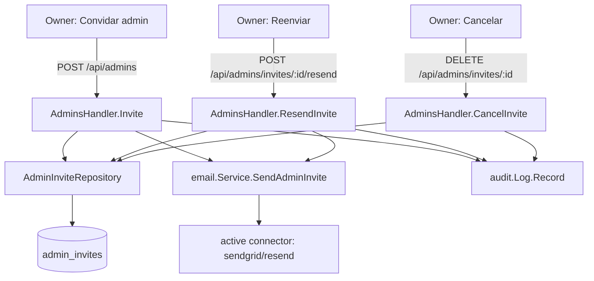

# Admin Invite Resend/Cancel Design

**Spec**: `.specs/features/admin-invite-resend-cancel/spec.md`
**Status**: Draft

---

## Architecture Overview

No new architectural pattern - this is a straightforward extension of the existing `AdminsHandler` / `AdminInviteRepository` / `email.Service` trio, all three already built (respectively by admin-dashboard and email-provider-connect). Single approach, no alternatives worth presenting: the repository method shapes, the handler's auth/audit conventions, and `email.Service.SendAdminInvite`'s signature are all fixed by prior features, so there is no real fork in how to wire them together.

---

## Code Reuse Analysis

### Existing Components to Leverage

| Component | Location | How to Use |
| --------- | -------- | ----------- |
| `email.Service.SendAdminInvite` | `internal/email/service.go:174` | Called as-is from `Invite` and the new `ResendInvite`; already handles no-active-provider (`ErrNoActiveProvider`), template rendering, and connector dispatch |
| `AdminInviteRepository.ClaimForUse` atomic pattern | `internal/db/admin_invites.go` (`WHERE token_hash = $1 AND used_at IS NULL AND expires_at > now() RETURNING ...`) | Copied (not reused directly - different WHERE clause) for two new repository methods, `Refresh` and `Cancel`, both keyed by ID instead of token hash and both dropping the `expires_at > now()` guard per the spec's expired-stays-manageable decision |
| `generateAdminInviteToken` / `hashAdminInviteToken` | `internal/api/admins.go` | Reused unchanged by `ResendInvite` to mint the new token |
| `audit.Log.Record` | `internal/audit/log.go:26` | Reused unchanged - two new action strings, `"resent"` and `"canceled"` |
| `api.RequireRole(db.RoleOwner)` (`ownerOnly`) | `internal/cli/routes.go:90` | Applied to the two new routes, same as `Invite`/`UpdateRole`/`Delete` |
| `AdminInviteEmailData` | `internal/email/provider.go:49` | Populated by the handler for both `Invite` and `ResendInvite` - `CompanyName` from `company_settings`, `Role` from the invite, `AcceptURL` built per Tech Decisions below |
| Company name lookup | `internal/db/company_settings_repository.go` (already injected elsewhere as `companySettingsRepo`) | `buildAdminRouter` already constructs this repo; `AdminsHandler` gains it as a new dependency to read `CompanyName` for the email template |

### Integration Points

| System | Integration Method |
| ------ | ------------------- |
| `admin_invites` table | No schema change. `List`'s query drops the `expires_at > now()` filter (keeps `used_at IS NULL`); two new queries (`Refresh`, `Cancel`) key on `id` instead of `token_hash` |
| `email` package | `AdminsHandler` gains an `*email.Service` dependency (already constructed in `routes.go:75` as `emailService`, currently only passed to `emailProvidersHandler`) |
| Frontend `AdminsPage` | `pendingColumns`' two disabled buttons (`web/src/features/admins/AdminsPage.tsx:136-145`, currently `disabled` with an "Ainda não disponível" tooltip) become live, calling the already-existing `useResendInvite`/`useCancelInvite` hooks (`hooks.ts:60-79`, currently unwired to any UI) |

---

## Components

### `AdminInviteRepository` (extended)

- **Purpose**: Add ID-keyed atomic refresh/cancel to the existing token-hash-keyed repository.
- **Location**: `internal/db/admin_invites.go`
- **Interfaces**:
  - `Refresh(ctx context.Context, id, newTokenHash string, newExpiresAt time.Time) (*AdminInvite, error)` - atomic `UPDATE admin_invites SET token_hash = $2, expires_at = $3 WHERE id = $1 AND used_at IS NULL RETURNING ...`; `ErrNotFound` if no row matches (covers not-found, already-accepted, already-canceled alike, per spec Assumptions)
  - `Cancel(ctx context.Context, id string) error` - atomic `UPDATE admin_invites SET used_at = now() WHERE id = $1 AND used_at IS NULL`; `ErrNotFound` if `RowsAffected() == 0`
  - `List` (modified) - drops `AND expires_at > now()` from its `WHERE`, keeps `used_at IS NULL`; still orders `created_at DESC`
- **Dependencies**: `*db.Pool` (unchanged)
- **Reuses**: The `ClaimForUse`/`MarkUsed` atomic-update shape; `ErrNotFound` convention

### `AdminsHandler` (extended)

- **Purpose**: Add `ResendInvite` and `CancelInvite` HTTP handlers; make `Invite` actually send email.
- **Location**: `internal/api/admins.go`
- **Interfaces**:
  - `ResendInvite(w http.ResponseWriter, r *http.Request)` - `POST /api/admins/invites/{id}/resend`
  - `CancelInvite(w http.ResponseWriter, r *http.Request)` - `DELETE /api/admins/invites/{id}`
  - `Invite` (modified) - after `h.invites.Create`, builds `email.AdminInviteEmailData` and calls `h.email.SendAdminInvite`; response gains `email_sent`
  - `List` (modified) - response's `adminResponse` gains `expired bool` for pending entries, computed as `expires_at <= now()` (using the handler's clock, not the DB's, since `List` already scans `ExpiresAt` into Go)
- **Dependencies**: new `*email.Service` field + a `companySettings *db.CompanySettingsRepository` field (for `CompanyName`); constructor signature grows accordingly
- **Reuses**: `generateAdminInviteToken`, `hashAdminInviteToken`, `writeAdminError`, `h.audit.Record`, `AdminFromContext`

### `NewAdminsHandler` (constructor, extended)

- **Purpose**: Wire the two new dependencies in.
- **Location**: `internal/api/admins.go`
- **Interfaces**: `NewAdminsHandler(pool *db.Pool, admins *db.AdminRepository, invites *db.AdminInviteRepository, emailSvc *email.Service, companySettings *db.CompanySettingsRepository, auditLog *audit.Log, logger *zap.Logger, devTokenLogging bool) *AdminsHandler`
- **Dependencies**: N/A (constructor)
- **Reuses**: N/A

### Routes (`internal/cli/routes.go`)

- **Purpose**: Register the two new endpoints, owner-only; pass the already-constructed `emailService` and a new `companySettingsRepo` reference into `NewAdminsHandler` (both already built earlier in `buildAdminRouter` for other handlers, so this is a call-site change, not a new construction).
- **Location**: `internal/cli/routes.go`
- **Interfaces**: `r.With(ownerOnly).Post("/api/admins/invites/{id}/resend", adminsHandler.ResendInvite)`, `r.With(ownerOnly).Delete("/api/admins/invites/{id}", adminsHandler.CancelInvite)`
- **Dependencies**: existing `emailService`, `companySettingsRepo` variables (already in scope at the `adminsHandler := api.NewAdminsHandler(...)` call site)
- **Reuses**: `ownerOnly` (`api.RequireRole(db.RoleOwner)`, `routes.go:90`)

### `AdminsPage` (frontend, modified)

- **Purpose**: Wire the two existing hooks into the two existing disabled buttons; show an "Expirado" tag when `expired`.
- **Location**: `web/src/features/admins/AdminsPage.tsx`
- **Interfaces**: no new exports; `pendingColumns`'s action cell calls `useResendInvite().mutate(a.id)` / `useCancelInvite().mutate(a.id)`, removes `disabled`/`Tooltip("Ainda não disponível")`
- **Dependencies**: `useResendInvite`, `useCancelInvite` (already exported from `hooks.ts`, unused today)
- **Reuses**: existing hooks verbatim, existing `Table`/`Button`/`Tag` components

### `hooks.ts` (frontend, minor extension)

- **Purpose**: Reflect the two new response fields in the type layer.
- **Location**: `web/src/features/admins/hooks.ts`
- **Interfaces**: `AdminRow` gains `expired?: boolean`; `useInviteAdmin`'s and `useResendInvite`'s success types gain `email_sent: boolean` (return type changes from `{status:string}`/`void` to reflect the real backend body - `useResendInvite`'s `mutationFn` return type changes from `apiFetch<void>` to `apiFetch<{status:string; email_sent:boolean}>`)
- **Dependencies**: none new
- **Reuses**: `apiFetch`, existing `useMutation`/`useQuery` wiring

---

## Data Models

No new tables or columns. `admin_invites` schema is unchanged; only query shapes change (see Integration Points). No new TypeScript interfaces beyond the two field additions above (`AdminRow.expired`, response body shapes).

---

## Error Handling Strategy

| Error Scenario | Handling | User Impact |
| --------------- | -------- | ------------ |
| Resend/cancel on unknown, already-accepted, or already-canceled invite ID | `Refresh`/`Cancel` return `db.ErrNotFound`; handler responds `404` | Owner sees "invite not found" - UI can safely just refetch the list, which will no longer show the stale row |
| `SendAdminInvite` fails on `Invite` or `ResendInvite` (no active provider, connector error, template render error) | Logged at `Error` with invite ID; HTTP response still `200`/`201` with `email_sent:false`; invite row is not rolled back | Owner sees the invite/resend succeed with an `email_sent:false` flag (P1 story 1, AC3) - UI can render a small warning without blocking the row |
| Concurrent resend/resend or resend/cancel on the same ID | Atomic `WHERE used_at IS NULL` update - exactly one caller gets a matching row, the other gets `ErrNotFound` → `404` | Rare in practice (single-owner-clicking-twice scenario); the loser just sees "invite not found" and refetches |
| Non-owner calls either new route | `ownerOnly` middleware rejects before the handler runs | `403`, same as every other admin-management route |

---

## Risks & Concerns

| Concern | Location (file:line) | Impact | Mitigation |
| ------- | --------------------- | ------ | ---------- |
| `AcceptURL` has no frontend page to land on yet | `web/src/App.tsx` (no `/accept-invite/:token` route) | The invite/resend email's link 404s in the browser until that page ships | Explicitly out of scope per spec (user-confirmed); `AcceptURL` still points at the intended future path (`/accept-invite/{token}`) so no rework is needed once that page exists. Tracked as a follow-up backlog item, not a task here. |
| `Invite`'s existing doc comment says "Email delivery is out of scope for the MVP" | `internal/api/admins.go:143-152` | Stale comment once this feature ships - would mislead a future reader | Task removes/rewrites that comment block as part of wiring in `SendAdminInvite` (not a separate task - same diff) |
| `List`'s response previously never exposed `expires_at <= now()` state; a caller (if any existed) relying on "every pending row is still valid" silently breaks | `internal/api/admins.go` (`List`) | None found - `List`'s only consumer is `AdminsPage`, updated in this same feature | No action needed beyond updating the one consumer |
| Handler grows another two constructor dependencies (`email.Service`, `CompanySettingsRepository`) on top of its existing five | `internal/api/admins.go` (`AdminsHandler` struct) | Constructor argument list keeps growing (now 8 params) - readability cost, not a correctness risk | Accepted for this feature; a config-struct refactor of `NewAdminsHandler` would be a separate, unrelated cleanup (YAGNI - not introduced here) |

---

## Tech Decisions (only non-obvious ones)

| Decision | Choice | Rationale |
| --------- | ------ | --------- |
| How `AcceptURL` is built | `fmt.Sprintf("%s://%s/accept-invite/%s", scheme, r.Host, rawToken)`, where `scheme` is `"https"` if `cfg.HTTPSEnabled` else `"http"` | Per AD-001, the admin frontend is embedded in the same Go binary and served from the same origin as the API in production - there is no separate "admin frontend URL" config to read. Using the incoming request's own `Host` (already how `router.HostRouter` reasons about domains elsewhere in this codebase) means no new config surface, and it degrades correctly for local dev (`localhost:8080`) too. `cfg.HTTPSEnabled` is already plumbed to `buildAdminRouter`'s caller-adjacent code (used for `SecureCookies`), so the scheme flag is a straightforward extension there. |
| Where `CompanyName` comes from | `CompanySettingsRepository.Get`'s `Name` field, read fresh on every `Invite`/`ResendInvite` call (not cached) | `company_settings` is a singleton row (`AD` established in `mvp-core`); a fresh read per invite is one extra indexed-PK lookup, negligible next to the network call to the email provider that follows it in the same request |
| `List`'s `expired` computed in Go vs. SQL | Computed in Go (`invite.ExpiresAt.Before(time.Now())`) after scanning, not `expires_at <= now()` in the SQL `SELECT` | `List` already scans `ExpiresAt` into the Go struct for the JSON response; comparing it in Go avoids a second query-shape change beyond dropping the `WHERE expires_at > now()` clause, and keeps the "now" used for filtering (none, post-change) and the "now" used for the `expired` flag consistent (same call, same instant, not two separate `now()` evaluations across a SQL boundary) |
| `Refresh` vs. reusing `Create` for resend | New `Refresh` method (`UPDATE`, not `INSERT`) | `Create` always inserts a fresh row; reusing it for resend would leave the old row around unless separately invalidated (as `Invite` does today via `InvalidatePendingForEmail`), which is unnecessary complexity when a single `UPDATE` on the same row does the job and preserves the original `id` (so the frontend's `id`-keyed resend/cancel buttons keep working against the same row across multiple resends) |

---

## Tips (n/a - implementation notes only, not part of the template checklist)
