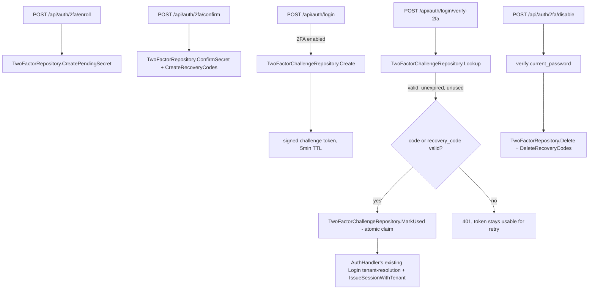

# Two-Factor Authentication (TOTP) Design

**Spec**: `.specs/features/auth-2fa-totp/spec.md`
**Status**: Draft

---

## Architecture Overview

Every architectural choice below is already locked in by spec.md's Assumptions table (all rows confirmed `y`) — this section wires those decisions into concrete components rather than re-opening alternatives.

Two new concerns, kept separate on purpose:

1. **TOTP secret + recovery-code lifecycle** — enroll → confirm → (optionally) disable. Pure CRUD against two new tables, gated behind the existing self-only auth routes.
2. **Login's second-factor gate** — `Login` stops short of issuing a session for a 2FA-enabled user and instead issues a short-lived, server-tracked **challenge token**; `verify-2fa` consumes it exactly once and then performs the same tenant-resolution + session-issuance `Login` already does.



---

## Code Reuse Analysis

### Existing Components to Leverage

| Component | Location | How to Use |
| --- | --- | --- |
| `crypto.Encrypt`/`VANE_MASTER_KEY` | `internal/crypto` | Encrypt the TOTP secret at rest, same pattern as `email_provider_repository.go`'s API key. |
| `auth.HashPassword`/bcrypt compare | `internal/auth/password.go` | Hash recovery codes exactly like `PasswordHash` — a credential, never read back plaintext. |
| `AuthHandler`'s tenant-resolution block in `Login` | `internal/api/auth_handler.go:120-157` | `verify-2fa` calls this exact sequence (membership lookup, `IssueSessionWithTenant`, cookie) for the resolved user — extracted into a small unexported helper so `Login` and `VerifyTwoFactor` share it instead of duplicating it. |
| `changePasswordRequest`'s password-reverification pattern | `internal/api/auth_handler.go:298-334` (`ChangePassword`) | `Disable2FA`'s `current_password` check calls `auth.VerifyPassword` the same way. |
| `credentialLimiter` middleware | wherever `login`/`password-reset` are wired in `internal/cli/routes.go` | `verify-2fa` rides the same limiter instance. |
| `sessionCookie`/`sessionCookieName` | `internal/api/auth_handler.go` | Unchanged — `verify-2fa`'s success path sets the same cookie shape `Login` does. |

### Integration Points

| System | Integration Method |
| --- | --- |
| `internal/auth` (JWT signing) | New `IssueTwoFactorChallenge`/`VerifyTwoFactorChallenge` functions alongside the existing session-token functions, same HMAC primitive, distinct claim shape (see Tech Decisions). |
| Postgres | Two new tables (`two_factor_secrets`, `two_factor_recovery_codes`) plus one new table backing the challenge token's server-side consumption state (`two_factor_challenges`) — see Data Models. |
| `go.mod` | New dependency `github.com/pquerna/otp` (pinned via `go get` during Execute, per spec's Assumptions). |

---

## Components

### `internal/auth` additions (`internal/auth/two_factor.go`, new file)

- **Purpose**: TOTP secret generation/validation and challenge-token signing, kept in `internal/auth` alongside the existing session-token code since both are pure, DB-free crypto/token operations.
- **Interfaces**:
  - `GenerateTOTPSecret(accountEmail, issuer string) (secret string, otpauthURI string, err error)` — wraps `github.com/pquerna/otp/totp.Generate`.
  - `ValidateTOTPCode(secret, code string) bool` — wraps `totp.Validate` (library default ±1 skew, per spec's Edge Cases).
  - `IssueTwoFactorChallenge(userID, jti, secret string) (string, error)` — signs a JWT with `Subject: userID`, `ID: jti` (JWT `jti` claim), `Audience: []string{"2fa_challenge"}`, 5-minute expiry.
  - `VerifyTwoFactorChallenge(tokenString, secret string) (userID, jti string, err error)` — verifies signature/expiry and explicitly requires `Audience == ["2fa_challenge"]`.
- **Dependencies**: `github.com/pquerna/otp`, `github.com/golang-jwt/jwt/v5` (already a dependency).
- **Reuses**: The same `jwt.SigningMethodHS256` + `sessionSecret` `IssueSessionWithTenant` already uses.

### `VerifySessionClaims` hardening (`internal/auth/session.go`, edit)

- **Purpose**: Guarantee a challenge token can never be accepted by `RequireAuth` as a real session, even if a future refactor changed how challenge tokens are parsed.
- **Change**: `VerifySessionClaims` returns `ErrInvalidToken` if the parsed token carries a non-empty `Audience` claim. A normal session token never sets `Audience` today (confirmed: `sessionClaims` has no `Audience` field set at issuance), so this is purely additive — no existing token shape is affected.
- **Reuses**: Existing `sessionClaims`/`jwt.RegisteredClaims` fields — no new struct field needed on the session-token side.

### `TwoFactorRepository` (`internal/db/two_factor_repository.go`, new)

- **Purpose**: CRUD for TOTP secrets and recovery codes.
- **Interfaces**:
  - `CreatePendingSecret(ctx, userID, encryptedSecret []byte) error` — upsert, `enabled_at = NULL`. Overwrites only an existing row with `enabled_at IS NULL` — the handler enforces the "already enabled → 409" rule (AC4) by checking `GetSecret` first, this method itself is a plain upsert.
  - `GetSecret(ctx, userID string) (*TwoFactorSecret, error)` — `db.ErrNotFound` if none.
  - `ConfirmSecret(ctx, userID string) error` — `UPDATE ... SET enabled_at = now() WHERE user_id = $1 AND enabled_at IS NULL`.
  - `DeleteSecret(ctx, userID string) error` — idempotent (no error if no row).
  - `CreateRecoveryCodes(ctx, userID string, hashes []string) error` — deletes any existing codes for the user first (a fresh `confirm` always issues a fresh batch), then bulk-inserts 10 rows.
  - `ConsumeRecoveryCode(ctx, userID, code string) (bool, error)` — loads all unused hashes for `userID`, `bcrypt.CompareHashAndPassword` against each (bounded at 10 — no timing/DoS concern), on match runs `UPDATE ... SET used_at = now() WHERE id = $1 AND used_at IS NULL RETURNING id` (atomic re-check closes the double-submit race), returns whether a match was consumed.
  - `DeleteRecoveryCodes(ctx, userID string) error`.
- **Dependencies**: `*db.Pool`.
- **Reuses**: `crypto.Encrypt`/`Decrypt` called by the handler (repository stores/returns `[]byte`, encryption stays a handler/service concern like `email_provider_repository.go`).

### `TwoFactorChallengeRepository` (`internal/db/two_factor_challenge_repository.go`, new)

- **Purpose**: Server-side backing for the challenge token's one-time-use and revocability semantics — a bare JWT can't express "already consumed" (spec AC3) without a row to check.
- **Interfaces**:
  - `Create(ctx, userID string, ttl time.Duration) (jti string, expiresAt time.Time, err error)` — inserts a row with a generated UUID `jti`, `expires_at = now() + ttl`, `used_at = NULL`.
  - `Lookup(ctx, jti string) (*TwoFactorChallenge, error)` — read-only; `db.ErrNotFound` if missing. Handler checks `expires_at`/`used_at` itself so a wrong-code retry (AC4) never touches this row.
  - `MarkUsed(ctx, jti string) (userID string, ok bool, err error)` — `UPDATE ... SET used_at = now() WHERE id = $1 AND used_at IS NULL AND expires_at > now() RETURNING user_id`; `ok = false` (no error) if the row was already consumed, expired, or missing — this is the atomic claim that closes the concurrent-double-verify race, called only after the code/recovery-code itself has already validated.
- **Dependencies**: `*db.Pool`.
- **Reuses**: Same repository-per-table convention as every other feature this cycle (e.g. `PollerLeadershipRepository`).

### `AuthHandler` changes (`internal/api/auth_handler.go`, edit)

- **Purpose**: Wire the new repositories into `Login` and add the four new endpoints.
- **Interfaces** (new handler methods):
  - `Enroll(w, r)` — `POST /api/auth/2fa/enroll`.
  - `Confirm2FA(w, r)` — `POST /api/auth/2fa/confirm`.
  - `Disable2FA(w, r)` — `POST /api/auth/2fa/disable`.
  - `VerifyTwoFactor(w, r)` — `POST /api/auth/login/verify-2fa`.
- **Change to `Login`**: after password + email-verification checks pass, look up `twoFactor.GetSecret(ctx, user.ID)`; if found and `EnabledAt != nil`, skip tenant-resolution/session-issuance entirely and instead call `challenges.Create` + `auth.IssueTwoFactorChallenge`, responding `200` with `{challenge_token}` — no cookie set.
- **Extraction**: the tenant-resolution + session-issuance block (`internal/api/auth_handler.go:120-157`) becomes an unexported method `(h *AuthHandler) issueSessionForUser(ctx, w, user *db.User) error` (or equivalent), called by both `Login` (2FA-disabled path) and `VerifyTwoFactor` (post-verification) — avoids duplicating tenant-resolution logic.
- **Dependencies**: new fields `twoFactor twoFactorStore`, `challenges twoFactorChallengeStore` on `AuthHandler`, both narrowed interfaces per this codebase's convention (`userGetter`, `authMembershipLister`).

---

## Data Models

### `two_factor_secrets`

```sql
CREATE TABLE two_factor_secrets (
    user_id UUID PRIMARY KEY REFERENCES users(id) ON DELETE CASCADE,
    encrypted_secret BYTEA NOT NULL,
    enabled_at TIMESTAMPTZ NULL,
    created_at TIMESTAMPTZ NOT NULL DEFAULT now()
);
```

**Relationships**: one row per user (PK is `user_id`, not a surrogate ID — a user has at most one secret at a time, matching AC4's "cannot enroll again while enabled" and "a fresh enroll overwrites an unconfirmed one").

### `two_factor_recovery_codes`

```sql
CREATE TABLE two_factor_recovery_codes (
    id UUID PRIMARY KEY DEFAULT gen_random_uuid(),
    user_id UUID NOT NULL REFERENCES users(id) ON DELETE CASCADE,
    code_hash TEXT NOT NULL,
    used_at TIMESTAMPTZ NULL,
    created_at TIMESTAMPTZ NOT NULL DEFAULT now()
);
CREATE INDEX idx_two_factor_recovery_codes_user_id ON two_factor_recovery_codes (user_id);
```

**Relationships**: many rows (10) per user, replaced wholesale on every `confirm`.

### `two_factor_challenges`

```sql
CREATE TABLE two_factor_challenges (
    id UUID PRIMARY KEY DEFAULT gen_random_uuid(),
    user_id UUID NOT NULL REFERENCES users(id) ON DELETE CASCADE,
    expires_at TIMESTAMPTZ NOT NULL,
    used_at TIMESTAMPTZ NULL,
    created_at TIMESTAMPTZ NOT NULL DEFAULT now()
);
```

**Relationships**: one row per `Login` call for a 2FA-enabled user; `id` is embedded as the JWT's `jti` claim. No cleanup job — rows are small, and a 5-minute-TTL row left behind after expiry is negligible volume (same posture the spec's own "stale row cleanup" decision takes for `user-sessions`, applied here proactively rather than deferred, since digest-scale cleanup isn't warranted for a table this narrow).

---

## Error Handling Strategy

| Error Scenario | Handling | User Impact |
| --- | --- | --- |
| `enroll` called while already enabled | `409`, no row mutated | Matches AC4 — client must call `disable` first. |
| `confirm` with wrong code | `422`, `enabled_at` stays NULL, no recovery codes generated | Matches AC3. |
| `verify-2fa` with expired/malformed/consumed challenge token | `401` | Matches AC3 of the login story — same generic shape as every other auth failure in this codebase (no detail on *why* the token is invalid). |
| `verify-2fa` with wrong code/recovery code | `401`, challenge token NOT marked used | Matches AC4 — user can retry within the token's remaining 5-minute window. |
| `disable` with wrong password | `401`, 2FA stays enabled | Matches the disable story's AC2. |
| `disable` called with no 2FA enabled | `200` no-op | Matches AC3 — idempotent, not an error. |
| 2FA enabled between `Login`'s challenge issuance and `verify-2fa` being disabled mid-flight | `401` on `verify-2fa` (challenge row's user no longer has `enabled_at` set) | Matches spec's Edge Cases — re-checked at `VerifyTwoFactor` time, not cached from `Login`. |

---

## Risks & Concerns

| Concern | Location (file:line) | Impact | Mitigation |
| --- | --- | --- | --- |
| Concurrent `verify-2fa` calls with the same challenge token and the same correct code | `internal/db/two_factor_challenge_repository.go` (`MarkUsed`) | Without an atomic claim, two requests racing between "code is valid" and "mark token used" could both issue a session for one login attempt. | `MarkUsed`'s `UPDATE ... WHERE used_at IS NULL ... RETURNING` is the atomic claim — only the first caller gets `ok = true`; the loser gets `401` even though its code was correct, same one-shot semantics `AttachDomain`'s `FOR UPDATE` pattern already established in this codebase. |
| `internal/api/auth_handler.go`'s `Login` currently has no seam for "issue session for this already-resolved user" — the tenant-resolution block is inlined | `internal/api/auth_handler.go:120-157` | Without extracting it, `VerifyTwoFactor` would duplicate ~35 lines of tenant-resolution logic, and the two copies could drift (e.g. a future TENANT-2x fix applied to one, not the other). | Extract into a shared unexported method (see Components) before adding `VerifyTwoFactor` — a Design-time flag so this doesn't get skipped under Execute time pressure. |
| `pquerna/otp` is a new dependency with no prior usage in this codebase | `go.mod` | Standard library import risk (supply chain, maintenance) is nonzero for any new dependency. | Per spec's own Knowledge Verification Chain conclusion: it's the de facto standard, MIT-licensed, RFC-compliant implementation — writing TOTP from scratch is strictly higher risk for a security primitive. Pin the exact version in `go.sum` at Execute time; no further mitigation warranted. |

---

## Tech Decisions (only non-obvious ones)

| Decision | Choice | Rationale |
| --- | --- | --- |
| Challenge-token isolation mechanism | `VerifySessionClaims` rejects any token with a non-empty `Audience` claim; challenge tokens always set `Audience: ["2fa_challenge"]` | Spec calls for "a distinct type/audience claim" without picking the exact mechanism — this is the concrete, testable implementation: one line in the existing verifier, no new parsing path for `RequireAuth` to accidentally skip. |
| Challenge-token one-time-use | Backed by a new `two_factor_challenges` table (`jti` = row ID), not purely a stateless JWT | Spec's AC3 requires "already consumed" to be a distinct rejection reason, which a stateless signed token cannot express on its own — this table is the minimal state needed, sized and TTL'd narrowly (5 minutes) so it doesn't become a second general-purpose session store. |
| Shared session-issuance code path | Extract `Login`'s tenant-resolution + `IssueSessionWithTenant` block into a private helper reused by both `Login` (2FA-disabled path) and `VerifyTwoFactor` | Avoids duplicating security-sensitive logic (anti-enumeration, TENANT-19/21 semantics) across two call sites that must never drift apart. |

> No new `AD-NNN` — this stays within `AD-004`'s existing session-cookie/JWT posture, adding a second, narrower token type rather than changing the session format itself (spec's own Out of Scope table already rules that out).
