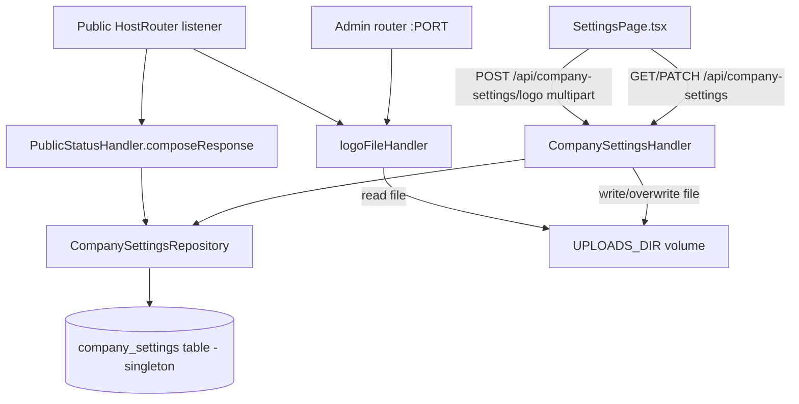

# Company Settings Design

**Spec**: `.specs/features/company-settings/spec.md`
**Status**: Draft

---

## Architecture Overview

Backend gains one singleton resource (`company_settings`, exactly one row, DB-enforced) behind two admin-only JSON endpoints (`GET`/`PATCH /api/company-settings`) and one admin-only multipart upload endpoint (`POST /api/company-settings/logo`). The logo file itself is written to a filesystem path read from `UPLOADS_DIR` (operators mount a persistent volume there) and served back by a small, dedicated file handler mounted on **both** HTTP listeners this project runs — the admin API listener and the public Host-routed listener — because a visitor of a custom public domain never shares an origin with the admin panel.



---

## Code Reuse Analysis

### Existing Components to Leverage

| Component                                                    | Location                                       | How to Use                                                                                     |
| -------------------------------------------------------------- | ----------------------------------------------- | ------------------------------------------------------------------------------------------------ |
| `db.Pool` / pgx query pattern                                 | `internal/db/pool.go`                          | Same `pool.QueryRow`/`pool.Exec` pattern as `DomainRepository`/`AdminRepository`.               |
| `RequireRole(db.RoleOwner)` (`ownerOnly` group)                | `internal/api/middleware.go:121-143`, `internal/cli/routes.go:50` | Reused verbatim for all 3 new admin routes - no new RBAC code needed.                           |
| `writeInternalError` / `writeForbidden`                       | `internal/api/auth_handler.go:139`, `internal/api/middleware.go:110-114` | Reused for 500/403 responses.                                                                   |
| Handler "role interface" pattern (`domainCreatorLister`)       | `internal/api/domains_handler.go:17-20`         | `CompanySettingsHandler` depends on a narrow interface, not the concrete repository.            |
| Migration numbering + runner                                   | `internal/db/migrations/000N_*.sql`, `internal/db/migrate.go` | New `0012_company_settings.up.sql`/`.down.sql`, same `golang-migrate` runner, no new plumbing.   |
| `config.Config` env-var loading pattern                        | `internal/config/config.go`                    | `UPLOADS_DIR` added as an *optional* var (like `LOG_LEVEL`/`CORS_ALLOWED_ORIGIN`, not `requireString`). |
| `PublicStatusHandler.composeResponse` (shared by prod + I12 preview) | `internal/api/public_status_handler.go:122`     | One new dependency (`CompanySettingsRepository.Get`) covers both public surfaces at once - `PublicStatusPreviewHandler` wraps this same instance (`public_status_preview_handler.go:41-42`). |
| `_handler_test.go` + `_repository_test.go` + `_migration_test.go` convention | `internal/api/domains_handler_test.go`, `internal/db/domains_migration_test.go` | Same 3-file test split, same `//go:build integration` tag, same `testDatabaseURL`/`issueTestSessionToken` helpers. |

### Integration Points

| System                          | Integration Method                                                                                                    |
| -------------------------------- | ------------------------------------------------------------------------------------------------------------------------ |
| `internal/cli/routes.go` (`buildAdminRouter`) | Registers `GET/PATCH /api/company-settings` (ownerOnly) and `POST /api/company-settings/logo` (ownerOnly), plus mounts `logoFileHandler` at `/uploads/`. |
| `internal/cli/serve.go` (public listener, `:166-167`) | Wraps `publicHandler.Get` in a tiny mux alongside `logoFileHandler` at `/uploads/`, then passes that mux to `router.HostRouter` - today `HostRouter` is handed `publicHandler.Get` directly for every path, so this is a required change, not additive-only. |
| `internal/api/public_status_handler.go` | `PublicStatusHandler` gains a `companySettings companySettingsGetter` field; `composeResponse` adds a `Company` field to `publicStatusResponse`. |
| PostgreSQL                       | New table `company_settings`, singleton-enforced (`id SMALLINT PRIMARY KEY DEFAULT 1 CHECK (id = 1)`), seeded once by the migration itself. |
| Filesystem (`UPLOADS_DIR`)       | App reads/writes exactly one logo file per install; operators bind-mount a persistent volume onto this path in Docker/Kubernetes (deployment concern, documented in README, not enforced by code). |

---

## Components

### `db.CompanySettingsRepository`

- **Purpose**: CRUD over the single `company_settings` row.
- **Location**: `internal/db/company_settings_repository.go`
- **Interfaces**:
  - `Get(ctx context.Context) (*CompanySettings, error)` - plain `SELECT ... FROM company_settings` (no `WHERE`, no "not found" branch - the migration guarantees exactly one row).
  - `Update(ctx context.Context, name, contactEmail string) (*CompanySettings, error)` - `UPDATE company_settings SET name=$1, contact_email=$2 RETURNING name, contact_email, logo_url`.
  - `UpdateLogoURL(ctx context.Context, logoURL string) (*CompanySettings, error)` - `UPDATE company_settings SET logo_url=$1 RETURNING name, contact_email, logo_url`, called only after the file write to `UPLOADS_DIR` succeeds (SET-13: no partial state).
- **Dependencies**: `*db.Pool`.
- **Reuses**: `pool.QueryRow`/`pool.Exec` pattern from `DomainRepository`.

### `api.CompanySettingsHandler`

- **Purpose**: HTTP surface for `GET`/`PATCH /api/company-settings` and `POST /api/company-settings/logo`.
- **Location**: `internal/api/company_settings_handler.go`
- **Interfaces**:
  - `Get(w http.ResponseWriter, r *http.Request)` - `200` + JSON, no params.
  - `Update(w http.ResponseWriter, r *http.Request)` - decodes `{name, contact_email}`, validates both non-empty + `contact_email` via `net/mail.ParseAddress`, `422` on failure, else `200` + updated JSON (SET-01, SET-04, SET-05).
  - `UploadLogo(w http.ResponseWriter, r *http.Request)` - wraps `r.Body` in `http.MaxBytesReader(w, r.Body, maxLogoBytes)` (10 MB, SET-08) *before* `r.ParseMultipartForm`, so oversized bodies are rejected while still reading rather than after buffering the whole thing; validates `Content-Type` of the part against `image/png`/`image/svg+xml` (SET-09) by sniffing (`http.DetectContentType` on the first 512 bytes - the client-sent `Content-Type` header is advisory only and never trusted alone); writes to a temp file inside `UPLOADS_DIR` then `os.Rename`s it over the fixed target name (atomic replace, satisfies SET-10 overwrite semantics and avoids a half-written file being served mid-upload); on any file-system error responds `500` without calling `UpdateLogoURL` (SET-13).
- **Dependencies**: narrow interface `companySettingsStore` (`Get`/`Update`/`UpdateLogoURL`), `uploadsDir string`, `*zap.Logger`.
- **Reuses**: `domainCreatorLister`-style narrow interface pattern; `writeInternalError`.

### `logoFileHandler` (function, not a struct - mirrors `HostRouter`'s functional style)

- **Purpose**: Serve the one stored logo file back over HTTP with no authentication, mounted at `/uploads/{filename}` on *both* listeners.
- **Location**: `internal/api/logo_file_handler.go`
- **Interfaces**:
  - `NewLogoFileHandler(uploadsDir string) http.Handler` - `chi.URLParam(r, "filename")` (or path-suffix parsing if mounted outside chi on the public listener) is validated against `filepath.Base(filename) == filename` (rejects any `/` or `..` segment) before joining with `uploadsDir`, then `http.ServeFile`. No directory listing: a request for anything but the exact stored filename is `404`, never a generic `http.FileServer` directory dispatch (SET-06, edge case: missing file -> `404`).
- **Dependencies**: `uploadsDir string`.
- **Reuses**: nothing existing - this is the one genuinely new HTTP-serving pattern in the project (everything else so far is JSON API or the JWT-gated SPA embed).

### `internal/uploads` (small package, or a function in `internal/api`)

- **Purpose**: the actual "write file atomically to `UPLOADS_DIR`, return the served path" logic used by `UploadLogo`.
- **Location**: `internal/uploads/store.go` (kept out of `internal/api` so it has no HTTP concerns and is unit-testable without a server)
- **Interfaces**:
  - `Save(dir string, ext string, r io.Reader) (servedPath string, err error)` - writes to `dir/logo.tmp`, `os.Rename` to `dir/logo<ext>`, removes any other `dir/logo.*` first (SET-10: exactly one file), returns `"/uploads/logo<ext>"`.
- **Dependencies**: `os`, `io`, `path/filepath`.
- **Reuses**: none - new, small, deliberately dependency-free.

---

## Data Models

### `db.CompanySettings`

```go
type CompanySettings struct {
    Name         string
    ContactEmail string
    LogoURL      *string
}
```

**Relationships**: none - true singleton, no foreign keys, no `company_id` (AD-002: single-tenant, no tenant column anywhere).

### Migration `0012_company_settings`

```sql
-- 0012_company_settings.up.sql
CREATE TABLE company_settings (
    id SMALLINT PRIMARY KEY DEFAULT 1 CHECK (id = 1),
    name TEXT NOT NULL DEFAULT '',
    contact_email TEXT NOT NULL DEFAULT '',
    logo_url TEXT
);
INSERT INTO company_settings (id) VALUES (1) ON CONFLICT DO NOTHING;
```

The `CHECK (id = 1)` makes a second row a constraint violation at the database level, not an application-level convention someone can forget (SET-03, SET-06).

---

## Error Handling Strategy

| Error Scenario                                              | Handling                                                                 | User Impact                                          |
| -------------------------------------------------------------- | --------------------------------------------------------------------------- | ------------------------------------------------------- |
| `PATCH` with empty `name`/`contact_email`                    | `422`, no DB write                                                       | Form shows inline validation error (`ApiError`, matches existing `SettingsPage.tsx:57` pattern) |
| `PATCH` with malformed `contact_email`                       | `422` via `net/mail.ParseAddress` failure, no DB write                   | Same as above                                        |
| Non-owner calls `GET`/`PATCH`/logo upload                    | `403` from `RequireRole(db.RoleOwner)` (existing middleware)              | Standard forbidden response, no new frontend handling needed - SettingsPage is not linked in the sidebar for non-owners already |
| Logo upload > 10 MB                                          | `http.MaxBytesReader` makes the body read fail mid-`ParseMultipartForm`; handler catches and responds `422` | Upload button shows the error inline                |
| Logo upload wrong MIME type                                  | `422` after `http.DetectContentType` sniff, previous logo untouched      | Upload button shows the error inline                |
| File write to `UPLOADS_DIR` fails (disk full/permission)     | `500`, logged via `zap`, no DB mutation (`UpdateLogoURL` never called)   | Generic "não foi possível salvar" message             |
| `UPLOADS_DIR` missing at first use                            | Lazy `os.MkdirAll(dir, 0o755)` before the write, not at process startup   | Transparent - first upload just works                |
| Requested logo file missing from disk (volume misconfigured) | `logoFileHandler` returns `404` via `http.ServeFile`'s own not-found path | Broken ``, same as any missing static asset      |

---

## Risks & Concerns

| Concern | Location (file:line) | Impact | Mitigation |
| ------- | -------------------- | ------ | ---------- |
| `router.HostRouter` today forwards every path unconditionally to the single `publicHandler` argument (`internal/router/host_router.go:60`) - it has no concept of a second route. | `internal/router/host_router.go:45-61` | Without a wiring change, `/uploads/{filename}` requested on a custom public domain would hit `PublicStatusHandler.Get` instead of the logo file, returning the JSON status payload for any URL under that path instead of the image. | `serve.go` wraps `publicHandler.Get` and `logoFileHandler` in a small `http.ServeMux` (or `chi.Mux`) *before* handing it to `HostRouter`, so both paths resolve correctly on the public listener too (documented above in Integration Points). This is a required change to existing wiring, not purely additive - call it out explicitly as a task, not an incidental detail. |
| Multi-replica deployments without a shared (RWX) volume will see inconsistent logos across pods (whichever pod last got the upload request has the file; others 404 or serve stale). | N/A - deployment topology, not code | An owner uploads a logo, refreshes, and sometimes sees no logo depending on which pod served the request. | Out of scope per spec Assumptions table (multi-replica shared storage). Document requirement clearly in README/deployment docs: single replica, or a shared RWX volume, for `UPLOADS_DIR`. Not a code task. |
| `SettingsPage.tsx:43-49` currently reads the file via `FileReader.readAsDataURL` and stuffs the result into local state, which today's `handleSubmit` sends inside the same `PATCH` body as `logo_url` (`SettingsPage.tsx:55`). | `web/src/features/settings/SettingsPage.tsx:43-59` | If left as-is, the frontend would keep sending a giant base64 string through `PATCH /api/company-settings`, which this design no longer accepts on that endpoint (logo now goes through the separate multipart upload). | Frontend task rewrites `handleLogoChange` to call the new upload mutation directly (multipart, immediate), decoupling it from the name/e-mail form's `handleSubmit`; `UpdateCompanySettingsInput` drops `logo_url` entirely. |

---

## Tech Decisions (only non-obvious ones)

| Decision                                            | Choice                                                                                   | Rationale                                                                                                    |
| ------------------------------------------------------ | ------------------------------------------------------------------------------------------- | ---------------------------------------------------------------------------------------------------------------- |
| Singleton enforcement                                | `CHECK (id = 1)` constraint + `INSERT ... ON CONFLICT DO NOTHING` at migration time      | DB-level guarantee beats an application convention that a future task could accidentally violate.            |
| Logo file naming                                    | Fixed `logo<ext>` (e.g. `logo.png`), old file(s) removed before each new write            | Matches spec Assumption; keeps `UPLOADS_DIR` at exactly one file, no cleanup job needed.                     |
| Logo write mechanism                                | Write to temp file + `os.Rename` over the target                                        | Atomic on the same filesystem - never serves a half-written file to a concurrent `GET /uploads/...` request. |
| MIME validation                                     | `http.DetectContentType` sniff on file bytes, not the client's `Content-Type` header alone | Header is client-controlled and unreliable; sniffing the actual bytes is the same trust boundary already implicit in serving the file back. |
| Public exposure of company identity                 | Piggyback on existing shared `composeResponse` rather than a new public endpoint         | One code path already serves both production and I12 preview; adding a field there is strictly additive and avoids a second unauthenticated surface to secure. |
| `/uploads/{filename}` mounted on two listeners       | Explicit dual-mount (admin router + public HostRouter mux), not a single shared listener | The two listeners exist for a real reason (admin API vs. arbitrary customer-owned public domains) predating this feature (AD-001) - not something this design can or should collapse. |

---

## Tips (n/a - implementation notes above are exhaustive for this feature's scope)
