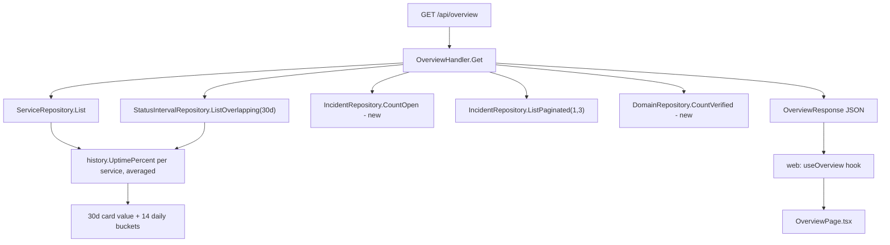

# Dashboard Overview Page Design

**Spec**: `.specs/features/dashboard-overview-page/spec.md`
**Status**: Approved

---

## Architecture Overview

One new read-only aggregation endpoint (`GET /api/overview`) composes data already owned by three existing repositories (`ServiceRepository`, `IncidentRepository`, `DomainRepository`, `StatusIntervalRepository`) — no new tables, no new writes. Frontend gets one new page + one new route + one new sidebar entry; `RootRoute`'s existing "authenticated landing slot" role changes target from `/domains` to this page.



---

## Approach Exploration

**Option A — dedicated aggregation endpoint (chosen).** One handler, one response shape, computed server-side from existing repositories in a single request.
**Option B — frontend composes 4 existing list endpoints in parallel** (`/api/services`, `/api/incidents`, `/api/domains`, plus a client-side uptime calc). Rejected: `UptimePercent`/`BuildBuckets` are Go-only (`internal/history`, no JS port), so the 30d/14d uptime math would have to be reimplemented in TypeScript — duplicating logic that already has test coverage on the Go side, and risking drift between this screen's uptime numbers and the public status page's. Also 4 round-trips instead of 1 on the page that's supposed to be the fastest one to load.
**Option C — materialized/cached summary row refreshed by the poller.** Rejected: over-engineered for this scope — no evidence yet that computing this on-demand from existing tables (all indexed, same queries the poller/public-status path already runs at higher frequency) is a performance problem. Revisit only if real usage shows otherwise.

**Recommendation**: Option A. Confirmed with user during Specify (assumptions table).

---

## Code Reuse Analysis

### Existing Components to Leverage

| Component | Location | How to Use |
| --- | --- | --- |
| `ServiceRepository.List` | `internal/db/service_repository.go:110` | Fetch all services + `CurrentStatus` once; count non-`operational` in Go (mirrors how `public_status_handler.go` already loops services in Go rather than a second SQL aggregate). |
| `StatusIntervalRepository.ListOverlapping` | `internal/db/status_interval_repository.go:145` | Fetch every interval overlapping `[now-30d, now]` for all service IDs in one query — the exact call `public_status_handler.go:240` already makes for the public page's per-service uptime bars. |
| `history.UptimePercent` | `internal/history/uptime.go:28` | Called once per service per window (30d card) and once per service per day (14 daily buckets) — same function, no new math. |
| `IncidentRepository.ListPaginated(ctx, 1, 3)` | `internal/db/incident_repository.go:148` | Already orders by `created_at DESC` and already returns exactly what AC8 asks for — zero new query needed for "recent incidents". |
| `intervalsByService` grouping pattern | `internal/api/public_status_handler.go:260-289` | Same `map[string][]db.StatusInterval` grouping loop, reused verbatim in the new handler. |
| `Card.tsx` | `web/src/components/ui/Card.tsx` | Wraps each of the 4 summary cards — same primitive every other screen uses. |
| `apiFetch` + React Query pattern | `web/src/lib/apiClient.ts`, `web/src/lib/branding.ts:17` | `useQuery({queryFn: () => apiFetch<OverviewResponse>("/api/overview")})` — identical shape to every other hook in `web/src/features/*/hooks.ts`. |
| `paginatedPage`/MSW handler conventions | `web/src/test/msw/handlers.ts` | New `http.get("/api/overview", ...)` mock returns the plain `OverviewResponse` shape (not a `Page<T>` envelope — this endpoint has no pagination, same non-list precedent as `/api/instance/branding`). |

### Integration Points

| System | Integration Method |
| --- | --- |
| `internal/cli/routes.go` (`buildAdminRouter`) | `protected.With(anyRole).Get("/api/overview", overviewHandler.Get)` — same `anyRole` gate as `/api/domains`/`/api/services` (routes.go:241-242); no new role needed per spec P2 AC5. |
| `web/src/App.tsx` | New route `/overview` under the existing `AuthenticatedLayout` group; `RootRoute` (App.tsx:64-93) stops `<Navigate to="/domains" replace />` and renders `<OverviewPage />` directly for the authenticated, non-public-status-page case. |
| `web/src/layout/Sidebar.tsx` | New standalone `NavLink` to `/overview`, rendered above the existing three nav groups (mirrors the mock's "always first, no group label" placement). |
| RLS / multi-tenancy (`AD-022`) | No new SQL beyond what's listed above — every repository call already runs inside the tenant-scoped transaction/pool convention every other handler uses. Nothing new to design here. |

---

## Components

### `OverviewHandler` (backend)

- **Purpose**: Compose the 4 summary values, 14-day series, and recent-incidents list into one response.
- **Location**: `internal/api/overview_handler.go` (new file)
- **Interfaces**:
  - `Get(w http.ResponseWriter, r *http.Request)` - handles `GET /api/overview`, no path/query params.
- **Dependencies**: `ServiceRepository`, `StatusIntervalRepository`, `IncidentRepository`, `DomainRepository` (all injected the same way every other handler in `buildAdminRouter` already receives its repos).
- **Reuses**: `history.UptimePercent`, the `intervalsByService` grouping pattern from `public_status_handler.go`.

### `IncidentRepository.CountOpen` (new, small)

- **Purpose**: `SELECT COUNT(*) FROM incidents WHERE status <> 'resolved'` — the one count this feature needs that no existing method returns (`ListPaginated`'s `total` is unfiltered-by-status).
- **Location**: `internal/db/incident_repository.go`, alongside `countIncidents` (same file, same pattern: private-style single-purpose count query, made public since `OverviewHandler` lives in a different package).
- **Interfaces**: `CountOpen(ctx context.Context) (int, error)`
- **Dependencies**: none beyond the existing pool.
- **Reuses**: identical shape to `countIncidents` (line 197) and `CountOpenedResolvedBetween` (line 210), just a different WHERE clause.

### `DomainRepository.CountVerified` (new, small)

- **Purpose**: `SELECT COUNT(*) FROM domains WHERE status = 'verified'`.
- **Location**: `internal/db/domain_repository.go`, alongside `countDomains` (line 191).
- **Interfaces**: `CountVerified(ctx context.Context) (int, error)`
- **Dependencies**: none.
- **Reuses**: identical shape to `countDomains`, different WHERE clause — same reasoning as `CountOpen` above.

### `OverviewPage` (frontend)

- **Purpose**: Render the 4 cards, 14-bar chart, recent-incidents list, and shortcuts grid.
- **Location**: `web/src/features/overview/OverviewPage.tsx` (new)
- **Interfaces**: default export, no props (route-level page component, same convention as `ServicesPage`/`IncidentsPage`).
- **Dependencies**: `useOverview` hook, `Card`, `react-i18next`.
- **Reuses**: `Card.tsx` for all 4 summary cards + the chart/incidents/shortcuts containers; the bar-chart visual pattern (bars grow from bottom, colored by threshold, `title`-attribute tooltip on hover/focus) follows the same accessible-tooltip convention `PublicStatusPage.tsx` already established for its 24-hour bars (not literally shared as one component — different data shape, 14 tenant-wide values vs. 24 per-service values — but the same interaction contract, per AGENTS.md §5 consistency expectations).

### `useOverview` (frontend hook)

- **Purpose**: Fetch `GET /api/overview` via React Query.
- **Location**: `web/src/features/overview/hooks.ts` (new)
- **Interfaces**: `useOverview(): UseQueryResult<OverviewResponse>`
- **Dependencies**: `apiFetch`.
- **Reuses**: exact hook shape as `web/src/lib/branding.ts:17` (`useQuery({queryKey: ["overview"], queryFn: () => apiFetch<OverviewResponse>("/api/overview")})`) — no `queryKey` page-number concern here since the endpoint isn't paginated (AGENTS.md §5's paginated-queryKey rule doesn't apply).

---

## Data Models

### `OverviewResponse` (Go struct / JSON contract, no DB table)

```go
type OverviewResponse struct {
    UptimeAvg30d      *float64                 `json:"uptime_avg_30d"`      // nil when no service has ok=true (AC3)
    OpenIncidents      int                     `json:"open_incidents"`
    UnhealthyServices  int                     `json:"unhealthy_services"`
    VerifiedDomains    int                     `json:"verified_domains"`
    UptimeSeries       [14]OverviewUptimeBucket `json:"uptime_series"`      // oldest first (AC7)
    RecentIncidents    []OverviewIncident       `json:"recent_incidents"`   // 0-3 items (AC8)
}

type OverviewUptimeBucket struct {
    Date          string   `json:"date"`           // YYYY-MM-DD, local (America/Sao_Paulo, same tz as history package)
    UptimePercent *float64 `json:"uptime_percent"`  // nil when no service has ok=true that day
}

type OverviewIncident struct {
    ID        string    `json:"id"`
    Title     string    `json:"title"`
    Status    string    `json:"status"`
    CreatedAt time.Time `json:"created_at"`
}
```

**Relationships**: Pure DTO, computed on every request from `services`, `status_intervals`, `incidents`, `domains` — no persistence of its own, no migration needed.

### Frontend mirror (`web/src/types/api.ts`, additive)

```typescript
export interface OverviewResponse {
  uptime_avg_30d: number | null;
  open_incidents: number;
  unhealthy_services: number;
  verified_domains: number;
  uptime_series: OverviewUptimeBucket[];
  recent_incidents: OverviewIncident[];
}

export interface OverviewUptimeBucket {
  date: string;
  uptime_percent: number | null;
}

export interface OverviewIncident {
  id: string;
  title: string;
  status: string;
  created_at: string;
}
```

---

## Error Handling Strategy

| Error Scenario | Handling | User Impact |
| --- | --- | --- |
| Any repository call fails (DB error) | `OverviewHandler.Get` logs the real error server-side, returns a fixed generic 500 (AGENTS.md §4 - never leak `err.Error()`) | Frontend renders the existing shared error-state pattern (edge case in spec.md) instead of a blank page. |
| Zero services / zero incidents / zero domains | Not an error - handler returns the documented zero/nil values (spec AC9); no special-case branch needed since `UptimePercent` already returns `ok=false` for empty intervals and `COUNT(*)` naturally returns 0. | Cards show `0`/`—`, chart shows 14 no-data bars, incidents list shows its existing empty-state message. |
| Unauthenticated request | `RequireAuth` middleware (already wraps this route group) returns 401 before the handler runs - no new logic. | Same as every other protected route. |

---

## Risks & Concerns

| Concern | Location (file:line) | Impact | Mitigation |
| --- | --- | --- | --- |
| 30d-window uptime average doesn't clamp to a stalled poller's `asOf` the way `public_status_handler.go:279-282` does (H7) - it uses wall-clock `now` per the spec's own AC3 wording. | `internal/api/overview_handler.go` (new) | If the poller has been down for hours, this screen's 30d/14d uptime numbers could look slightly better than the per-service numbers on Serviços Monitorados/public status page, which do clamp. | Accepted as spec-defined (Assumptions table, confirmed). Documented here so a future reader doesn't mistake it for an oversight; revisit only if a poller-outage incident makes the discrepancy user-visible. |
| `OverviewHandler` performs `1 (services) + 1 (intervals) + 1 (CountOpen) + 1 (ListPaginated 1,3) + 1 (CountVerified) = 5` queries per request, uncached, on every page load. | `internal/api/overview_handler.go` (new) | Negligible at current scale (single-tenant-per-install services/incidents/domains counts are small, same order of magnitude the public status page already handles per request) - flagged only because Option C (materialized summary) was explicitly rejected above; if usage ever proves this wrong, that's the fallback. | No mitigation needed now - documented as the accepted trade-off from the Approach Exploration section. |
| `RootRoute` currently has exactly one authenticated branch (`<Navigate to="/domains" replace />`, `App.tsx:88`) with no test coverage beyond "redirects an authenticated user" - existing test likely asserts the literal `/domains` target. | `web/src/App.tsx:88`, `web/src/App.test.tsx` (unconfirmed name) | Changing this line will break that existing assertion until updated - expected, not a hidden risk, but flagging so Tasks explicitly includes updating that test rather than treating it as collateral damage. | Tasks phase must include "update RootRoute's existing redirect-target test" as its own checklist item under the task that changes `App.tsx`. |

---

## Tech Decisions

| Decision | Choice | Rationale |
| --- | --- | --- |
| Where to compute the average across services | In Go, in the handler, not SQL | `UptimePercent` is a Go function operating on `[]db.StatusInterval` - there is no SQL equivalent, and every existing per-service uptime computation in this codebase already happens in Go for the same reason (`public_status_handler.go`). |
| 14-day bucket boundaries | Local-midnight-aligned days in `America/Sao_Paulo` (same `historyLoc` timezone already loaded via `time/tzdata`, AD-001) | Matches the existing hourly-history convention (`public-status-hourly-history`) exactly - no new timezone decision to make. |
| Response is a flat DTO, not `Page[T]` | No pagination envelope | This endpoint returns a fixed-shape summary, not a list - same precedent as `/api/instance/branding` (AGENTS.md §4's `Page[T]` rule explicitly only applies to "every paginated list endpoint"). |

No project-level (`AD-NNN`) decision is created here - every choice above is feature-local, consistent with existing active decisions (`AD-001` tzdata, `AD-012`/§4 Page[T] scope, `AD-022` RLS), none of them superseded.

---

## Tips (n/a - implementation phase)
