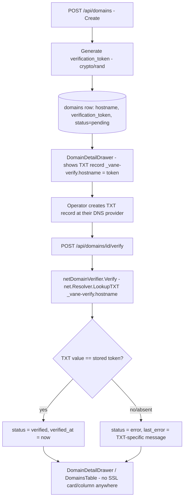

# Domain Apex TXT Verification Design

**Spec**: `.specs/features/domain-apex-txt-verification/spec.md`
**Status**: Draft

---

## Architecture Overview

`domains` gains one new column, `verification_token`, generated once at `Create` and never mutated afterward. `ssl_status` is dropped entirely — it never held a correct value once it's clear (confirmed with the user) that a `domains` row is always a root domain, which never gets its own TLS certificate under this product's design (only `subdomain.hostname`, tracked by the unrelated `StatusPage` state machine, does).

`internal/api/domain_verifier.go`'s `netDomainVerifier` is rewritten from "resolve IPs + dial TLS" to "look up TXT record `_vane-verify.<hostname>` and compare its value to the stored token". `DomainsHandler.Verify` and `mapDomainVerificationResult` (`internal/api/domains_handler.go`) are updated to call the new check and produce TXT-specific status/error text — `status` (`pending`/`verified`/`error`) keeps its existing meaning and state machine, only what earns `verified` changes. `verifyDomainCooldown` and the rest of `Verify`'s control flow (cooldown check, `SetVerificationResult`, audit log entry) are untouched.

The frontend's `DomainDetailDrawer.tsx` swaps its CNAME table for a TXT record table (record name, expected value, copy button) and drops the SSL status card entirely. `DomainsTable.tsx` drops its SSL column. Both locale files lose the now-dead SSL keys and gain new TXT-instruction keys.

The subdomain-attach path (`AttachDomainDrawer.tsx`, `StatusPagesHandler.VerifyDomain`, `HostPolicy`, `PUBLIC_DNS_TARGET`) is untouched — it already operates correctly on `subdomain.hostname`.

---

## Code Reuse Analysis

### Existing Components to Leverage

| Component | Location | How to Use |
| --------- | -------- | ---------- |
| `Domain` struct + `DomainRepository` | `internal/db/domain_repository.go` | `SSLStatus` field removed; new `VerificationToken string` field added, set once by `Create`, read (never mutated) by `Verify`. `SetVerificationResult` keeps its existing signature/behavior for `status`/`last_error`/`verified_at`, just drops the `sslStatus` parameter. |
| `netDomainVerifier`/`domainVerifier` interface | `internal/api/domain_verifier.go` | Same interface shape (`Verify(ctx, hostname, ...) result`), same fake-injection pattern for handler tests — internals rewritten to do a TXT lookup instead of IP/TLS. The `expectedTarget string` parameter becomes the domain's own `verification_token` (still passed in by the caller, same call shape). |
| `mapDomainVerificationResult` | `internal/api/domains_handler.go` | Same function shape (`result -> status, lastError`), no more `sslStatus` return value; body rewritten around the new `domainVerificationResult` shape (below). |
| `verifyDomainCooldown` / `checkVerifyCooldown` | `internal/api/domains_handler.go` | Unchanged — still gates real-lookup frequency identically. |
| Token generation | wherever the codebase already generates opaque random tokens for sessions/invites (confirm exact helper at implementation time — likely `crypto/rand` + hex encoding, matching the existing pattern) | Reused for `verification_token`, not reinvented. |
| `DomainDetailDrawer.tsx`'s existing card layout | `web/src/features/domains/DomainDetailDrawer.tsx` | The `current.domain_type === "custom"` block (today's CNAME table) is replaced in place with the TXT table using the same card/grid styling; the adjacent SSL grid cell is deleted, and the "verified at" cell now spans alone or is regrouped with a new field (Design leaves exact layout to implementation, no behavior implication). |
| `DomainsTable.tsx`'s existing column layout | `web/src/features/domains/DomainsTable.tsx` | SSL column (`sslStatusColor`/`sslStatusLabel` usage, line ~91-92) deleted; no replacement column added by this spec. |
| `domainStatusMeta.ts` | `web/src/features/domains/domainStatusMeta.ts` | `sslStatusLabel`/`sslStatusColor` exports deleted (dead once both call sites are gone). |
| `Field`-style copy-to-clipboard pattern, if one already exists elsewhere in `web/src/components/ui/` | TBD — confirm at implementation time whether a reusable "copyable value" component exists (e.g. used for an invite link or API token elsewhere) before building a new one for the TXT value. | Reused if found. |

### Integration Points

| System | Integration Method |
| ------ | ------------------- |
| New migration | `internal/db/migrations/0044_domain_txt_verification.up.sql` / `.down.sql` (next sequential number after `0043_domain_last_rdap_success`) — `ALTER TABLE domains ADD COLUMN verification_token TEXT NOT NULL DEFAULT encode(gen_random_bytes(16), 'hex')` (backfills existing rows with a real token so no domain is left without one, matching the "no half-finished state" rule), then `ALTER COLUMN verification_token DROP DEFAULT` (new rows generate their token in application code, not the database, for testability/consistency with how `SetHealthCheckResult` etc. keep business logic in Go); `ALTER TABLE domains DROP COLUMN ssl_status`. `.down.sql` reverses both: re-adds `ssl_status TEXT NOT NULL DEFAULT 'pending'` (matching `0029`'s original `CHECK`) and drops `verification_token`. |
| `internal/db/domain_repository.go` | `Domain.SSLStatus` field removed. `Domain.VerificationToken string` field added. `Create`'s `INSERT`/`RETURNING` and `ListPaginated`/`GetByID`'s `SELECT` column lists updated (drop `ssl_status`, add `verification_token`). `SetVerificationResult`'s signature drops its `sslStatus` parameter and the column from its `UPDATE`. |
| `internal/api/domain_verifier.go` | `domainVerificationResult` struct rewritten: drops `ResolvedIPs`, `DNSMatchesTarget`, `TLSReachable`, `TLSCertValid`, `TLSError`; gains `TXTFound bool` (record name resolved at all) and `TXTMatches bool` (value equals expected token). `domainVerifier.Verify(ctx, hostname, expectedToken string) domainVerificationResult` — same shape, `expectedTarget` renamed `expectedToken` and now always non-empty (it's the domain's own stored token, never operator config). `netDomainVerifier.checkDNS`/`resolveIPs`/`dialTLS`/`verifyServedCert`/`ipSetsOverlap` all deleted; replaced by a single `checkTXT` using `v.resolver.LookupTXT(ctx, "_vane-verify."+hostname)`. `dialTimeout` field/its 25s ACME-headroom comment no longer apply (no TLS dial) — removed or repurposed as the DNS lookup's own timeout. |
| `internal/api/domains_handler.go` | `domainResponse` drops `SSLStatus`; `toDomainResponse` updated accordingly. `Verify` calls `h.verifier.Verify(r.Context(), domain.Hostname, domain.VerificationToken)` instead of passing `h.dnsTarget`. `mapDomainVerificationResult` rewritten around `TXTFound`/`TXTMatches`. `dnsNotResolvedError`/`dnsMismatchError` constants replaced with TXT-specific copy (e.g. `txtNotFoundError = "TXT record not found for _vane-verify.<hostname>"`, `txtMismatchError = "TXT record found but its value does not match the expected token"` — exact hostname interpolation decided at implementation). `h.dnsTarget`/`NewDomainsHandler`'s `dnsTarget` parameter: **stays** — `GET /api/domains`'s `dns_target` field is still needed by the subdomain-attach flow's `useDNSTarget()` hook (`AttachDomainDrawer.tsx`), which is out of scope and unaffected. |
| `web/src/types/api.ts` | `DomainSSLStatus` type and `Domain.ssl_status` field removed. `Domain` gains no new client-visible field for the token itself — the TXT instruction (record name + value) rides on a new response field analogous to `dns_target`, e.g. `Domain.verification_txt_value` (exact field name/shape decided at implementation, mirroring the existing `dns_target` pattern rather than exposing the raw `verification_token` name). |
| `web/src/features/domains/DomainDetailDrawer.tsx` | CNAME table block replaced with TXT table (record name `_vane-verify.<hostname>`, value from the new API field); SSL grid cell deleted. |
| `web/src/features/domains/DomainsTable.tsx` | SSL column deleted, no replacement. |
| `web/src/features/domains/domainStatusMeta.ts` | `sslStatusLabel`/`sslStatusColor` deleted. |
| `web/src/locales/pt-BR.json`, `en.json` | `domains.detail.sslLabel`, `domains.sslStatusLabel.*` keys deleted; new `domains.detail.txtConfigLabel`/`domains.detail.txtRecordName`/`domains.detail.txtRecordValue` (or equivalent) keys added, both locales kept in parity per `AGENTS.md` §5 (`npm run i18n:check`). |
| `.specs/STATE.md` | New `AD-NNN` entry: root-domain verification switched from DNS/TLS to TXT-based ownership proof; cross-references the existing `domain-health-monitoring` AD ("root domain stays pointed at whatever infrastructure the operator already chose") as the decision this corrects the verification mechanism to actually match. |

---

## Components

### `db.Domain.VerificationToken` (new field) / migration `0044`

- **Purpose**: One immutable, per-domain opaque token proving whoever can edit the domain's DNS also controls `vane`'s registration of it.
- **Location**: `internal/db/domain_repository.go`, `internal/db/migrations/0044_domain_txt_verification.up.sql`.
- **Interfaces**: Generated in `DomainsHandler.Create`'s call path (or inside `DomainRepository.Create` itself — implementation decides which layer, following whichever existing token-generation call in the codebase sets the precedent) before the `INSERT`.
- **Reuses**: Existing `crypto/rand`-based token pattern used elsewhere in the codebase (exact call site confirmed at implementation time).

### `netDomainVerifier.checkTXT` (replaces `checkDNS`/`dialTLS`)

- **Purpose**: Perform the real DNS TXT lookup and value comparison.
- **Location**: `internal/api/domain_verifier.go`.
- **Interfaces**: `Verify(ctx, hostname, expectedToken string) domainVerificationResult` — same public shape as today, `expectedTarget` param renamed/repurposed.
- **Dependencies**: `net.Resolver.LookupTXT` (stdlib, no new dependency — same resolver already used for `LookupHost` today).
- **Reuses**: The existing lookup-timeout/context-cancellation pattern from today's `checkDNS` (5s `context.WithTimeout`).

### `mapDomainVerificationResult` (rewritten body, same signature shape minus `sslStatus`)

- **Purpose**: Translate `domainVerificationResult` into `status`/`lastError`.
- **Location**: `internal/api/domains_handler.go`.
- **Interfaces**: `func mapDomainVerificationResult(result domainVerificationResult) (status string, lastError *string)`.
- **Reuses**: Same "switch on result fields, build `status`/`lastError`" shape as today, one fewer field to combine (no more `tlsErr` to merge with `dnsErr`).

### `DomainDetailDrawer` TXT section (modified)

- **Purpose**: Show the TXT record instruction; remove the SSL card.
- **Location**: `web/src/features/domains/DomainDetailDrawer.tsx`.
- **Interfaces**: Extends the existing query shape with the new `verification_txt_value`-equivalent field (already flowing through the existing `Domain` fetch, no new endpoint).
- **Reuses**: Existing card/grid layout, existing copy-to-clipboard pattern if one exists elsewhere (confirmed at implementation time).

### `DomainsTable` (modified: column removed)

- **Purpose**: Drop the now-meaningless SSL column.
- **Location**: `web/src/features/domains/DomainsTable.tsx`.

---

## Error Handling

- TXT lookup fails entirely (NXDOMAIN, no records, resolver timeout): `TXTFound = false` → `status = "error"`, `lastError` = "not found" copy. Never falls back to any CNAME/TLS interpretation.
- TXT record(s) present but none match the expected token exactly (e.g. operator copy-pasted with extra whitespace, or created the record under the wrong name): `TXTFound = true, TXTMatches = false` → `status = "error"`, `lastError` = "found but mismatched" copy. `net.Resolver.LookupTXT` can return multiple TXT records for the same name (a domain may already use `_vane-verify.<hostname>` for something else, however unlikely) — the verifier checks whether *any* returned value matches, not just the first.
- Cooldown still applies exactly as today: a `Verify` call within `verifyDomainCooldown` of the last one returns the existing persisted state without a fresh lookup.
- Migration backfill: existing domains get a real, usable `verification_token` via the `DEFAULT gen_random_bytes`-based backfill (not a placeholder/empty value) so no pre-existing domain is left unable to complete verification after this ships.

## Testing Strategy

- **Unit**: `checkTXT` against an injected fake resolver (mirroring today's `domainVerifier` interface fake used by `domains_handler_test.go`) — exact match, mismatch, absent-record, multiple-TXT-records-only-one-matches cases. `mapDomainVerificationResult` table-driven cases for the new result shape.
- **Integration**: `DomainRepository.Create` persists a non-empty `VerificationToken`; migration `0044` backfills existing rows (test against a pre-migration fixture if the migration test harness supports it, otherwise covered by the migration itself running cleanly in the disposable-Postgres integration gate per `AGENTS.md` §3).
- **Frontend**: `DomainDetailDrawer.test.tsx` updated for the TXT table (record name/value rendered, copy interaction if added) and asserts no SSL card renders; `DomainsTable.test.tsx` asserts no SSL column; MSW mocks (`web/src/test/msw/handlers.ts` if `Domain` fixtures live there) updated to drop `ssl_status` and add the new TXT-value field; pt-BR/en i18n parity check (`npm run i18n:check`).
