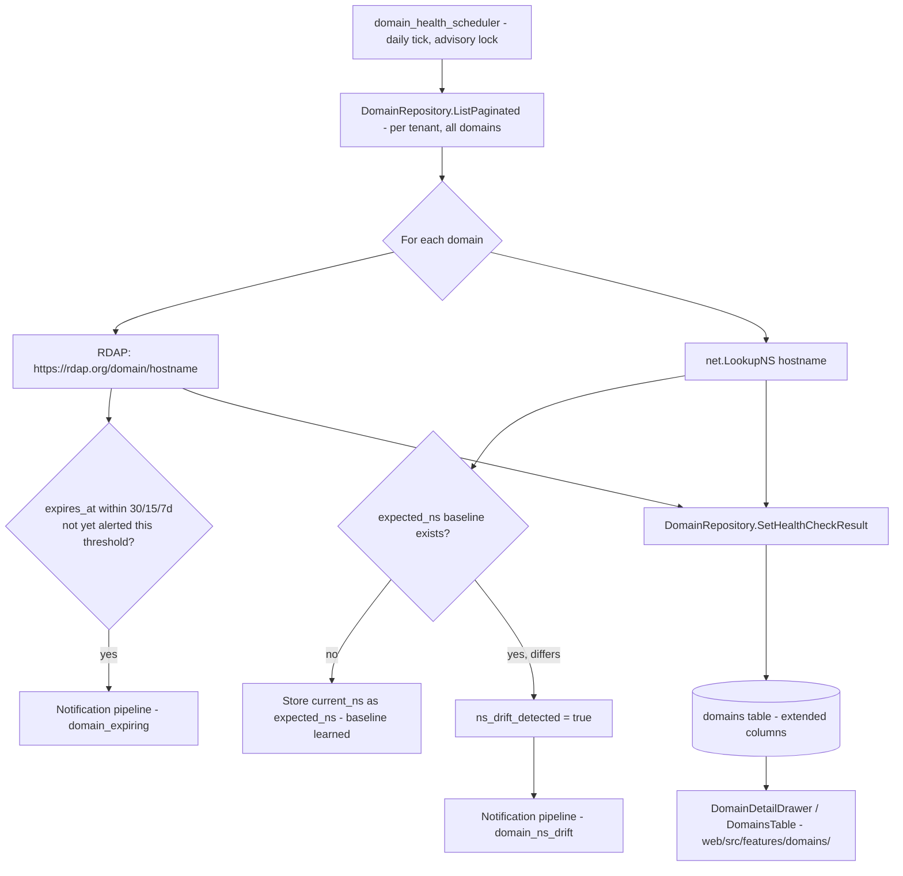

# Domain Health Monitoring Design

**Spec**: `.specs/features/domain-health-monitoring/spec.md`
**Status**: Draft

---

## Architecture Overview

The existing `domains` table (`internal/db/domain_repository.go`) gains seven nullable columns holding the latest health-check result — no new table. A new background scheduler, `internal/cli/domain_health_scheduler.go`, modeled directly on the existing `internal/cli/digest_scheduler.go` pattern (own ticker, own Postgres advisory lock in the reserved `727200000–727299999` block), runs once per day. Per tenant, it lists every domain via the existing `DomainRepository.ListPaginated`, and for each one: performs an RDAP lookup (HTTP client against `https://rdap.org/domain/{hostname}`) for expiration/registrar, and a `net.LookupNS` for current nameservers. It compares results against the stored baseline/thresholds and writes the outcome back with a new `SetHealthCheckResult` repository method — reusing the same `TenantTxFromContext`-aware transaction pattern already fixed today in `IncidentRepository.Create` (2026-09-28, `AD-039`/incident-repository fix), so this feature is built RLS-correct from the start rather than repeating that bug class.

Alerts (expiration threshold crossed, NS drift detected) are dispatched through whatever mechanism the existing notification pipeline already uses for incident/SLO notifications (exact call site confirmed in Design's Code Reuse Analysis below) — two new notification "kinds"/templates, no new delivery infrastructure.

The admin UI's `DomainDetailDrawer` and `DomainsTable` (`web/src/features/domains/`) render the new fields; the `AddDomainDrawer`'s hostname placeholder is corrected in the same pass (`web/src/locales/pt-BR.json:143`, `en.json:143`) since it is the concrete UI entry point this feature depends on for root-domain registration.

---

## Code Reuse Analysis

### Existing Components to Leverage

| Component | Location | How to Use |
| --------- | -------- | ---------- |
| `Domain` struct + `DomainRepository` | `internal/db/domain_repository.go` | Struct gains new fields; repository gains one new method (`SetHealthCheckResult`), all existing methods (`Create`, `ListPaginated`, `GetByID`, `SetVerificationResult`, `Delete`) untouched. |
| `digest_scheduler.go` pattern | `internal/cli/digest_scheduler.go` | Ticker + advisory-lock structure copied for the new `domain_health_scheduler.go` — same leadership-election shape (`pglock`), new dedicated lock key in the same reserved block, wired into `RunE` in `internal/cli/serve.go` the same way the digest scheduler is. |
| Tenant-scoped transaction helpers | `internal/db/pool.go` (`WithTenantTx`, `TenantTxFromContext`) + `poller.TenantTxFunc` | Reused exactly as `IncidentRepository.Create` and the SLO enrichment dispatchers now do (today's fix, `AD-039`) — every write in the new scheduler opens/uses a tenant-scoped transaction, never a bare `pool.Begin`. |
| `net.Resolver`/`net.LookupNS` | stdlib, already used in `internal/api/domain_verifier.go`'s `checkDNS` | Same stdlib DNS resolution approach, no new dependency for the NS side of the check. |
| Notification pipeline | wherever incident/SLO notifications are dispatched today (confirm exact package/call site before implementation — not yet traced in this session's investigation) | Two new notification kinds/templates added to the existing dispatch path; no new provider, no new delivery mechanism. |
| `DomainDetailDrawer.tsx` / `DomainsTable.tsx` | `web/src/features/domains/` | Extended with a new "Saúde do domínio" section / list indicator; existing components, not new files, aside from possibly a small presentational sub-component if the section grows large enough to warrant extraction. |
| i18n locale files | `web/src/locales/pt-BR.json`, `en.json` | New keys for the health section + corrected `hostnamePlaceholder` (`"suaempresa.com"` / `"yourcompany.com"`), both locales kept in parity per `AGENTS.md` §5. |

### Integration Points

| System | Integration Method |
| ------ | ------------------- |
| `internal/db/domain_repository.go` | New columns on `Domain` struct: `ExpiresAt *time.Time`, `Registrar *string`, `ExpectedNS []string`, `CurrentNS []string`, `NSDriftDetected bool`, `LastRDAPCheckAt *time.Time`, `RDAPLastError *string`. New method `SetHealthCheckResult(ctx, id string, result HealthCheckResult) error`. |
| New migration | `internal/db/migrations/` (next sequential number) — `ALTER TABLE domains ADD COLUMN ...` for the seven fields above, all nullable/defaulted, no backfill needed. |
| `internal/cli/domain_health_scheduler.go` (new file) | New `DomainHealthScheduler` type, `Run(ctx)` loop, advisory lock constant (e.g. `domainHealthLeaderLockKey int64 = 727200003` — exact value confirmed against the reserved block at implementation time to avoid collision with `digestLeaderLockKey`/`pollerLeaderLockKey`). |
| `internal/cli/serve.go` (`RunE`) | Wires the new scheduler alongside the existing digest scheduler wiring — same lifecycle (start goroutine, graceful shutdown on context cancel). |
| New RDAP client | `internal/rdap/` (new package) or a small unexported helper inside the scheduler file if it stays under ~100 lines — HTTP GET `https://rdap.org/domain/{hostname}`, parse the subset of the RDAP JSON response needed (`events[type=expiration].eventDate`, registrar entity). Package boundary decided at implementation time based on actual size. |
| `internal/api/domains_handler.go` | No change to existing endpoints; the new health fields ride along on whatever serialization `Domain` already goes through for `GET /api/domains` — confirm at implementation time whether a new response field needs explicit wiring or falls out of the existing struct-to-JSON path. |
| `web/src/features/domains/DomainDetailDrawer.tsx` | New section rendering `expiresAt`, `registrar`, `currentNs` vs `expectedNs`, `nsDriftDetected`, `lastRdapCheckAt`, `rdapLastError`. |
| `web/src/features/domains/DomainsTable.tsx` | New column/badge for "expiring soon" or "NS drift" state, sourced from the same fields. |
| `web/src/features/domains/AddDomainDrawer.tsx` + locale files | Placeholder text fix only — no new form field, this feature doesn't add operator input to domain creation. |

---

## Components

### `db.DomainRepository.SetHealthCheckResult` (new method)

- **Purpose**: Persist one health-check cycle's result for a single domain, replacing whatever RDAP/NS state existed before.
- **Location**: `internal/db/domain_repository.go`
- **Interfaces**: `SetHealthCheckResult(ctx context.Context, id string, expiresAt *time.Time, registrar *string, currentNS []string, driftDetected bool, rdapErr *string) error` — exact signature (single struct param vs. positional) decided at implementation time following whichever convention `SetVerificationResult` already sets nearby in the same file.
- **Dependencies**: `*db.Pool`, tenant transaction from context.
- **Reuses**: Same `TenantTxFromContext`/fallback-`Begin` pattern as `IncidentRepository.Create` (today's fix) and `StatusPageRepository.Create` — never a bare `pool.Begin(ctx)` regardless of caller.

### `cli.DomainHealthScheduler` (new)

- **Purpose**: Daily, tenant-scoped background job: RDAP + NS check for every registered domain, threshold/drift detection, alert dispatch, persistence.
- **Location**: `internal/cli/domain_health_scheduler.go`
- **Interfaces**: `NewDomainHealthScheduler(pool *db.Pool, domains *db.DomainRepository, notifier <notification interface, TBD>, logger *zap.Logger) *DomainHealthScheduler`, `Run(ctx context.Context)` — blocks on its own ticker until `ctx` is cancelled, exactly like `digest_scheduler.go`'s existing shape.
- **Dependencies**: `db.Pool` (advisory lock + tenant tx), `db.DomainRepository`, the notification pipeline's existing entry point, an RDAP client.
- **Reuses**: `digest_scheduler.go`'s ticker/lock/shutdown skeleton; `poller.TenantTxFunc`-style tenant transaction opening; `net.LookupNS` as already used in `domain_verifier.go`.

### RDAP client (new, small)

- **Purpose**: Fetch expiration date + registrar for a hostname via RDAP, with bootstrap redirect handled by `rdap.org`.
- **Location**: TBD at implementation — `internal/rdap/client.go` if it grows past a trivial HTTP-GET-and-parse, otherwise inlined in the scheduler file.
- **Interfaces**: `Lookup(ctx context.Context, hostname string) (expiresAt *time.Time, registrar *string, err error)`.
- **Dependencies**: `net/http` only (stdlib), no third-party RDAP library planned unless `rdap.org`'s bootstrap proves unreliable during implementation.
- **Reuses**: nothing existing — genuinely new capability, the one piece of this feature with no prior art in the codebase.

### `DomainDetailDrawer` health section (modified)

- **Purpose**: Show expiration/registrar/NS-drift state for the open domain.
- **Location**: `web/src/features/domains/DomainDetailDrawer.tsx`
- **Interfaces**: Extends the existing props/query shape with the new `Domain` fields (already flowing through whatever query hook fetches the domain today) — no new endpoint, no new React Query key.
- **Reuses**: Existing drawer layout/badge components (`DomainStatusTag.tsx` conventions) for a consistent look with the existing verification-status badges.

### `DomainsTable` list indicator (modified)

- **Purpose**: Surface at-a-glance risk (expiring soon / NS drift) without opening the drawer.
- **Location**: `web/src/features/domains/DomainsTable.tsx`
- **Interfaces**: Same table row shape, new conditional badge/icon column.
- **Reuses**: Existing table/badge components.

---

## Error Handling

- RDAP failure (timeout, unsupported TLD, HTTP error, malformed response): recorded in `RDAPLastError`, does not block NS check or other domains in the same cycle, retried next scheduled cycle — no immediate retry.
- NS lookup failure (no resolvable records): recorded, but `ExpectedNS`/`CurrentNS` baseline is left untouched — a transient DNS failure must never silently erase a learned baseline.
- Domain deleted between listing and check (race with an operator deleting it mid-cycle): treated as a no-op, logged at debug level, no alert.
- All writes go through tenant-scoped transactions from the start (see Architecture Overview) — this feature does not reintroduce the transaction-scoping bug class fixed today in `IncidentRepository`/`SLOAnalyzer`.

## Testing Strategy

- **Unit**: expiration-threshold-crossing logic (30/15/7 days, alert-once-per-crossing semantics), NS-set comparison/diff, RDAP response parsing (against fixture JSON, no live network call).
- **Integration**: `SetHealthCheckResult` correctness under RLS (same pattern as existing `IncidentRepository`/`StatusPageRepository` integration tests, disposable Postgres container per `AGENTS.md` §3); scheduler end-to-end against a local test HTTP server standing in for `rdap.org` (never a real RDAP call in CI).
- **Frontend**: MSW mock extended with the new `Domain` fields; drawer/table render tests for the health section and drift/expiration badges; pt-BR/en i18n parity check (`npm run i18n:check`) covering both the new keys and the corrected placeholder.
