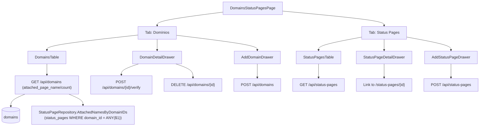

# Domínios & Status Pages Page Design

**Spec**: `.specs/features/domains-status-pages-page/spec.md`
**Status**: Draft

---

## Architecture Overview

Almost the entire backend surface this screen needs already exists and ships unchanged: `DomainsHandler` (Create/List/Verify/Delete, all persisting to `domains`' `domain_type`/`status`/`ssl_status`/`verified_at`/`last_error`) and `StatusPagesHandler` (Create/List/SetServices/Delete). The one real gap — "which status page(s) is this domain attached to" — is a pure read-side join: `StatusPage.DomainID` already points at `Domain.ID`, nothing new needs to be persisted. `DomainsHandler.List` gains one batched query (all domain IDs from the current page, one `WHERE domain_id = ANY($1)` call) instead of a per-row lookup, so the endpoint stays O(1) queries regardless of page size (AGENTS.md §4's "no live external call per row" principle, applied here to an internal join instead of Datadog).

The frontend work is the bulk of this feature: `DomainsStatusPagesPage.tsx` is rewritten from two stacked sections into the mock's tabbed layout, following the exact component shapes `monitored-services-page`/`manual-polling-monitoring` already established (`Drawer`, `ModeCard`-style disabled-tile chooser, `Tag`-based status pill, `Pager`, `EmptyState`).



---

## Code Reuse Analysis

### Existing Components to Leverage

| Component | Location | How to Use |
| --- | --- | --- |
| `Drawer` | `web/src/components/ui/Drawer.tsx` | Both detail drawers and both add drawers use it unchanged (standard chrome, per the standing "one drawer model" decision) |
| `ModeCard`-style disabled-tile chooser | `web/src/features/services/AddServiceDrawer.tsx` (local, not exported) | Re-implemented locally in the new file for domain-type and visibility choosers — same visual/disabled pattern, not extracted into a shared component (each screen's chooser has different copy/icons; AGENTS.md's no-premature-abstraction rule) |
| `Tag` | `web/src/components/ui/Tag.tsx` | Backs the status/SSL pills (`success`/`warning`/`critical` variants map to verified/pending/error) |
| `Pager` | `web/src/components/ui/Pager.tsx` | Both tabs' tables, `totalPages` computed by the caller per AGENTS.md §5 |
| `EmptyState` | `web/src/layout/EmptyState.tsx` | Zero-domains / zero-pages states |
| `Field` | `web/src/components/ui/Field.tsx` | Hostname / page-name inputs in both add drawers |
| `useAuth().hasRole` | `web/src/auth/AuthProvider.tsx` | Gates Delete/Create actions to owner/operator, same as `DomainsSection` today |
| `formatTimestamp` pattern | `web/src/features/domains/DomainsSection.tsx:14` | Reused for Verificado/Atualizado columns |

### Integration Points

| System | Integration Method |
| --- | --- |
| `GET /api/domains` | Response gains two fields per item (`attached_page_name`, `attached_page_count`); no new endpoint |
| `GET /api/status-pages` | Unchanged — already returns everything the Status Pages tab needs |
| `POST /api/domains/{id}/verify` | Already exists (`DomainsHandler.Verify`); frontend gains a `useRecheckDomain` hook that didn't exist before — named distinctly from `status-pages/hooks.ts`'s existing `useVerifyDomain`, which hits a different endpoint (`/api/status-pages/{id}/verify-domain`) |
| React Query cache | New/updated hooks in `web/src/features/domains/hooks.ts` and `web/src/features/status-pages/hooks.ts` |

---

## Components

### `StatusPageRepository.AttachedNamesByDomainIDs` (backend)

- **Purpose**: One batched query returning, per domain ID, the names of every status page attached to it — ordered so the caller can take the first as "primary".
- **Location**: `internal/db/status_page_repository.go`
- **Interfaces**:
  - `AttachedNamesByDomainIDs(ctx context.Context, domainIDs []string) (map[string][]string, error)` — `SELECT domain_id, name FROM status_pages WHERE domain_id = ANY($1) ORDER BY domain_id, created_at ASC`; returns an empty map (not an error) for an empty `domainIDs` slice, so `DomainsHandler.List` can call it unconditionally even on an empty page.
- **Dependencies**: `*Pool`.
- **Reuses**: Same `ANY($1)` batching idiom already used elsewhere in the codebase for "avoid N+1" (e.g. `serviceIDsByStatusPage`).

### `DomainsHandler.List` (extended)

- **Purpose**: Same endpoint, now also attaches `attached_page_name`/`attached_page_count` per domain.
- **Location**: `internal/api/domains_handler.go`
- **Interfaces**: `domainResponse` gains `AttachedPageName *string` (`json:"attached_page_name"`, nil when count is 0) and `AttachedPageCount int` (`json:"attached_page_count"`).
- **Dependencies**: `StatusPageRepository.AttachedNamesByDomainIDs` — `DomainsHandler` needs a new narrow interface (`statusPageNameLister`) rather than depending on the concrete repo, matching the existing `domainCreatorLister` pattern.
- **Reuses**: Existing `toDomainResponse`, extended to take the names map alongside the domain.

### `DomainsStatusPagesPage` (rewritten)

- **Purpose**: Top-level screen — tab state, renders one of the two table+drawer trees below.
- **Location**: `web/src/features/domains/DomainsStatusPagesPage.tsx`
- **Interfaces**: No props (route component).
- **Dependencies**: `useDomains`, `useStatusPages` (existing), new hooks below.
- **Reuses**: Tab styling pattern already established by `AddServiceDrawer`'s "Baseado em SLO"/"Polling manual" `ChipButton`-adjacent visual language is NOT reused here — tabs are a simpler two-item underline switcher unique to this screen (matches the mock's `tabStyle`, no existing tab component in the codebase to reuse; this is the one genuinely new small UI primitive, kept local since nothing else in the app has tabs yet).

### `DomainsTable` + `DomainDetailDrawer` + `AddDomainDrawer`

- **Purpose**: Domínios tab's list, read-only detail view, and creation flow.
- **Location**: `web/src/features/domains/` (new files, or kept as sections within `DomainsStatusPagesPage.tsx` if small enough — decided at Tasks time based on line count, consistent with how `ServiceListPage`/`ServiceDetailDrawer`/`AddServiceDrawer` ended up as three separate files).
- **Interfaces**:
  - `DomainDetailDrawer({ domain, onClose }: { domain: Domain; onClose: () => void })`
  - `AddDomainDrawer({ open, onClose }: { open: boolean; onClose: () => void })`
- **Dependencies**: `useDomains`, `useRecheckDomain` (new), `useDeleteDomain` (existing), `useCreateDomain` (existing).
- **Reuses**: `Drawer`, `Tag`, `Field`, `Button`.

### `StatusPagesTable` + `StatusPageDetailDrawer` + `AddStatusPageDrawer`

- **Purpose**: Status Pages tab's list, read-only detail view (services + domain + links), and creation flow.
- **Location**: `web/src/features/status-pages/` (new files alongside existing `StatusPagesSection.tsx`, which stays as-is for `IntegrationsPage`'s embed — same "genuinely different layout, don't touch" precedent as `ServicesSection` vs `ServiceListPage`).
- **Interfaces**:
  - `StatusPageDetailDrawer({ page, onClose }: { page: StatusPageWithMeta; onClose: () => void })`
  - `AddStatusPageDrawer({ open, onClose }: { open: boolean; onClose: () => void })`
- **Dependencies**: `useStatusPages` (existing), `useCreateStatusPage` (existing), `useSetStatusPageServices` (existing), service-list source for the checklist (existing `useServices`).
- **Reuses**: `Drawer`, `Tag`, `Field`, `Link` (react-router) to `/status-pages/{id}`.

---

## Data Models

### `Domain` (frontend type, extended)

```typescript
export type DomainStatus = "pending" | "verified" | "error";
export type DomainSSLStatus = "pending" | "active" | "error";

export interface Domain {
  id: string;
  hostname: string;
  created_at: string;
  domain_type: "custom"; // only value the backend ever produces today
  status: DomainStatus;
  ssl_status: DomainSSLStatus;
  verified_at: string | null;
  last_error: string | null;
  attached_page_name: string | null;
  attached_page_count: number;
}
```

**Relationships**: `attached_page_name`/`attached_page_count` are derived read-side from `StatusPage.domain_id === Domain.id` — no new persisted relationship, no migration.

---

## Error Handling Strategy

| Error Scenario | Handling | User Impact |
| --- | --- | --- |
| `DELETE /api/domains/{id}` → 409 (`ErrDomainInUse`) | Drawer catches the error, shows inline message, does not close | User sees "domínio ainda está anexado a uma status page" instead of a silent no-op or a crash |
| `POST /api/domains` → 409 (duplicate hostname) | Same inline-error pattern already used by `DomainsSection` | Consistent with today's behavior, just inside the new drawer |
| `POST /api/domains/{id}/verify` → network/5xx | `useRecheckDomain`'s `onError` surfaces a toast/inline message (existing `ApiError` pattern) | User sees a failure instead of a stuck spinner |
| Status page with no `domain_id` | Frontend renders `—` for URL pública, disables "Ver página pública" | No dead/broken link ever rendered |

---

## Risks & Concerns

| Concern | Location | Impact | Mitigation |
| --- | --- | --- | --- |
| Frontend `Domain` type has silently drifted from the backend's `domainResponse` since `domain-verification-state` shipped — `domain_type`/`status`/`ssl_status`/`verified_at`/`last_error` exist server-side but were never added to `web/src/types/api.ts` or consumed anywhere | `web/src/types/api.ts:97-101`, `internal/api/domains_handler.go:66-73` | Not a runtime bug today (nothing reads the missing fields), but it means this feature's frontend work starts from a stale type, not a fresh one — must update the type as part of this feature, not assume it's already correct | Task in this feature updates `Domain` fully (see Data Models above); add an MSW handler assertion so a future drift is caught by a failing test, same principle as AGENTS.md §5 |
| `domainsPageResponse` (backend) is a bespoke envelope (`items`/`total`/`page`/`page_size`/`dns_target`), not the generic `Page[T]` — `useDomains` currently types it as `Page<Domain>`, silently dropping `dns_target` | `internal/api/domains_handler.go:122-129`, `web/src/features/domains/hooks.ts:8` | `dns_target` is unused today (no UI reads it), so no current bug, but the mismatch would bite the first feature that needs it | Give `useDomains` its own response type (mirroring the backend's real shape) instead of forcing `Page<Domain>`; this feature doesn't need `dns_target` itself, but fixing the type now prevents the same silent-drop bug for whoever needs it next |
| No `useRecheckDomain` hook exists yet (`useCreateStatusPage` was checked — it already exists, no new work needed there) | `web/src/features/domains/hooks.ts` | None — this is expected net-new work, not a pre-existing bug | Added as part of this feature's tasks |

> No security, fragile-code, or perf concerns beyond the two type-drift items above — both are pre-existing and low-severity, addressed inline by this feature's own scope rather than needing a separate fix task.

---

## Tech Decisions

| Decision | Choice | Rationale |
| --- | --- | --- |
| Where the domain→page join lives | `StatusPageRepository.AttachedNamesByDomainIDs`, not `DomainRepository` | The query's `FROM` clause is `status_pages`, matching the existing convention that a repository owns queries against its own table (`DomainRepository` never queries `status_pages` directly today either) |
| Batch vs. per-row query | Batch (`WHERE domain_id = ANY($1)`) called once per `List` request | AGENTS.md §4 precedent (status page's own read path was fixed to avoid per-row external calls); here it's an internal query, but the same "O(1) queries regardless of page size" principle applies |
| Tabs component | New, local, minimal (no shared `Tabs` primitive extracted) | Only one screen in the app has tabs today; extracting a shared component now would be speculative generality for a single caller (AGENTS.md's no-premature-abstraction rule) |
| "Subdomínio Vane" / "Privado" tiles | Rendered, but disabled/non-interactive, not hidden entirely | Matches the mock visually (so the redesign looks complete) while being honest that the capability doesn't exist — same pattern already shipped for "New Relic" in `manual-polling-monitoring` |

