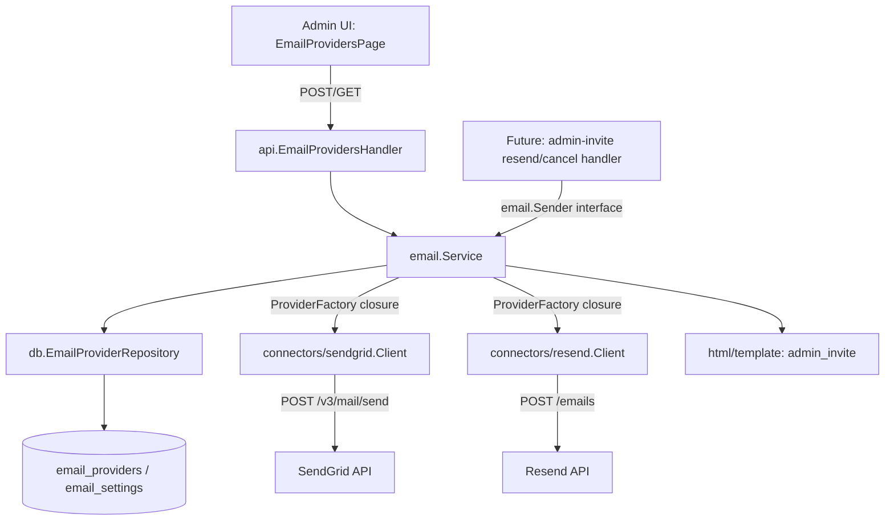

# Email Provider Connect Design

**Spec**: `.specs/features/email-provider-connect/spec.md`
**Status**: Draft

---

## Architecture Overview

Two new tables (Approach A, confirmed with user): `email_providers` (one row per connected provider, unique on `provider`) and `email_settings` (singleton, holds the nullable `active_provider`). A new leaf package `internal/email` defines the provider-agnostic contract (`Message`, `Provider` interface) and the business-logic `Service` (connect/activate/list/send). Two new connector packages, `internal/connectors/sendgrid` and `internal/connectors/resend`, each implement `email.Provider` - mirroring `internal/connectors/datadog`'s existing shape (typed errors, `NewClient(apiKey)`, a `ValidateCredentials` method).

`internal/email.Service` never imports the connector packages directly - it receives a `ProviderFactory` closure, built in `internal/cli/routes.go`, that turns `(provider, apiKey)` into a `Provider`. This is the exact pattern `internal/api/integrations_handler.go` already uses for Datadog (`validateDatadogCredentials`, `searchDatadogSLOs` function types wired in `routes.go`) - it keeps `internal/api` and `internal/email` decoupled from which concrete connectors exist, so adding a third provider later never touches those packages.



---

## Code Reuse Analysis

### Existing Components to Leverage

| Component | Location | How to Use |
| --- | --- | --- |
| `internal/crypto.Encrypt`/`Decrypt` | `internal/crypto/` | Same encrypt-before-store, decrypt-before-use pattern as `IntegrationRepository`'s Datadog keys - `cfg.MasterKey` encrypts `api_key` at rest. |
| Datadog connector shape | `internal/connectors/datadog/client.go` | Copy the shape, not the code: typed errors (`ErrUnauthorized`, `ErrTimeout`, `ErrServer`), `NewClient(key)` constructor, timeout-classifying `get`/`post` helper, `ValidateCredentials(ctx) error`. |
| Function-typed dependency injection | `internal/api/integrations_handler.go` (`validateDatadogCredentials`, `searchDatadogSLOs`), wired in `internal/cli/routes.go` | Same pattern for `email.ProviderFactory` - handler/service layers depend on a function type, never on a concrete connector package. |
| Singleton-row table pattern | `internal/db/migrations/0012_company_settings.up.sql` (`id SMALLINT PRIMARY KEY DEFAULT 1 CHECK (id = 1)`) | `email_settings` uses the identical shape for `active_provider`. |
| `net/mail.ParseAddress` (Go stdlib) | n/a | Validates `from_email` syntax (AC: "not a syntactically valid email address" -> `422`) without hand-rolling a regex. |
| Role middleware | `internal/cli/routes.go` (`writeRoles`, `anyRole`) | Reused as-is: `writeRoles` on connect/activate, `anyRole` on list - identical split to the existing `/api/integrations/datadog/*` routes. |
| MSW test infra + `hooks.ts`/`*.test.tsx` conventions | `web/src/features/integrations/` | P2 UI story follows this feature's file layout, form/error pattern, and role-gated (`hasRole(["owner","operator"])`) rendering 1:1. |

### Integration Points

| System | Integration Method |
| --- | --- |
| Postgres | Two new tables via a new `golang-migrate` pair, `0016_email_providers.{up,down}.sql`, next in sequence after `0015_company_settings_logo_storage`. |
| chi router (`internal/cli/routes.go`) | Three new routes under `/api/integrations/email/*`, registered alongside the existing Datadog integration routes, same `protected.With(writeRoles|anyRole)` wiring. |
| Future admin-invite resend/cancel feature | Consumes `email.Sender` (specifically `SendAdminInvite`) - this feature only builds and exposes that interface; the future feature imports and calls it. |

---

## Components

### `internal/db/email_provider_repository.go` (new)

- **Purpose**: Persist connected email providers and the singleton active-provider pointer.
- **Location**: `internal/db/email_provider_repository.go`
- **Interfaces**:
  - `UpsertProvider(ctx context.Context, provider string, encryptedAPIKey []byte, fromEmail, fromName string) error` - insert-or-overwrite by `provider` (unique), sets `status='connected'`, `last_checked_at=now()`, clears `last_error`.
  - `Get(ctx context.Context, provider string) (*EmailProvider, error)` - `ErrNotFound` if never connected.
  - `List(ctx context.Context) ([]EmailProvider, error)` - all connected providers, ordered by `provider`.
  - `GetActiveProvider(ctx context.Context) (string, error)` - returns `""` (not an error) when `active_provider IS NULL`; the singleton row always exists (seeded by migration, same as `company_settings`).
  - `SetActiveProvider(ctx context.Context, provider string) error`.
- **Dependencies**: `*db.Pool` (same constructor shape as every other repository in this package).
- **Reuses**: Query/scan/error-wrapping style identical to `IntegrationRepository`.

### `internal/email` (new package)

Holds both the provider-agnostic contract (leaf types, importable by connectors with no cycle) and the business-logic service (imports the repository, never a connector package).

- **Purpose**: Define what an email connector must implement, and orchestrate connect/activate/list/send against the repository + an injected connector factory + the admin-invite template.
- **Location**: `internal/email/`
  - `provider.go` - `Message` struct, `Provider` interface, `ProviderFactory` type, shared typed errors (`ErrUnauthorized`, `ErrTimeout`, `ErrServer` - reused by both connectors instead of each redefining their own, since the classification is provider-agnostic HTTP behavior).
  - `service.go` - `Service` struct + `Sender` interface + `Connect`/`Activate`/`List`/`SendAdminInvite`.
  - `templates.go` - `//go:embed templates/admin_invite.html.tmpl templates/admin_invite.txt.tmpl`, parsed once in `NewService`.
- **Interfaces**:
  - `type Message struct { To, FromEmail, FromName, Subject, HTMLBody, TextBody string }`
  - `type Provider interface { Send(ctx context.Context, msg Message) error; ValidateCredentials(ctx context.Context) error }`
  - `type ProviderFactory func(provider, apiKey string) (Provider, error)`
  - `type Sender interface { SendAdminInvite(ctx context.Context, to string, data AdminInviteEmailData) error }`
  - `func NewService(repo EmailProviderStore, factory ProviderFactory, masterKey string, logger *zap.Logger) (*Service, error)` - returns an error only if template parsing fails (fail-fast at boot, not at first send).
  - `func (s *Service) Connect(ctx context.Context, provider, apiKey, fromEmail, fromName string) error`
  - `func (s *Service) Activate(ctx context.Context, provider string) error`
  - `func (s *Service) List(ctx context.Context) (ListResult, error)`
  - `func (s *Service) SendAdminInvite(ctx context.Context, to string, data AdminInviteEmailData) error`
- **Dependencies**: `EmailProviderStore` (narrow interface satisfied by `*db.EmailProviderRepository` - only the methods `Service` actually calls, same narrowing convention `datadogIntegrationUpserter` uses in `integrations_handler.go`), `ProviderFactory`, `masterKey`, `*zap.Logger`.
- **Reuses**: `internal/crypto` for encrypt/decrypt, `net/mail.ParseAddress` for `from_email` validation.

### `internal/connectors/sendgrid` (new package)

- **Purpose**: Implement `email.Provider` against SendGrid's v3 API.
- **Location**: `internal/connectors/sendgrid/client.go`
- **Interfaces**:
  - `func NewClient(apiKey string) *Client`
  - `func (c *Client) Send(ctx context.Context, msg email.Message) error` - `POST https://api.sendgrid.com/v3/mail/send`.
  - `func (c *Client) ValidateCredentials(ctx context.Context) error` - `GET /v3/scopes`; 200 = valid, 401 = `email.ErrUnauthorized`.
- **Dependencies**: `net/http`, imports `internal/email` for `Message`/typed errors only (not `Service`).
- **Reuses**: Datadog client's request/error-classification shape (`isTimeout`, status-code switch).

### `internal/connectors/resend` (new package)

- **Purpose**: Implement `email.Provider` against Resend's API.
- **Location**: `internal/connectors/resend/client.go`
- **Interfaces**:
  - `func NewClient(apiKey string) *Client`
  - `func (c *Client) Send(ctx context.Context, msg email.Message) error` - `POST https://api.resend.com/emails`.
  - `func (c *Client) ValidateCredentials(ctx context.Context) error` - `GET https://api.resend.com/api-keys`; 200 = valid, 401 = `email.ErrUnauthorized` [Provável - see spec Assumptions, not live-tested against an invalid key].
- **Dependencies**: same as SendGrid connector.
- **Reuses**: same as SendGrid connector.

### `internal/api/email_providers_handler.go` (new)

- **Purpose**: HTTP surface for connect/list/activate.
- **Location**: `internal/api/email_providers_handler.go`
- **Interfaces**:
  - `func NewEmailProvidersHandler(svc emailProviderService, logger *zap.Logger) *EmailProvidersHandler`
  - `Connect(w http.ResponseWriter, r *http.Request)` - `POST /api/integrations/email/{provider}`.
  - `List(w http.ResponseWriter, r *http.Request)` - `GET /api/integrations/email`.
  - `Activate(w http.ResponseWriter, r *http.Request)` - `POST /api/integrations/email/{provider}/activate`.
- **Dependencies**: `emailProviderService` - narrow interface (`Connect`, `Activate`, `List`) satisfied by `*email.Service`, same narrowing convention as `IntegrationsHandler`.
- **Reuses**: `writeInternalError`, JSON response helpers already in the `api` package (see `writeSLOSummaries`/`writeInvalidDatadogCredentials` for the existing style).

### `web/src/features/email-providers/` (new, P2)

- **Purpose**: Admin screen to connect, list, and activate SendGrid/Resend.
- **Location**: `web/src/features/email-providers/{EmailProvidersPage.tsx, hooks.ts, EmailProvidersPage.test.tsx, hooks.test.ts}`
- **Interfaces**: `useEmailProviders()` (query), `useConnectEmailProvider(provider)`, `useActivateEmailProvider()` (mutations) - same `@tanstack/react-query` shape as `web/src/features/integrations/hooks.ts`.
- **Dependencies**: `apiClient`, MSW handlers added to `web/src/test/msw/handlers.ts`.
- **Reuses**: `Card`, `Field`, `Button`, `Tag` UI components; `useAuth().hasRole(["owner","operator"])` gate; connect-form open/submit/error pattern from `IntegrationsPage.tsx`.

---

## Data Models

### `email_providers` (Postgres table)

```sql
CREATE TABLE email_providers (
    id                UUID PRIMARY KEY DEFAULT gen_random_uuid(),
    provider          TEXT NOT NULL UNIQUE CHECK (provider IN ('sendgrid', 'resend')),
    encrypted_api_key BYTEA NOT NULL,
    from_email        TEXT NOT NULL,
    from_name         TEXT NOT NULL,
    status            TEXT NOT NULL DEFAULT 'connected' CHECK (status IN ('connected', 'invalid')),
    last_checked_at   TIMESTAMPTZ,
    last_error        TEXT
);
```

### `email_settings` (Postgres table, singleton)

```sql
CREATE TABLE email_settings (
    id              SMALLINT PRIMARY KEY DEFAULT 1 CHECK (id = 1),
    active_provider TEXT REFERENCES email_providers (provider) ON DELETE SET NULL
);

INSERT INTO email_settings (id) VALUES (1) ON CONFLICT DO NOTHING;
```

**Relationships**: `email_settings.active_provider` is a nullable FK into `email_providers.provider` (a `UNIQUE` column, referenceable in Postgres). `ON DELETE SET NULL` costs nothing now (disconnect is out of scope) and means a future disconnect feature can't leave a dangling `active_provider`.

### Go: `internal/db.EmailProvider`

```go
type EmailProvider struct {
    ID              string
    Provider        string // "sendgrid" | "resend"
    EncryptedAPIKey []byte
    FromEmail       string
    FromName        string
    Status          string // "connected" | "invalid"
    LastCheckedAt   *time.Time
    LastError       *string
}
```

### Go: `internal/email.AdminInviteEmailData`

```go
type AdminInviteEmailData struct {
    CompanyName string // company_settings.name
    Role        string // invited admin's role (owner/operator/viewer)
    AcceptURL   string // invite acceptance link, built by the caller
}
```

---

## Error Handling Strategy

| Error Scenario | Handling | User Impact |
| --- | --- | --- |
| Connect: missing `api_key`/`from_email`/`from_name`, or malformed `from_email` | `Service.Connect` returns `ErrInvalidInput` before any network call | Handler responds `422`, generic message, matching `invalidDatadogCredentialsBody` style |
| Connect: provider rejects the key (401/403) or times out/5xx | `Provider.ValidateCredentials` returns a typed connector error; `Service.Connect` wraps as `ErrValidationFailed`, persists nothing | Handler responds `422`; underlying provider error logged server-side only, never in the response body (mirrors `ConnectDatadog`) |
| Connect: unknown `provider` path segment | Handler checks against `{"sendgrid","resend"}` before calling `Service.Connect` | `404` |
| Activate: `provider` has no `connected` row | `Service.Activate` returns `ErrProviderNotConnected` | Handler responds `422` |
| `SendAdminInvite`: no active provider | `Service.SendAdminInvite` returns `ErrNoActiveProvider` immediately, zero network calls | Propagated to the future caller (resend/cancel-invite feature); this feature does not decide the HTTP status for that caller |
| `SendAdminInvite`: active provider's `Send` call fails | Error returned unwrapped-of-retries to the caller (no retry, no queue - per spec) | Same as above |
| `SendAdminInvite`: send fails because the previously-valid key was revoked after connect | Same as above - `status` in `email_providers` is **not** flipped to `invalid` automatically (no health-check poller for email, unlike Datadog's) | Owner only sees the failure via whatever the future caller surfaces; `status` stays `connected` until a new connect attempt |

---

## Risks & Concerns

| Concern | Location (file:line) | Impact | Mitigation |
| --- | --- | --- | --- |
| Resend's 401-on-invalid-key behavior for `GET /api-keys` is inferred (standard REST convention), not confirmed against a real invalid key | `internal/connectors/resend/client.go` (new) | If Resend actually returns e.g. `403` or `200` with an error body for an invalid key, `ValidateCredentials` would misclassify a bad key as valid (or vice versa), letting a broken connection through `422`-free | Flagged as `[Provável]` in spec Assumptions. Task list must include manual verification against a real (or intentionally invalid) Resend key during implementation before this ships - do not trust the inference alone. |
| Two tables (`email_providers`, `email_settings`) both need to exist before `Service` can be constructed at boot | `internal/cli/routes.go` (wiring) | If migration `0016` hasn't run, `NewService`'s first repository call fails at request time, not at boot (Postgres errors are lazy, not schema-checked at Go compile time) | Same failure mode every other repository in this codebase already has (no schema pre-check exists anywhere in `internal/cli/serve.go`) - not a new risk this feature introduces, no extra mitigation needed. |
| `email_providers.provider` CHECK constraint hardcodes `('sendgrid', 'resend')` | `internal/db/migrations/0016_email_providers.up.sql` (new) | Adding a third provider later requires a new migration to widen the CHECK, not just new Go code | Explicitly acceptable: spec's `EmailProvider` interface is the extension point for *code*; the schema constraint intentionally stays narrow so an unsupported provider name can never reach the database, matching the same fail-closed instinct as `status IN ('connected','invalid')`. |

---

## Tech Decisions (only non-obvious ones)

| Decision | Choice | Rationale |
| --- | --- | --- |
| Provider abstraction location | `internal/email.Provider` interface (not one interface per connector package) | Two connectors need to be interchangeable behind one contract; Datadog's `SLOProvider` lives in `internal/connectors/datadog` because it only ever has one implementation - that pattern doesn't fit here. |
| Breaking the potential import cycle | Leaf types (`Message`, `Provider`, typed errors) live in `internal/email` itself; `Service` receives a `ProviderFactory` closure instead of importing `internal/connectors/sendgrid`/`resend` directly | `internal/email` -> connectors would cycle back since connectors need `email.Message`. Injecting the factory from `routes.go` (which imports everything) is the same shape already used for `validateDatadogCredentials`/`searchDatadogSLOs` - no new pattern invented. |
| `status` never auto-flips to `invalid` after connect | Only a new `Connect` call changes `status` | Spec's edge cases explicitly rule out a health-check poller for email in this round (unlike Datadog's `MarkDatadogInvalid`/`MarkDatadogChecked` driven by the poller) - building one here would be scope the user didn't ask for. |
| Shared typed errors (`ErrUnauthorized`/`ErrTimeout`/`ErrServer`) live in `internal/email`, not duplicated per connector | One set of classification errors, both connectors return them | Datadog's client defines its own because it's the only connector that exists; with two connectors sharing one `Provider` contract, duplicating the same three error values in two packages is pure repetition with no benefit. |

**Project-level decision candidate**: none of the above rise to an `AD-NNN` (all are feature-local structuring choices, not constraints future unrelated features must follow) - no `STATE.md` append needed for this design.

---
