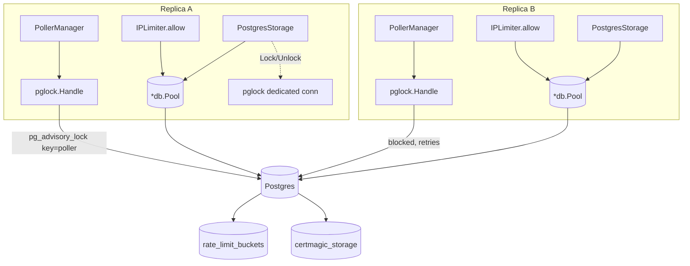

# HA Multi-Replica Design

**Spec**: `.specs/features/ha-multi-replica/spec.md`
**Status**: Approved

---

## Architecture Overview

All three fixes share one shape: replace an in-process, single-node mechanism with a Postgres-backed one, using either a session-scoped `pg_advisory_lock` (poller leader election, CertMagic's distributed lock) or a plain table (rate limiter buckets, CertMagic key/value blobs). A new small package, `internal/pglock`, centralizes the advisory-lock primitive so the poller and the CertMagic storage's `Locker` don't each reinvent session/connection handling.



Only one replica's `pglock.Handle` for the poller key ever holds the lock at a time; the other polls `pg_try_advisory_lock` on an interval until it does. `rate_limit_buckets` and `certmagic_storage` are plain shared tables every replica reads/writes through its own `*db.Pool` — no session state needed for those two, since correctness comes from row-level atomicity, not exclusion.

---

## Code Reuse Analysis

### Existing Components to Leverage

| Component | Location | How to Use |
| --- | --- | --- |
| `dbtest.lockAdvisoryKey` pattern (dedicated `pgx.Connect`, not pool) | `internal/dbtest/lock.go:117` | Same shape reused (not imported — `dbtest` is test-only) for `internal/pglock`'s dedicated-connection handling: advisory locks are session-scoped, so a pool connection that can be silently recycled is wrong for this. |
| `db.Pool` (`*pgxpool.Pool` wrapper, `MaxConns=4` per AD-011) | `internal/db/pool.go` | `IPLimiter` and `PostgresStorage`'s non-lock methods (Store/Load/Delete/Exists/List/Stat) go through the existing pool — no new pool needed, these are ordinary bounded queries. |
| Migration numbering/format (`NNNN_name.up.sql`/`.down.sql`, `internal/db/migrations/`) | `internal/db/migrations/0016_email_providers.up.sql` | New migrations `0017_rate_limit_buckets` and `0018_certmagic_storage` follow the same convention. |
| `PollerManager` (`mu sync.Mutex`, `cancel`/`done` lifecycle) | `internal/cli/poller_manager.go` | Extended, not replaced — it gains lock acquisition/heartbeat around its existing `Restart`/`stopLocked` lifecycle rather than a parallel mechanism. |
| `IPLimiter` (`allow(ip)`, `Middleware`) public API | `internal/ratelimit/ip_limiter.go` | Same exported surface kept (`NewIPLimiter`, `Middleware`) — internals swap from `map[string]*entry` to Postgres, so `internal/cli/routes.go:98`'s call site needs only its constructor arguments to change, not its usage. |
| `certmagic.FileStorage` replacement target | `internal/tls/manager.go:52` | `NewManager`'s second parameter changes from `storagePath string` to the new `certmagic.Storage` implementation; `HostPolicy`/`OnEvent` are untouched. |

### Integration Points

| System | Integration Method |
| --- | --- |
| Postgres (`*db.Pool`) | All three mechanisms read/write it directly; no new connection type except the dedicated advisory-lock connections in `internal/pglock` (opened via the same `DatabaseURL` DSN already in `config.Config`, not through the pool). |
| `internal/cli/serve.go` | `newHTTPSServer` passes `pool` (already available) into `vanetls.NewManager` instead of `storagePath`; `RunE`'s `pollerManager := NewPollerManager(...)` call gains the DSN needed for `internal/pglock`. |
| `internal/cli/routes.go:98` | `ratelimit.NewIPLimiter` call gains a `*db.Pool` argument. |
| `internal/config` | `CERTMAGIC_STORAGE_PATH` env var and its default/config field are removed (no longer meaningful — nothing left to point at a path). |
| `charts/zeep-vane/` | `templates/pvc.yaml` deleted; `values.yaml`'s `persistence.*` block removed; `templates/deployment.yaml`'s CertMagic volume mount and the `CERTMAGIC_STORAGE_PATH` env entry removed. |

---

## Components

### `internal/pglock` (new package)

- **Purpose**: Postgres session-advisory-lock primitive shared by poller leader election and CertMagic's `Locker`. Owns dedicated (non-pooled) connections because advisory locks are session-scoped — returning the connection to a pool would silently release the lock the next time pgxpool recycles it.
- **Location**: `internal/pglock/pglock.go`
- **Interfaces**:
  - `TryAcquire(ctx context.Context, dsn string, key int64) (*Handle, bool, error)` — non-blocking `pg_try_advisory_lock(key)` on a fresh dedicated connection. Returns `(nil, false, nil)` if already held elsewhere, `(nil, false, err)` on connection/query failure.
  - `Acquire(ctx context.Context, dsn string, name string) (*Handle, error)` — blocking `pg_advisory_lock(hashtextextended(name, 0))` on a fresh dedicated connection; honors `ctx` cancellation (pgx sends a Postgres cancel request, unblocking the wait). Used by CertMagic's `Lock(ctx, name)`.
  - `(*Handle) Healthy(ctx context.Context) bool` — runs `SELECT 1` on the handle's own connection; `false` means the session (and therefore the lock) is gone. Used by the poller's heartbeat.
  - `(*Handle) Release(ctx context.Context) error` — `pg_advisory_unlock`/`pg_advisory_unlock(hashtextextended(...))` as appropriate, then closes the dedicated connection.
- **Dependencies**: `github.com/jackc/pgx/v5` (direct `pgx.Connect`, same driver already used by `internal/dbtest`).
- **Reuses**: The dedicated-connection pattern already proven in `internal/dbtest/lock.go`.

### Poller leader election (extends `PollerManager`)

- **Purpose**: Guarantee at most one replica runs poll cycles at a time, satisfying HA-01..HA-07.
- **Location**: `internal/cli/poller_manager.go`
- **Interfaces** (additions to the existing type):
  - `NewPollerManager(parentCtx, pool, cfg, logger, dsn string)` — gains the raw DSN (`pglock` needs it for dedicated connections; `pool` alone can't provide session-scoped connections safely).
  - Internal `runLeaderLoop(ctx)` goroutine, started from `RunE` alongside the existing boot-time `Restart` call: loops `pglock.TryAcquire(ctx, dsn, pollerLeaderLockKey)` on `leaderRetryInterval` (10s) until acquired; once acquired, calls the existing `Restart` to start polling, then loops `Handle.Healthy(ctx)` every `leaderHeartbeatInterval` (10s — same constant, checked right before/after each poll cycle rather than on its own separate timer, satisfying HA-03's "at least once per renewal interval, per successful cycle"); on `Healthy() == false`, calls `stopLocked()` (HA-05, abort in-flight cycle) and returns to the acquire loop.
  - `pollerLeaderLockKey int64 = 727200001` — new namespace, distinct from `internal/dbtest`'s `727100001`-`727100003` test-only keys (see Risks & Concerns).
- **Dependencies**: `internal/pglock`.
- **Reuses**: `PollerManager.Restart`/`stopLocked` unchanged — the leader loop only decides *when* to call them.

**Single-replica behavior (HA-07)**: with one replica, `TryAcquire` always succeeds immediately and no contention ever occurs — behavior is identical to today's unconditional boot-time `Restart`, just gated by one extra (near-instant) lock acquisition.

### `internal/ratelimit.IPLimiter` (modified, same public API)

- **Purpose**: Cross-replica per-IP token-bucket rate limiting for the 4 unauthenticated routes, satisfying HA-08..HA-12.
- **Location**: `internal/ratelimit/ip_limiter.go`
- **Interfaces** (unchanged signatures, changed internals):
  - `NewIPLimiter(pool *db.Pool, perMinute, burst int, idleTTL time.Duration) *IPLimiter` — gains `pool` as first argument; `internal/cli/routes.go:98`'s call site updates accordingly.
  - `Middleware(next http.Handler) http.Handler` — unchanged signature and 429 body.
  - `allow(ip string) bool` — becomes `allow(ctx context.Context, ip string) bool` internally (the exported `Middleware` already has a request context to pass through); replaces the in-memory map lookup with the single atomic UPSERT below.
- **Dependencies**: `*db.Pool` (existing pool, `AD-011`'s `MaxConns=4` cap already accounts for this — same low request volume as before, just now via Postgres instead of memory).
- **Reuses**: `Middleware`'s HTTP wiring, `clientIP`, `rateLimitedBody` all untouched.

### `internal/tls.PostgresStorage` (new, implements `certmagic.Storage`)

- **Purpose**: Replace `certmagic.FileStorage` so every replica shares certificate state through Postgres, satisfying HA-13..HA-18.
- **Location**: `internal/tls/postgres_storage.go`
- **Interfaces**:
  - `NewPostgresStorage(pool *db.Pool, dsn string) *PostgresStorage` — `dsn` is needed for `pglock.Acquire`'s dedicated connections (`Lock`/`Unlock`); `pool` backs every other method.
  - `Store(ctx, key string, value []byte) error` — `INSERT ... ON CONFLICT (key) DO UPDATE SET value = EXCLUDED.value, modified_at = now()`.
  - `Load(ctx, key string) ([]byte, error)` — `SELECT value FROM certmagic_storage WHERE key = $1`; `pgx.ErrNoRows` wraps into `fs.ErrNotExist` (interface contract: "Load ... should return fs.ErrNotExist if the key does not exist").
  - `Delete(ctx, key string) error` — deletes the exact key AND every key prefixed by `key || '/'` (interface's "directory" semantics — CertMagic deletes whole cert bundles by prefix); returns `fs.ErrNotExist`-wrapped error only if nothing existed to delete under that key or prefix.
  - `Exists(ctx, key string) bool` — true if an exact match or a `key || '/%'` prefix match exists.
  - `List(ctx, path string, recursive bool) ([]string, error)` — `recursive`: all keys prefixed by `path || '/'`; non-recursive: only the immediate next path segment for each match (mirrors `FileStorage`'s one-level-directory-listing semantics), deduplicated in Go after a single prefix query.
  - `Stat(ctx, key string) (certmagic.KeyInfo, error)` — `SELECT value, modified_at FROM certmagic_storage WHERE key = $1` (or a prefix-only check to report a non-terminal "directory" `KeyInfo` when no exact row exists but a prefix does).
  - `Lock(ctx, name string) error` — `pglock.Acquire(ctx, dsn, name)`, tracked in an internal `map[string]*pglock.Handle` (mutex-protected) so `Unlock` can find the same handle.
  - `Unlock(ctx, name string) error` — looks up and releases the handle from the map; errors if no handle is tracked for `name` (contract: only called after a successful `Lock`).
- **Dependencies**: `internal/pglock`, `*db.Pool`.
- **Reuses**: Nothing pre-existing (first Postgres-backed `certmagic.Storage` in the codebase) — the interface itself is external (`github.com/caddyserver/certmagic`).

### Wiring changes

- **`internal/cli/serve.go`**: `newHTTPSServer(pool, dsn, logger)` gains `dsn`; builds `tls.NewPostgresStorage(pool, dsn)` and passes it to `vanetls.NewManager(statusPages, storage)` instead of a `storagePath` string. `defaultCertMagicStoragePath` constant and the `CERTMAGIC_STORAGE_PATH` env read are deleted. `NewPollerManager(...)` call gains `cfg.DatabaseURL` as the new `dsn` argument.
- **`internal/tls/manager.go`**: `NewManager(store StatusPageStore, storage certmagic.Storage) *certmagic.Config` — signature changes from `storagePath string` to `storage certmagic.Storage`; body changes `certmagic.Default.Storage = &certmagic.FileStorage{Path: storagePath}` to `certmagic.Default.Storage = storage`.
- **`internal/config/config.go`**: no change needed for the rate limiter/poller (they take `pool`/`dsn` already present in `Config`/wired at call sites) — only the CertMagic storage path concept is removed, and it was never a `Config` struct field (read directly via `os.Getenv` in `serve.go`), so no struct change there either.

---

## Data Models

### `rate_limit_buckets` (migration `0017_rate_limit_buckets`)

```sql
CREATE TABLE rate_limit_buckets (
    ip          TEXT PRIMARY KEY,
    tokens      DOUBLE PRECISION NOT NULL,
    last_refill TIMESTAMPTZ NOT NULL DEFAULT now()
);
```

Single atomic statement per `allow(ctx, ip)` call — refill-then-consume, clamped so tokens never go negative (matching `golang.org/x/time/rate.Limiter`'s own floor-at-zero behavior, per HA-09's "byte-for-byte" parity requirement):

```sql
INSERT INTO rate_limit_buckets (ip, tokens, last_refill)
VALUES ($1, $2 - 1, now())
ON CONFLICT (ip) DO UPDATE SET
    tokens = GREATEST(
        0,
        LEAST($2, rate_limit_buckets.tokens
                  + $3 * EXTRACT(EPOCH FROM (now() - rate_limit_buckets.last_refill)))
        - CASE WHEN LEAST($2, rate_limit_buckets.tokens
                             + $3 * EXTRACT(EPOCH FROM (now() - rate_limit_buckets.last_refill))) >= 1
               THEN 1 ELSE 0 END
    ),
    last_refill = now()
RETURNING
    LEAST($2, rate_limit_buckets.tokens
             + $3 * EXTRACT(EPOCH FROM (now() - rate_limit_buckets.last_refill))) >= 1 AS allowed;
```

(`$2` = `burst` i.e. bucket capacity, `$3` = `perMinute/60` refill rate per second — same units `IPLimiter` already computes today for `rate.NewLimiter`.) Cleanup (HA-11, bounding table growth): a `DELETE FROM rate_limit_buckets WHERE last_refill < now() - idleTTL` runs opportunistically inside `allow()` once a cheap `SELECT count(*)` (or a sampled/probabilistic check) exceeds `sweepThreshold` — same trigger condition `IPLimiter.allow` already uses for its in-memory sweep, just against the table.

### `certmagic_storage` (migration `0018_certmagic_storage`)

```sql
CREATE TABLE certmagic_storage (
    key         TEXT PRIMARY KEY,
    value       BYTEA NOT NULL,
    modified_at TIMESTAMPTZ NOT NULL DEFAULT now()
);
CREATE INDEX certmagic_storage_key_prefix_idx ON certmagic_storage (key text_pattern_ops);
```

The prefix index supports `Delete`/`Exists`/`List`/`Stat`'s "directory" (prefix) semantics efficiently (`WHERE key LIKE 'prefix/%'`).

**Relationships**: Neither table relates to any existing entity — both are purely infrastructural (no FK, no `company_settings`/`status_pages` reference), consistent with `AD-002` (single-tenant, no cross-referencing needed).

---

## Error Handling Strategy

| Error Scenario | Handling | User Impact |
| --- | --- | --- |
| Postgres unreachable during `allow(ctx, ip)` | Log the error, return `true` (fail-open, HA-10) | None — request proceeds as if under the limit |
| Postgres unreachable during poller's `TryAcquire`/`Healthy` | Retry on the existing interval; poller simply doesn't run until Postgres recovers | Status data goes stale, same as today's single-poller-down case; no crash |
| Postgres unreachable during CertMagic `Store`/`Load`/`Lock` | Propagated as a normal error to CertMagic, which already has its own ACME retry/backoff for storage failures (unchanged from `FileStorage` disk-I/O errors today) | Certificate issuance/renewal delayed, same class of failure as a disk-full `FileStorage` today |
| `Load`/`Delete`/`List`/`Stat` called on a missing key | Wrapped as `fs.ErrNotExist` per the `certmagic.Storage` interface contract | None — CertMagic's own logic already handles "not found" as "needs to issue" |
| Rate-limit cleanup query itself errors/times out | Logged and skipped for this cycle (best-effort, per spec Edge Cases) | None — table grows slightly slower-than-bounded until next successful cleanup |
| Two replicas' CertMagic `Lock` race for the same hostname | Second blocks in Postgres until the first calls `Unlock` (or its connection dies) | None — same "second issuer waits" behavior `FileStorage`'s file lock gives today |

---

## Risks & Concerns

| Concern | Location (file:line) | Impact | Mitigation |
| --- | --- | --- | --- |
| Advisory lock key collision with test-only keys | `internal/dbtest/lock.go:18,25,33` (`727100001`-`727100003`) | If production poller lock key ever matched a test key, integration tests could deadlock against a real dev/staging instance sharing the key namespace | New production key (`727200001`) is in a distinct block; documented in `pglock.go`'s doc comment same as `dbtest`'s own collision-avoidance comment |
| `pg_advisory_lock` session tied to one physical connection, not the pool | New code, `internal/pglock` | A dedicated connection idle for a long time (single-replica case, poller leader holds it for the process lifetime) is one extra long-lived Postgres connection outside `db.Pool`'s `MaxConns=4` (AD-011) | Bounded: at most 1 extra connection for the poller leader (per replica attempting leadership) + at most 1 per concurrently-issuing hostname for CertMagic locks (naturally small — self-hosted install issues few certs); not unbounded growth |
| `IPLimiter.allow` now does a Postgres round-trip per request on 4 routes that are, by design, already rate-limited to a handful of requests/minute per IP | `internal/ratelimit/ip_limiter.go` | Negligible — these are login/reset/invite/bootstrap only, not high-QPS routes; `AD-011`'s 4-connection pool cap already anticipates low concurrent load | No mitigation needed beyond noting it; flagged so a future high-QPS rate-limited route doesn't copy this pattern blindly |
| `internal/tls/manager_integration_test.go` and `manager_test.go` currently exercise `certmagic.FileStorage` behavior indirectly | `internal/tls/manager_test.go`, `internal/tls/manager_integration_test.go` | Existing tests may assert against file-based storage specifics that no longer apply | Tasks phase updates these tests to use `PostgresStorage` (or a fake) instead of asserting file-path behavior — tracked as an explicit task, not silently left stale |

> No further concerns found beyond the above.

---

## Tech Decisions (only non-obvious ones)

| Decision | Choice | Rationale |
| --- | --- | --- |
| Leader election mechanism | Session-scoped `pg_advisory_lock` on a dedicated connection + heartbeat, not a time-based lease/TTL table | Postgres already releases a session lock automatically when the holding connection dies (crash, network partition) — this gives "automatic failover on failure" for free, simpler and more correct than reimplementing TTL/renewal bookkeeping in a table. Supersedes the placeholder "30s lease" framing recorded as an assumption in `spec.md`/`context.md` before this research; the *outcome* (HA-01..HA-07) is unchanged, only the mechanism is simpler than assumed. |
| Rate limiter algorithm | Re-derive the exact token-bucket formula in SQL (refill-then-consume, clamped at 0) rather than a generic Postgres rate-limiting library | No existing Go Postgres rate-limit library matches `golang.org/x/time/rate`'s exact semantics closely enough to guarantee HA-09's parity requirement; the formula is small enough to own directly and test against the existing `IPLimiter` test suite's expected behavior. |
| CertMagic lock key hashing | `hashtextextended(name, 0)` computed in SQL, not hashed in Go | Keeps `Lock`/`Unlock`'s SQL self-contained (no separate Go-side hash step to keep in sync with the unlock statement), and `hashtextextended` returns a full 64-bit value (unlike `hashtext`'s 32-bit), minimizing collision risk between distinct lock names. |
| `PersistentVolumeClaim` removal from Helm chart | Delete `templates/pvc.yaml` and `values.yaml`'s `persistence.*` entirely, not just make it optional | Nothing in the codebase writes to a local path anymore once `PostgresStorage` replaces `FileStorage` — an optional-but-present PVC would be dead configuration inviting confusion about whether it's still needed. |

> **Project-level decision**: this design formalizes Postgres-backed coordination (advisory locks + shared tables) as the project's default pattern for anything needing cross-replica state, instead of introducing new infrastructure (Redis/etcd/NFS/object storage) — extending the same reasoning already behind `AD-010` (logo storage) and `AD-011` (pool sizing). This will be recorded as `AD-013` in `.specs/STATE.md` once this design is approved (see `memory.md`).

---
