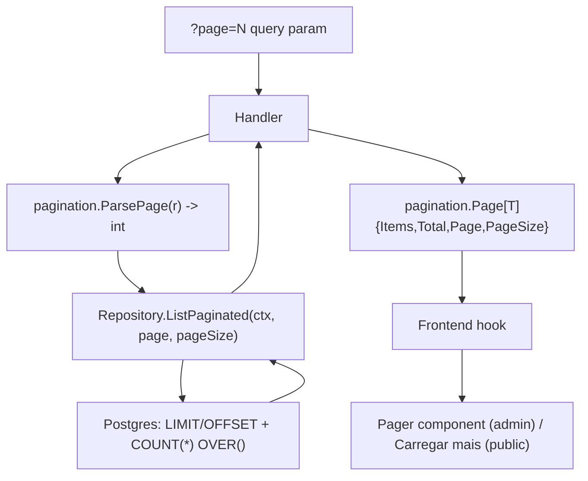

# List Pagination Design

**Spec**: `.specs/features/list-pagination/spec.md`
**Status**: Draft

---

## Architecture Overview

One shared envelope type and one shared query-param parser (`internal/api/pagination.go`), reused by 9 repository methods and 9 handlers. Each repository method that changes gets a **new** `ListPaginated` method rather than a mutated `List` signature, except where `List(ctx)` has no caller left afterward (removed as dead code) or has a second internal caller that must stay unpaginated (`ServiceRepository`, kept alongside).



---

## Code Reuse Analysis

### Existing Components to Leverage

| Component | Location | How to Use |
| --------- | -------- | ---------- |
| `chi.URLParam` / `r.URL.Query()` precedent | `internal/api/integrations_handler.go:172` (`SearchSLOs`, only existing query-param read in the backend) | Same `r.URL.Query().Get(...)` pattern for `page`, first `strconv.Atoi` on an HTTP query param in this codebase |
| `json.NewEncoder(w).Encode(...)` response pattern | every handler in `internal/api/*.go` | `Page[T]` envelope encoded the same way, no new response-writing mechanism |
| TanStack Query prefix invalidation | `web/src/features/*/hooks.ts` (every mutation already calls `invalidateQueries({queryKey: ["incidents"]})` etc., e.g. `incidents/hooks.ts:23`, `admins/hooks.ts:37`) | **No code change needed** for PAG-11 (P2 AC4, cache invalidation across pages): TanStack Query's `invalidateQueries` does prefix matching by default (`exact` defaults to `false`) — `["incidents"]` already matches `["incidents", 2]` once the query key gains a page segment. Confirmed via existing TanStack Query default behavior, not a new mechanism |
| `Button` variants (`ghost`/`icon`) | `web/src/components/ui/Button.tsx:17-26` (`buttonVariantClasses`) | `Pager`'s Anterior/Próximo controls reuse these classes instead of new CSS |
| `providers := []EmailProvider{}` empty-slice-not-nil pattern | `internal/db/email_provider_repository.go:98` | Every new `ListPaginated` initializes `items := []T{}` the same way, so `page=N` past the end serializes as `"items":[]`, never `"items":null` |

### Integration Points

| System | Integration Method |
| ------ | ------------------- |
| Postgres | `LIMIT $N OFFSET $M` + `COUNT(*) OVER()` window function added to each existing `ORDER BY` query, no schema change |
| `admins` merge | Handler-level in-memory pagination stays on the existing merge (see Assumptions in spec.md) — no repository signature change for `AdminInviteRepository.List` or the raw admins SQL in `admins.go:558` |

---

## Components

### `internal/api/pagination.go` (new)

- **Purpose**: single shared envelope type + query-param parser, reused by every paginated handler
- **Location**: `internal/api/pagination.go`
- **Interfaces**:
  - `type Page[T any] struct { Items []T \`json:"items"\`; Total int \`json:"total"\`; Page int \`json:"page"\`; PageSize int \`json:"page_size"\` }`
  - `func parsePage(r *http.Request) int` — reads `?page=`, returns `1` on missing/non-numeric/non-positive (PAG-02, PAG-03)
- **Dependencies**: `net/http`, `strconv`
- **Reuses**: nothing new to introduce beyond stdlib; Go 1.26 (per `go.mod`) supports generics, confirmed

### Repository changes (7 repos gain `ListPaginated`; 2 stay untouched)

| Repository | Change | Reason |
| ---------- | ------ | ------ |
| `DomainRepository` | `List(ctx)` → replaced by `ListPaginated(ctx, page, pageSize) ([]Domain, int, error)` | Single caller (`domains_handler.go:80`), safe to replace, no dead code left |
| `ServiceRepository` | **Adds** `ListPaginated(ctx, page, pageSize) ([]Service, int, error)`; **keeps** existing `List(ctx)` unchanged | `List(ctx)` has a second caller outside the HTTP layer: `internal/poller/poller.go:115` polls every service every cycle and must never be paginated. Changing its signature would silently break polling. `ListForStatusPage` (used by the public endpoint, `service_repository.go:75`) is untouched — different method, different caller |
| `StatusPageRepository` | `List(ctx)` → replaced by `ListPaginated(ctx, page, pageSize) ([]StatusPage, int, error)` | Single caller (`status_pages_handler.go:220`). The existing batch `serviceIDsByStatusPage` lookup (`status_page_repository.go:242-249`) runs against only the paged IDs, shrinking its own blast radius as a side effect |
| `IncidentRepository` | `List(ctx)` → replaced by `ListPaginated(ctx, page, pageSize) ([]Incident, int, error)`; `ListUpdates(ctx, id)` → replaced by `ListUpdatesPaginated(ctx, id, page, pageSize) ([]IncidentUpdate, int, error)` | Single caller each (`incidents_handler.go:80` and `:155`/`:139` — `AddUpdate` also calls `ListUpdates` today to rebuild the timeline after posting; it switches to page 1 of `ListUpdatesPaginated`, matching what the client re-fetches anyway). The `listServiceIDs` N+1 (`incident_repository.go:130`) now runs against at most `page_size=25` incidents per request instead of the whole table — incidental shrinkage, not a fix (see Risks) |
| `IntegrationRepository` | `List(ctx)` → replaced by `ListPaginated(ctx, page, pageSize) ([]Integration, int, error)` | Single caller (`poller_status.go:48`); confirmed the poller itself (`poller.go`) never calls `IntegrationRepository.List`, only `MarkDatadogChecked`/`MarkDatadogInvalid` — safe to replace |
| `EmailProviderRepository` | `List(ctx)` → replaced by `ListPaginated(ctx, page, pageSize) ([]EmailProvider, int, error)` | Single caller (`email/service.go:144`, itself called only by `email_providers_handler.go:135`) |
| `AdminInviteRepository` | **Untouched** | Handler merges the full invite list with the full admin list in memory before slicing one page (spec Assumption); pagination happens after the merge, not in this repository's query |
| `admins.go`'s raw SQL query (`h.pool.Query(...)`, `admins.go:558`) | **Untouched** at the query level | Same reason — `AdminsHandler.List` fetches all admins + all invites (both small by AD-002), merges, sorts, then applies `page`/`page_size=20` slicing to the merged Go slice in the handler itself |

**`total` under `COUNT(*) OVER()`'s edge case** (applies to every `ListPaginated` above): a window function only appears on rows that are actually returned — when the requested page is beyond the last page (PAG-04) or the table is empty, the query returns zero rows and there is no row to carry `total`. Each `ListPaginated` falls back to a plain `SELECT COUNT(*) FROM <table> [same WHERE, if any]` **only when the primary query returns zero rows** — the common case (a page with at least one row) stays a single query; the edge case costs one extra cheap `COUNT(*)` (see Tech Decisions).

### Handler changes (9 handlers)

Each of `DomainsHandler.List`, `ServicesHandler.List`, `StatusPagesHandler.List`, `IncidentsHandler.List`, `IncidentsHandler.ListUpdates`, `PollerStatusHandler.List`, `EmailProvidersHandler.List`, `AdminsHandler.List`, and `PublicStatusHandler`'s incident composition:

- Reads `page := parsePage(r)` (or, for the public handler, from whatever request path already reaches `composeResponse` — see below)
- Calls the corresponding `ListPaginated`/merge-and-slice
- Responds with `pagination.Page[T]{Items: items, Total: total, Page: page, PageSize: pageSize}` (constant `pageSize` per endpoint, per spec Assumptions: 20 for admins/domains/services/status-pages/email-providers/poller-status, 25 for incidents/updates, 10 for public)

### `internal/api/public_status_handler.go` — shared composition function

- **Purpose**: apply the same envelope to the incidents block of the public/preview status page response, without duplicating logic between the real public handler and the dev/admin preview handler that already share a composition function (per prior `admin-invite`/`status-page-domain-attach`-era work: preview reuses `PublicStatusHandler`'s composition via an extracted function)
- **Location**: `internal/api/public_status_handler.go` (the extracted `composeResponse`-style function, shared with `public_status_preview_handler.go`)
- **Interfaces**: `ListPublicForStatusPage(ctx, statusPageID, retentionDays, page, pageSize) (active []db.IncidentPublic, resolved db.Page[db.IncidentPublic], err error)` — **active incidents stay a plain unpaginated slice** (an active incident is, by definition, at most one per service and always shown in full at the top of the page today; pagination in this feature targets **resolved** incident history, the part that grows over time). `resolved` becomes `pagination.Page[db.IncidentPublic]`
- **Dependencies**: same `internal/api/pagination.go` envelope
- **Reuses**: the existing shared composition function; because both the real public handler and the preview handler call it, pagination reaches both without a second implementation

### Frontend: `web/src/components/ui/Pager.tsx` (new)

- **Purpose**: reusable Anterior/Próximo + "Página X de Y" control for the 8 admin list screens
- **Location**: `web/src/components/ui/Pager.tsx`
- **Interfaces**: `Pager({ page, totalPages, onChange }: { page: number; totalPages: number; onChange: (page: number) => void })` — disables "Anterior" when `page <= 1`, disables "Próximo" when `page >= totalPages`
- **Dependencies**: `Button` (`variant="ghost"` or `"icon"`, per Code Reuse)
- **Reuses**: `web/src/components/ui/Button.tsx` variant classes

### Frontend: hooks (7 files change; `AdminInviteRepository`-backed merge stays the same shape)

Each of `useIncidents`, `useIncidentUpdates`, `useDomains`, `useServices`, `useStatusPages`, `useAdmins`, `usePollerStatus`, `useEmailProviders` gains a `page: number` parameter:

- `queryKey` gains the page segment: `["incidents", page]` (top-level lists) or `["incidents", incidentId, "updates", page]` (nested)
- `queryFn` calls `apiFetch<Page<T>>(\`/api/incidents?page=${page}\`)` (querystring built into the path string, matching the existing precedent for path params — `apiClient.ts` has no query-object helper, confirmed)
- Returns the full `Page<T>` object (not just `.items`) so the calling component can read `total`/`page_size` for the `Pager`

### Frontend: `web/src/features/public-status/hooks.ts` + `PublicStatusPage.tsx`

- `usePublicStatusPage` fetches page 1 of resolved incidents by default; a new `loadMoreResolvedIncidents()` action fetches the next page and appends to local state (PAG-13/14) — active incidents are unaffected (unpaginated, per the component note above)
- "Carregar mais" button renders in `PublicStatusPage.tsx` only `WHILE resolved.items.length < resolved.total`

---

## Data Models

```typescript
// web/src/types/api.ts (extended)
interface Page<T> {
  items: T[];
  total: number;
  page: number;
  page_size: number;
}
```

```go
// internal/api/pagination.go
type Page[T any] struct {
	Items    []T `json:"items"`
	Total    int `json:"total"`
	Page     int `json:"page"`
	PageSize int `json:"page_size"`
}
```

**Relationships**: `Page[T]` wraps every existing response model (`Domain`, `Service`, `StatusPage`, `Incident`, `IncidentUpdate`, `Integration` (as `pollerIntegrationStatus`), `EmailProvider`, `adminResponse`, `db.IncidentPublic`) without changing any of those models themselves.

---

## Error Handling Strategy

| Error Scenario | Handling | User Impact |
| --------------- | -------- | ----------- |
| `?page=` missing | Defaults to `1` (PAG-02) | First page loads normally |
| `?page=` invalid (`0`, negative, `"abc"`) | Clamped to `1`, `200` (PAG-03) | Same as above — no visible error |
| `?page=` beyond last page | `200`, `items: []`, correct `total` (PAG-04) | Admin sees an empty table with the `Pager` still showing the correct "Página X de Y"; the frontend never actually lets this happen via the UI (`Pager` disables "Próximo" past the last page), but a stale/bookmarked/shared URL still resolves cleanly |
| `COUNT(*) OVER()` yields zero rows on an empty page | Fallback `SELECT COUNT(*)` runs once | `total` still correct even when the primary query can't carry it |

---

## Risks & Concerns

| Concern | Location (file:line) | Impact | Mitigation |
| ------- | --------------------- | ------ | ---------- |
| `ServiceRepository.List(ctx)` has a second, non-HTTP caller | `internal/poller/poller.go:115` | Naively changing `List`'s signature to add pagination would silently make the poller only ever see `page_size` services per cycle, breaking monitoring for every service past the first page | New `ListPaginated` method added alongside the untouched `List(ctx)`; `poller.go` is not touched by this feature at all |
| `IncidentRepository`'s per-incident `listServiceIDs` N+1 | `internal/db/incident_repository.go:130` | Still N+1 after this feature, just bounded to `page_size=25` per request instead of unbounded | Incidental shrinkage accepted as a side effect; a batch-fetch fix is a separate, out-of-scope improvement (not requested, not blocking this feature's goals) |
| `useServices`'s client-side per-service SLO-name enrichment N+1 | `web/src/features/services/hooks.ts:32-33` | Pre-existing, unrelated to pagination; still fires once per row, now bounded to `page_size=20` rows per page instead of the whole table | Same as above — incidental shrinkage, no dedicated fix in this feature |
| `COUNT(*) OVER()` can't produce `total` on a zero-row page | every new `ListPaginated` | Without a fallback, `total` would come back as `0` for a legitimately non-empty table when `page` overshoots, breaking PAG-04's "correct total" requirement | Fallback plain `COUNT(*)` query, only when the primary query returns zero rows (see Components) |
| `AddUpdate`'s existing re-fetch of the full timeline after posting an update | `internal/api/incidents_handler.go:139` | Switches to page 1 of `ListUpdatesPaginated`; if an incident has more than 25 updates, the caller's immediate post-submit view shows only the most recent 25 (already true today for the initial render — `ORDER BY created_at DESC` — so behavior is unchanged for the common case, only the ceiling is now explicit) | No fix needed — same effective behavior as today, now bounded instead of unbounded |

> No security or auth-boundary concerns identified: this feature does not change who can call which endpoint (`RequireRole` gates are unaffected by adding `page`/`page_size` to responses already gated the same way).

---

## Tech Decisions (only non-obvious ones)

| Decision | Choice | Rationale |
| -------- | ------ | --------- |
| New method name vs. mutated signature | `ListPaginated` as a new method (old `List` removed where no other caller exists, kept where one does) | Keeps `ServiceRepository`'s poller-facing `List(ctx)` completely unaffected instead of threading pagination params through a method the poller must call unpaginated |
| `total` computation | `COUNT(*) OVER()` in the primary query, with a fallback plain `COUNT(*)` only on a zero-row result | Preserves "one query in the common case" (the confirmed spec assumption) while still meeting PAG-04's correctness requirement, which the window function alone cannot satisfy when no row survives the `LIMIT`/`OFFSET` |
| Public status page pagination target | Only **resolved** incidents get `Page[T]`; active incidents stay a plain slice | An active incident is at most one per service by the existing domain model — there is nothing to paginate there; the growth risk this feature targets is historical (resolved) incidents |
| Cache invalidation across pages | No new invalidation code — rely on TanStack Query's default prefix-matching `invalidateQueries` | Every existing mutation already invalidates the base key (`["incidents"]`, `["admins"]`, etc.); adding a page segment to the query key doesn't require touching any mutation hook, confirmed via TanStack Query's documented default (`exact: false`) |
