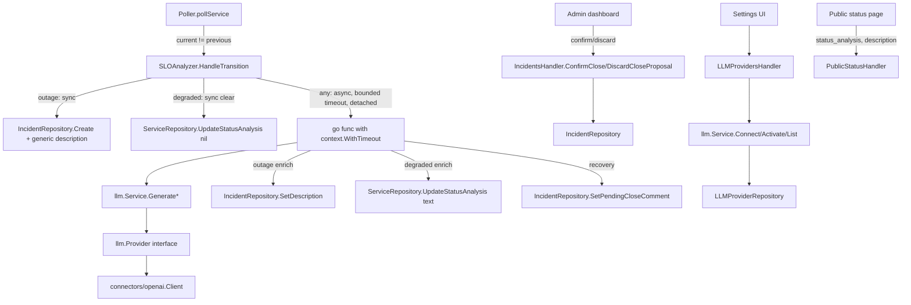

# LLM SLO Analysis Design

**Spec**: `.specs/features/llm-slo-analysis/spec.md`
**Context**: `.specs/features/llm-slo-analysis/context.md`
**Status**: Draft

---

## Architecture Overview

Single approach — the codebase already carries the exact precedent this feature needs twice over (`email.Provider`/`internal/connectors/{resend,sendgrid}` for the adapter shape, `email_providers`/`email_settings` for the storage shape), so there is no real alternative-approach exploration to present; deviating from either precedent would need its own justification, not the other way around.

A new `internal/llm` package (mirrors `internal/email`) owns the provider-agnostic contract, prompt construction, and connect/activate/list business logic. `internal/connectors/openai` implements it, the same way `internal/connectors/resend` implements `email.Provider`. A new `internal/poller.SLOAnalyzer` sits beside `Poller`, called from `pollService` at the exact point a transition is already known (`current != svc.CurrentStatus`, before `UpdateStatus` overwrites it) — it never introduces a second polling loop or a new trigger mechanism. Incident/analysis writes that must never block the poll cycle run in a detached goroutine with a bounded timeout, the same `context.WithoutCancel` + timeout shape `AD-014` established for the password-reset email send.



---

## Code Reuse Analysis

### Existing Components to Leverage

| Component | Location | How to Use |
| --- | --- | --- |
| `email.Provider` / `ProviderFactory` shape | `internal/email/provider.go` | Direct template for `llm.Provider` / `llm.ProviderFactory` |
| `email.Service.Connect/Activate/List` | `internal/email/service.go` | Direct template for `llm.Service.Connect/Activate/List` — same validate-before-persist, same encrypted-at-rest handling |
| `resend.Client` HTTP plumbing (`do`, timeout classification, typed errors) | `internal/connectors/resend/client.go` | Template for `connectors/openai.Client` — same `ErrUnauthorized`/`ErrTimeout`/`ErrServer` classification, reused from `internal/email`'s typed errors is NOT possible (different package/domain) so `internal/llm` gets its own copy of the same three typed errors |
| `EmailProvidersHandler` (Connect/Activate/List, known-provider allowlist, error-body helpers) | `internal/api/email_providers_handler.go` | Direct template for `LLMProvidersHandler` |
| `email_providers`/`email_settings` migration shape (per-provider row + FK'd singleton active row) | `internal/db/migrations/0016_email_providers.up.sql` | Direct template for `llm_providers`/`llm_settings` |
| `internal/crypto.Encrypt/Decrypt` | `internal/crypto/secretbox.go` | Reused as-is, no changes — same `masterKey` already threaded through `cli/routes.go` |
| `IncidentRepository.Create/Transition/AddUpdate` | `internal/db/incident_repository.go` | Extended (new columns, new narrow methods), not replaced — existing manual-incident flow (`incidents_handler.go`) is untouched |
| Detached-goroutine dispatch pattern (`context.WithoutCancel`) | `internal/api/password_reset_handler.go` (per `AD-014`) | Same shape for the LLM enrichment goroutine, adapted with a bounded `context.WithTimeout` on top since an LLM call, unlike a fire-and-forget email send, has content the caller eventually reads |
| Hourly-history tooltip pattern (`title` + `tabIndex`, native browser tooltip) | `web/src/features/public-status/PublicStatusPage.tsx` (hourlyTooltip) | Reused for the `degraded` service badge's tooltip — no new tooltip component |
| `Page[T]` pagination envelope | `internal/api/pagination.go` | `GET /api/integrations/llm` reuses it exactly like `GET /api/integrations/email` |

### Integration Points

| System | Integration Method |
| --- | --- |
| Poller (`internal/poller/poller.go`) | `pollService` gains one call, `p.analyzer.HandleTransition(ctx, svc, previousStatus, current)`, placed after computing `current` and before `OpenOrExtend`/`UpdateStatus` — read-only with respect to those, never changes `current` itself |
| Postgres | 3 new migrations (`0021_llm_providers`, `0022_incident_ai_fields`, `0023_service_status_analysis`), embedded via the existing `internal/db/migrations_embed.go` mechanism, no new manual step |
| Public status API | `publicServiceResponse` gains `status_analysis` (nullable, only meaningful `WHILE status == "degraded"`), `publicIncidentResponse` gains `description` (nullable) — both additive fields, no rename, no `AD-020`-style breaking change needed |
| Admin API | New `/api/integrations/llm/*` routes (mirrors `/api/integrations/email/*`); `incidents_handler.go` gains `POST /api/incidents/{id}/confirm-close` and `POST /api/incidents/{id}/discard-close-proposal` |
| Settings UI | New "IA" section, structurally identical to the existing email-providers settings section (connect form, model selector, active/connected badges) |

---

## Components

### `internal/llm` (new package)

- **Purpose**: Provider-agnostic contract, prompt construction, and connect/activate/list business logic for LLM analysis — the `internal/email` of this feature.
- **Location**: `internal/llm/provider.go`, `internal/llm/service.go`, `internal/llm/prompts.go`
- **Interfaces**:
  - `Provider.Complete(ctx context.Context, systemPrompt, userPrompt string) (string, error)` — a single bounded text completion call. Deliberately generic (no "degraded"/"outage" concept inside the connector) so a future Gemini/etc. connector only ever implements this one method plus `ValidateCredentials`.
  - `Provider.ValidateCredentials(ctx context.Context) error`
  - `ProviderFactory func(provider, apiKey, model string) (Provider, error)`
  - `Service.Connect(ctx, provider, apiKey, model string) error` — `model` empty means "use the provider's default" (AI-03); validates via `Provider.ValidateCredentials` before persisting, same as `email.Service.Connect`.
  - `Service.SetModel(ctx, provider, model string) error` — changes the active model for an already-connected provider without re-supplying/re-validating the API key (AI-04); rejects a model not in that provider's known-model allowlist.
  - `Service.Activate(ctx, provider string) error`
  - `Service.List(ctx, page, pageSize int) (ListResult, error)`
  - `Service.GenerateDegradedAnalysis(ctx context.Context, in AnalysisInput) (string, error)` — builds the degraded-tooltip prompt, calls the active provider's `Complete`.
  - `Service.GenerateOutageDescription(ctx context.Context, in AnalysisInput) (string, error)`
  - `Service.GenerateClosingComment(ctx context.Context, in AnalysisInput) (string, error)`
  - `AnalysisInput` struct: `ServiceName string`, `SLOState string`, `SLI, Target, ErrorBudgetRemaining float64`, `Timeframe string` — built directly from `db.Service` + `datadog.SLOStatus`, no new external call.
- **Dependencies**: `internal/db` (via a narrow `LLMProviderStore` interface, same convention as `email.EmailProviderStore`), `internal/crypto`.
- **Reuses**: Exact shape of `internal/email/service.go` and `internal/email/provider.go`.

### `internal/connectors/openai` (new package)

- **Purpose**: Implements `llm.Provider` against OpenAI's REST API.
- **Location**: `internal/connectors/openai/client.go`
- **Interfaces**:
  - `NewClient(apiKey, model string) *Client`
  - `(c *Client) Complete(ctx, systemPrompt, userPrompt string) (string, error)` — `POST /v1/chat/completions`, `max_tokens` capped small (≈200) since every prompt asks for 1-2 sentences; classifies 401/403 as `llm.ErrUnauthorized`, 5xx as `llm.ErrServer`, deadline/timeout as `llm.ErrTimeout`, same 3-way classification `resend.Client.do` already does.
  - `(c *Client) ValidateCredentials(ctx) error` — `GET /v1/models`, list endpoint, no completion spent (Research: OpenAI's own docs list `GET /v1/models` as the standard low-cost way to confirm a key works, same shape Resend/SendGrid already use for their own `ValidateCredentials`).
- **Dependencies**: none beyond `net/http` + `internal/llm`'s typed errors.
- **Reuses**: `resend.Client`'s HTTP plumbing shape (`do`, timeout classification) — not the code itself (different package), the pattern.

### `internal/poller.SLOAnalyzer` (new file, `internal/poller/analyzer.go`)

- **Purpose**: Bridges poller state transitions to `internal/llm`, keeping all "when does this feature fire" logic in one place, in the same package as the transition data (`Poller` already owns `svc.CurrentStatus` vs `current`).
- **Location**: `internal/poller/analyzer.go`
- **Interfaces**:
  - `NewSLOAnalyzer(incidents incidentStore, services statusAnalysisWriter, llmSvc llmGenerator, timeout time.Duration, logger *zap.Logger) *SLOAnalyzer`
  - `(a *SLOAnalyzer) HandleTransition(ctx context.Context, svc db.Service, previousStatus, newStatus string, sloStatus datadog.SLOStatus)` — called synchronously from `pollService`; the method itself returns immediately after any synchronous DB write (incident creation, analysis-clear), having already kicked off the async enrichment goroutine (if any) before returning. Never returns an error to the caller — a failure here must never fail `pollService`'s per-service loop (AI-08 "independent of whether an LLM call ever completes").
- **Dependencies**: `db.IncidentRepository` (narrowed), `db.ServiceRepository` (narrowed to `UpdateStatusAnalysis`), `llm.Service` (narrowed to the three `Generate*` methods).
- **Reuses**: `AD-014`'s detached-dispatch pattern (`context.WithoutCancel(ctx)` wrapped in `context.WithTimeout(..., analysisTimeout)`).

### `LLMProvidersHandler` (new file, `internal/api/llm_providers_handler.go`)

- **Purpose**: Serves `/api/integrations/llm/*`.
- **Location**: `internal/api/llm_providers_handler.go`
- **Interfaces**: `Connect`, `SetModel`, `Activate`, `List` — same signatures/shape as `EmailProvidersHandler`.
- **Dependencies**: `llm.Service` (narrowed interface).
- **Reuses**: `EmailProvidersHandler` almost verbatim (route param validation, error-body helpers, `Page[T]`-free list response matching `listEmailProvidersResponse`'s shape since there's currently exactly one known provider — same precedent as email's 2).

### `IncidentsHandler` extension

- **Purpose**: Add the two new confirm/discard endpoints for a pending LLM closing-comment proposal.
- **Location**: `internal/api/incidents_handler.go` (existing file, additive methods)
- **Interfaces**:
  - `ConfirmClose(w, r)` — `POST /api/incidents/{id}/confirm-close`. 404 if no incident, 422 if no pending proposal exists. On success: appends the pending comment as a normal `incident_update` (reuses `AddUpdate`), transitions to `resolved` (reuses `Transition`), clears `pending_close_comment` — all inside one transaction (new repository method `ConfirmPendingClose`, not three separate calls, to avoid a partial-apply race).
  - `DiscardCloseProposal(w, r)` — `POST /api/incidents/{id}/discard-close-proposal`. Clears `pending_close_comment`, incident stays exactly as it was otherwise.
- **Dependencies**: `db.IncidentRepository` (already a dependency).
- **Reuses**: Existing `incidents_handler.go` role-gating/error-body conventions.

---

## Data Models

### `llm_providers` table (migration `0021_llm_providers.up.sql`)

```sql
CREATE TABLE llm_providers (
    id                UUID PRIMARY KEY DEFAULT gen_random_uuid(),
    provider          TEXT NOT NULL UNIQUE CHECK (provider IN ('openai')),
    encrypted_api_key BYTEA NOT NULL,
    model             TEXT NOT NULL,
    status            TEXT NOT NULL DEFAULT 'connected' CHECK (status IN ('connected', 'invalid')),
    last_checked_at   TIMESTAMPTZ,
    last_error        TEXT
);

CREATE TABLE llm_settings (
    id              SMALLINT PRIMARY KEY DEFAULT 1 CHECK (id = 1),
    active_provider TEXT REFERENCES llm_providers (provider) ON DELETE SET NULL
);

INSERT INTO llm_settings (id) VALUES (1) ON CONFLICT DO NOTHING;
```

Byte-for-byte the `email_providers`/`email_settings` shape (`0016_email_providers.up.sql`), with `model` added (email providers have no model concept) and the `provider` CHECK constrained to `('openai')` today — extending it to a second provider later is a one-line migration, not a redesign.

### `incidents` table additions (migration `0022_incident_ai_fields.up.sql`)

```sql
ALTER TABLE incidents
    ADD COLUMN description          TEXT,
    ADD COLUMN pending_close_comment TEXT,
    ADD COLUMN auto_created         BOOLEAN NOT NULL DEFAULT false;
```

- `description`: the single current best-effort explanation shown on the incident card — separate from the append-only `incident_updates` timeline (which keeps recording "Status changed to X" and any admin-authored updates exactly as today). Written synchronously as the generic fallback text at creation (AI-09), overwritten in place once the LLM call resolves (AI-10/AI-11) — an actual column update, not a new timeline entry, because the spec (AI-10) calls for replacing the shown text, not appending to a history a visitor has to read through. `NULL` for a manually-created incident (admin flow untouched, `internal/api/incidents_handler.go`'s existing `Create` never sets it).
- `pending_close_comment`: non-`NULL` exactly when a closing-comment proposal is awaiting owner/operator confirmation (AI-19/AI-20). Both `ConfirmPendingClose` and `DiscardCloseProposal` clear it.
- `auto_created`: distinguishes an `SLOAnalyzer`-created incident from an admin-authored one, for the admin dashboard's badge ("Detectado automaticamente") and for `HasOpenIncidentForService`'s query — not itself required by any AC, but needed for the admin UI reviewer to tell which incidents came from this feature; a plain boolean flag on already-being-created rows, not a new capability.

### `services` table addition (migration `0023_service_status_analysis.up.sql`)

```sql
ALTER TABLE services ADD COLUMN status_analysis TEXT;
```

Nullable, cleared (`NULL`) synchronously the instant a service's status changes to anything other than `degraded` (AI-17), and the instant it changes *into* `degraded` (so a stale prior analysis is never shown while a fresh one is pending — AI-15/AI-16). Only ever meaningful `WHILE current_status == "degraded"`; the public API only serializes it in that case.

### `AnalysisInput` (Go struct, `internal/llm/service.go`)

```go
type AnalysisInput struct {
    ServiceName          string
    SLOState              string  // "ok" | "warning" | "breached" | "no_data"
    SLI                    float64
    Target                 float64
    Timeframe              string
    ErrorBudgetRemaining  float64
}
```

Built by `SLOAnalyzer.HandleTransition` directly from `db.Service` + the `datadog.SLOStatus` already fetched that cycle — no second Datadog call.

**Relationships**: `AnalysisInput` is a pure value object, not persisted — it exists only to cross the `internal/poller` → `internal/llm` boundary without `internal/llm` importing `internal/connectors/datadog` (keeps the dependency graph one-directional, same reasoning `email.Message` already applies).

---

## Error Handling Strategy

| Error Scenario | Handling | User Impact |
| --- | --- | --- |
| OpenAI API key invalid at connect time | `Provider.ValidateCredentials` fails, `llm.Service.Connect` returns `ErrValidationFailed`, nothing persisted | Owner/operator sees a 422 on the Settings form, same as an invalid email-provider key today |
| OpenAI call fails/times out during an outage transition | Incident already exists with the generic description (written synchronously first) — the async goroutine's error is logged, `description` stays generic | Visitor sees a real incident with a plain factual title, no broken/missing incident |
| OpenAI call fails/times out during a degraded transition | `status_analysis` stays `NULL` | Visitor sees the plain "Degradado" label, no tooltip — never an error string in the tooltip |
| OpenAI call fails/times out during a recovery/closing-comment draft | `pending_close_comment` stays `NULL`, incident stays open | Owner/operator falls back to the existing manual close flow, unaffected |
| No LLM provider connected/active at all | `llm.Service.Generate*` returns `ErrNoActiveProvider` immediately (mirrors `email.ErrNoActiveProvider`) — `SLOAnalyzer` treats this exactly like an LLM failure (same fallback paths above), skips even attempting the goroutine | Same as "provider unreachable" from the visitor's point of view — every fallback above already covers "provider not configured" |
| Repeated `outage` transitions while an incident is already open for that service | `HasOpenIncidentForService` short-circuits before `IncidentRepository.Create`, no second incident, no second LLM call | Visitor sees one incident, not a flood |
| Admin confirms a closing proposal that was already discarded/never existed (race: two admins) | `ConfirmPendingClose` is a single `UPDATE ... WHERE pending_close_comment IS NOT NULL RETURNING ...` — 0 rows updated maps to 422, not a panic | Second admin's click gets a clear "no pending proposal" error instead of double-resolving |
| Process restarts mid-flight while an enrichment goroutine is running | Goroutine is detached from `Poller.Run`'s own `ctx`, so it is not force-cancelled by `Run`'s own shutdown path, but the process exiting still kills it (same accepted trade-off as `AD-014`'s email send) — worst case the incident/tooltip is left on its generic/empty fallback, which is already a valid, spec-covered state, not corruption | None beyond "analysis text arrives one poll cycle later than it would have," if at all |

---

## Risks & Concerns

| Concern | Location (file:line) | Impact | Mitigation |
| --- | --- | --- | --- |
| Real per-call cost against the operator's own OpenAI account, unbounded by this feature's own logic if a service flaps often | `internal/poller/analyzer.go` (new) | An operator with a genuinely flappy SLO could see meaningful OpenAI spend | Transition-only triggering (never per-tick) + hysteresis already upstream (`breachHysteresisCycles` in `poller.go:58`) means `outage` itself can't flap faster than 2 poll cycles; `max_tokens` capped small keeps each call cheap; documented in README's Configuration table alongside the model default, same as other cost-relevant settings |
| Detached goroutines have no supervised lifecycle — a bug causing many concurrent hangs (e.g. OpenAI degraded, every call blocks until timeout) has no backpressure | `internal/poller/analyzer.go` (new) | In the worst case, one goroutine per transitioning service per cycle, each alive up to the bounded timeout | Timeout is short (design default 20s, tunable) and transitions are inherently rare relative to poll interval (minutes) — not a per-tick fan-out. Flagged here rather than solved with a worker pool/queue, which would be over-engineering for this trigger frequency; revisit if a future installation reports otherwise |
| `internal/db/incident_repository.go` is already 548 lines with several near-duplicate list/scan helpers | `internal/db/incident_repository.go:1-549` | New methods (`SetDescription`, `HasOpenIncidentForService`, `ConfirmPendingClose`, `DiscardCloseProposal`) add to an already-large file | Accepted — matches the project's existing per-domain single-repository-file convention (`service_repository.go`, `status_page_repository.go` are similarly sized); splitting is a separate refactor, not in scope here |
| No test coverage exists today for "LLM provider unreachable mid-poll-cycle" as a class of failure, since no external call happens inside `pollService` today beyond Datadog itself | `internal/poller/poller.go` (existing) | Risk that the async-dispatch/timeout boundary is exactly the kind of subtle concurrency code the project's own lessons store has flagged failures in before (see `AD-19` lineage) | Tasks phase must include an integration-style test that forces the LLM call to hang past the timeout and asserts `pollOnce` still completes for the remaining services in the same cycle within a bounded wall-clock time — not just a unit test of `SLOAnalyzer` in isolation |

---

## Tech Decisions (only non-obvious ones)

| Decision | Choice | Rationale |
| --- | --- | --- |
| `description` as a mutable `incidents` column vs. an append-only `incident_updates` entry | New column, edited in place | Spec's AI-10 explicitly calls for replacing the shown text, not layering a second timeline entry a visitor has to read through; keeps the existing `incident_updates` timeline semantics (append-only, used for status transitions and admin commentary) completely unchanged |
| Closing-comment proposal storage | New `pending_close_comment` column on `incidents`, not a separate table | One incident has at most one pending proposal at a time (AI-19/AI-21/AI-22 describe a single confirm/discard cycle, not a history of proposals) — a column is sufficient and keeps `ConfirmPendingClose` a single atomic `UPDATE` |
| Async dispatch mechanism | Goroutine + `context.WithTimeout(context.WithoutCancel(ctx), analysisTimeout)`, no job queue/worker pool | Matches `AD-014`'s existing precedent for exactly this shape of problem (fire-and-forget-but-bounded external call); a queue is unjustified complexity at "one call per rare transition" frequency (see Risks row above) |
| `Provider.Complete`'s prompt-building ownership | Lives in `internal/llm`, not in `connectors/openai` | Keeps every connector interchangeable at the text-completion level — a future Gemini connector implements only `Complete`/`ValidateCredentials`, never needs to know what a "degraded tooltip" or "closing comment" even is (spec P2 AI-25/AI-26) |
| `SLOAnalyzer` lives in `internal/poller`, not `internal/llm` | `internal/poller/analyzer.go` | The transition-detection logic (`previousStatus != newStatus`, hysteresis interaction, `svc`/`sloStatus` shapes) already lives in and depends on `internal/poller`'s own types; putting the bridge here (not in `internal/llm`, which stays a clean provider-agnostic layer like `internal/email`) avoids a circular/leaky dependency where `internal/llm` would need to import poller-specific types |
| `auto_created` boolean | Added to `incidents` even though no AC strictly requires it | Cheap, additive, needed so the admin dashboard can visually distinguish an `SLOAnalyzer`-created incident from a manually-authored one — without it there is no way for an admin to know why an incident with a generic title showed up |

> **Project-level decision**: The `llm_providers`/`llm_settings` shape, the `email.Provider`-style adapter interface for a second integration domain, and the detached-goroutine-with-bounded-timeout pattern for a non-blocking external call inside the poller are each reusable enough to warrant an `AD-NNN` entry once implemented — recorded at that point (per `memory.md`), not speculatively now before the code exists.

---

## Tips carried into Tasks

- Migrations first (`0021`-`0023`), each with its own `up`/`down` and a `*_migration_test.go` mirroring `internal/db/email_providers_migration_test.go`.
- `internal/llm` and `internal/connectors/openai` can be built and unit-tested fully in isolation before `SLOAnalyzer` exists — same phase-ordering `AD-007`'s `mvp-core` breakdown already used for `internal/email`/`internal/connectors/resend`.
- `SLOAnalyzer`'s "must not block `pollOnce`'s loop over remaining services" requirement needs a real timing-bounded integration test (see Risks row 3) — not deferred to manual QA.
- Frontend: Settings' new "IA" section and the public tooltip/description rendering are independently testable stories (P1 story 1 vs. stories 2-4) — can be split into separate frontend tasks from the backend ones.
