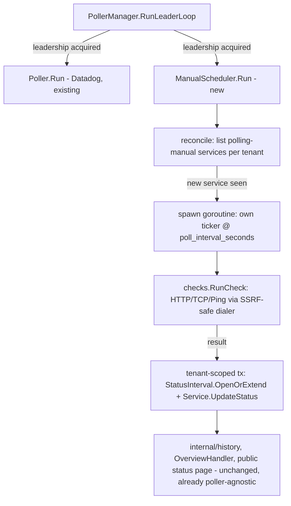

# Manual Polling Monitoring Design

**Spec**: `.specs/features/manual-polling-monitoring/spec.md`
**Status**: Draft

---

## Architecture Overview

A second, independent scheduler (`poller.ManualScheduler`) runs alongside the existing Datadog-based `poller.Poller`, under the same leader-election gate (`PollerManager`/`ha-multi-replica`) but with its own lifecycle - it starts whenever this replica is leading, regardless of whether a Datadog integration is connected, and needs no external trigger to pick up newly created services (unlike the Datadog poller, which only restarts on an admin action). Each polling-manual service gets its own goroutine with its own ticker (its interval is per-service, unlike the Datadog poller's one shared `interval`); a lightweight reconciliation loop periodically lists new polling-manual services and spawns a goroutine for each one it hasn't seen yet.



---

## Approach Exploration

**Scheduling model (per-service interval):**

1. **One goroutine + ticker per polling-manual service (recommended).** A lightweight reconciliation loop (own ticker, e.g. every 15s) lists polling-manual services and starts a goroutine for any new ID; each goroutine runs its own `time.Ticker` at its own `poll_interval_seconds` until canceled. The Datadog poller's single shared `interval` can't express "this service every 30s, that one every 5min" - a per-service ticker is the natural fit. The per-service failure-streak counter (MP-06) also becomes a plain local variable inside that goroutine's loop, no shared map/lock needed (an improvement over the Datadog poller's necessarily-shared `breachStreak` map, which exists only because *that* poller shares one goroutine across all services).
2. A single scheduler goroutine walking a priority queue keyed by next-due-time. Rejected: real scalability benefit only matters at thousands of services on sub-second intervals; this app's intervals are 30s/1min/5min and services number in the tens-to-hundreds for a self-hosted/small-SaaS deployment. The added complexity (custom heap, per-tick dequeue-and-requeue logic) isn't justified yet.
3. Reuse the Datadog poller's single shared-interval model, forcing every polling-manual service onto one global tick. Rejected: contradicts the mock directly (per-service interval selector, SVC's own "Intervalo de verificação" chips).

**SSRF protection mechanism:**

1. **A shared `net.Dialer` with a `Control` hook (recommended)**, used both as the HTTP client's `Transport.DialContext` and directly for TCP/Ping's raw dial. `Control` fires after DNS resolution but before the actual connect syscall, receiving the resolved `ip:port` - exactly the point needed to reject a blocked address, and it re-runs on *every* dial (every poll cycle), closing the DNS-rebinding gap the spec's Assumptions table calls out (MP-15/edge case) for free, with one implementation shared by all three check types.
2. Resolve the hostname manually first (`net.LookupIP`), check the range, then dial normally. Rejected: two round-trips to two different resolution paths risk drifting apart (the manual lookup could return a different IP than the one the dialer later actually connects to under DNS load-balancing/round-robin), reopening exactly the TOCTOU gap this feature is trying to close.

**Manual-poller lifecycle inside `PollerManager`:**

1. **A second, independent start/stop pair alongside the existing one (recommended)**, started right after `m.leading.Store(true)` in `RunLeaderLoop` (parallel to the existing `m.Restart(ctx)` call) and stopped symmetrically in the leadership-loss branch and `PollerManager.Stop`. It is *not* folded into `Restart` itself, since `Restart` is also called directly by `IntegrationsHandler.ConnectDatadog` on every Datadog credential connect/rotate (`internal/cli/routes.go`) - the manual scheduler has no credentials to rotate and must not be torn down/rebuilt on every Datadog reconnect.
2. Fold both into one `Restart` call. Rejected: would restart (losing all manual-poller goroutines and their in-memory failure-streak state) every time an admin merely rotates a Datadog API key, for no reason connected to polling-manual services at all.

---

## Code Reuse Analysis

### Existing Components to Leverage

| Component | Location | How to Use |
| --- | --- | --- |
| `poller.TenantTxFunc` + `poolTenantTx` | `internal/poller/poller.go`, `internal/cli/serve.go` | `ManualScheduler` takes the exact same function type; production wires the exact same `poolTenantTx(pool)` the Datadog poller already uses. |
| `db.SystemTenantLister` | `internal/db` | Same tenant-enumeration path the Datadog poller's `EnableTenantIteration` uses (TENANT-04, AD-024) - no new "who am I allowed to list tenants as" logic. |
| `db.StatusIntervalRepository.OpenOrExtend` | `internal/db/status_interval_repository.go` | Called identically to the Datadog poller's `pollService` - same table, same semantics, `errorBudgetRemaining` passed as `0` (polling-manual has no SLO error-budget concept; `history.UptimePercent` never reads that column). |
| `db.ServiceRepository.UpdateStatus` | `internal/db/service_repository.go` | Reused as-is. |
| `PollerManager`'s leader-election (`leading` atomic.Bool, `m.mu`) | `internal/cli/poller_manager.go` | Extended, not replaced - see Approach Exploration. |
| `internal/history` (`UptimePercent`, `BuildBuckets`) | `internal/history` | Zero changes - both packages already operate purely on `[]db.StatusInterval`, agnostic to which poller wrote them. |
| `ServicesHandler.Create`, `Field`/`Button` (frontend) | `internal/api/services_handler.go`, `web/src/components/ui` | Extended (branching validation) rather than a parallel endpoint - one `Service` model, one creation path, dispatched by `monitor_mode`. |

### Integration Points

| System | Integration Method |
| --- | --- |
| `services` table | Migration `0034_service_polling_mode`: new nullable `poll_type`/`poll_target`/`poll_interval_seconds` columns, `monitor_mode` (default `'slo'`), `slo_id` becomes nullable, one `CHECK` constraint enforcing the two valid field combinations (spec AC1.5). |
| Network (HTTP/TCP checks) | New `internal/checks` package - the only place in this codebase that dials a fully admin-supplied, dynamic target; every dial goes through the SSRF-safe `Control`-hooked dialer, no exceptions. |
| `PollerManager` | Extended with a second start/stop pair (Approach Exploration). |

---

## Components

### Migration `0034_service_polling_mode`

- **Purpose**: Let a `Service` be either SLO-based or polling-manual-based.
- **Location**: `internal/db/migrations/0034_service_polling_mode.up.sql` / `.down.sql`
- **Schema**:
  ```sql
  ALTER TABLE services ALTER COLUMN slo_id DROP NOT NULL;
  ALTER TABLE services ADD COLUMN monitor_mode TEXT NOT NULL DEFAULT 'slo';
  ALTER TABLE services ADD COLUMN poll_type TEXT;
  ALTER TABLE services ADD COLUMN poll_target TEXT;
  ALTER TABLE services ADD COLUMN poll_interval_seconds INT;
  ALTER TABLE services ADD CONSTRAINT services_monitor_mode_check
    CHECK (monitor_mode IN ('slo', 'polling'));
  ALTER TABLE services ADD CONSTRAINT services_poll_type_check
    CHECK (poll_type IS NULL OR poll_type IN ('http', 'tcp', 'ping'));
  ALTER TABLE services ADD CONSTRAINT services_monitor_mode_fields_check
    CHECK (
      (monitor_mode = 'slo' AND slo_id IS NOT NULL
        AND poll_type IS NULL AND poll_target IS NULL AND poll_interval_seconds IS NULL)
      OR
      (monitor_mode = 'polling' AND slo_id IS NULL
        AND poll_type IS NOT NULL AND poll_target IS NOT NULL AND poll_interval_seconds IS NOT NULL)
    );
  ```
- **Down**: drop the three constraints and four new/changed items, restore `slo_id SET NOT NULL` (safe only if no polling-mode row exists at rollback time - standard down-migration caveat, consistent with this repo's other reversible-in-the-common-case migrations).

### `internal/checks` (new package)

- **Purpose**: The one place in the codebase that dials an admin-supplied target, safely.
- **Location**: `internal/checks/`
- **Interfaces**:
  - `ValidateTargetFormat(pollType, target string) error` - pure parsing, no network. HTTP(S): `url.Parse` requires a scheme + host; TCP: `host:port` via `net.SplitHostPort`; Ping: bare host, optional `:port` (defaults `80` if absent).
  - `ValidateTargetSafety(ctx context.Context, pollType, target string) error` - resolves the target's host via `net.DefaultResolver.LookupIPAddr` and rejects if any resolved IP falls in a blocked range (MP-03). Used at service-creation time; does **not** require the target be reachable (a service can be registered before its target is deployed - see Tech Decisions).
  - `RunCheck(ctx context.Context, pollType, target string, timeout time.Duration) error` - performs the actual check (HTTP GET / TCP dial / Ping-as-TCP-dial) through the shared SSRF-safe dialer (Approach Exploration); a nil error is success, any error (including a blocked-range rejection re-triggered by DNS rebinding, MP-15) is a failed check.
- **Dependencies**: stdlib only (`net`, `net/http`, `net/url`).
- **Reuses**: nothing pre-existing - genuinely new surface, called out because it's the one place in this codebase dialing a fully dynamic, admin-supplied network target.

### `poller.ManualScheduler` (new type, same package as `Poller`)

- **Purpose**: Discover polling-manual services and run their checks on their own per-service interval.
- **Location**: `internal/poller/manual_scheduler.go`
- **Interfaces**:
  - `NewManualScheduler(services pollingServiceLister, statuses serviceStatusUpdater, statusIntervals statusIntervalWriter, tenants tenantLister, tenantTx TenantTxFunc, logger *zap.Logger) *ManualScheduler`
  - `Run(ctx context.Context)` - reconciliation loop (`manualDiscoveryInterval`, see Tech Decisions), same immediate-first-pass-then-tick shape as `Poller.Run`.
- **Dependencies**: `internal/checks`, the same repository-subset interfaces `Poller` already declares (`serviceStatusUpdater`, `statusIntervalWriter`, `tenantLister`, `TenantTxFunc` - all reused, not redefined).
- **Reuses**: `TenantTxFunc`'s exact contract from `poller.go`; a new `pollingServiceLister` interface (`ListPollingManual(ctx) ([]db.Service, error)`) mirrors `serviceLister`'s existing shape.

### `db.ServiceRepository` (extend)

- **Purpose**: Persist and read the new mode-specific fields; list only polling-manual services for the scheduler.
- **Location**: `internal/db/service_repository.go`
- **Interfaces**:
  - `Service` struct gains `MonitorMode string`, `PollType *string`, `PollTarget *string`, `PollIntervalSeconds *int`.
  - `Create` branches its `INSERT` column list by `MonitorMode` (still one method, one statement built conditionally - not two separate `Create` methods, since every other field and the returned row shape is identical).
  - `ListPollingManual(ctx) ([]Service, error)` - new, `WHERE monitor_mode = 'polling'`, same shape as the existing unpaginated `List`.
- **Reuses**: existing scan/error-wrap conventions in the same file.

### `api.ServicesHandler.Create` (extend)

- **Purpose**: Branch validation by `monitor_mode`, calling `internal/checks` for polling-mode targets.
- **Location**: `internal/api/services_handler.go`
- **Behavior**: `monitor_mode` defaults to `"slo"` when omitted (existing callers/tests unaffected - SPEC_DEVIATION-free, purely additive). When `"polling"`: requires `poll_type`/`poll_target`/`poll_interval_seconds` (one of `30`/`60`/`300`), rejects `slo_id`/`slo_name` if present, runs `checks.ValidateTargetFormat` then `checks.ValidateTargetSafety`, 422 on either failure (MP-03/MP-04) with a fixed generic message per field (never echoing back a raw resolver/parse error, consistent with AGENTS.md §4's no-raw-error-leakage rule applied to this new input path too).

### `internal/cli.PollerManager` (extend)

- **Purpose**: Start/stop the manual scheduler alongside (not instead of) the Datadog poller, under the same leadership.
- **Location**: `internal/cli/poller_manager.go`
- **Behavior**: second `manualCancel`/`manualDone` pair; started in `RunLeaderLoop`'s acquire branch (unconditionally, no "integration missing" gate - Approach Exploration) and stopped in the loss branch and `Stop()`, both under the same `m.mu` critical sections already guarding the Datadog pair.

### Frontend: `AddServiceDrawer` (extend)

- **Purpose**: The mode toggle + per-mode fields the mock draws.
- **Location**: `web/src/features/services/AddServiceDrawer.tsx`
- **Behavior**: `monitorMode` state (`"slo" | "polling"`, default `"slo"`); "Fonte" chips gain a disabled "New Relic" option (no click handler, `aria-disabled`, no backend field ever sent for it - purely decorative per the user's own instruction, unrelated to this feature's backend); polling mode renders check-type chips + target `Field` (label/placeholder switch by type, per spec's Assumptions table) + interval chips; submit sends the mode-appropriate payload only (never both SLO and polling fields in the same request body).
- **Reuses**: existing chip-button pattern already in this file's own history (see `ServicesSection.tsx`'s superseded inline dialog, git history) and `ServiceListPage.tsx`'s status-filter chips for the visual pattern (border/bg-tint toggle group).

---

## Data Models

### `Service` (extended)

```go
type Service struct {
	ID                  string
	Name                string
	SLOID               *string // nullable now - nil for monitor_mode="polling"
	SLOName             string
	MonitorMode         string  // "slo" | "polling"
	PollType            *string // "http" | "tcp" | "ping", nil for monitor_mode="slo"
	PollTarget          *string
	PollIntervalSeconds *int
	CurrentStatus       string
	LastStatusChangeAt  time.Time
	StatusAnalysis      *string
}
```

**Relationships**: `StatusInterval` rows reference `Service.ID` exactly as today - no schema change on that side, no new relationship. A polling-manual service's `StatusAnalysis` stays permanently `nil` (the LLM-based `SLOAnalyzer` is Datadog-SLO-specific and is never invoked for polling-manual transitions - see Risks & Concerns).

### `POST /api/services` request (extended)

```typescript
interface CreateServiceRequest {
  name: string;
  monitor_mode?: "slo" | "polling"; // omitted = "slo", unchanged existing behavior
  // monitor_mode = "slo" (or omitted):
  slo_id?: string;
  slo_name?: string;
  // monitor_mode = "polling":
  poll_type?: "http" | "tcp" | "ping";
  poll_target?: string;
  poll_interval_seconds?: 30 | 60 | 300;
}
```

---

## Error Handling Strategy

| Error Scenario | Handling | User Impact |
| --- | --- | --- |
| Polling-mode target resolves to a blocked IP range at creation | 422, fixed message identifying the target field (not the resolved IP, to avoid confirming internal-network layout to the caller) | Admin sees "target not allowed" and must pick a different one. |
| Polling-mode target's DNS doesn't resolve yet at creation | Creation succeeds (Tech Decisions) - service starts `not_configured`, first check attempt fails safely (DNS error = failed check, counts toward the 2-failure threshold) | Admin can register a target before it's deployed; it naturally reaches `outage` once 2 checks fail, same as any other unreachable target. |
| A poll-time dial's `Control` hook rejects a rebound address | Treated as a failed check (MP-15/edge case) - never a panic, never a crash of the service's goroutine | Service behaves exactly as if the target were simply down; no special error surfaces anywhere. |
| HTTP/TCP/Ping check times out (10s) | Failed check, same as any other failure | Counts toward the 2-consecutive-failure threshold like any other failure reason (spec Edge Cases: reason never resets/affects the streak). |
| `ManualScheduler`'s reconciliation query fails (DB error) | Logged, this cycle's discovery is skipped, already-running per-service goroutines are unaffected and keep ticking | A transient DB hiccup delays discovering a *brand-new* service by one reconciliation interval; it never stops existing checks. |

---

## Risks & Concerns

| Concern | Location (file:line) | Impact | Mitigation |
| --- | --- | --- | --- |
| `SLOAnalyzer.HandleTransition` expects a `datadog.SLOStatus` (`internal/poller/poller.go:369`) - polling-manual has no such value | New code path, not existing | Calling it with a fabricated/zero `SLOStatus` would produce a nonsensical LLM prompt about SLI/error-budget for a check type that has neither. | `ManualScheduler` never calls the analyzer at all - polling-manual services simply never get an AI-authored `StatusAnalysis`, consistent with them never reaching `degraded` (spec Assumptions) in the first place. |
| A per-service goroutine leak if `ManualScheduler.Run`'s `ctx` is canceled but an individual service goroutine's own child context isn't also explicitly canceled | New code, no prior instance to point at | Leaked goroutines accumulate across leadership handoffs in a long-running process (each new leader term would leak one more per service). | Every per-service goroutine's context is a child of the *reconciliation loop's* `ctx` (`context.WithCancel(ctx)` at spawn time, canceled explicitly when the scheduler stops) - a task in Tasks must include a test asserting goroutine count returns to baseline after `Run`'s `ctx` is canceled. |
| `net.Dialer.Control` is a Unix-specific (`syscall.RawConn`) hook - confirm it behaves identically across this project's actual deployment target | `internal/checks` (new) | If the deployment ever targets Windows (it doesn't today - Dockerfile/docker-compose are Linux-only per `self-hosted-docker-bootstrap`), this exact mechanism might need adjustment. | Not a blocker: this codebase already only ships Linux containers (AD-001/AD-009). Flagged for completeness, no task needed. |

---

## Tech Decisions

| Decision | Choice | Rationale |
| --- | --- | --- |
| Reconciliation (discovery) interval | 15 seconds, a new `manualDiscoveryInterval` constant | Cheap DB query (`ListPollingManual`, no join), and the spec's own independent test only requires a newly created service to start being checked "within one interval" of *its own* configured interval (30s minimum) - 15s discovery latency is well inside that budget without polling the DB aggressively. |
| Creation-time safety check requires DNS resolution to succeed, but not reachability | Allow creation when the target simply doesn't resolve yet; reject only when it resolves into a blocked range | A polling-manual service is allowed to be registered before its target is deployed (this is normal - nothing in the spec requires immediate reachability), but a target that visibly resolves into the deployment's own private network is rejected outright regardless of reachability. |
| `errorBudgetRemaining` value passed to `OpenOrExtend` for polling-manual writes | `0` | Column has no polling-manual meaning; `history.UptimePercent`/`BuildBuckets` never read it, confirmed by reading `internal/history/uptime.go`. |
| Ping default port when target has none | `80` | Matches the mock's own placeholder (`cache.acme.health`, no port) and is the most broadly-open TCP port for a generic reachability probe. |

> **Project-level decision**: This design introduces a second scheduler pattern (per-service goroutine+ticker) alongside the existing shared-interval `Poller`, and a new SSRF-safe-dialing convention (`internal/checks`) for the first-ever admin-supplied dynamic network target in this codebase. Both are worth an `AD-NNN` entry in `.specs/STATE.md` once implemented, since a future integration that also dials an admin-supplied host (e.g. a webhook receiver, `gap-analysis.md`'s deferred "Dashboard Integrações" item) should reuse `internal/checks`'s dialer rather than inventing a third SSRF posture.

---

## Tips

(n/a - implementation-facing template section, no content needed here)
