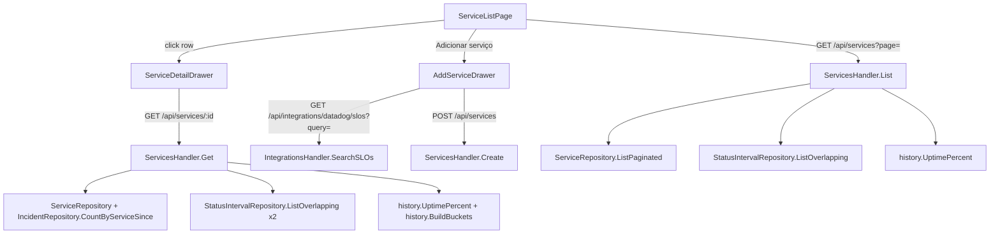

# Monitored Services Page Design

**Spec**: `.specs/features/monitored-services-page/spec.md`
**Status**: Draft

---

## Architecture Overview

Read paths (list + drawer) are pure aggregation over existing repositories — same shape as `OverviewHandler`: no new tables for status/uptime data, batch `ListOverlapping` instead of per-row queries, `internal/history` for uptime% and hourly buckets. The one genuine new persisted field is `services.slo_name`, because the SLO's human name has no other durable home and today's frontend resolves it via a live per-row Datadog search call (see Risks & Concerns — this design removes that call, it doesn't add to it).



---

## Approach Exploration

**SLO name (table subtext + drawer):**

1. **Persist `slo_name` at creation time (recommended).** `POST /api/services` already receives the SLO's name from the frontend's own search-result selection (`useSLOSearch` → `{id, name}`); store it alongside `slo_id`. List/Get read it straight from the row, zero external calls.
2. Live Datadog lookup per row on every read (today's actual behavior — `fetchSLOName`, `internal/features/integrations/hooks.ts:76-85`). Rejected: N Datadog calls per page load, a name that can silently disappear if the SLO is deleted upstream, and it's exactly the live-external-call-on-a-read-path pattern `AGENTS.md §4` already forbids for the public status page — the same reasoning applies to any hot admin read path.
3. A background job syncing SLO names into `services` periodically. Rejected: adds a scheduler/cron surface for a value that only ever changes at link time in practice; over-engineered for what's needed.

**Uptime/last-check computation:**

1. **Reuse `OverviewHandler`'s batch pattern (recommended)**: one `ListOverlapping(serviceIDs, windowStart, now)` call per request, bucket into a `map[string][]db.StatusInterval`, run `history.UptimePercent` per service. Already proven correct and tested by `overview_handler.go`.
2. Per-row queries in a loop. Rejected: N+1, and `ServiceRepository.ListPaginated` already caps rows at 20, so the batch call is trivially bounded.

**Incidents (30d) per service (drawer only):**

1. **New `IncidentRepository.CountByServiceSince(ctx, serviceID, since)` (recommended)**, same `COUNT(*) FILTER (WHERE ...)` idiom as the existing `CountOpenedResolvedBetween`, joined through `incident_services`.
2. Fetch all incidents and filter client-side. Rejected: no endpoint returns incidents scoped by service today, and building one just to filter in JS wastes a real SQL join that already exists as a pattern.

---

## Code Reuse Analysis

### Existing Components to Leverage

| Component | Location | How to Use |
| --- | --- | --- |
| `history.UptimePercent` | `internal/history/uptime.go:28` | Per-service 30d uptime, table + drawer — same call `OverviewHandler` makes. |
| `history.BuildBuckets` | `internal/history/hourly.go:59` | Drawer's 24 hourly bars: `BuildBuckets(intervals, now, asOf, americaSaoPaulo, 24, time.Hour)`. |
| `StatusIntervalRepository.ListOverlapping` | `internal/db/status_interval_repository.go` | Batch-fetch intervals for the page's services (list) or one service (drawer, two windows: 30d for uptime, 24h for bars). |
| `IncidentRepository.CountOpenedResolvedBetween` pattern | `internal/db/incident_repository.go:244` | Template for the new `CountByServiceSince` (`COUNT(*) FILTER` idiom, same file). |
| `Page[T]` envelope + `parsePage` | `internal/api/page.go` (per AD-012) | `GET /api/services` keeps this shape; no change to the envelope itself. |
| `Pager` component | `web/src/components/ui/Pager.tsx` | List page pagination, `totalPages` computed by the caller (AGENTS.md §5). |
| `Card`, `Dialog`, `Button`, `Field`, `Tag` | `web/src/components/ui/*` | Table shell, add-service drawer (as a `Dialog`, see Tech Decisions), status badges. |
| `useSLOSearch` | `web/src/features/integrations/hooks.ts:68` | Add-service drawer's SLO picker — same hook `ServicesSection` already uses. |
| `RequireAuth` / `AuthenticatedLayout` route pattern | `web/src/App.tsx` | `/services` route already exists inside the shell; no routing change needed (L-050 already satisfied — this is not a new top-level route). |

### Integration Points

| System | Integration Method |
| --- | --- |
| Datadog SLO search | `GET /api/integrations/datadog/slos?query=` — unchanged, existing endpoint (add-drawer only, never on a list/detail read). |
| `incidents`/`incident_services` tables | New read-only aggregate query, no schema change. |
| `services` table | One additive migration: `slo_name TEXT NOT NULL DEFAULT ''`. |

---

## Components

### Backend: `services` migration

- **Purpose**: Persist the SLO's human name at link time so no read path needs a live Datadog call.
- **Location**: `internal/db/migrations/0033_service_slo_name.up.sql` / `.down.sql`
- **Schema**: `ALTER TABLE services ADD COLUMN slo_name TEXT NOT NULL DEFAULT '';` — default `''` (not nullable) so existing rows created before this migration don't need a backfill decision; the API maps `''` to `null`/fallback display (see Error Handling).
- **Down**: `ALTER TABLE services DROP COLUMN slo_name;`

### Backend: `db.ServiceRepository` (extend)

- **Purpose**: Carry `SLOName` through `Create`/`List`/`Get`.
- **Location**: `internal/db/service_repository.go`
- **Interfaces**:
  - `Create(ctx, service *Service) error` — `Service.SLOName` now included in the `INSERT`.
  - `ListPaginated(ctx, page, pageSize) ([]Service, int, error)` — `SELECT` gains `slo_name`.
  - `Get(ctx, id string) (*Service, bool, error)` — **new**, single-row lookup by ID for the drawer endpoint (`sql.ErrNoRows` → `(nil, false, nil)`, same not-found convention as other single-lookups in this file).
- **Dependencies**: existing `*Pool`.
- **Reuses**: same scan/error-wrap style as the rest of the file.

### Backend: `db.IncidentRepository` (extend)

- **Purpose**: Count incidents touching one service in a time window.
- **Location**: `internal/db/incident_repository.go`
- **Interfaces**:
  - `CountByServiceSince(ctx, serviceID string, since time.Time) (int, error)` — `SELECT COUNT(*) FROM incidents i JOIN incident_services isv ON isv.incident_id = i.id WHERE isv.service_id = $1 AND i.created_at >= $2`.
- **Dependencies**: existing `*Pool`.
- **Reuses**: `CountOpenedResolvedBetween`'s `COUNT(*) FILTER`/join idiom (adapted — this one needs a join, that one doesn't).

### Backend: `api.ServicesHandler` (extend)

- **Purpose**: Serve the list (extended) and a new per-service detail read.
- **Location**: `internal/api/services_handler.go`
- **Interfaces**:
  - `List(w, r)` — extended: for the page's services, batch `ListOverlapping(serviceIDs, now-30d, now)`, compute `uptime_30d` (`*float64`, nil when no data) and `last_seen_at` (`*time.Time`, nil when never polled) per row alongside the existing fields.
  - `Get(w, r)` — **new**, `GET /api/services/{id}`. Loads the service; 404 (fixed generic body, no `err.Error()` leak, AGENTS.md §4) if missing. Computes the same `uptime_30d`/`last_seen_at` as `List` (30d window), `incidents_30d` via `IncidentRepository.CountByServiceSince(id, now-30d)`, and `hourly_buckets` via a second `ListOverlapping(serviceID, now-24h, now)` + `history.BuildBuckets(..., 24, time.Hour)`. `status_analysis` passes through unchanged from `Service.StatusAnalysis`.
  - `Create(w, r)` — extended request body: `{name, slo_id, slo_name}`.
- **Dependencies**: `db.ServiceRepository`, `db.StatusIntervalRepository`, `db.IncidentRepository`, `time.Location` (America/Sao_Paulo, same load-once-panic-on-failure pattern as `NewOverviewHandler`).
- **Reuses**: `OverviewHandler`'s batch-interval pattern; `history.UptimePercent`/`BuildBuckets`; `parsePage`/`Page[T]` (List keeps its envelope, Get does not — it's a single resource, same precedent as `OverviewResponse` being a flat DTO).

### Backend: router wiring

- **Purpose**: Mount the new read route.
- **Location**: `internal/cli/routes.go`
- **Change**: add `protected.With(anyRole).Get("/api/services/{id}", servicesHandler.Get)` next to the existing `/api/services` routes (same role as `List` — read-only, all roles).

### Frontend: `web/src/features/services/hooks.ts` (extend, not fork)

- **Purpose**: Stop resolving `slo_name` via a live per-row Datadog call now that the backend returns it; add hooks for the detail endpoint.
- **Location**: `web/src/features/services/hooks.ts`
- **Interfaces**:
  - `useServices(page, { search?, status? })` — extend existing hook; `ServiceResponse` gains `slo_name: string`, `uptime_30d: number | null`, `last_seen_at: string | null`; `toService` becomes a synchronous mapper (drops the `await fetchSLOName` call entirely — this also simplifies/speeds up `ServicesSection`, which shares this hook).
  - `useServiceDetail(id)` — **new**, `GET /api/services/{id}`.
  - `useCreateService()` — extend: `CreateServiceInput` gains `slo_name: string` (the frontend already has it from the selected `SLOSummary`).
- **Dependencies**: `apiClient`, react-query.
- **Reuses**: existing query-key convention (`["services", page]` → extend to include filter/search once client-side, see Tech Decisions), existing mutation/invalidation pattern.

### Frontend: `ServiceListPage` (new)

- **Purpose**: The redesigned `/services` screen — table, filter chips, search.
- **Location**: `web/src/features/services/ServiceListPage.tsx` (replaces what `ServicesPage.tsx` renders at the `/services` route; `ServicesSection`/`ServicesPage.tsx` themselves are untouched — see Tech Decisions on why this is a new component, not an extension of `ServicesSection`).
- **Interfaces**: no props (route-level page component), internal state for `statusFilter`/`searchQuery`/`page`.
- **Dependencies**: `useServices`, `Pager`, `Tag`, `Card`, `Button`.
- **Reuses**: `Tag`/`Card`/`Button`/`Pager` from `components/ui`; the existing `statusLabel`/`statusVariant` maps already defined in `ServicesSection.tsx` (hoist to a shared `web/src/features/services/statusMeta.ts` so both components import the same source of truth instead of duplicating the 4-entry lookup — `not_configured` included, matching the spec's 4th chip).

### Frontend: `ServiceDetailDrawer` (new)

- **Purpose**: Read-only drawer opened by a row click.
- **Location**: `web/src/features/services/ServiceDetailDrawer.tsx`
- **Interfaces**: `{ serviceId: string; onClose: () => void }`.
- **Dependencies**: `useServiceDetail`.
- **Reuses**: `Dialog`/panel primitives already in `components/ui` for the slide-over shell (check `Dialog`'s existing variant support before adding a new one).

### Frontend: `AddServiceDrawer` (new, extracted from `ServicesSection`'s inline dialog)

- **Purpose**: The "Adicionar serviço" flow (name + SLO search), reused by `ServiceListPage`.
- **Location**: `web/src/features/services/AddServiceDrawer.tsx`
- **Interfaces**: `{ open: boolean; onOpenChange: (open: boolean) => void }`.
- **Dependencies**: `useSLOSearch`, `useCreateService`.
- **Reuses**: the exact form logic already in `ServicesSection.tsx:59-172` (name field, debounced SLO search, selection, submit validation, error display) — extracted so both the old compact section and the new page can each open it, instead of two divergent copies of the same form.

---

## Data Models

### `Service` (extended)

```go
type Service struct {
	ID                 string
	Name               string
	SLOID              string
	SLOName            string // new: human name, set at Create, '' for pre-migration rows
	CurrentStatus      string
	LastStatusChangeAt time.Time
	StatusAnalysis     *string
}
```

### `GET /api/services` item (extended `serviceResponse`)

```typescript
interface ServiceListItem {
  id: string;
  name: string;
  slo_id: string;
  slo_name: string; // "" for a pre-migration row never re-saved — frontend falls back to slo_id
  current_status: "operational" | "degraded" | "outage" | "not_configured";
  last_status_change_at: string;
  uptime_30d: number | null; // null = no interval data yet (render "—")
  last_seen_at: string | null; // null = never polled (render "—")
}
```

### `GET /api/services/{id}` (new, flat DTO — not `Page[T]`)

```typescript
interface ServiceDetail extends ServiceListItem {
  status_analysis: string | null; // only meaningful when current_status === "degraded"
  incidents_30d: number;
  hourly_buckets: Array<{ start: string; status: "operational" | "degraded" | "outage" | "no_data" }>; // exactly 24, oldest first
}
```

**Relationships**: `hourly_buckets[i].status` values come straight from `history.Bucket.Status` (`"operational" | "degraded" | "outage" | "no_data"` — note `no_data`, not `not_configured`; a service that already has *some* history uses this vocabulary per-bucket even if its overall `current_status` is something else).

---

## Error Handling Strategy

| Error Scenario | Handling | User Impact |
| --- | --- | --- |
| `GET /api/services/{id}` with unknown/foreign-tenant ID | 404, fixed generic body | Drawer shows a "não encontrado" state, closes automatically (edge case: shouldn't normally happen — ID comes from the same tenant's own list). |
| `ListOverlapping`/`CountByServiceSince` DB error mid-request | Logged server-side with `zap.Error`, fixed 500 body (AGENTS.md §4) | List/detail show a generic load-error state, no stack trace or SQL leaked. |
| `POST /api/services` with unknown `slo_id` (SLO deleted between search and submit) | Unchanged existing behavior — Datadog/poller will simply never resolve it; no new validation added this cycle (out of scope: was already true before this feature). | Same as today — service sits with whatever status the poller assigns. |
| Add-drawer SLO search returns zero results | Empty state string in the drawer (SVC-edge-case) | Admin knows to adjust the query, not a blank silent list. |

---

## Risks & Concerns

| Concern | Location (file:line) | Impact | Mitigation |
| --- | --- | --- | --- |
| Existing SLO-name resolution does a **live Datadog API call per service row, on every page load** (`fetchSLOName`, called once per row from `toService`) | `web/src/features/integrations/hooks.ts:76-85`, `web/src/features/services/hooks.ts:9-24` | N external calls on a hot admin read path today; a slow/rate-limited Datadog response currently slows down every services list render (Integrations dashboard included). Confirmed real, pre-existing (SPEC_DEVIATION already documented in the file's own comment). | This design's `slo_name` migration + backend persistence removes it entirely — `toService` becomes synchronous, no network call. Applies to both the new page and the existing `ServicesSection` embed (shared hook). |
| `ServiceRepository.List` (unpaginated, used by the poller) is a **separate method** from `ListPaginated` (used by this screen) — a future change to one's query shape (e.g. adding `slo_name`) is easy to forget on the other | `internal/db/service_repository.go` (two `SELECT`s over the same table) | A silent drift where the poller's view of a service and the admin UI's view diverge in subtle ways (not a bug today, but a foot-gun for the next person editing this file). | No schema change needed for `List` (poller doesn't need `slo_name`/uptime) — flagged here only so whoever touches this file next re-reads both methods' `SELECT`s before assuming they're symmetric. No task added; this is a documentation-only mitigation, the concern doesn't block this feature. |
| No test today exercises `ServicesHandler.List`/`Get` against a mix of `not_configured` + polled services in the *same* page (uptime/last-seen nil-vs-populated in one response) | new code, no prior coverage to point at | A batch-computation bug (e.g. treating an empty `intervalsByService[id]` slice as `0%` instead of nil) could ship undetected if tests only ever use all-`not_configured` or all-polled fixtures. | Tasks must include a mixed fixture (at least one `not_configured` + one `operational` service in the same paginated response) — captured as an explicit task requirement, not left to task-writer discretion. |

---

## Tech Decisions

| Decision | Choice | Rationale |
| --- | --- | --- |
| New page vs. extending `ServicesSection` | New `ServiceListPage` component; `ServicesSection`'s compact embedded card (used by `IntegrationsPage`, per its own doc-comment) is untouched beyond the shared-hook simplification | The mock's full-page table (chips, search, 6-column grid, drawer) is a different UI shape from the compact card `IntegrationsPage` still needs until its own redesign (`Dashboard Integrações`, not yet specced per `gap-analysis.md`). Forcing one component to serve both would mean prop-gating half the new UI behind a "compact mode" flag — more complex than two small, honest components sharing hooks/status-maps. |
| Filter/search scope | Client-side, scoped to the current page's already-fetched rows (per spec Assumption "List pagination") | Spec already resolved this: `AGENTS.md §5`'s pagination rule takes precedence over the mock's no-pager cosmetic; a server-side filtered-and-paginated combo is a bigger endpoint contract change than this cycle's scope warrants, and 20 rows/page is small enough that client-side narrowing is instant. |
| `GET /api/services/{id}` response shape | Flat DTO, not `Page[T]` | Single-resource read, same precedent as `OverviewResponse` (`internal/api/overview_handler.go:54`) — `Page[T]` is for lists. |
| `slo_name` migration default | `NOT NULL DEFAULT ''`, not nullable | Avoids a three-state (`NULL`/`''`/real name) column; `''` already reads unambiguously as "unknown" in the API layer, one falsy check (`slo_name || slo_id` fallback) instead of a null check. |

---

## Tips

(n/a — implementation-facing template section, no content needed here)
