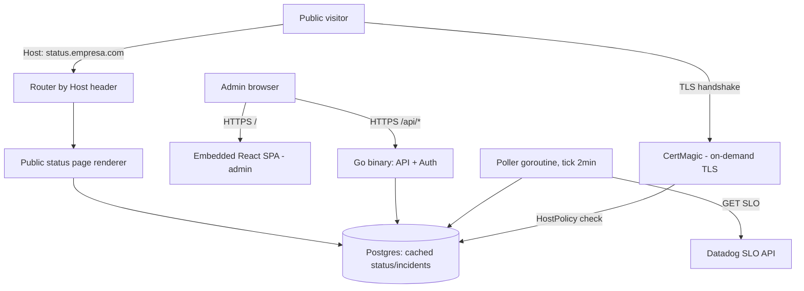

# MVP Core (Zeep Vane) Design

**Spec**: `.specs/features/mvp-core/spec.md`
**Status**: Draft

---

## Architecture Overview

Binário Go único (single deploy), React SPA embutida via `go:embed` (mesmo padrão de `zeep-orbit/internal/dashboard/embed.go`). Um processo cobre: API admin, servidor da SPA admin, roteamento dinâmico de status pages públicas por Host header, e provisionamento automático de TLS por domínio via CertMagic (lib do time do Caddy, embutida — sem proxy externo).



---

## Code Reuse Analysis

### Existing Components to Leverage

| Component | Location | How to Use |
| --- | --- | --- |
| Padrão de embed da SPA no binário | `baas/zeep-orbit/internal/dashboard/embed.go` | Copiar a mesma estratégia (`go:embed` + fallback pra `index.html` no client-side routing) pra servir a SPA admin deste projeto |
| Stack Go (chi, pgx/v5, jwt/v5, zap, cobra) | `baas/zeep-orbit/go.mod` | Mesmas libs, mesma versão major, pra manter consistência entre projetos ZeepLabs |
| Padrão de token stateless assinado (HMAC, sem estado em memória) | `zeep-orbit/internal/auth/google.go` (`signState`/`verifyState`) | Aplicar no token de reset de senha (SP-23/SP-24) — nunca guardar token em map em memória, mesmo rodando 1 réplica só, pra já nascer correto se o projeto crescer pra múltiplas réplicas depois |

### Integration Points

| System | Integration Method |
| --- | --- |
| Datadog SLO API | Cliente HTTP próprio em `internal/connectors/datadog`, chave de API por header `DD-API-KEY`/`DD-APPLICATION-KEY` |
| Let's Encrypt | Via CertMagic (`github.com/caddyserver/certmagic`), on-demand TLS com `HostPolicy` consultando Postgres |
| Postgres | pgx/v5, migrations com `golang-migrate` ou SQL puro versionado em `internal/db/migrations` |

---

## Components

### `internal/connectors/datadog`

- **Purpose**: Buscar status de SLO no Datadog e normalizar pra um formato interno comum (extensível pra outros APMs depois).
- **Location**: `internal/connectors/datadog/`
- **Interfaces**:
  - `type SLOProvider interface { FetchSLOStatus(ctx, sloID string) (SLOStatus, error) }` — contrato que qualquer conector (Datadog, futuro New Relic) implementa
  - `NewClient(apiKey, appKey string) *Client` - cria cliente autenticado
  - `(c *Client) FetchSLOStatus(ctx, sloID string) (SLOStatus, error)` - chama `GET /api/v1/slo/{slo_id}`, retorna error budget remanescente e status calculado
- **Dependencies**: `net/http`, API key/App key descriptografadas do Postgres
- **Reuses**: nenhum código existente — conector novo

> **Verificação necessária (Knowledge Verification Chain, passo 4/5):** não tenho acesso a doc live do Datadog nesta sessão pra confirmar o shape exato da resposta de `GET /api/v1/slo/{slo_id}` e o cálculo de error budget. **[Incerto]** — antes de implementar a Task correspondente, validar contra a doc oficial (`docs.datadoghq.com/api/latest/service-level-objectives/`) ou usar o MCP Datadog disponível na sessão pra inspecionar um SLO real. Não fabricar o schema de resposta.

### `internal/tls`

- **Purpose**: Gerenciar emissão automática de certificado TLS por domínio cadastrado, sem proxy externo.
- **Location**: `internal/tls/`
- **Interfaces**:
  - `NewManager(store DomainStore) *certmagic.Config` - configura CertMagic com `OnDemand` + `HostPolicy`
  - `HostPolicy(ctx, hostname string) error` - rejeita qualquer hostname que não esteja marcado como `StatusPage` ativo no Postgres antes de permitir o desafio ACME
- **Dependencies**: `github.com/caddyserver/certmagic`, volume persistente pra armazenar certificados (ver Risks & Concerns)
- **Reuses**: nenhum — mas a verificação de posse de domínio (SP-11 a SP-13 da spec) é resolvida implicitamente pelo próprio desafio HTTP-01 do ACME: só quem controla o DNS/servidor do domínio consegue completar o desafio. Não precisa de um passo de verificação DNS TXT separado — isso resolve a "Assumption" de método de verificação registrada na spec como deferida ao Design.

### `internal/router`

- **Purpose**: Rotear requisição HTTP pelo `Host` header — API admin, SPA admin, ou status page pública correspondente ao domínio.
- **Location**: `internal/router/`
- **Interfaces**:
  - `Handler(adminAPI, adminSPA, publicPages http.Handler) http.Handler` - middleware de dispatch por Host
- **Dependencies**: `chi`
- **Reuses**: padrão de fallback SPA de `zeep-orbit/internal/dashboard/embed.go` (adaptado pra múltiplos domínios em vez de path fixo `/dashboard`)

### `internal/poller`

- **Purpose**: Job periódico (tick de 2 min, configurável via env) que busca status de SLO de cada serviço vinculado e persiste snapshot + atualiza status atual.
- **Location**: `internal/poller/`
- **Interfaces**:
  - `Run(ctx context.Context)` - loop com `time.Ticker`, cancelável via context
  - `pollService(ctx, svc Service) error` - chama o `SLOProvider`, aplica retry com backoff (3 tentativas), grava `StatusSnapshot`, atualiza `Service.current_status`
- **Dependencies**: `internal/connectors/datadog`, Postgres
- **Reuses**: nenhum

### `internal/api`

- **Purpose**: Handlers REST da API admin (auth, integrations, services, status pages, domains, incidents).
- **Location**: `internal/api/`
- **Interfaces**: rotas REST convencionais (`POST /api/auth/login`, `POST /api/integrations/datadog`, `POST /api/status-pages`, `POST /api/incidents`, etc.)
- **Dependencies**: `chi`, `jwt/v5` (sessão), `internal/db`
- **Reuses**: convenção de erro HTTP de `zeep-orbit` (nunca vazar `err.Error()` cru em 500 — log real no servidor, mensagem genérica fixa pro cliente)

### `internal/db`

- **Purpose**: Acesso a dado via pgx/v5, migrations versionadas.
- **Location**: `internal/db/`
- **Dependencies**: `pgx/v5`, Postgres

### `web/` (React SPA)

- **Purpose**: Dashboard admin — login, conectar Datadog, criar status page, gerenciar domínio, gerenciar incidente.
- **Location**: `web/` (Vite + React + TS), buildado e embutido em `internal/webui/static` via `go:embed` (mesmo padrão de `zeep-orbit`)
- **Dependencies**: build step incluído no Makefile (`make webui-build` análogo a `make dashboard-build` de zeep-orbit)

---

## Data Models

```go
type Admin struct {
    ID           string
    Email        string
    PasswordHash string
    CreatedAt    time.Time
}

type PasswordResetToken struct {
    ID        string
    AdminID   string
    TokenHash string // hash do token, nunca o token cru
    ExpiresAt time.Time
    UsedAt    *time.Time
}

type Integration struct {
    ID              string
    Provider        string // "datadog" (único valor no MVP; unique constraint)
    EncryptedAPIKey []byte
    EncryptedAppKey []byte
    Status          string // "active" | "invalid"
    LastCheckedAt   *time.Time
    LastError       *string
}

type Service struct {
    ID               string
    Name             string
    SLOID            string
    CurrentStatus    string // "operational" | "degraded" | "outage" | "not_configured"
    LastStatusChange time.Time
}

type StatusSnapshot struct {
    ID                    string
    ServiceID             string
    Status                string
    ErrorBudgetRemaining  float64
    FetchedAt             time.Time
}

type Domain struct {
    ID        string
    Hostname  string // domínio raiz, ex: "empresa.com"
    CreatedAt time.Time
}

type StatusPage struct {
    ID          string
    Name        string
    Subdomain   string // ex: "status"
    DomainID    string
    State       string // "draft" | "pending_tls" | "published" | "tls_failed"
    TLSLastError *string
    CreatedAt   time.Time
}

type StatusPageService struct {
    StatusPageID string
    ServiceID    string
}

type Incident struct {
    ID         string
    Title      string
    Status     string // "investigating" | "identified" | "monitoring" | "resolved"
    CreatedAt  time.Time
    ResolvedAt *time.Time
}

type IncidentService struct {
    IncidentID string
    ServiceID  string
}

type IncidentUpdate struct {
    ID         string
    IncidentID string
    Body       string
    CreatedAt  time.Time
}
```

**Relationships**: `StatusPage` → `Domain` (N:1) e → `Service` via `StatusPageService` (N:N). `Incident` → `Service` via `IncidentService` (N:N), → `IncidentUpdate` (1:N). `Service` → `StatusSnapshot` (1:N, histórico). `Admin` → `PasswordResetToken` (1:N).

**Sem tabela de tenant/empresa** — decisão confirmada: 1 instalação = 1 empresa (ver spec, pergunta "Escopo tenant"). Nenhum dado precisa de `company_id`.

---

## Error Handling Strategy

| Error Scenario | Handling | User Impact |
| --- | --- | --- |
| API key Datadog inválida no cadastro | Rejeita antes de salvar, retorna 422 com mensagem específica | Admin vê erro claro, nada é persistido |
| Falha de leitura de SLO (timeout/5xx) | Retry com backoff (3x), depois marca conexão como falha e loga estruturado | Página pública mantém último status + timestamp; admin vê alerta no dashboard |
| Falha de emissão de certificado TLS | `StatusPage.State = "tls_failed"`, motivo salvo em `TLSLastError` | Admin vê motivo da falha no dashboard; página não fica acessível publicamente até corrigir |
| Domínio raiz duplicado | Constraint única em `Domain.Hostname`, rejeita com 409 | Admin vê mensagem de domínio já cadastrado |
| Edição concorrente da mesma status page | Last-write-wins, sem lock otimista no MVP | Sem erro visível; última gravação prevalece (assumption já registrada na spec) |

---

## Risks & Concerns

| Concern | Location (file:line) | Impact | Mitigation |
| --- | --- | --- | --- |
| CertMagic guarda certificados em disco por padrão; se o container reiniciar sem volume persistente, reemite certificado a cada boot | `internal/tls/manager.go` (novo) | Risco de bater rate limit do Let's Encrypt (5 certs/domínio/semana) em ambientes que recriam container com frequência | Task de Design/Deploy: configurar `certmagic.Config.Storage` apontando pra um volume persistente montado, documentar isso como obrigatório no guia de deploy self-hosted |
| On-demand TLS sem `HostPolicy` restritiva permite que qualquer requisição force o servidor a tentar emitir certificado pra hostname arbitrário | `internal/tls/manager.go` (novo) | Abuso de rate limit do Let's Encrypt por terceiro mal-intencionado, possível DoS indireto | `HostPolicy` **sempre** consulta Postgres e só permite hostnames de `StatusPage` com `State != "draft"` antes de qualquer chamada ACME — não opcional |
| Chave mestra de criptografia da API key do Datadog é responsabilidade do operador self-hosted; perda da chave = todas integrations quebradas sem recovery | `internal/db` (schema `Integration`) | Se `VANE_MASTER_KEY` for perdida, admin precisa reconectar Datadog do zero | Documentar claramente no README (tabela de env vars, seguindo convenção de `zeep-orbit`) que a chave deve ser backupada fora do container |
| Shape exato da resposta da API de SLO do Datadog não foi verificado nesta sessão (sem acesso a doc live) | `internal/connectors/datadog/client.go` (novo) | Risco de suposição errada propagar pra Tasks/implementação | Marcado como `[Incerto]` acima — validar contra doc oficial ou MCP Datadog antes de escrever a Task de implementação do conector |

---

## Tech Decisions

| Decision | Choice | Rationale |
| --- | --- | --- |
| Linguagem/runtime backend | Go | Aprovado pelo usuário (Abordagem A) — binário único, footprint leve, CertMagic resolve o risco crítico de TLS dinâmico |
| Router HTTP | `chi` | Já usado em `zeep-orbit`, mantém consistência de stack entre projetos ZeepLabs |
| Driver Postgres | `pgx/v5` | Idem — já validado em produção em `zeep-orbit` |
| Sessão/token | `golang-jwt/jwt/v5` | Idem |
| Logging | `zap` | Idem |
| CLI/bootstrap | `cobra` | Idem — útil pro binário aceitar subcomandos (`serve`, `migrate`, etc.) |
| TLS automático | `github.com/caddyserver/certmagic` | Resolve domínio dinâmico + on-demand TLS embutido no processo, sem proxy externo (decisão núcleo da Abordagem A) |
| Frontend embutido | `go:embed` + fallback SPA | Mesmo padrão comprovado em `zeep-orbit/internal/dashboard/embed.go` |
| Verificação de posse de domínio | Implícita via desafio ACME HTTP-01 (sem passo de DNS TXT separado) | O próprio CertMagic só emite certificado se o desafio for completado, o que já prova controle do domínio — elimina a necessidade de um fluxo de verificação manual extra |

> **Decisão de projeto (candidata a `AD-001`):** stack Go + chi + pgx/v5 + jwt/v5 + zap + cobra + CertMagic + React embutido via `go:embed` é o padrão-base deste projeto — toda feature futura conforma a isso ou supera explicitamente via novo AD-NNN em `STATE.md`.

---

## Open Follow-ups (não bloqueiam o MVP, mas precisam de decisão antes da Task correspondente)

- Verificar shape real da API de SLO do Datadog (`[Incerto]`, ver acima) antes de detalhar a Task do conector.
- Confirmar path/volume de storage do CertMagic no ambiente de deploy alvo (Docker Compose vs Kubernetes) antes da Task de TLS.
