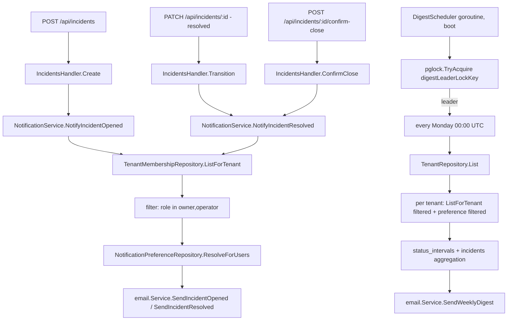

# Notification Preferences and Incident Email Delivery Design

**Spec**: `.specs/features/notification-preferences/spec.md`
**Status**: Approved (2026-09-12) — backend design unchanged; the Meu Perfil `Notificações` frontend section was added to scope.

---

## Architecture Overview

Four independent pieces, matched to the spec's own P1/P1/P2/P1 split:

1. **Preference storage + self-service endpoints** — plain CRUD, no architecture risk.
2. **Event-driven sends** (incident opened/resolved) — synchronous calls added to 3 existing handler methods, reusing `internal/email/service.go`'s established send pattern.
3. **Weekly digest** — the one piece needing real design: a new scheduler goroutine plus a **second**, distinct advisory-lock leader election, deliberately reusing `internal/pglock` (AD-013) rather than inventing a second HA mechanism.
4. **Frontend `Notificações` section** — a new `web/src/features/notifications/` module (section + hooks + types) composed by `ProfilePage`, mirroring `features/sessions/` and `features/two-factor/`; purely client-side over the two self-service endpoints.



---

## Code Reuse Analysis

### Existing Components to Leverage

| Component | Location | How to Use |
| --- | --- | --- |
| `email.Service`'s active-provider-lookup-and-send pattern | `internal/email/service.go` (`SendSignupVerification` shape) | Two new methods, `SendIncidentOpened`/`SendIncidentResolved`/`SendWeeklyDigest`, follow the identical `GetActiveProvider` → `ErrNoActiveProvider` → render → send shape. |
| `TenantMembershipRepository.ListMembersWithEmail` | `internal/db/tenant_membership_repository.go` | Returns every member of a tenant with their email (joined from `users`) - the recipient list the fan-out needs. Role filtering (owner/operator) stays in the notification layer. `ListForTenant` itself returns no email, so this method was added during Execute. |
| `internal/pglock` + `PollerManager`'s leader-loop shape | `internal/cli/poller_manager.go` (`RunLeaderLoop`, `defaultLeaderRetryInterval`/`defaultLeaderHeartbeatInterval`) | The digest scheduler's leader loop is structurally identical — a new, smaller `DigestScheduler` type copies the acquire/heartbeat/retry shape rather than generalizing `PollerManager` itself (see Tech Decisions for why not to share the type directly). |
| `status_intervals` + `internal/history` | `internal/db/status_interval_repository.go`, `internal/history` | Digest's uptime summary reads the same data `poller-status-real-state` and the public status page already read — no new metrics computation invented. |
| `incidents` table's `created_at`/`resolved_at` (from `incident-severity-and-timeline`) | `internal/db/incident_repository.go` | Digest's incident counts are a plain date-ranged `COUNT(*)` query, no new columns needed. |
| `profile-self-service`'s self-scoped endpoint pattern | `internal/api/auth_handler.go` (`UpdateProfile`) | `GET`/`PATCH /api/auth/notification-preferences` follow the same self-only, partial-update shape. |
| Separate feature module composed by `ProfilePage` | `web/src/features/sessions/`, `web/src/features/two-factor/` | New `web/src/features/notifications/` module follows the same "section component + hooks, imported by `ProfilePage`" shape, rather than adding a card inside `features/profile/`. |
| Frontend query/mutation + test harness patterns | `web/src/features/profile/hooks.ts`, `web/src/test/msw/handlers.ts`, `web/src/lib/i18n.ts` | New hooks follow the existing query/mutation convention; the two endpoints get MSW handlers in the shared handlers file; strings land under `profile.notifications.*` in both locales. |

### Integration Points

| System | Integration Method |
| --- | --- |
| Postgres | New `notification_preferences` table; a second advisory-lock key (`digestLeaderLockKey`, new constant, distinct block from `pollerLeaderLockKey`). |
| `internal/cli/serve.go` | Boots `DigestScheduler` alongside `PollerManager`, same lifecycle (start at boot, stop on shutdown). |
| `IncidentsHandler` | `Create`, `Transition`, `ConfirmClose` each gain one call to the new notification layer after their existing success path — never before the DB commit, never blocking the response on send failure. |
| `web/` (Meu Perfil) | New `features/notifications/` module rendered by `ProfilePage`; reads/writes the two self-service endpoints; MSW handlers stand in during tests. |

---

## Components

### `NotificationPreferenceRepository` (`internal/db/notification_preference_repository.go`, new)

- **Purpose**: Own the `notification_preferences` table.
- **Interfaces**:
  - `Get(ctx, userID string) (map[string]bool, error)` — returns stored rows for the 3 known types; caller (handler) applies defaults for any type with no row, per spec's documented default table.
  - `Upsert(ctx, userID string, values map[string]bool) error` — `INSERT ... ON CONFLICT (user_id, notification_type) DO UPDATE`, one statement per provided key (2-3 rows max per call, no batching complexity warranted).
  - `ResolveEnabledForUsers(ctx, userIDs []string, notificationType string) (map[string]bool, error)` — used by the notification layer (not the self-service handler): given a candidate recipient list, returns which of them have `notificationType` resolved `true` (stored `true`, or no row and the type defaults to `true` — only `weekly_digest` defaults `false`). Batches the lookup in one query instead of N.
- **Dependencies**: `*db.Pool`.
- **Reuses**: Standard repository shape, matches this cycle's other new tables.

### `NotificationService` (`internal/notify/service.go`, new package)

- **Purpose**: The one place that knows "who gets notified about what" — keeps `IncidentsHandler` and the digest scheduler from each re-deriving the owner/operator + preference filter independently.
- **Interfaces**:
  - `NotifyIncidentOpened(ctx, tenantID string, incident IncidentSummary) error` (or the handler passes the already-loaded `*db.Incident` — exact shape decided at Execute time, kept narrow here).
  - `NotifyIncidentResolved(ctx, tenantID string, incident IncidentSummary) error`.
  - Both: `ListForTenant` → filter `role IN (owner, operator)` → `ResolveEnabledForUsers` → for each enabled recipient, call `email.Service.SendIncidentOpened`/`SendIncidentResolved`, logging (not returning) any individual send failure — matches spec's non-fatal requirement (a loop over recipients, one slow/failed send never blocks the others or the caller).
- **Dependencies**: `TenantMembershipRepository`, `NotificationPreferenceRepository`, `email.Service`, `*zap.Logger`.
- **Reuses**: `email.Service`'s send methods; `TenantMembershipRepository.ListForTenant`.
- **Why a new package, not a method on `email.Service`**: `email.Service` is provider-agnostic email plumbing (connect/validate/send); "who is a tenant's owner/operator with this preference enabled" is a membership+preference concern with no email-specific logic of its own. Keeping them separate matches this codebase's existing layering (handlers own orchestration, `internal/email` owns transport) and avoids giving `email.Service` a `TenantMembershipRepository` dependency it otherwise has no reason to carry.

### `IncidentsHandler` changes (`internal/api/incidents_handler.go`, edit)

- **Purpose**: Fire the two event-driven notifications at the 3 confirmed hook points.
- **Change**: `Create` calls `h.notify.NotifyIncidentOpened(ctx, tenantID, incident)` after `h.incidents.Create` succeeds, before writing the `201` response — failure is logged only (`h.logger.Error`), never changes the response. `Transition` calls `NotifyIncidentResolved` only when `req.Status == "resolved"`. `ConfirmClose` calls it unconditionally (it always resolves). Tenant ID comes from `ActiveTenantIDFromContext(r.Context())`, already available via the existing tenant-context middleware.
- **Dependencies**: new `notify notificationNotifier` field (narrowed interface: `NotifyIncidentOpened`, `NotifyIncidentResolved`).
- **Auto-created incidents**: incidents created by `SLOAnalyzer` (`internal/poller/analyzer.go`) bypass this handler entirely, so they get their own hook. The poller's per-tenant iteration stores the tenant id in the context (`internal/poller/tenant_context.go`, `withTenantID`); `handleOutageTransition` calls `NotifyIncidentOpened` for the tenant after a successful auto-incident create. `SLOAnalyzer.SetNotifier` is optional (nil disables it, as in most tests). This is required because a monitoring product's incidents are mostly auto-detected - hooking only manual creation would leave the toggle inert in the common case.

### `DigestScheduler` (`internal/cli/digest_scheduler.go`, new)

- **Purpose**: Fire the weekly digest exactly once per tenant per week, exactly once across all running replicas.
- **Interfaces**:
  - `NewDigestScheduler(dsn string, tenants tenantLister, notify digestNotifier, logger *zap.Logger) *DigestScheduler`.
  - `Run(ctx context.Context)` — blocks until `ctx` is canceled; internally: compute next Monday 00:00 UTC, sleep/wait (via a cancelable timer, not a busy loop) until then, then loop every 7 days. On each fire: `pglock.TryAcquire(ctx, dsn, digestLeaderLockKey)` (non-blocking, mirrors `PollerManager`'s own leader check) — if not acquired, skip this fire entirely (another replica is leading); if acquired, run the digest for every tenant, then `Release` the lock immediately after (the lock's only job is to gate *this one weekly fire*, not to be held continuously like the poller's leadership lock — see Tech Decisions).
  - Internal: `runOnce(ctx) `— iterates `tenants.List(ctx)`, for each tenant resolves enabled recipients via `NotificationService`-equivalent logic (reuses `ResolveEnabledForUsers` with `notification_type = 'weekly_digest'`), skips tenants with zero enabled recipients (AC3) without building or sending anything, otherwise composes and sends one email per enabled recipient via `email.Service.SendWeeklyDigest`.
- **Dependencies**: `internal/pglock`, `TenantRepository` (or the same `SystemTenantLister` pattern `AD-024` established for cross-tenant enumeration — see Risks), `NotificationService`/`NotificationPreferenceRepository`, `internal/history`/`StatusIntervalRepository`, `IncidentRepository`.
- **Reuses**: `PollerManager.RunLeaderLoop`'s retry/acquire shape (structurally copied, not shared by inheritance — see Tech Decisions); `internal/pglock.TryAcquire`.

### `email.Service` additions (`internal/email/service.go`, edit)

- **Purpose**: Three new send methods, one template each.
- **Interfaces**: `SendIncidentOpened(ctx, to string, data IncidentOpenedEmailData) error`, `SendIncidentResolved(ctx, to string, data IncidentResolvedEmailData) error`, `SendWeeklyDigest(ctx, to string, data WeeklyDigestEmailData) error` — each mirrors `SendSignupVerification`'s body exactly (active-provider lookup, template render, send, typed error passthrough).
- **Reuses**: `s.templates`, `s.repo.GetActiveProvider`/`Get`, the existing `ErrNoActiveProvider` sentinel.

### `NotificationsSection` + hooks (`web/src/features/notifications/`, new module)

- **Purpose**: The Meu Perfil `Notificações` UI — three toggles, one per preference type.
- **Interfaces**:
  - `hooks.ts` — `useNotificationPreferences()` (query key `["notification-preferences"]`) wrapping `GET /api/auth/notification-preferences`, and `useUpdateNotificationPreference()` wrapping the partial `PATCH` with an optimistic update of the single key and rollback plus error toast on failure.
  - `types.ts` (or types co-located in `hooks.ts`) — `NotificationPreferences = { incident_opened: boolean; incident_resolved: boolean; weekly_digest: boolean }` and the `NotificationType` union.
  - `NotificationsSection.tsx` — renders the three toggles from the hook, a loading state with toggles disabled while the initial request is in flight, and an inline error state on initial-load failure; calls the mutation per toggle.
- **Dependencies**: the two self-service endpoints, `react-i18next` (`profile.notifications.*`), the shared toast utility.
- **New primitive**: no switch control exists in `components/ui/` today (the mock renders a custom track/knob switch, not a native checkbox), so this introduces `web/src/components/ui/Switch.tsx` (`role="switch"`, keyboard-operable, `checked`/`disabled`/`onChange`) as a reusable primitive.
- **Reuses**: the `features/sessions`/`features/two-factor` module shape; the existing query/mutation conventions.
- **Why a separate module, not a card in `features/profile/`**: keeps `features/profile/` about the user's identity and security cards and gives the notification UI its own testable boundary, matching the existing separate-module precedent (user decision, 2026-09-12).

---

## Data Models

### `notification_preferences`

```sql
CREATE TABLE notification_preferences (
    user_id UUID NOT NULL REFERENCES users(id) ON DELETE CASCADE,
    notification_type TEXT NOT NULL CHECK (notification_type IN ('incident_opened', 'incident_resolved', 'weekly_digest')),
    enabled BOOLEAN NOT NULL,
    PRIMARY KEY (user_id, notification_type)
);
```

**Relationships**: up to 3 rows per user; a missing row for a given `(user_id, type)` reads as that type's documented default (`true`/`true`/`false`) at the repository layer, not backfilled.

---

## Error Handling Strategy

| Error Scenario | Handling | User Impact |
| --- | --- | --- |
| `ErrNoActiveProvider` on any of the 3 new send methods | Logged, swallowed by `NotificationService`/`DigestScheduler` | Incident creation/transition still returns its normal success status; digest run for that cycle simply sends nothing (already the case with zero opted-in recipients). |
| One recipient's send fails mid-loop (event-driven or digest) | Logged per-recipient, loop continues to the next recipient | A transient provider hiccup for one user never blocks the rest of the tenant's notified members. |
| Digest scheduler's `TryAcquire` fails to acquire (another replica already leading this fire) | No-op, no log-as-error (expected steady state in a multi-replica deployment) | No duplicate digest emails. |
| Tenant has zero enabled `weekly_digest` recipients | No email built or sent for that tenant this week | Matches AC3 exactly — silent skip, not an error path. |

---

## Risks & Concerns

| Concern | Location (file:line) | Impact | Mitigation |
| --- | --- | --- | --- |
| `DigestScheduler` needs to enumerate all tenants, the exact same fail-closed-RLS bootstrap problem `AD-024` already solved for the poller | `internal/db/tenant_repository.go` (`List`, RLS policy from migration `0027`) | Without reusing `AD-024`'s mechanism, a naive `TenantRepository.List` call from the digest scheduler's own connection (no `app.tenant_id`, no `app.is_system`) would silently return zero tenants under production RLS — the digest would appear to work in every test against a superuser test role and then send nothing in production. | Reuse `db.SystemTenantLister` (`internal/db/system_tenant_lister.go`) exactly as `newPollerFromStoredIntegration` does — the digest scheduler is system-internal code with the same trust shape as the poller, not a new RLS carve-out. |
| Holding the digest's advisory lock only briefly (acquire → send all tenants → release) rather than continuously like the poller's leadership lock | `internal/cli/digest_scheduler.go` (`Run`) | A window exists, in theory, where the lock is free between two replicas' near-simultaneous fires at exactly Monday 00:00 UTC — but `pg_try_advisory_lock` is atomic at the Postgres level, so at most one of two simultaneous `TryAcquire` calls ever succeeds; there is no window where both succeed. | No mitigation needed beyond using `TryAcquire` (not a manual check-then-acquire) — flagged here only so a future reader doesn't mistake "briefly held" for "unsafe": the safety property comes from Postgres's atomicity, not from how long the lock is held. |
| A digest cycle spans potentially many tenants sequentially inside one held advisory lock / one leader-election window | `internal/cli/digest_scheduler.go` (`runOnce`) | A slow tenant (many recipients, slow provider) delays the lock's release, though this only matters if a second replica is also trying to fire the *same* weekly cycle concurrently, which `TryAcquire`'s atomicity already prevents from causing a double-send. | No correctness risk; a latency-only concern. If tenant count grows large enough to matter, a future spec can parallelize `runOnce`'s per-tenant loop — not warranted at this project's current scale (AD-002, single-tenant-per-installation is the common case; multi-tenant installs are the newer, smaller-volume path per `AD-022`). |
| `IncidentsHandler.Create`/`Transition`/`ConfirmClose` each add a synchronous email-fanout call (N recipients × network I/O) directly in the request path | `internal/api/incidents_handler.go` | `POST /api/incidents` (and the two resolve paths) get slower proportional to tenant member count and provider latency. | Spec explicitly accepts this tradeoff (same one `SendSignupVerification` already has) — no queue exists in this codebase and introducing one for 2 email types is out of scope per spec's own Assumptions row. Flagged here as a known, accepted cost, not a defect to fix in this feature. |

---

## Tech Decisions (only non-obvious ones)

| Decision | Choice | Rationale |
| --- | --- | --- |
| `DigestScheduler` is a new type, not a generalized `PollerManager` | Structural copy of the leader-loop shape, separate type | `PollerManager` is specifically about owning one `Poller`'s start/stop lifecycle tied to a stored Datadog integration (`AD-013`/`AD-013 addendum`) — its `Restart`/leadership-gating semantics are shaped around that one job. Forcing the weekly digest (a periodic batch job, not a long-running process to start/stop) through the same abstraction would either strain `PollerManager`'s interface or require a generalization exercise disproportionate to a second, structurally simpler leader-election consumer. Both share `internal/pglock` at the primitive level, which is the actual reusable unit per `AD-013`'s own stated scope ("any future feature needing cross-replica coordination... defaults to a Postgres-backed mechanism"). |
| Digest advisory lock is acquired and released per-fire, not held continuously | `TryAcquire` + `Release` bracketing one `runOnce` call | Unlike poller leadership (which must persist between poll cycles so exactly one replica keeps running the loop), the digest only needs exclusivity for the few minutes it takes to iterate tenants once a week — holding a session-scoped advisory lock (and its dedicated connection) idle for 7 days between fires would be a wasted, leaked-looking resource for no benefit. |
| Lock key value | A new named constant in a namespace block distinct from `pollerLeaderLockKey` (`internal/pglock`'s own doc comment reserves `727200000-727299999` for production locks generally — the new key is a specific value in that block, picked and documented at Execute time) | Matches `AD-013`'s established key-namespacing discipline — never invent a second ad-hoc numbering scheme. |
| Tenant enumeration for the digest | Reuses `db.SystemTenantLister`, not a new RLS policy | Directly avoids re-deriving `AD-024`'s already-solved bootstrap paradox for a second system-internal background job — same trust shape (in-process, ticker-driven, never HTTP-reachable). |
| Frontend module boundary | New `web/src/features/notifications/` module composed by `ProfilePage`, not a card inside `features/profile/` | Mirrors `features/sessions/` and `features/two-factor/`; the notification UI depends on a different resource (self preferences) than the identity/security cards, so a separate boundary keeps both independently testable. |
| Toggle write model | One partial `PATCH` per toggle, optimistic single-key update with rollback on failure | Matches the mock's per-toggle behavior and the endpoints' partial-update contract; a form-save model was never requested. |

> **New `AD-NNN` candidate**: if Execute confirms `SystemTenantLister` generalizes cleanly to a second caller, append a short addendum to `AD-024` noting it now serves two system-internal consumers (poller + digest scheduler), not one — not a new decision, just scope-widening the existing one's `Scope` line.
