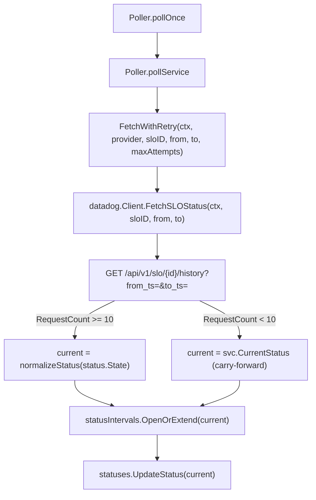

# Poller Recent SLO Window Design

**Spec**: `.specs/features/poller-recent-slo-window/spec.md`
**Status**: Draft

---

## Approach Exploration

Three ways to get a recent-window status into `pollService`, all delivering the same spec scope:

### Option A — Repurpose `FetchSLOStatus` in place (recommended)

`datadog.Client.FetchSLOStatus` keeps its name but its signature grows a `from, to time.Time` window; internally it calls `GET /api/v1/slo/{id}/history?from_ts=&to_ts=` instead of `GET /api/v1/slo/search?query=id:`. `SLOProvider` interface, `FetchWithRetry`, and `pollService` thread the window through. `SLOStatus` gains one field (`RequestCount`) for the volume guard.

- **Trade-off**: Every call site of `FetchSLOStatus` (only `retry.go`) changes its call signature — small, mechanical diff.
- **Why recommended**: `FetchSLOStatus` has exactly one caller in the whole codebase (`internal/poller/retry.go` — confirmed via `grep`). There is nothing to preserve by keeping a second method around; a second method would be dead weight the moment this ships (the spec's "substitui totalmente" decision already rules out keeping the 30d path alive anywhere).

### Option B — Add a new method, deprecate the old one

Add `FetchRecentSLOStatus(ctx, sloID, from, to)` alongside the untouched `FetchSLOStatus`. Poller switches to the new method; old one stays in the codebase, unused.

- **Trade-off**: Immediate dead code (zero callers for `FetchSLOStatus` the moment this ships) with no plan to ever call it again — spec's Out of Scope explicitly rejects keeping a parallel 30d signal. Rejected: violates the project's own "don't design for hypothetical future requirements" stance (`AGENTS.md`) for no benefit.

### Option C — Two separate calls (thresholds + history)

Fetch the SLO's static thresholds via `GET /slo/{id}` once, then request history without relying on Datadog's own `state` computation, computing ok/warning/breached in Go from `sliValue` vs. the fetched `target`/`warning`.

- **Trade-off**: Doubles Datadog API calls per poll cycle (more quota pressure, more failure surface — now two calls that can independently time out or 401), and reimplements a comparison Datadog's `history` endpoint already does correctly and returned for free in the live test call (`overall.state: "ok"` with no `target` param passed). Rejected: no functional gain, real cost in latency/quota/failure modes.

**Chosen: Option A.**

---

## Architecture Overview

No new components. The change is confined to the existing poll pipeline — the shape of the pipeline (list services → fetch status → open/extend interval → update cached status) does not change; only what "fetch status" asks Datadog for, and one new branch (volume guard) between fetch and write, change.



`from`/`to` are computed once per service per cycle in `pollService`: `to := time.Now()`, `from := to.Add(-p.interval)` — `p.interval` is the existing `Poller.interval` field (already `POLL_INTERVAL_SECONDS` from `cmd/vane`'s config, `internal/cli/serve.go:260`). No new config value.

---

## Code Reuse Analysis

### Existing Components to Leverage

| Component | Location | How to Use |
| --- | --- | --- |
| `Poller.interval` | `internal/poller/poller.go:56` | Already holds `POLL_INTERVAL_SECONDS` as a `time.Duration` — reused directly as the window length, no new field/config. |
| `normalizeStatus` | `internal/poller/poller.go:178-195` | Unchanged. Still maps Datadog's `state` string (`ok`/`warning`/`breached`/other) to vane's status vocabulary — now fed by the history call's `state` instead of the search call's. |
| `FetchWithRetry` / `isTransient` | `internal/poller/retry.go` | Unchanged retry/backoff/auth-shortcut logic — only its call to `provider.FetchSLOStatus` gains two new passthrough params. |
| `statusIntervals.OpenOrExtend` / `statuses.UpdateStatus` | `internal/poller/poller.go:33`, `:26` | Unchanged interfaces and call sites — still called with whatever `current` ends up being (recomputed or carried-forward), so `service-status-intervals`/`public-status-hourly-history` need zero changes. |
| `Client.get` | `internal/connectors/datadog/client.go:237-266` | Unchanged auth header / status-code classification helper, reused as-is for the new history request. |
| `svc.CurrentStatus` | `internal/db/service_repository.go:16` (`db.Service`) | Already loaded by `p.services.List(ctx)` before `pollService` runs — the carry-forward value comes from a field already in hand, no extra query. |

### Integration Points

| System | Integration Method |
| --- | --- |
| Datadog SLO History API | New endpoint for vane: `GET /api/v1/slo/{slo_id}/history?from_ts=<unix>&to_ts=<unix>`. Confirmed live (2026-09-08, via SDK discovery + `execute_code` against `service:conversations-service`'s real SLO): returns `state` computed against the SLO's own configured target even without an explicit `target` param, plus per-window request counts under `series.denominator`/`series.numerator`. Same auth headers (`DD-API-KEY`/`DD-APPLICATION-KEY`) as the existing `/slo/search` call — no new credential/permission surface (SLO read scope already covers both endpoints). |
| `GET /api/v1/slo/search` | Untouched — still backs `SearchSLOs` (I14, SLO-by-name lookup for the admin UI) and `ValidateCredentials` (SP-01.2). Only `FetchSLOStatus` moves off it. |

---

## Components

### `datadog.SLOStatus` (data model change)

- **Purpose**: Vane's normalized view of an SLO's status for a given window — now a specific `[from, to)` window instead of the SLO's fixed configured timeframe.
- **Location**: `internal/connectors/datadog/client.go`
- **Change**: add `RequestCount int64` (from `data.series.denominator.sum` — total requests observed in the window, the volume-guard input). `ErrorBudgetRemaining` becomes an approximation (`Target - SLI`, both already on the struct) instead of Datadog's own budget figure, since Datadog only computes a precise custom-window budget when an explicit `target` is passed (see spec Assumptions) — acceptable because the field is DB-only and unread today (verified, see spec's Out of Scope).
- **Reuses**: `State`, `SLI`, `Target`, `Timeframe` fields keep their existing meaning (state/SLI now reflect the requested window; `Target`/`Timeframe` still describe the SLO's own static configuration, sourced from the same history response's `thresholds` map — same as today's `thresholds[0]` read from `/slo/search`).

### `datadog.Client.FetchSLOStatus` (signature + implementation change)

- **Purpose**: Fetch `sloID`'s status for an arbitrary `[from, to)` window instead of its 30-day default.
- **Location**: `internal/connectors/datadog/client.go`
- **Interfaces**:
  - `FetchSLOStatus(ctx context.Context, sloID string, from, to time.Time) (SLOStatus, error)` — was `FetchSLOStatus(ctx, sloID)`. Same error contract (`ErrUnauthorized`/`ErrTimeout`/`ErrServer`/`ErrNotFound`), same auth/retry classification via `c.get`.
- **Dependencies**: `c.get` (unchanged), new `sloHistoryResponse` decode struct.
- **Reuses**: `c.get`'s status-code classification, `defaultBaseURL`, `defaultTimeout`.

### `datadog.SLOProvider` (interface change)

- **Purpose**: Contract the poller depends on.
- **Location**: `internal/connectors/datadog/client.go`
- **Interfaces**: `FetchSLOStatus(ctx context.Context, sloID string, from, to time.Time) (SLOStatus, error)` — signature change propagates to every implementer, real and test fakes.

### `poller.FetchWithRetry` (signature change)

- **Purpose**: Retry wrapper around the provider call.
- **Location**: `internal/poller/retry.go`
- **Interfaces**: `FetchWithRetry(ctx context.Context, provider datadog.SLOProvider, sloID string, from, to time.Time, maxAttempts int) (datadog.SLOStatus, error)` — was `(ctx, provider, sloID, maxAttempts)`. Retry/backoff/`isTransient` logic body unchanged — only the passthrough call gains `from, to`.

### `poller.Poller.pollService` (logic change)

- **Purpose**: Compute the window, fetch, apply the volume guard, write.
- **Location**: `internal/poller/poller.go:151-174`
- **Change**: computes `to := time.Now()`, `from := to.Add(-p.interval)` before calling `FetchWithRetry`; after a successful fetch, branches on `status.RequestCount < minRecentWindowRequests` (new package constant, `= 10`, per spec's logged assumption) — below it, `current := svc.CurrentStatus` (carry-forward); at or above it, `current := normalizeStatus(status.State)` (unchanged mapping). The rest of the function (open/extend interval, update cached status, error handling on fetch failure) is untouched — same lines, same order, same early-return-on-error behavior (SP-08 preserved).
- **Reuses**: `normalizeStatus` unchanged.

---

## Data Models

### `datadog.SLOStatus` (updated)

```go
type SLOStatus struct {
    // State is one of "ok", "warning", "breached", "no_data" — now computed
    // by Datadog for the requested [from, to) window, not the SLO's fixed
    // configured timeframe.
    State string
    // ErrorBudgetRemaining is an approximation (Target - SLI, percentage
    // points) for the requested window — DB-only field, not read by any
    // handler/frontend (verified).
    ErrorBudgetRemaining float64
    // SLI is the service level indicator for the requested window, 0-100.
    SLI float64
    // Target is the SLO's own configured target threshold (unchanged
    // meaning), sourced from the history response's thresholds map.
    Target float64
    // Timeframe is the SLO's own configured timeframe (e.g. "30d") that
    // Target belongs to — informational only, not the requested window.
    Timeframe string
    // RequestCount is the total request volume observed in the requested
    // window (series.denominator.sum) — input to the poller's low-volume
    // carry-forward guard. New field.
    RequestCount int64
}
```

**Relationships**: consumed only by `poller.pollService` (`State`, `RequestCount`) and persisted as-is into `status_intervals.error_budget_remaining` (`ErrorBudgetRemaining`) via the existing, unchanged `OpenOrExtend` call.

### `sloHistoryResponse` (new, unexported decode struct)

```go
// sloHistoryResponse mirrors the subset of GET /api/v1/slo/{id}/history
// vane needs. Shape confirmed live (2026-09-08) against a real SLO via
// Datadog MCP SDK discovery + execute_code — the official Go/TS client's
// declared types cover sli_value/thresholds; state/corrections are
// undeclared extra fields Datadog still returns inline (same verbatim
// keys), consistent with how sloSearchResponse already decodes /slo/search.
type sloHistoryResponse struct {
    Data struct {
        Overall struct {
            SLIValue float64 `json:"sli_value"`
            State    string  `json:"state"`
        } `json:"overall"`
        Series struct {
            Denominator struct {
                Sum int64 `json:"sum"`
            } `json:"denominator"`
        } `json:"series"`
        Thresholds map[string]struct {
            Target    float64 `json:"target"`
            Timeframe string  `json:"timeframe"`
        } `json:"thresholds"`
    } `json:"data"`
}
```

`Thresholds` is a map because the JSON key is the SLO's own configured timeframe (e.g. `"30d"`), which varies per SLO — same reasoning `sloSearchResponse` already applies by reading `Thresholds[0]` from a list; here it's a single-entry map instead of a single-entry list, so the design takes the one present entry regardless of its key.

---

## Error Handling Strategy

| Error Scenario | Handling | User Impact |
| --- | --- | --- |
| History request times out / 5xx | `isTransient` still matches (`ErrTimeout`/`ErrServer` unchanged), `FetchWithRetry` retries up to `maxFetchAttempts` — identical to today. | None — invisible to the public page unless every retry fails. |
| History request 401/403 | `ErrUnauthorized`, never retried — identical to today. | Integration marked invalid (`MarkDatadogInvalid`), admin sees it in the dashboard — unchanged path. |
| Every retry exhausted | `pollService` returns the error without touching `current_status` or writing an interval — identical to today (SP-08). | Public page keeps showing the last known status — unchanged. |
| SLO deleted / `sloID` no longer resolves | `ErrNotFound` — identical to today (`/slo/history` 404s the same way `/slo/search` returning zero results is mapped today; both are "this ID doesn't exist" from vane's point of view). | Same as an exhausted-retry cycle from vane's perspective — treated as a failed poll for that service. |
| Window has < 10 requests (`RequestCount`) | New: not an error. `current` becomes the carry-forward value; interval is still opened/extended with it (no gap in hourly history). | Public page shows the same status as before this poll cycle — no flicker from noise. |
| Window has 0 requests (`RequestCount == 0`) | Same as above — 0 is `< 10`, no special-case needed. | Same as above. |
| Malformed/missing `state` in response | `normalizeStatus`'s existing default branch maps any unrecognized value (including empty string) to `degraded` — unchanged invariant ("never claim operational on indeterminate data"). | Public page shows `degraded`, never a silently-stale `operational`. |

---

## Risks & Concerns

| Concern | Location (file:line) | Impact | Mitigation |
| --- | --- | --- | --- |
| Signature change breaks every test fake implementing `SLOProvider` | `internal/poller/poller_abort_test.go`, `internal/poller/poller_test.go`, `internal/poller/retry_test.go`, `internal/connectors/datadog/client_test.go` (all confirmed via `grep` to define/use `FetchSLOStatus`) | Build fails project-wide until every fake's method signature and every test's assertions on the passed `sloID`-only call are updated. | Tasks phase must enumerate each file as its own task — mechanical but must not be skipped or bundled silently into the client/poller change tasks (would hide a broken build behind an unrelated commit). |
| Low-traffic services may rarely accumulate 10 requests inside a single `POLL_INTERVAL_SECONDS` window | `internal/poller/poller.go` (new carry-forward branch) | For those services, `current_status` may barely ever update from live computation — it stays at whatever it last was, correctly avoiding noise but also correctly not proving recovery quickly. This is the deliberate trade-off the user chose (carry-forward over auto-expanding window). | Documented as expected behavior in spec (RSW-06/07) and here — not a bug to fix in this feature. If it proves too sluggish in practice for a specific low-traffic service, revisit the fixed `10` constant or window strategy as a follow-up, not silently now. |
| `ErrorBudgetRemaining` semantics change (exact 30d figure → windowed approximation) without any consumer noticing | `internal/db/status_interval_repository.go`, migrations `0005`/`0014` | None today (column unread everywhere) — but a future feature that starts reading this column would silently get a different, approximate number than before, with no comment at the read site warning about it. | This design's `SLOStatus` doc comment (above) states the approximation explicitly; if a future feature starts reading `error_budget_remaining`, it inherits that doc comment and should re-verify precision needs before trusting it — not this feature's job to guess a future consumer's precision requirement. |

> No test-coverage gap beyond the fakes above — the existing failure-path tests (`poller_test.go`/`retry_test.go`/`poller_abort_test.go`) already exercise timeout/5xx/401/not-found; they need signature updates, not new scenarios, to keep passing. New scenarios (volume guard, window computation) are net-new tests this feature must add — covered in Tasks.

---

## Tech Decisions

| Decision | Choice | Rationale |
| --- | --- | --- |
| Method name | Keep `FetchSLOStatus`, change signature (not a new/renamed method) | Sole caller confirmed via `grep`; a rename would be pure churn with no reader benefit — the name still accurately describes "fetch this SLO's status," now parameterized by window. |
| Minimum volume threshold | Package constant `minRecentWindowRequests = 10` in `internal/poller/poller.go`, not config | Spec's explicit choice: no new env var / DB column for a single tunable number; a future need to tune it is a one-line code change, not a migration. |
| `ErrorBudgetRemaining` for the windowed call | Computed in Go as `Target - SLI` rather than requesting Datadog's own figure via an explicit `target` param | Avoids a chicken-and-egg second call (Datadog's own windowed budget calc needs `target` passed in, which vane doesn't have until it reads `thresholds` from this same response) for a field nothing currently reads. |
| `Thresholds` decoded as `map[string]struct{...}` | Iterate the single present entry rather than assuming a known key like `"30d"` | The configured timeframe varies per SLO (this org has both 30d and — per the earlier live SLO listing — no other timeframe observed, but nothing in the SLO's definition guarantees `"30d"` specifically); matches how `sloSearchResponse` already avoids hardcoding by reading `thresholds[0]` from a list. |

> **Project-level decision**: this design supersedes the implicit "mirror the SLO's own `state` 1:1" assumption `mvp-core`'s original spec.md (SP-06/SP-07) baked in without ever registering it as an `AD-NNN`. Recording this as **AD-019** in `.specs/STATE.md` once this feature ships (per `memory.md`), since it's the first time that assumption is being deliberately overridden and future features touching the poller need to know the new contract (windowed, not fixed-timeframe) is now the standard.

---

## Tips reminder (not part of the doc — for Tasks phase)

Design intentionally keeps `OpenOrExtend`/`UpdateStatus`/`normalizeStatus`/interval-writer contracts untouched — Tasks should NOT re-open `service-status-intervals` or `public-status-hourly-history` files; this feature's blast radius is `internal/connectors/datadog/client.go`, `internal/poller/{retry.go,poller.go}`, and their four test files, plus one `.specs/STATE.md` append at the end.
