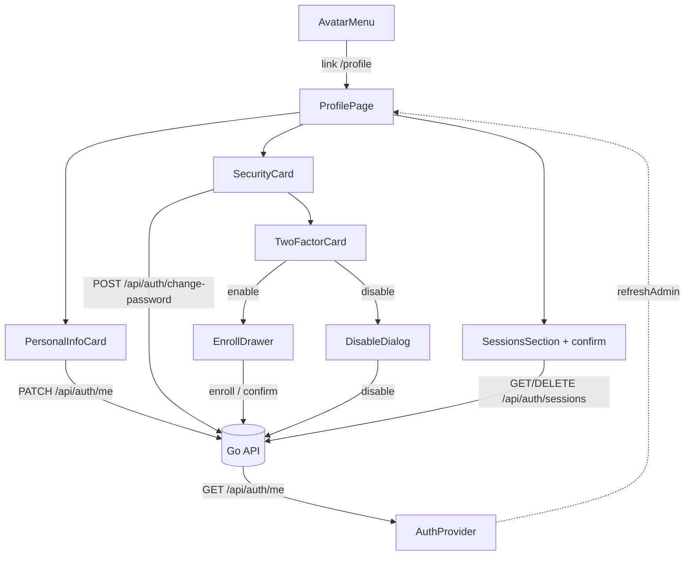

# Meu Perfil Page Design

**Spec**: `.specs/features/profile-page/spec.md`
**Status**: Draft

---

## Architecture Overview

A frontend-led feature on top of three already-shipped backends. The page is a thin composition shell; each card owns its own data hooks, and the 2FA enrollment flow is an isolated multi-step drawer. The only backend change is one additive boolean on `GET /api/auth/me`. The page reads the authenticated identity from the existing `AuthProvider` context (single source of truth) and refreshes it after any mutation that changes the displayed identity (name, 2FA status).



**Chosen approach (confirmed with the user 2026-09-11):** two modules, `web/src/features/profile/` (page, personal info, password, hooks) and `web/src/features/two-factor/` (2FA card, drawer, dialog, hooks). Rejected: a single `features/profile/` module mixing profile and security concerns, and one monolithic `ProfilePage.tsx`. The split mirrors the existing self-contained `features/sessions/` module and keeps the multi-step security flow independently testable.

---

## Code Reuse Analysis

### Existing Components to Leverage

| Component | Location | How to Use |
| --- | --- | --- |
| `SessionsSection` | `web/src/features/sessions/SessionsSection.tsx` | Import into `ProfilePage`; add a confirmation `Dialog` before the existing revoke mutation. |
| `useSessions` / `useRevokeSession` | `web/src/features/sessions/hooks.ts` | Reused unchanged. |
| `AuthProvider` / `useAuth` | `web/src/auth/AuthProvider.tsx` | Read `admin`; extend with `refreshAdmin()` and `two_factor_enabled`. |
| `Dialog` | `web/src/components/ui/Dialog.tsx` | Confirmation for session revoke. |
| `Drawer` | `web/src/components/ui/Drawer.tsx` | 2FA enrollment container (matches the mock's drawer). |
| `Card`, `Button`, `Field`, `Input`, `Tag` | `web/src/components/ui/` | Card layout and form primitives, matching existing pages. |
| `sonner` `toast` | already used by `SessionsSection`/admins | Success/error feedback. |
| `apiFetch` / `ApiError` | `web/src/lib/apiClient.ts` | HTTP calls and status-based error branching. |
| `LogoutConfirmDialog` | `web/src/layout/LogoutConfirmDialog.tsx` | Pattern reference for the session-revoke confirmation dialog. |
| `react-i18next` | `web/src/lib/i18n.ts` | New `profile.*` / `twoFactor.*` keys, pt-BR + en. |
| `AuthHandler.Me` / `meResponse` | `internal/api/auth_handler.go:465,487` | Source of the identity payload; gains `two_factor_enabled`. |
| `twoFactorStore.GetSecret` | `internal/api/auth_handler.go:40` | Already-injected store used by `Me` to compute the flag. |

### Integration Points

| System | Integration Method |
| --- | --- |
| `PATCH /api/auth/me` | Existing; used by `useUpdateProfileName`. |
| `POST /api/auth/change-password` | Existing; used by `useChangePassword`. |
| `POST /api/auth/2fa/enroll` / `confirm` / `disable` | Existing backend; first frontend consumer. |
| `GET /api/auth/sessions` / `DELETE /api/auth/sessions/{id}` | Existing; consumed via `SessionsSection`. |
| `GET /api/auth/me` | Existing; extended with `two_factor_enabled` (additive). |
| MSW handlers | `web/src/test/msw/handlers.ts` extended with the four profile/2FA endpoints and the new `/me` field. |

---

## Components

### `ProfilePage` (new)

- **Purpose**: Render the Meu Perfil screen and compose its cards.
- **Location**: `web/src/features/profile/ProfilePage.tsx`
- **Interfaces**: `function ProfilePage(): JSX.Element`
- **Dependencies**: `useAuth()`, `<PersonalInfoCard/>`, `<SecurityCard/>`, `<SessionsSection/>`, `useTranslation()`.
- **Reuses**: page layout/token conventions from existing pages (e.g. `SettingsPage`).

### `PersonalInfoCard` (new)

- **Purpose**: Show and update the caller's display name; show email read-only and an initials avatar.
- **Location**: `web/src/features/profile/PersonalInfoCard.tsx`
- **Interfaces**: `function PersonalInfoCard(): JSX.Element`
- **Dependencies**: `useAuth()` (`admin.name`/`admin.email`), `useUpdateProfileName()`.
- **Reuses**: `Card`, `Field`, `Input`, `Button`, toast.

### `SecurityCard` (new)

- **Purpose**: Host the password-change form and the 2FA card under one "Segurança" section.
- **Location**: `web/src/features/profile/SecurityCard.tsx`
- **Interfaces**: `function SecurityCard(): JSX.Element`
- **Dependencies**: `useChangePassword()`, `<TwoFactorCard/>`.
- **Reuses**: `Card`, form primitives, toast.

### `profile/hooks.ts` (new)

- **Purpose**: Mutations for name and password.
- **Location**: `web/src/features/profile/hooks.ts`
- **Interfaces**:
  - `useUpdateProfileName()` — `PATCH /api/auth/me` `{name}`; on success calls `refreshAdmin()`.
  - `useChangePassword()` — `POST /api/auth/change-password` `{current_password,new_password}`.
- **Dependencies**: `apiFetch`, `useAuth().refreshAdmin`.
- **Reuses**: `useMutation` patterns from `features/sessions/hooks.ts`.

### `TwoFactorCard` (new)

- **Purpose**: Show the 2FA enabled/disabled state and route to enable (drawer) or disable (dialog).
- **Location**: `web/src/features/two-factor/TwoFactorCard.tsx`
- **Interfaces**: `function TwoFactorCard(): JSX.Element`; reads `admin.two_factor_enabled`.
- **Dependencies**: `useAuth()`, `<EnrollDrawer/>`, `<DisableDialog/>`, `useTranslation()`.
- **Reuses**: `Card`, `Tag` (status badge), `Button`.

### `EnrollDrawer` (new)

- **Purpose**: Run the 3-step enrollment flow (scan → verify → recovery codes).
- **Location**: `web/src/features/two-factor/EnrollDrawer.tsx`
- **Interfaces**:
  - `function EnrollDrawer({ open, onOpenChange, onEnabled }): JSX.Element`
  - Internal step state: `useState<"scan" | "verify" | "codes">`.
- **Dependencies**: `useEnroll2FA()`, `useConfirm2FA()`, `QRCodeSVG` from `qrcode.react`, `Drawer`, `Button`.
- **Reuses**: `Drawer` per the mock's drawer affordance.

### `DisableDialog` (new)

- **Purpose**: Ask for the current password and disable 2FA.
- **Location**: `web/src/features/two-factor/DisableDialog.tsx`
- **Interfaces**: `function DisableDialog({ open, onOpenChange, onDisabled }): JSX.Element`
- **Dependencies**: `useDisable2FA()`, `Dialog`, `Input`, `Button`.
- **Reuses**: `Dialog` + password-field pattern from `SecurityCard`.

### `two-factor/hooks.ts` (new)

- **Purpose**: 2FA mutations.
- **Location**: `web/src/features/two-factor/hooks.ts`
- **Interfaces**:
  - `useEnroll2FA()` — `POST /api/auth/2fa/enroll` → `{secret, otpauth_uri}`.
  - `useConfirm2FA()` — `POST /api/auth/2fa/confirm` `{code}` → `{recovery_codes}`.
  - `useDisable2FA()` — `POST /api/auth/2fa/disable` `{current_password}`; on success `refreshAdmin()`.
- **Dependencies**: `apiFetch`, `useAuth().refreshAdmin`.
- **Reuses**: `useMutation` pattern.

### `SessionsSection` (modified)

- **Purpose**: Reused as-is except for a confirmation step before revoke.
- **Location**: `web/src/features/sessions/SessionsSection.tsx`
- **Change**: clicking "Encerrar" opens a `Dialog`; only the dialog's confirm calls `revoke.mutate(id)`. The dialog is keyed by the pending session id.
- **Note**: this supersedes the component's earlier documented choice of no confirmation (mock parity, user decision 2026-09-11). Existing tests that asserted immediate revocation are updated to go through the dialog.

### `AuthProvider` (modified)

- **Purpose**: Carry `two_factor_enabled` and expose an identity refresh.
- **Location**: `web/src/auth/AuthProvider.tsx`
- **Change**: add `two_factor_enabled: boolean` to `AuthenticatedAdmin`; add `refreshAdmin()` to `AuthContextValue` that re-hydrates `GET /api/auth/me` and dispatches `AUTHENTICATED` (same path the boot effect already uses). `refreshAdmin` is a no-op/keeps state on failure and never throws to callers.

### `AvatarMenu` (modified)

- **Purpose**: Add the page's entry point.
- **Location**: `web/src/layout/AvatarMenu.tsx`
- **Change**: add a "Meu Perfil" item linking to `/profile`, above the existing `/settings` link. No role guard (any authenticated role).

### `App.tsx` (modified)

- **Purpose**: Route the page inside the authenticated layout.
- **Location**: `web/src/App.tsx`
- **Change**: `<Route path="/profile" element={<ProfilePage />} />` inside the existing authenticated `<Route>` group (no `RequireRole`).

### `lib/i18n.ts` (modified)

- **Purpose**: Ship all new copy.
- **Location**: `web/src/lib/i18n.ts`
- **Change**: add `profile.*` and `twoFactor.*` keys under both `pt` and `en`.

### `internal/api/auth_handler.go` (modified)

- **Purpose**: Report 2FA status in the identity payload.
- **Location**: `internal/api/auth_handler.go` (`meResponse`, `Me`)
- **Change**: add `TwoFactorEnabled bool \`json:"two_factor_enabled"\`` to `meResponse`; in `Me`, call `h.twoFactor.GetSecret(ctx, user.ID)` and set the flag `true` only when a secret exists with `EnabledAt != nil` (`ErrNotFound` → `false`; any other error → log and `false`, never fail `/me`).

---

## Data Models

### `AuthenticatedAdmin` (frontend, `web/src/auth/AuthProvider.tsx`)

```typescript
interface AuthenticatedAdmin {
  id: string;
  email: string;
  name?: string;
  role: Role;
  active_tenant_id?: string;
  memberships: TenantMembership[];
  two_factor_enabled: boolean; // new - mirrors GET /api/auth/me
}
```

### Backend `meResponse` (`internal/api/auth_handler.go`)

```go
type meResponse struct {
    ID    string  `json:"id"`
    Email string  `json:"email"`
    Name  string  `json:"name"`
    Phone *string `json:"phone,omitempty"`
    Role  string  `json:"role"`
    ActiveTenantID string `json:"active_tenant_id,omitempty"`
    Memberships []meMembership `json:"memberships"`
    TwoFactorEnabled bool `json:"two_factor_enabled"` // new
}
```

### Profile/2FA request & response contracts (existing backend, exact shapes)

| Endpoint | Request | Success | Failure |
| --- | --- | --- | --- |
| `PATCH /api/auth/me` | `{name: string}` | `200` `meResponse` | `422` `{"error":"name is required"}` |
| `POST /api/auth/change-password` | `{current_password, new_password}` | `200` `{"status":"ok"}` | `401` wrong current; `422` weak password |
| `POST /api/auth/2fa/enroll` | `{}` | `200` `{secret, otpauth_uri}` | `409` already enabled |
| `POST /api/auth/2fa/confirm` | `{code}` | `200` `{recovery_codes: string[10]}` | `422` invalid code |
| `POST /api/auth/2fa/disable` | `{current_password}` | `200` `{"status":"ok"}` | `401` wrong password |

### Frontend feature types (new)

```typescript
// web/src/features/two-factor/types.ts
interface EnrollResponse { secret: string; otpauth_uri: string }
interface ConfirmResponse { recovery_codes: string[] }
```

---

## Error Handling Strategy

| Error Scenario | Handling | User Impact |
| --- | --- | --- |
| Empty name (client-side) | Block submit, inline field error | No request sent |
| Name `422` | Inline field error | Same message as client-side |
| Password confirmation mismatch | Block submit, inline error | No request sent |
| `change-password` `401` | Inline "current password incorrect" | Password unchanged |
| `change-password` `422` | Inline policy error | Password unchanged |
| `2fa/enroll` `409` | Close drawer, `refreshAdmin()`, informational message | Card flips to enabled |
| `2fa/confirm` `422` | Inline error, stay on verify step | Flow not advanced |
| `2fa/disable` `401` | Inline error in dialog | 2FA stays enabled |
| Sessions list load failure | Card-level error state via `useSessions().isError` | Other cards unaffected |
| `refreshAdmin` failure after a successful mutation | Log/ignore; local UI still shows the action succeeded | Name/2FA may lag until next navigation |
| Unauthenticated `/profile` | `RequireAuth` redirect | Login screen |

---

## Risks & Concerns

| Concern | Location (file:line) | Impact | Mitigation |
| --- | --- | --- | --- |
| `AuthProvider` has no refresh path; name/2FA would go stale in the shell | `web/src/auth/AuthProvider.tsx:57` | Topbar/sidebar show old name after a rename; 2FA card desyncs | Add `refreshAdmin()` and call it after name/2FA mutations |
| `GET /api/auth/me` is the boot-time hot path; the new flag adds a DB read per call | `internal/api/auth_handler.go:487` | Slight per-boot latency | Single PK lookup on `two_factor_secrets` (`SessionRepository`-style); failures degrade to `false`, never fail `/me` |
| `/me` is an auth response - `AGENTS.md` §7 marks auth changes as higher-risk | `internal/api/auth_handler.go:465` | Could affect every authenticated page if malformed | Additive field only, no behavior change; integration test for both states |
| MSW mock must mirror the real `/me`/2FA shapes or tests pass while runtime breaks | `web/src/test/msw/handlers.ts` | Contract drift (`AGENTS.md` §5) | Update types + handlers together; a shape assertion for the new field |
| `SessionsSection` tests assert immediate revocation | `web/src/features/sessions/SessionsSection.test.tsx` | Adding a dialog breaks them until updated | Update the tests to click through the dialog in the same change |
| New dependency `qrcode.react` must be tree-shakeable/small | `web/package.json` | Bundle growth (see AD-016) | ESM build, imported once as `QRCodeSVG`; verify bundle delta during Execute |
| Enrolling 2FA makes login impossible until the separate login-time step ships | `web/src/features/auth/LoginPage.tsx` (no `challenge_token` handling) | A user who enrolls cannot log back in | Explicitly out of scope; sequence the login-2FA spec before enabling 2FA in any real deployment; do not ship this page's enable path to production ahead of it |

---

## Tech Decisions (only non-obvious ones)

| Decision | Choice | Rationale |
| --- | --- | --- |
| 2FA status transport | Add `two_factor_enabled` to `GET /api/auth/me` | No status endpoint exists; `/me` is already fetched and cached in `AuthProvider`, avoiding a second round-trip. |
| Enrollment step state | Local `useState` union (`"scan" \| "verify" \| "codes"`) | Three linear steps; a state-machine library would be unneeded complexity (YAGNI). |
| QR rendering | `qrcode.react`'s `QRCodeSVG` | ESM, small, widely used; backend returns a URI, not an image. Checked via Context7 (`/zpao/qrcode.react`). |
| Session revoke confirmation | Add a `Dialog` before `DELETE` | Mock parity, user decision 2026-09-11; supersedes the component's earlier no-confirm comment (a feature-local UX choice, not an AD-level convention). |
| Identity refresh | `refreshAdmin()` on `AuthProvider` | Keeps one source of truth for the shell and the page instead of duplicating name/2FA state locally. |
| No new AD | - | All decisions here are feature-local (a field on one response, one dependency, one page's UX); none sets a cross-feature convention, so `.specs/STATE.md` is unchanged. |
