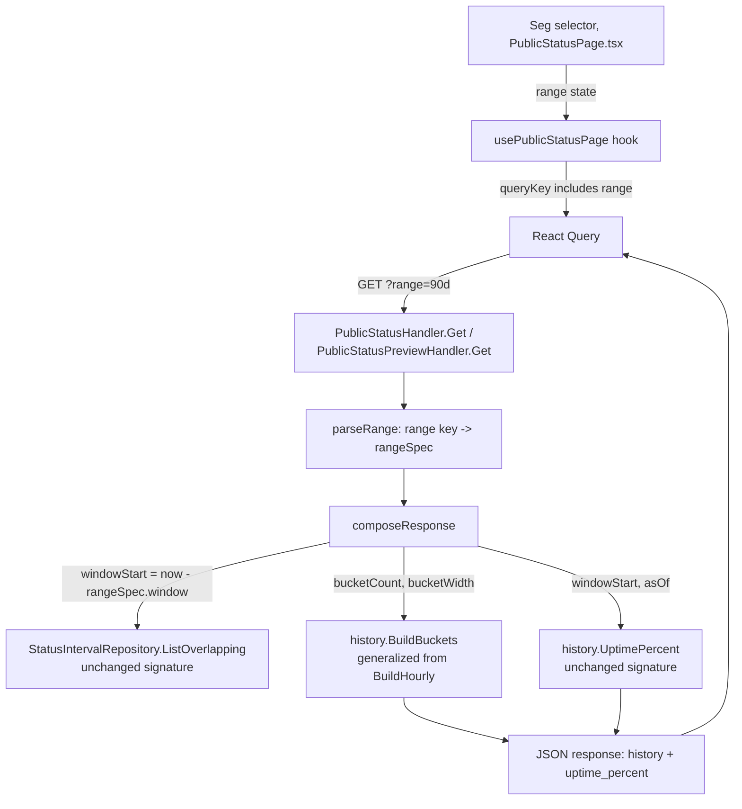

# Public Status Time-Range Selector Design

**Spec**: `.specs/features/public-status-time-range-selector/spec.md`
**Status**: Draft

---

## Architecture Overview

One new query parameter (`range`) flows from the frontend selector through both public-status HTTP handlers into a generalized bucketing function. No new tables, no new endpoints, no new background jobs - the shape of the existing pipeline (`services + status_intervals` → bucketed history + uptime %) is unchanged; only the window size and bucket width become parameters instead of the hardcoded 24h/1h pair.



---

## Approach Exploration

**Recommended: Approach A - generalize the existing bucketing function, one endpoint, one query param.**

| Approach | Description | Trade-off |
| --- | --- | --- |
| **A (recommended)** | Generalize `BuildHourly` into `BuildBuckets(intervals, now, asOf, loc, bucketCount, bucketWidth)`; existing 24h/1h behavior becomes the `bucketWidth = 1h` case. One `range` query param on the existing endpoints selects a `{window, bucketWidth, bucketCount}` triple. | Requires reworking `internal/history/hourly_test.go` around the new signature (mechanical, not risky - see Risks & Concerns). In exchange: zero duplicated bucketing logic, zero duplicated worst-status-wins rule, zero new endpoints/response shapes to keep in sync. |
| **B** | Leave `BuildHourly`/the 24h path untouched; add a second, parallel function + response shape (e.g. `BuildDaily`) reached only for the 7d/30d/90d tiers via a separate code path. | Lower short-term risk to the existing 24h behavior (nothing about it changes), but duplicates the worst-status-wins bucket-resolution rule and the response DTO shape in two places - any future fix to one (like the `asOf` stall-clamp, H7) has to be remembered and applied to both, or they silently diverge. Rejected: violates "reuse is king" for no real safety gain, since Approach A's generalization is a strict superset (1h is just one instance of a variable bucket width) and is unit-testable in isolation before it ever touches the handler. |
| **C** | Always fetch a fixed 90-day window at 1h granularity from the backend (2160 buckets/service) and let the frontend aggregate coarser buckets client-side in JS for the 7d/30d/90d tiers. | Avoids backend changes to the bucketing function, but ships up to 2160 rows/service on every page load regardless of the selected range, and requires re-implementing the worst-status-wins resolution rule in TypeScript to match Go exactly - a second, JS-side copy of business logic that can drift from the Go original with no compiler/test link between them. Rejected: worse payload size, worse logic-duplication risk than B, for no upside. |

---

## Code Reuse Analysis

### Existing Components to Leverage

| Component | Location | How to Use |
| --- | --- | --- |
| `StatusIntervalRepository.ListOverlapping(ctx, serviceIDs, windowStart, now)` | `internal/db/status_interval_repository.go:145` | **No change.** Already accepts an arbitrary `windowStart` - the query and its supporting index (`idx_status_intervals_service_id_starts_at` on `(service_id, starts_at)`) already scale to a 90-day window the same way they scale to 24h. |
| `history.UptimePercent(intervals, windowStart, asOf)` | `internal/history/uptime.go:29` | **No change.** Already takes an arbitrary `windowStart`; the handler just needs to pass the selected range's `windowStart` instead of the hardcoded 24h one. |
| `history.BuildHourly(intervals, now, asOf, loc, windowHours)` | `internal/history/hourly.go:47` | **Generalize, don't duplicate.** Rename to `BuildBuckets`, replace the implicit "1 hour" unit with an explicit `bucketWidth time.Duration` parameter (see Components below) - `windowHours=24` today is exactly `bucketCount=24, bucketWidth=1h` under the new signature. |
| `Seg` segmented-control component | `web/src/components/ui/Seg.tsx` | **Use as-is, no changes.** Already a controlled `{value, onChange, options}` tab-list component, already the project's established pattern for this exact interaction shape (used for the admin-invite role picker). The range selector is `<Seg options={RANGE_OPTIONS} value={range} onChange={setRange} aria-label="Selecionar período" />` - zero new component code. |
| `useQuery`'s `queryKey` range-inclusion pattern | `web/src/features/public-status/hooks.ts:127` (existing `["public-status-page", id]`) already follows AGENTS.md §5's rule that paginated `queryKey`s must include the page number | **Apply the same rule to `range`.** `["public-status-page", id ?? "production", range]` - this is also what makes the "rapid range switching" edge case (spec Edge Cases) resolve for free: each range gets its own cache entry, so a stale in-flight fetch for a previously-selected range can never overwrite the currently-selected range's rendered data. No extra request-cancellation code needed. |
| `write<Foo>Error` handler-error convention | e.g. `internal/api/email_providers_handler.go:181` (`{"error":"..."}` body, fixed status, `Content-Type: application/json`) | Add `writeInvalidRangeError` following the exact same shape for the new validation error. |

### Integration Points

| System | Integration Method |
| --- | --- |
| `internal/api.PublicStatusHandler.Get` / `PublicStatusPreviewHandler.Get` | Both already share `composeResponse` (the whole point of `AD-008`'s preview-parity guarantee) - both gain a `parseRange(r)` call before invoking it, giving parity for free, same as they already do for `parsePage(r)`. |
| `internal/cli/serve.go`'s `pruneRetention` constant | One-line value change (`35 * 24 * time.Hour` → `95 * 24 * time.Hour`), no signature/interface change - `Pruner`/`intervalDeleter` already take retention as a plain `time.Duration` parameter. |
| `web/src/lib/publicStatus.ts` types + `web/src/features/public-status/hooks.ts`'s `PreviewResponse`/`PreviewService` types | Field rename to match the renamed JSON field (see Data Models) - both files already define the response shape by hand (no codegen), so this is a direct, mechanical rename. |
| `web/src/test/msw/handlers.ts` | Both `/api/public-status` and `/api/status-pages/:id/public-preview` mocks read `?range=` off `request.url` (same `URL(request.url).searchParams` pattern already used for `?page=` in this file) and return a bucket count matching the requested tier - required by AGENTS.md §5 (mocks must mirror the real backend's shape, including query-param-driven behavior, or TypeScript passes while the real backend disagrees at runtime). |

---

## Components

### `history.BuildBuckets` (renamed/generalized from `BuildHourly`)

- **Purpose**: Resolve a status-bucket timeline of arbitrary width/count from raw `status_intervals`, using the existing worst-status-wins rule - unchanged behavior for the `bucketWidth=1h` case, generalized to `6h`/`24h` for the other tiers.
- **Location**: `internal/history/hourly.go` (file kept; consider renaming to `buckets.go` during Tasks since "hourly" no longer describes its scope - naming call left to Tasks, not a spec/design-level decision)
- **Interfaces**:
  - `BuildBuckets(intervals []db.StatusInterval, now, asOf time.Time, loc *time.Location, bucketCount int, bucketWidth time.Duration) []Bucket` - `Bucket` replaces `HourlyBucket` (same two fields: `Start time.Time`, `Status string`)
- **Dependencies**: none beyond what `BuildHourly` already depends on (`db.StatusInterval`, `time`, `statusPriority`) - no new imports.
- **Reuses**: The entire worst-status-wins resolution loop and the `asOf` stall-clamp (H7) logic are untouched; only the two truncation/indexing lines that hardcoded `time.Hour` change to `bucketWidth`. See Tech Decisions for the generalized boundary-alignment formula (verified equivalent to today's behavior when `bucketWidth = 1h`).

### `internal/api` range parsing + spec table

- **Purpose**: Translate the `?range=` query parameter into a `{windowDuration, bucketWidth, bucketCount}` triple, or reject an unrecognized value.
- **Location**: New file `internal/api/time_range.go` (mirrors `pagination.go`'s existing role as a small, focused query-param-parsing file, not folded into `public_status_handler.go` since both `Get` handlers need it and it's a self-contained concern).
- **Interfaces**:
  - `type rangeSpec struct { window time.Duration; bucketWidth time.Duration; bucketCount int }`
  - `parseRange(r *http.Request) (rangeSpec, bool)` - `bool` is `false` only for a present-but-unrecognized `range` value; a missing/empty `range` always resolves to the `24h` default (`true`).
  - `writeInvalidRangeError(w http.ResponseWriter)` - `422`, `{"error":"range must be one of 24h, 7d, 30d, 90d"}`, matching every other validation error in this package (see Tech Decisions on why `422` and not the spec's illustrative "(400)").
- **Dependencies**: `net/http`, `time`.
- **Reuses**: The `write<Foo>Error` convention (see Code Reuse Analysis).

### `PublicStatusHandler.composeResponse` (extended)

- **Purpose**: Same responsibility as today (compose the full public-status JSON for one status page), now parameterized by the selected range instead of a hardcoded 24h window.
- **Location**: `internal/api/public_status_handler.go` (existing file, existing method - signature gains one parameter)
- **Interfaces**:
  - `composeResponse(ctx context.Context, statusPageID string, resolvedPage int, rng rangeSpec) (publicStatusResponse, error)` - both `Get` handlers already call this with `parsePage(r)`; both now also pass `parseRange(r)`'s result.
- **Dependencies**: unchanged (`serviceLister`, `statusIntervalReader`, `publicIncidentLister`, `companySettingsGetter`), plus the new `rangeSpec` type.
- **Reuses**: `ListOverlapping`/`UptimePercent` unchanged (see Code Reuse Analysis); `windowStart := now.Add(-rng.window)` replaces today's `now.Add(-historyWindowHours * time.Hour)`; `history.BuildBuckets(serviceIntervals, now, asOf, h.historyLoc, rng.bucketCount, rng.bucketWidth)` replaces today's `BuildHourly(..., historyWindowHours)` call.

### Frontend: range selector state + fetch wiring

- **Purpose**: Let the visitor pick a range, refetch history for it, and render the right bar count/labels.
- **Location**: `web/src/features/public-status/PublicStatusPage.tsx` (selector UI + local `range` state), `web/src/features/public-status/hooks.ts` (`usePublicStatusPage` gains the `range` param and threads it into the query key + fetch URL).
- **Interfaces**:
  - `usePublicStatusPage(id?: string, range: RangeKey = "24h")` - `RangeKey = "24h" | "7d" | "30d" | "90d"`, a new exported type in `web/src/lib/publicStatus.ts` alongside the existing `PublicServiceStatus` union, following the same pattern.
  - `fetchPublicStatusPage(id, resolvedPage, range)` appends `&range=${range}` to both the production and preview URLs.
- **Dependencies**: `Seg` (see Code Reuse Analysis), the existing `useQuery` setup.
- **Reuses**: `Seg` for the control itself; the existing `queryKey` pattern extended with `range` (see Code Reuse Analysis) for the race-condition edge case; the existing `refetchInterval: 120_000` is unchanged - it keeps polling whatever range is currently selected, not just 24h.

---

## Data Models

### `rangeSpec` (Go, `internal/api/time_range.go`)

```go
type rangeSpec struct {
	window      time.Duration // total lookback window (e.g. 90 * 24h)
	bucketWidth time.Duration // width of one bucket (e.g. 24h)
	bucketCount int           // window / bucketWidth (e.g. 90)
}

var rangeSpecs = map[string]rangeSpec{
	"24h": {window: 24 * time.Hour, bucketWidth: 1 * time.Hour, bucketCount: 24},
	"7d":  {window: 7 * 24 * time.Hour, bucketWidth: 6 * time.Hour, bucketCount: 28},
	"30d": {window: 30 * 24 * time.Hour, bucketWidth: 24 * time.Hour, bucketCount: 30},
	"90d": {window: 90 * 24 * time.Hour, bucketWidth: 24 * time.Hour, bucketCount: 90},
}
```

**Relationships**: Derived entirely from the spec's confirmed tier table (spec.md Assumptions) - not a new decision, a direct transcription. `bucketCount * bucketWidth == window` for every tier (kept as an invariant a unit test should assert, so a future edit to one field can't silently desync from the others).

### `Bucket` (Go, `internal/history`, renamed from `HourlyBucket`)

```go
type Bucket struct {
	Start  time.Time
	Status string
}
```

No field change, name change only (see Tech Decisions on why the rename, not just an alias).

### Response DTO change (Go `internal/api` + TS `web/src/lib/publicStatus.ts`)

`publicServiceResponse.HourlyHistory []publicHourlyStatusResponse` (JSON key `hourly_history`) becomes `publicServiceResponse.History []publicHistoryBucketResponse` (JSON key `history`) - see Tech Decisions for the rationale (the field held only-ever-hourly buckets before; it no longer does, and the old name would actively mislead a consumer of the public JSON about what a "bucket" represents once the visitor selects 7d/30d/90d).

Mirrored on the frontend: `PublicHourlyBucket` → `PublicHistoryBucket` in `web/src/lib/publicStatus.ts`, `hourly_history` → `history` in `PublicServiceStatus`, and the same rename in `hooks.ts`'s hand-written `PreviewService`/`PreviewResponse` types and in `web/src/test/msw/handlers.ts`'s fixtures.

---

## Error Handling Strategy

| Error Scenario | Handling | User Impact |
| --- | --- | --- |
| `range` query param present but not one of `24h`/`7d`/`30d`/`90d` | `parseRange` returns `ok=false`; both `Get` handlers respond `422` via `writeInvalidRangeError` before calling `composeResponse` at all (no partial work, no DB query issued) | Visitor never sees this directly (the frontend only ever sends one of the 4 valid values) - this guards against a malformed/hand-crafted request, consistent with TRS-07. |
| `range` query param missing/empty | Defaults to the `24h` tier, same as today's fixed behavior with no `range` param at all | No visible change from today for any client that doesn't yet know about `range` (e.g. an old cached page, a third-party integration hitting the public JSON directly). |
| Selected range's window predates all of a service's/instance's real data | `BuildBuckets` already renders `NoData` buckets when no interval overlaps a given bucket - unchanged mechanism, now exercised for wider windows too | Visitor sees a partially-filled chart (real data on the right, `no_data` gray on the left) rather than an error - matches spec Edge Cases. |
| Visitor switches ranges rapidly | React Query's per-`queryKey` cache isolation (see Code Reuse Analysis) - no explicit cancellation/abort code needed | The chart shows the most recently *selected* range's data once it resolves, never a stale range's data flashing in over the current selection. |

---

## Risks & Concerns

| Concern | Location (file:line) | Impact | Mitigation |
| --- | --- | --- | --- |
| Public JSON contract change: `hourly_history` field renamed to `history` | `internal/api/public_status_handler.go:96` (`publicServiceResponse.HourlyHistory`) | Any third-party integration reading Vane's public status JSON directly (not through the shipped frontend) breaks silently on this field rename - Vane has no versioned/stable public-API guarantee documented anywhere (README doesn't promise one), but this is still a real, uncoordinated breaking change for any such consumer. | Call it out explicitly in `CHANGELOG.md` under `### Changed` (not buried in `### Added`), the same way `AD-018`'s endpoint-path move (`/` → `/api/public-status`) was called out at the time. No deprecation shim added - the project has no precedent for maintaining dual field names, and this is a young, pre-1.0 OSS project without a stated stability guarantee. |
| `internal/history/hourly_test.go`'s existing tests are written against `BuildHourly`'s exact old signature/name | `internal/history/hourly_test.go` (whole file) | Every existing test in this file needs updating to call `BuildBuckets` with an explicit `bucketWidth`, not just a rename find-replace, since the function's very shape changes (new required parameter). This is real work, not a risk to correctness, but likely the single largest task in the breakdown. | Sized explicitly as its own task in Tasks (not folded silently into the `BuildBuckets` implementation task), with the spec's own boundary-alignment invariant (`bucketWidth=1h` case must produce byte-identical output to today's `BuildHourly` for the same inputs) written as an explicit regression test before any other bucket-width test is added - catches a generalization mistake before it can hide behind a passing 6h/24h test. |
| Frontend's leftmost/rightmost axis labels ("24h atrás" / "agora") are a hardcoded literal string today | `web/src/features/public-status/PublicStatusPage.tsx:322` (`<span>24h atrás</span>`) | Easy to miss when generalizing - if left hardcoded, the 7d/30d/90d views would still say "24h atrás" under a 28/30/90-bar chart, actively misleading. | Called out explicitly as its own AC-traceable task (not assumed to be swept up by "wire the selector") - a small lookup table (`{ "24h": "24h atrás", "7d": "7 dias atrás", "30d": "30 dias atrás", "90d": "90 dias atrás" }`) keyed by the same `RangeKey` the selector already tracks. |
| `pruneRetention`'s new value (95 days) is a plain Go constant, not surfaced in `.env.example`/README's config table | `internal/cli/serve.go:33` | Consistent with today (35 days isn't documented as configurable either - it's presented as fixed behavior, not a knob) - not a new gap this feature introduces, but worth confirming stays true rather than silently assumed. | No README change needed - `.specs/STATE.md`'s `service-status-intervals` AD already documents the pruner's existence and behavior at a project-memory level; this feature's own AD entry updates that figure, which is the existing pattern for this exact kind of "not user-facing config" constant. |
| `AD-012` (list-pagination convention) says an invalid/missing `?page=` silently clamps to `1`, never a `400`/error | `.specs/STATE.md` `### AD-012` | This design's `range` param behaves differently on invalid input (rejects with `422`) - a reader could reasonably ask "why does this query param follow a different rule than `page`?" | Addressed directly in Tech Decisions below, not left as an unexplained inconsistency - `AD-012` is explicitly scoped to *pagination* params (where "just show page 1" is always a safe, unsurprising fallback); `range` selects between materially different, non-orderable views, where silently substituting a different range than the one requested is more likely to mislead a caller than clamping a page number ever is. |

> No security, auth-boundary, or perf-bottleneck concerns identified - `range` is read-only, unauthenticated-safe (same trust boundary as the rest of this endpoint), and the 90-day query rides an existing index with no new N+1/unbounded-scan shape (see Code Reuse Analysis).

---

## Tech Decisions (only non-obvious ones)

| Decision | Choice | Rationale |
| --- | --- | --- |
| HTTP status for an invalid `range` value | `422 Unprocessable Entity`, not the spec's illustrative "(400)" | Every existing validation error in `internal/api` uses `422` (`writeCompanySettingsValidationError`, `writeInvalidEmailProvider`, etc.) - `grep`-confirmed zero uses of `400` anywhere in the package. `422` is chosen for consistency with that established convention; the spec's "(400)" was illustrative, not a hard requirement, and this is exactly the kind of implementation-time precision correction the closure gate anticipates. Spec's AC text (TRS-07) will be read as "SHALL reject it (422)" going forward - noted here rather than silently diverging. |
| Query param name and values | `?range=24h\|7d\|30d\|90d` (exact literal strings matching the spec's own tier names) | Self-documenting or nothing - no numeric/enum-index encoding that would need a lookup table to read from a raw URL, and it reads identically in the URL, the Go map key, and the frontend `RangeKey` union, so there's exactly one place tier identity is spelled out. |
| Bucket boundary alignment formula for `bucketWidth` > 1h | `dayStart := midnight(now, loc); elapsed := now - dayStart; currentStart := dayStart + floor(elapsed / bucketWidth) * bucketWidth` | Verified algebraically equivalent to today's `BuildHourly` truncation (`time.Date(Y,M,D,H,0,0,0,loc)`) for the `bucketWidth = 1h` case - both truncate `now` to the start of the current clock-hour. For `6h`, this aligns bucket boundaries to 00:00/06:00/12:00/18:00 local time; for `24h`, `elapsed` is always `< 24h` so `currentStart` always lands exactly on local midnight, giving the "today so far" partial bucket the same treatment `BuildHourly` already gives "this hour so far." No new dependency, no floating-point involved (`time.Duration` integer division only). |
| Response field rename (`hourly_history` → `history`) instead of adding a new field alongside the old one | Rename, no dual-field compatibility shim | Per `AGENTS.md`'s general guidance against backwards-compatibility shims when the code can just change - this project has precedent for renaming/moving public response shape when the old name stops accurately describing the data (`AD-018` moved the entire public-status payload from `/` to `/api/public-status`). Flagged as a real, uncoordinated breaking change in Risks & Concerns above; accepted rather than carrying two field names indefinitely for a project with no stated API-stability guarantee. |
| `range` param rejects on invalid input instead of clamping to a default, unlike `AD-012`'s pagination convention | Reject (`422`) | See Risks & Concerns row on `AD-012` above - `page` and `range` are different shapes of parameter (an ordered scalar with an always-safe fallback vs. an enum selecting between materially different views), so applying pagination's silent-clamp convention here isn't actually following precedent correctly, it's misapplying an unrelated one. Not proposed as a supersession of `AD-012` - `AD-012` remains correct and unchanged for pagination params. |
| `pruneRetention` stays a Go constant, not promoted to an env var/`config.Config` field | No new configuration surface | Not requested (spec's Out of Scope doesn't mention configurability), and every other retention-adjacent constant in this codebase (`incidentRetentionDays`, `publicResolvedIncidentsPageSize`) is likewise a plain constant, not env-driven - consistent with the existing pattern, avoids adding a knob nobody asked for (YAGNI). |

> **Project-level decision to record:** the `range`-vs-`page` validation-behavior distinction above is worth a short addendum to `.specs/STATE.md`'s `AD-012` once this feature is approved for Execute, so a future reader of `AD-012` isn't left wondering why this feature "violates" it - not a supersession, a clarifying addendum. Deferred to the `memory.md` step at the end of Execute, not done speculatively now before the design itself is approved.

---

## Tips (not part of the artifact - process note for this session)

Design is now ready for your review. Once approved, next step is Tasks (breakdown into atomic, one-commit-each steps) - this feature's component list above sizes to roughly 8-10 tasks across 3 natural phases (backend bucketing/handler, retention constant, frontend selector+types+MSW), which is right at the sub-agent-delegation threshold (~7 tasks/batch) - Tasks will make the actual call once the real step count is known.
