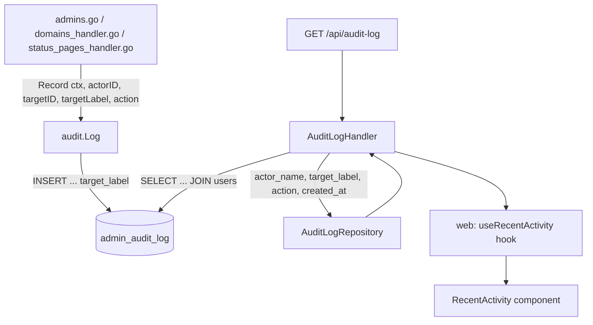

# Recent Team Activity Design

**Spec**: `.specs/features/recent-team-activity/spec.md`
**Context**: `.specs/features/recent-team-activity/context.md` (discuss decisions — locked, not re-litigated here)
**Status**: Approved

---

## Architecture Overview

Write path: the 8 existing `audit.Log.Record` call sites gain a `targetLabel` argument, sourced from data already (or now newly) in scope at each site. Read path: a new handler queries `admin_audit_log` joined to `users` for the actor's current name, capped/ordered/limited, returned as a small DTO. Frontend: `RecentActivity` swaps its hardcoded array for a `useQuery` against the new endpoint.



---

## Code Reuse Analysis

### Existing Components to Leverage

| Component | Location | How to Use |
| --- | --- | --- |
| `audit.Log` | `internal/audit/log.go` | Extend `Record`'s signature in place — same struct, same callers, one new parameter. |
| `TenantInviteRepository.Refresh`'s `RETURNING` pattern | `internal/db/tenant_invites.go:146` | Copy the exact shape for `Cancel` (currently `error`-only) so it returns the canceled invite. |
| Tenant-scoped RLS on `admin_audit_log` | `internal/db/migrations/0024_multi_tenancy_core.up.sql:259-261` | Already enforces tenant isolation on this table — the new read query needs no additional application-level tenant filter, only to run inside the normal tenant-scoped connection every other handler already uses. |
| `parsePage`-style query-param defaulting | `internal/api/*.go` (`Page[T]` envelope, AD-012) | Apply the same "invalid/out-of-range input silently falls back to a safe default" posture to `limit` (default 5, hard cap 20) instead of inventing a new validation style. |
| Shared `Skeleton` primitive | `web/src/components/ui/Skeleton.tsx` (loading-skeletons feature) | `RecentActivity`'s loading state reuses it directly — no new placeholder component. |
| Billing's "unrecognized enum renders verbatim, never crashes" precedent | `web/src/features/billing/BillingPage.tsx` (`tenant.plan`) | Same posture applied to an unrecognized `action` string via the generic fallback phrase. |

### Integration Points

| System | Integration Method |
| --- | --- |
| Postgres (`admin_audit_log`) | New nullable `target_label TEXT` column, migration `0037_audit_log_target_label` |
| `internal/api` router | New route `GET /api/audit-log`, no role gate (any authenticated session) |
| `web` React Query | New `useRecentActivity()` hook, `queryKey: ["audit-log", limit]` |

---

## Components

### `audit.Log` (extended, not new)

- **Purpose**: Persist an audit entry including a human-readable target label.
- **Location**: `internal/audit/log.go`
- **Interfaces**:
  - `Record(ctx context.Context, actorID, targetID, targetLabel, action string) error` — `targetLabel` may be an empty string (never a Go `nil`, since the column accepts `NULL` at the DB level for empty string too — the repository layer converts `""` to SQL `NULL` on insert, matching how other nullable-text columns in this codebase are already handled, e.g. `AdminInvite.Phone`'s `nilIfEmpty` helper).
- **Dependencies**: `db.Pool`
- **Reuses**: Its own existing `Record` method, extended in place — no new type.

### `AuditLogRepository` (new)

- **Purpose**: Read the tenant's most recent audit entries with the actor's current name resolved.
- **Location**: `internal/db/audit_log_repository.go`
- **Interfaces**:
  - `ListRecent(ctx context.Context, limit int) ([]AuditLogEntry, error)` — `SELECT a.action, a.target_label, a.created_at, COALESCE(u.name, '') AS actor_name, (u.id IS NULL) AS actor_deleted FROM admin_audit_log a LEFT JOIN users u ON u.id = a.actor_id ORDER BY a.created_at DESC LIMIT $1` (RLS on `admin_audit_log` already scopes this to the caller's tenant; `users` carries no tenant column — a `LEFT JOIN` is safe since `actor_id` was written by an actor whose action was itself already tenant-scoped at write time).
- **Dependencies**: `db.Pool`
- **Reuses**: The existing `admin_audit_log` table and its RLS policy; no new table.

### `AuditLogEntry` (new, `internal/db` package type)

```go
type AuditLogEntry struct {
    Action       string
    TargetLabel  *string // nil for historical pre-feature rows
    ActorName    string  // resolved name, or "" when the actor's user row is gone
    ActorDeleted bool
    CreatedAt    time.Time
}
```

### `AuditLogHandler` (new)

- **Purpose**: `GET /api/audit-log?limit=N` — any authenticated role, no role gate.
- **Location**: `internal/api/audit_log_handler.go`
- **Interfaces**:
  - `Get(w http.ResponseWriter, r *http.Request)` — parses `limit` (default 5, invalid/≤0 → 5, >20 → 20), calls the repository, maps each row to a JSON entry with a locale-agnostic `actor_name` (`"Usuário removido"`/`"Removed user"` substitution happens client-side via i18n, NOT server-side — the server returns a stable `actor_deleted: bool` flag plus whatever name it has, keeping locale decisions in the frontend where every other i18n string already lives).
- **Dependencies**: `AuditLogRepository`
- **Reuses**: This codebase's existing plain-JSON-array response shape for small, non-paginated lists (this endpoint is deliberately NOT wrapped in the `Page[T]` envelope — AD-012 applies to actual paginated list *screens*; this is a fixed-size summary feed with a hard cap, closer to `GET /api/overview`'s own non-paginated shape).

### `useRecentActivity` (new, frontend hook)

- **Purpose**: Fetch `GET /api/audit-log?limit=5`.
- **Location**: `web/src/features/overview/hooks.ts` (new file, or added to an existing overview-scoped hooks file if one exists)
- **Interfaces**: `useRecentActivity(): UseQueryResult<AuditLogEntry[]>`
- **Dependencies**: `apiFetch`, React Query
- **Reuses**: Existing `useQuery` + `apiFetch` pattern every other feature hook already follows.

### `RecentActivity` (modified, not new)

- **Purpose**: Render the last 5 real audit entries instead of the mock array.
- **Location**: `web/src/features/overview/OverviewPage.tsx`
- **Interfaces**: No props change (still a zero-prop internal component).
- **Dependencies**: `useRecentActivity`, `Skeleton`, i18n action-phrase map (new `web/src/features/overview/activityPhrases.ts` or inline in the component — small enough either way, decided at Execute time).
- **Reuses**: `Skeleton` (loading), the page's existing error-row visual pattern (error), `t()` i18n calls.

---

## Data Models

### `admin_audit_log` (migration `0037_audit_log_target_label`)

```sql
ALTER TABLE admin_audit_log ADD COLUMN target_label TEXT;
```

No index needed — the table is already read by `created_at DESC LIMIT N`, and `created_at` has no existing index either (table is small: append-only, admin actions are low-frequency). Out of scope to add one now; flagged below as a deferred concern if this ever becomes a hot path.

**Relationships**: `actor_id` and `target_id` both reference `users`/other entities loosely (no FK, by original design — `internal/audit/log.go`'s existing doc comment: "There is no cascade delete tying rows here to the users table"). `target_label` has the same "no FK, survives deletion" property by design (that is the entire point of the discuss decision).

---

## Error Handling Strategy

| Error Scenario | Handling | User Impact |
| --- | --- | --- |
| `GET /api/audit-log` with no session | `401`, same as every other authenticated endpoint | Redirected to login by the existing app-wide 401 handling |
| `limit` param invalid/≤0/non-numeric | Silently defaults to 5 | No error shown — request just uses the default |
| `limit` param > 20 | Silently capped to 20 | No error shown |
| Actor's user row hard-deleted | `actor_deleted: true`, empty `actor_name` from the repository; frontend substitutes the localized "Removed user" placeholder | Entry still renders, just with a generic actor label |
| `target_label` is `null` (pre-feature historical row) | Frontend phrase mapping omits the target clause gracefully per-action | Entry renders as a slightly shorter phrase, never `"null"`/`"undefined"` literal text |
| Unrecognized `action` string (future call site added without updating the i18n map) | Frontend falls back to the generic phrase | Entry still renders, generic wording instead of a tailored one |
| Repository query fails (DB error) | Handler logs server-side, returns `500` with the codebase's standard fixed generic body (AGENTS.md §4 — never leak `err.Error()`) | Card shows its existing error-row pattern |

---

## Risks & Concerns

| Concern | Location (file:line) | Impact | Mitigation |
| --- | --- | --- | --- |
| `TenantInviteRepository.Cancel`'s signature change is a breaking change to an existing method | `internal/db/tenant_invites.go:173` | Any other caller of `Cancel` (currently only `admins.go:508`, confirmed via grep) must be updated in the same commit, or the build breaks | Task-level: update both the repository and its one call site atomically in the same task; `go build ./...` gate catches any missed caller immediately (compile error, not a silent runtime gap) |
| `removed`/`domain_deleted`/`status_page_deleted` label capture must happen strictly before their respective delete call | `admins.go:668` (`h.users.Delete`), `domains_handler.go` delete call, `status_pages_handler.go` delete call | Reordering incorrectly silently produces an empty label forever (not a crash — a quiet correctness bug that would only surface as "why is this row unlabeled" much later) | Each call site's task explicitly states the ordering requirement (spec AC4); the Verifier's discrimination sensor should include a mutation that reorders one of these three to confirm a test catches it |
| No index on `admin_audit_log(created_at)` | `internal/db/migrations/0011_admin_audit_log.up.sql` | `ORDER BY created_at DESC LIMIT N` degrades to a full table scan as the table grows | Table is currently small and append-only at a low rate (8 action types, admin-triggered only, not a per-request hot path) — deferred, not addressed by this feature; flagged here for a future feature if the table's growth ever makes it relevant |
| New endpoint is NOT wrapped in the `Page[T]` envelope (AD-012) | `internal/api/audit_log_handler.go` (new) | A future engineer might assume every list endpoint uses `Page[T]` and be surprised | Documented explicitly in this design's Components section and will be documented again in the endpoint's own doc comment at Execute time — same precedent `email-providers`' `active_provider` endpoint already set for "not every list is `Page[T]`" |

---

## Tech Decisions (only non-obvious ones)

| Decision | Choice | Rationale |
| --- | --- | --- |
| Actor name resolution: live join vs. snapshot | Live join (not a label column like `target_label`) | Actors are the currently-authenticated user performing the action — essentially never deleted mid-session, and a live name (reflecting a rename) is more accurate than freezing it; asymmetric treatment from `target_label` is deliberate, not an oversight (documented in spec.md's Assumptions table). |
| Endpoint response shape | Plain JSON array, not `Page[T]` | This is a fixed-size (≤20), non-paginated summary feed, not a browsable list screen — `Page[T]` (AD-012) is for the latter. |
| `target_label` nullability | Nullable, no default, no backfill | Historical rows genuinely have no label source to derive one from; `NULL` is the honest representation of "unknown", not a fabricated placeholder. |

---
