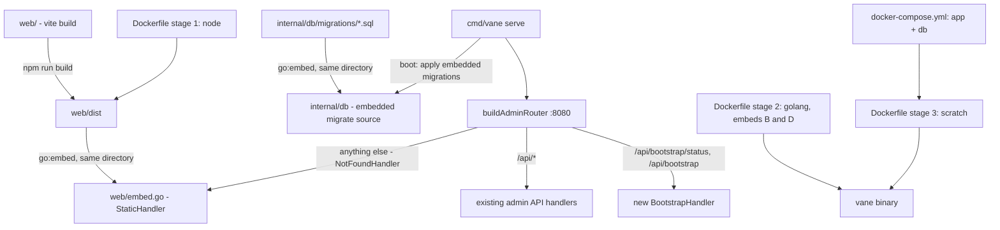

# Self-Hosted Docker + Admin Bootstrap Design

**Spec**: `.specs/features/self-hosted-docker-bootstrap/spec.md`
**Status**: Approved

---

## Reference Implementation

Per the user's explicit instruction, this design mirrors `baas/zeep-orbit`'s already-working Docker/Compose/bootstrap setup rather than inventing an independent one. Inspected directly (not from memory):

- `zeep-orbit/Dockerfile` - two `--platform=$BUILDPLATFORM` build stages (frontend, then Go cross-compiling via `GOARCH=$TARGETARCH`), `FROM scratch` final stage, `ENTRYPOINT`/`CMD` split.
- `zeep-orbit/docker-compose.yml` - `app` + `db` services, `depends_on: condition: service_healthy`, `restart: on-failure`, one named volume for Postgres data.
- `zeep-orbit/Makefile` - `build: dashboard-build` then `go build`, mirrored here as `build: web-build` then `go build`.
- `zeep-orbit/README.md`'s "Docker Compose" quick-start section shape.
- `zeep-orbit/internal/dashboard/embed.go` - `//go:embed static`, `fs.Sub`, open-or-fallback-to-`index.html` static handler.
- `zeep-orbit/internal/dashboard/store.go`'s `IsBootstrapped`/`BootstrapFirstSuperadmin` - table-level lock (`LOCK TABLE ... IN EXCLUSIVE MODE`), not `SELECT ... FOR UPDATE` (empty table has no rows to lock).
- `zeep-orbit/.gitignore` (`internal/dashboard/static/` fully ignored) and its CI workflows (frontend build always runs before the Go build/test step) - the accepted "must build once" convention this feature also adopts, per the spec's revised assumption.

Where Vane's own constraints differ (real file-based migrations via `golang-migrate`, which Orbit's dynamic BaaS schema provisioner has no equivalent of; a dedicated public TLS listener for status pages, which Orbit doesn't have), this design makes the narrowest addition needed and says so explicitly rather than forcing a false parallel.

---

## Architecture Overview

---

## Approach Exploration

**Recommended: mirror the reference implementation's layout and mechanisms directly (below), adapted only where Vane has no Orbit equivalent.**

Since the user's instruction removes the usual "2-3 approaches" exploration for the parts Orbit already answers (embed layout, compose shape, bootstrap race protection), exploration here is scoped to the one place Vane has no Orbit precedent: **how migrations get applied inside the container.**

| # | Approach | How it works | Trade-off |
| --- | --- | --- | --- |
| **A (recommended)** | `vane serve` applies embedded migrations itself, once, before starting any listener. | Matches the DX Orbit's `CMD ["serve"]` already delivers (one command, nothing else to run) - the closest available mirror of "already works," since Orbit has no migration step to imitate directly. Embedded via `go:embed migrations` in `internal/db` (same directory, no path-traversal issue) + `golang-migrate`'s `source/iofs` (already an indirect dependency of the `golang-migrate/v4` module already in `go.sum`, no new dependency). | `vane serve` gains a new startup responsibility it didn't have before; mitigated by keeping the existing `db.MigrateUp(dsn, dir string)` (disk-path based) untouched for the CLI (`vane migrate up`) and all 37 existing test call sites - this is a new, additive function, not a signature change. |
| B | A separate init step in `docker-compose.yml` (a one-shot `migrate` service running `vane migrate up` before `app` starts). | Explicit, inspectable step. Rejected: Orbit's compose has no equivalent extra service, and the user asked for the same command shape Orbit already has - adding a step Orbit doesn't need contradicts "mesmo que já funciona." Also reintroduces the disk-path migrations directory into the runtime image, which the `FROM scratch` final stage doesn't have (nothing to copy the `migrations/` folder from without adding it back). |
| C | Migrate lazily on first request via middleware. | Rejected outright - unpredictable latency on cold start, and migrating from inside a request handler that might be one of several concurrent requests reintroduces exactly the race-safety question `golang-migrate`'s own locking already solves for a single, explicit call site. No project precedent for this pattern anywhere in the codebase. |

Approach A is chosen.

---

## Code Reuse Analysis

### Existing Components to Leverage

| Component | Location | How to Use |
| --- | --- | --- |
| `AdminRepository.CountActiveOwners(ctx, tx)`'s pattern of a tx-scoped, repository-owned lock method | `internal/db/admin_repository.go:179` | Not reused directly (that method's `FOR UPDATE` subquery locks *existing* rows - useless on an empty table), but its existence confirms this codebase already has a convention of a repository method taking `pgx.Tx` for a caller-managed transaction. The new `BootstrapFirst` method follows that same convention, using `LOCK TABLE admins IN EXCLUSIVE MODE` (Orbit's technique) instead. |
| `auth.HashPassword` / `auth.IssueSession` / the private `sessionCookie(...)` helper | `internal/auth/password.go`, `internal/api/auth_handler.go` | Reused as-is by the new `BootstrapHandler` - same hashing, same session-issuing, same cookie shape AD-004 already mandates. No new auth primitive needed. |
| `AcceptInvite`'s request/response/error-body shape (`{"error": "..."}`, `writeAdminError`-equivalent inline JSON) | `internal/api/admins.go` | Style reused for `BootstrapHandler`'s request/response/error bodies - not the handler itself (bootstrap is public and self-logs-in; invite-accept is public but doesn't auto-login, a deliberate difference already captured in spec Assumptions). |
| `router.New(pool)` base + `buildAdminRouter`'s existing route-registration pattern | `internal/router/router.go`, `internal/cli/routes.go` | The two new public bootstrap routes register the same way every other public route already does (`r.Get(...)`, `r.Post(...)`, no auth middleware) - no new routing mechanism. |
| `time/tzdata` blank-import precedent for "embed what a minimal container can't assume is on the host" | `cmd/vane/main.go` | Same reasoning extended to the SPA and migrations: a minimal (`FROM scratch`) image can't assume anything is on disk beyond the binary itself. |
| `web/src/routes/RequireRole.tsx`'s `Navigate`-based guard pattern | `web/src/routes/RequireRole.tsx` | The new bootstrap-redirect logic in `App.tsx` follows the exact same shape (`if (status === "loading") return null; if (<condition>) return <Navigate to="..." replace />`). |
| `AuthProvider`'s boot-time `useEffect` + reducer pattern | `web/src/auth/AuthProvider.tsx` | Extended (not replaced) with one more boot-time fetch (`GET /api/bootstrap/status`) alongside the existing `GET /api/auth/me` call, exposing `needsBootstrap: boolean` next to the existing `status`. |

### Integration Points

| System | Integration Method |
| --- | --- |
| `internal/db` | New `migrations_embed.go` (`//go:embed migrations`, `var MigrationsFS embed.FS`) + new `MigrateUpEmbedded(dsn string) error` using `source/iofs`. New `AdminRepository.BootstrapFirst(ctx, admin *Admin) (created bool, err error)`. |
| `web/` | New `embed.go` (`//go:embed dist`, `package web`, `func StaticHandler() http.Handler`) - placed directly in `web/` (sibling of `dist/`) because `go:embed` patterns cannot traverse `..`, the same constraint that shaped Orbit's own `internal/dashboard/embed.go` placement. |
| `internal/cli/serve.go` | Calls `db.MigrateUpEmbedded(cfg.DatabaseURL)` right after the pool is created, before building any router or starting any listener. |
| `internal/cli/routes.go` | `buildAdminRouter` registers `r.Get("/api/bootstrap/status", ...)` / `r.Post("/api/bootstrap", ...)` alongside the other public routes, and sets `r.NotFound(web.StaticHandler())` as the last thing before returning. |
| `internal/api` | New `bootstrap_handler.go` (`BootstrapHandler`, mirroring `AuthHandler`'s shape). |
| `web/src` | New `BootstrapPage.tsx`, `AuthProvider` gains `needsBootstrap`, `App.tsx` gains the `/bootstrap` route + redirect guards. |
| `Dockerfile`, `docker-compose.yml`, `Makefile`, `README.md` | New/edited files at the repo root, structured per the Reference Implementation section above. |

---

## Components

### `web` package (new Go package, lives in the existing `web/` directory)

- **Purpose**: Embed the built SPA and serve it with client-route fallback, exactly mirroring `zeep-orbit`'s `internal/dashboard` static-serving shape.
- **Location**: `web/embed.go` (new - the only `.go` file in a directory that otherwise holds the npm project; Go tooling ignores non-`.go` files, so this is not a layout conflict)
- **Interfaces**:
  - `StaticHandler() http.Handler` - serves an exact embedded asset when the request path matches one, otherwise serves `index.html` (client-side routing fallback), otherwise (path starts with `/api/`) writes a plain JSON 404 rather than falling back to `index.html` (SHD-05).
- **Dependencies**: `embed.FS` populated by `//go:embed dist` at build time.
- **Reuses**: Same `fs.Sub` + "try open, else serve index.html" shape as `zeep-orbit/internal/dashboard/embed.go`'s `StaticHandler`.

### `internal/db` migrations-embed addition

- **Purpose**: Let the container apply migrations without any migration file present on the runtime image's disk.
- **Location**: `internal/db/migrations_embed.go` (new)
- **Interfaces**:
  - `MigrationsFS embed.FS` (package-level var, `//go:embed migrations`)
  - `MigrateUpEmbedded(dsn string) error` - same idempotency contract as the existing `MigrateUp` (ErrNoChange is a no-op, not a failure), but sourced from `iofs.New(MigrationsFS, "migrations")` instead of `file://`.
- **Dependencies**: `golang-migrate/v4/source/iofs` (already available transitively via the existing `golang-migrate/v4` dependency - confirmed in `go.sum`, no new module).
- **Reuses**: The existing `MigrateUp`'s error-handling shape (`errors.Is(err, migrate.ErrNoChange)`), copied not shared, since the two functions differ only in their `migrate.NewWith...` source construction.

### `BootstrapHandler`

- **Purpose**: Serve the two public bootstrap routes.
- **Location**: `internal/api/bootstrap_handler.go` (new)
- **Interfaces**:
  - `Status(w, r)` - `GET /api/bootstrap/status` → `{"bootstrapped": bool}` (SHD-14 naming mirrors Orbit's `{"bootstrapped": ok}` shape exactly).
  - `Create(w, r)` - `POST /api/bootstrap` → on success, sets the session cookie and returns the same shape `Login` returns (`{"token": "..."}`, or the `meResponse` shape - pinned during Tasks to whichever the frontend's post-bootstrap redirect actually needs, most likely `meResponse` since the SPA's next step is the authenticated app, not another `/api/auth/me` round-trip). On an already-bootstrapped database, returns `409` with `{"error":"already bootstrapped"}` (SHD-15/16, byte-for-byte matching Orbit's error body).
- **Dependencies**: `AdminRepository.BootstrapFirst`, `auth.HashPassword`, `auth.IssueSession`, the private `sessionCookie` helper (same package, no export needed).
- **Reuses**: `AuthHandler.Login`'s cookie-setting call shape, `AcceptInvite`'s request-body validation shape (`req.Password == ""` → 422).

### `AdminRepository.BootstrapFirst`

- **Purpose**: Race-safe "create the first admin, or refuse if one already exists."
- **Location**: `internal/db/admin_repository.go` (extended)
- **Interfaces**:
  - `BootstrapFirst(ctx context.Context, admin *Admin) (created bool, err error)` - opens a transaction, `LOCK TABLE admins IN EXCLUSIVE MODE`, counts, inserts only if the count is zero, commits; returns `created=false, err=nil` (not an error) when another admin already exists, mirroring Orbit's `BootstrapFirstSuperadmin`'s `(false, nil)` return for that case - the caller (`BootstrapHandler.Create`) is what turns `created=false` into the 409 response.
- **Dependencies**: `*db.Pool` (`pool.Begin(ctx)`).
- **Reuses**: Orbit's exact lock statement and count-then-insert shape (`internal/dashboard/store.go:136-162`), adapted to `admins`' existing columns (`email`, `password_hash`; `role` keeps its `owner` column default, unchanged from every other admin-creation path in this codebase).

### Frontend: `BootstrapPage` + `AuthProvider` extension

- **Purpose**: Show the first-run form; gate routing on whether bootstrap is needed.
- **Location**: `web/src/features/auth/BootstrapPage.tsx` (new), `web/src/auth/AuthProvider.tsx` (extended), `web/src/App.tsx` (extended)
- **Interfaces**:
  - `AuthContextValue` gains `needsBootstrap: boolean` (three-state internally alongside `status`, but exposed as a plain boolean once the boot fetch resolves - `false` during the loading window, matching how `RequireAuth` already treats `status === "loading"` as "render nothing yet").
  - `App.tsx`'s `<Routes>` gains `<Route path="/bootstrap" element={<BootstrapPage />} />`, guarded the same direction both ways: `needsBootstrap && path !== "/bootstrap"` → redirect to `/bootstrap`; `!needsBootstrap && path === "/bootstrap"` → redirect to `/login` (SHD-21).
- **Dependencies**: `apiFetch` (existing), the existing `AuthProvider` boot `useEffect`.
- **Reuses**: `LoginPage`'s form-layout conventions (desktop/mobile brand blocks, `useBrandLogoUrl`), `RequireRole.tsx`'s `Navigate`-based guard shape.

---

## Data Models

No new table. `AdminRepository.BootstrapFirst` writes to the existing `admins` table with its existing columns and existing `role` column default (`'owner'`, from migration `0009_admin_role_and_revocation`) - no schema change.

---

## Error Handling Strategy

| Error Scenario | Handling | User Impact |
| --- | --- | --- |
| `POST /api/bootstrap` when an admin already exists | `BootstrapFirst` returns `created=false, err=nil`; handler writes `409 {"error":"already bootstrapped"}` | SPA shows an inline error and (per SHD-21's guard) the visitor is redirected to `/login` on next boot check |
| Two concurrent `POST /api/bootstrap` requests, zero admins | `LOCK TABLE ... IN EXCLUSIVE MODE` serializes the two transactions; the second sees `count > 0` after acquiring the lock and returns `created=false` | Exactly one request succeeds; the loser gets the same 409 as the "already exists" case, not a 500 or a duplicate owner |
| Container starts before Postgres is ready | Compose's `depends_on: condition: service_healthy` delays `app`'s start entirely - the app process never even attempts to connect prematurely | No user-visible error; `docker compose up` just waits |
| `MigrateUpEmbedded` fails (e.g. a broken migration file - shouldn't happen since the same files are tested via `MigrateUp` in CI, but the embedded copy is compiled from the same source tree) | `serve`'s `RunE` returns the error immediately, before any listener starts; `os.Exit(1)` via `main.go`'s existing error path | Container exits non-zero; compose reports `app` unhealthy/exited, visible in `docker compose ps` |
| A request path matches nothing (`NotFoundHandler`) and starts with `/api/` | `web.StaticHandler()` writes a plain `404 {"error":"not found"}` instead of `index.html` | An unknown API route still reads as an API error, not an HTML page, to any API client |

---

## Risks & Concerns

| Concern | Location (file:line) | Impact | Mitigation |
| --- | --- | --- | --- |
| `go:embed` cannot use `..` in its pattern, so the embedding file must live inside (or at) the directory being embedded. | N/A (architectural constraint, not existing code) | A naively-placed `internal/web/embed.go` with `//go:embed ../../web/dist` would fail to compile. | Design places the embedding file at `web/embed.go` itself (sibling of `dist/`), exactly mirroring why Orbit's own `embed.go` lives inside `internal/dashboard/` next to `static/` rather than somewhere more "conventional." Flagging here so Tasks doesn't silently pick the wrong location. |
| `internal/cli/routes.go`'s `buildAdminRouter` currently has no `r.NotFound(...)` override - adding one is new behavior on a function every existing admin-API test already exercises. | `internal/cli/routes.go` (current file, no line number yet for new code) | If the new `NotFound` handler is registered before all `/api/*` and `/uploads/*` routes, chi could still dispatch correctly (chi resolves the most specific registered route first regardless of `NotFound` registration order) - but confirm this explicitly with a test, since a subtle chi-mounting mistake here would make an existing API route silently return the SPA's `index.html` instead of JSON. | Task-level test: hit a real, existing API route through the *production* router (not a bare handler) and assert it still returns its normal JSON shape after `NotFound` is wired in - the same "test the real router, not a hand-rolled one" lesson `status-page-domain-attach`'s Verifier already forced onto this codebase once. |
| `vane serve` gaining an auto-migrate step changes existing behavior for anyone running the binary directly (not via Docker) who previously ran `vane migrate up` as a separate, deliberate step. | `internal/cli/serve.go` | A non-Docker operator's mental model of "migrate is explicit" changes to "serve also migrates." | Not mitigated by hiding it - `RunE` should log at `Info` level that it applied N migrations (or zero) before continuing, so the behavior is visible, not silent. Existing `vane migrate up` CLI command is kept working unchanged for anyone who still wants the explicit step (e.g. running it once before a blue-green deploy). |
| Bootstrap's public `POST /api/bootstrap` is unauthenticated by definition (that's the whole point) - it is reachable at any time, not just "first boot," until an admin exists. | `internal/api/bootstrap_handler.go` (new) | If an operator's Postgres is somehow reachable before they've had a chance to bootstrap (e.g. exposed on a network before firewall rules land), anyone who gets there first becomes the owner. | Not a new risk introduced by this feature - `POST /api/admins/invite/{token}/accept` is already public-by-design for the same structural reason (no authenticated caller can exist yet for the very first admin). Documented, not solved differently than the existing invite-accept endpoint already accepts. |

---

## Tech Decisions

| Decision | Choice | Rationale |
| --- | --- | --- |
| Embedding file location for the SPA | `web/embed.go`, not a new `internal/...` package | Forced by `go:embed`'s no-`..`-traversal rule; also the exact reason Orbit's own embed file lives where it does. |
| Migrations: new function vs. changed signature | New `MigrateUpEmbedded(dsn string)`, existing `MigrateUp(dsn, dir string)` untouched | Changing `MigrateUp`'s signature would touch all 37 existing call sites for no requirement-driven reason - surgical addition instead. |
| Bootstrap race protection | `LOCK TABLE admins IN EXCLUSIVE MODE` inside a transaction | Mirrors Orbit's already-working, already-battle-tested technique for this exact "empty table" race; `SELECT ... FOR UPDATE` (this codebase's own `CountActiveOwners` pattern) does not apply when there are zero rows to lock. |
| Where migrations apply | Inside `vane serve`'s boot sequence, not a separate compose service | Matches the "one command, it just works" DX Orbit's compose already has - the closest available mirror given Vane, unlike Orbt, has real file-based migrations that need an explicit application step somewhere. |
| SPA fallback mechanism | `chi.Router.NotFound(...)`, not a wildcard route | `NotFound` naturally receives every path that didn't match a real route, including both "real SPA client route" and "typo'd asset path" - one handler, one place, matching chi's own idiom rather than registering a catch-all wildcard route that would need to be last-registered anyway. |

> **Project-level decision to record in `.specs/STATE.md`**: fulfilling AD-001's SPA-embedding promise, plus the "mirror zeep-orbit's deployment conventions" pattern this feature establishes, is worth a new `AD-009` once Execute completes - future features that touch deployment (Helm, k8s, additional static assets) should default to matching Orbit's already-proven shape unless there's a Vane-specific reason not to.

---

## Tasks Preview (why Tasks is not skipped)

This feature touches: a new Go package (`web/embed.go`), a new embedded-migrations path in `internal/db`, a new repository method with its own race-safety test, a new API handler with two routes, `serve.go`/`routes.go` wiring, three new/edited frontend files (`BootstrapPage`, `AuthProvider`, `App.tsx`), and four repo-root deployment files (`Dockerfile`, `docker-compose.yml`, `Makefile`, `README.md`) - well past the "≤3 obvious steps" threshold. A formal `tasks.md` follows this design.
