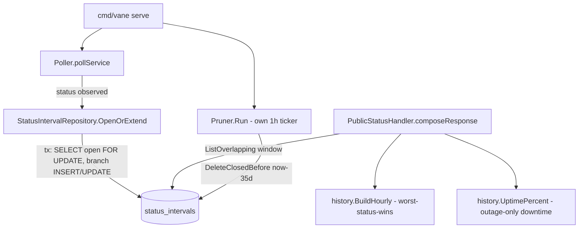

# Service Status Intervals Design

**Spec**: `.specs/features/service-status-intervals/spec.md`
**Status**: Approved

---

## Architecture Overview

`status_snapshots` (one row per poll) is replaced end to end by `status_intervals` (one row per status *change*, open-ended via `ends_at IS NULL` until the next change). The poller's write path becomes read-then-branch instead of blind insert. The public status handler's two read paths (hourly bars, uptime %) both consume the same new query - overlapping intervals for a time window - computed by two new pure functions in `internal/history`. A new, independent ticker prunes closed intervals older than 35 days.



---

## Approach Exploration

**Recommended: A - transactional read-then-branch write, one method.**

| # | Approach | How it works | Trade-off |
| --- | --- | --- | --- |
| **A (recommended)** | `OpenOrExtend` opens a tx, `SELECT ... FOR UPDATE` the service's open interval (if any), then branches: no row → INSERT open; same status → UPDATE `error_budget_remaining`/`last_seen_at` in place; different status → UPDATE `ends_at` on the old row + INSERT a new open row. The unique partial index (`WHERE ends_at IS NULL`) is the safety net if two writers race past the `SELECT`. | One query round-trip more than a blind insert, but it's the exact transactional-lock pattern already used and tested in `status-page-domain-attach` (`AttachDomain`, `SELECT ... FOR UPDATE` chosen explicitly over `UPDATE ... WHERE` for the same reason: distinguishing "doesn't exist" from "already in the state we'd write"). Zero new infrastructure, one new repository method, testable with the same `internal/dbtest` harness already used everywhere else in this codebase. |
| B | Move the branch into a Postgres trigger/function: application always `INSERT`s a raw observation into a thin table, a trigger maintains `status_intervals` automatically. | Removes the read-before-write round trip. Rejected: this codebase has zero triggers or stored procedures anywhere (`grep -r "CREATE TRIGGER\|CREATE FUNCTION" internal/db/migrations/` returns nothing) - introducing one for a single write path is a new maintenance surface (harder to unit test in Go, harder for the next contributor to find) for a performance gain this product's scale (a handful of services polled every 60s, not thousands/sec) doesn't need. |
| C | In-memory cache of each service's current open status inside the `Poller` struct, skip the DB read except on an actual status change. | Rejected: the cache would need to be reconciled against the DB's real open interval on every process start (or `PollerManager.Restart`) to avoid producing a duplicate open interval after a restart mid-status - which reintroduces exactly the read-before-write query this approach was meant to avoid, just moved to startup instead of every poll. No measurable win at this product's poll volume. |

Approach A is chosen. It reuses an established, already-reviewed pattern in this codebase instead of introducing a new one.

---

## Code Reuse Analysis

### Existing Components to Leverage

| Component | Location | How to Use |
| --- | --- | --- |
| `SELECT ... FOR UPDATE` transactional branch pattern | `internal/db/status_page_repository.go` (`AttachDomain`, from `status-page-domain-attach`) | Same shape: lock the row that might-or-might-not exist, branch on what's found, never a blind `UPDATE ... WHERE` that can't distinguish "absent" from "already correct." |
| Unique partial index as a race safety net | `status-page-domain-attach`'s `WHERE domain_id IS NOT NULL` index | Same technique, applied to `WHERE ends_at IS NULL` here - makes "at most one open interval per service" a DB-enforced invariant, not just an application assumption (the exact class of bug `internal/history.hourly.go`'s report flagged OneUptime for needing a repair cron to fix after the fact). |
| `internal/history` package (pure, no I/O, already exists) | `internal/history/hourly.go` | Extended in place: `BuildHourly` changes its input type and bucket-resolution rule; a new `UptimePercent` function is added alongside it. Both stay dependency-free and unit-testable without a DB, per the package's existing doc comment. |
| `time/tzdata` blank import, `America/Sao_Paulo` `*time.Location` already loaded once in `PublicStatusHandler` | `cmd/vane/main.go`, `internal/api/public_status_handler.go:80-84` | No change needed - `BuildHourly` already takes a `*time.Location`; reused as-is. |
| Goroutine + own ticker + `ctx.Done()` shutdown pattern | `internal/poller/poller.go` (`Run`), `internal/cli/serve.go`'s two `go func()` blocks for the HTTP/HTTPS listeners | Same shape for the new `Pruner.Run(ctx)` - own `time.NewTicker`, `select` on `ctx.Done()`/ticker, started in `serve.go`'s `RunE` alongside the poller, canceled by the same `ctx`/`stop()` already wired for graceful shutdown. |
| `internal/dbtest` integration-test harness | used by every existing `*_repository_test.go` | Reused unchanged for `status_interval_repository_test.go`. |

### Integration Points

| System | Integration Method |
| --- | --- |
| `internal/poller/poller.go` | `snapshotCreator` interface (`Create`) is replaced by a `statusIntervalWriter` interface (`OpenOrExtend`); `pollService` calls it once per poll instead of `snapshots.Create`. |
| `internal/api/public_status_handler.go` | `latestSnapshotFetcher` interface is replaced by a `statusIntervalReader` interface (`OpenIntervalsByService` for `LastUpdatedAt`, `ListOverlapping` for both history and uptime %); `composeResponse` gains one field (`uptime_percent`) per shown service. |
| `internal/cli/serve.go` / `internal/cli/routes.go` | Both existing `db.NewStatusSnapshotRepository(pool)` call sites (serve.go:168, serve.go:217, routes.go:45) become `db.NewStatusIntervalRepository(pool)`; `serve.go`'s `RunE` gains one more `go func()` starting `retention.NewPruner(intervals, 1*time.Hour, 35*24*time.Hour, logger).Run(ctx)`. |
| Database | New migration `0014_status_intervals` creates the table + indexes; drops `status_snapshots` (full replacement per spec Assumptions - no dual-write, no backfill). |

---

## Components

### `StatusIntervalRepository` (replaces `StatusSnapshotRepository`)

- **Purpose**: Own the interval table's read/write access - the single place that knows how to open, extend, close, list, and prune intervals.
- **Location**: `internal/db/status_interval_repository.go` (replaces `internal/db/status_snapshot_repository.go`)
- **Interfaces**:
  - `OpenOrExtend(ctx context.Context, serviceID, status string, errorBudgetRemaining float64, at time.Time) error` - SHU-01/02/03/05. Transactional read-then-branch (Approach A). `at` is passed in (not `time.Now()` inside) so tests can control it precisely, matching the existing convention of `fetched_at` being server-assigned only at the `Create` boundary in the old repository.
  - `OpenIntervalsByService(ctx context.Context) (map[string]StatusInterval, error)` - returns each service's currently-open interval (if any), keyed by `service_id`. Replaces `LatestFetchedAtByService`; the handler reads `.LastSeenAt` off the result for `LastUpdatedAt` (same public contract, new source).
  - `ListOverlapping(ctx context.Context, serviceIDs []string, windowStart, now time.Time) ([]StatusInterval, error)` - SHU-06..15. Returns every interval for any of `serviceIDs` that overlaps `[windowStart, now]` - i.e. `starts_at < now AND (ends_at IS NULL OR ends_at > windowStart)` - ordered by `service_id, starts_at`. Replaces `ListRecentByServices`; feeds both `BuildHourly` and `UptimePercent` from one query since an interval overlapping the display window is exactly the set both computations need. An empty `serviceIDs` or no matching rows returns an empty slice, never an error (same contract as the function it replaces).
  - `DeleteClosedBefore(ctx context.Context, cutoff time.Time) (int64, error)` - SHU-16..20. `DELETE FROM status_intervals WHERE ends_at IS NOT NULL AND ends_at < cutoff`, returns rows deleted for logging/testing.
- **Dependencies**: `*db.Pool` (pgx), same as every other repository.
- **Reuses**: `internal/dbtest` for its own test file; the `SELECT ... FOR UPDATE` transaction shape from `status_page_repository.go`.

### `internal/history` package (extended)

- **Purpose**: Pure bucketing and uptime-percentage math over intervals - no I/O, no DB types beyond the plain `StatusInterval` struct passed in.
- **Location**: `internal/history/hourly.go` (extended in place), new `internal/history/uptime.go`
- **Interfaces**:
  - `BuildHourly(intervals []db.StatusInterval, now time.Time, loc *time.Location, windowHours int) []HourlyBucket` - SHU-06..09. Signature keeps the same shape (still takes `now`/`loc`/`windowHours`, still returns `[]HourlyBucket`) but the input type changes from `[]db.StatusSnapshot` to `[]db.StatusInterval`, and the resolution rule changes from last-observation-wins to highest-priority-status-wins (`outage` > `degraded` > `operational`) among every interval overlapping that bucket's `[start, start+1h)`. A bucket with no overlapping interval is still `NoData`.
  - `UptimePercent(intervals []db.StatusInterval, windowStart, now time.Time) (percent float64, ok bool)` - SHU-10..15. `ok=false` means "undefined, render a dash" (zero intervals, or a clipped denominator of zero). Denominator start = `max(windowStart, earliest interval's starts_at among intervals)` - no separate query needed: any interval for a service newer than the window is, by construction, already inside `[windowStart, now]` and therefore already present in the same `ListOverlapping` result `BuildHourly` consumes (see Tech Decisions). Downtime = sum of each `outage`-status interval's overlap duration with `[denominatorStart, now]`. Result is clamped to `[0, 100]`, then floored to one decimal (`math.Floor(pct*10)/10`).
- **Dependencies**: none beyond stdlib `time`/`math` and the `db.StatusInterval` struct.
- **Reuses**: package doc comment convention, `NoData` constant, `HourlyBucket` struct all stay as-is.

### `Pruner`

- **Purpose**: Own the "delete old closed intervals" ticker loop, independent of the poller's ticker (per spec P2, user chose the dedicated-ticker option).
- **Location**: `internal/retention/pruner.go` (new package - kept separate from `internal/poller` because it has nothing to do with polling Datadog, and separate from `internal/history` because it does I/O, which that package deliberately never does)
- **Interfaces**:
  - `NewPruner(intervals intervalDeleter, tick, retention time.Duration, logger *zap.Logger) *Pruner`
  - `Run(ctx context.Context)` - SHU-16/17. Same shape as `Poller.Run`: `time.NewTicker(tick)`, `select` on `ctx.Done()`/ticker, calls `prune(ctx)` each tick, returns when `ctx` is canceled.
- **Dependencies**: an `intervalDeleter` interface (`DeleteClosedBefore(ctx, cutoff) (int64, error)`) - the same minimal-interface-per-dependency convention used by `Poller` (`serviceLister`, `snapshotCreator`, etc.).
- **Reuses**: the goroutine/ticker/graceful-shutdown pattern from `Poller.Run`; started in `serve.go`'s `RunE` the same way the poller is.

---

## Data Models

### `StatusInterval` (Go struct, `internal/db`)

```go
type StatusInterval struct {
    ID                   string
    ServiceID            string
    Status               string     // "operational" | "degraded" | "outage"
    ErrorBudgetRemaining float64
    StartsAt             time.Time
    LastSeenAt           time.Time  // bumped on every poll that confirms this status is still current, including the poll that opened it
    EndsAt               *time.Time // nil while this interval is the service's current status
}
```

**Relationships**: `ServiceID` references `services(id)`, same FK as the table it replaces.

### `status_intervals` (SQL, migration `0014`)

```sql
CREATE TABLE status_intervals (
    id                     UUID PRIMARY KEY DEFAULT gen_random_uuid(),
    service_id             UUID NOT NULL REFERENCES services(id),
    status                 TEXT NOT NULL,
    error_budget_remaining DOUBLE PRECISION NOT NULL,
    starts_at              TIMESTAMPTZ NOT NULL,
    last_seen_at           TIMESTAMPTZ NOT NULL,
    ends_at                TIMESTAMPTZ
);

-- At most one open interval per service - the DB-enforced invariant that
-- makes the write path's race-loser case (SHU-05) a constraint violation
-- instead of a silent duplicate.
CREATE UNIQUE INDEX idx_status_intervals_one_open_per_service
    ON status_intervals (service_id) WHERE ends_at IS NULL;

-- Overlap queries (ListOverlapping) and pruning (DeleteClosedBefore) both
-- filter/order by service_id + a timestamp column.
CREATE INDEX idx_status_intervals_service_id_starts_at ON status_intervals (service_id, starts_at);
CREATE INDEX idx_status_intervals_ends_at ON status_intervals (ends_at) WHERE ends_at IS NOT NULL;

DROP TABLE status_snapshots;
```

`0014_status_intervals.down.sql` reverses this: drops `status_intervals` and its indexes, recreates `status_snapshots` exactly as `0005_status_snapshots.up.sql` defined it (empty - the down migration is a schema rollback, not a data-recovery path; this matches every other `.down.sql` in this codebase, none of which preserve data either).

---

## Error Handling Strategy

| Error Scenario | Handling | User Impact |
| --- | --- | --- |
| `OpenOrExtend`'s `INSERT` violates the unique partial index (race-loser, SHU-05) | Return the pgx unique-violation error wrapped with context; caller (`pollService`) logs it via `zap.Error`, same as any other poll failure - does not retry within the same tick (next tick will succeed once the winner's row exists) | None visible - the winning writer's interval is what persists; the public status page already only reads committed data |
| `ListOverlapping` called with an empty `serviceIDs` | Returns `[]StatusInterval{}, nil` immediately (short-circuit, no query) | A status page with zero shown services renders with empty history/uptime, same as today |
| `DeleteClosedBefore`'s query fails (DB unavailable mid-tick) | `Pruner.Run` logs the error via `zap.Error` and continues its loop - does not exit, does not crash `serve` | None visible immediately; disk keeps growing until the next successful tick, which is the existing (already-accepted) risk this feature reduces, not eliminates to zero |
| A service has zero intervals in `ListOverlapping`'s result (never successfully polled) | `BuildHourly` returns all `NoData` buckets; `UptimePercent` returns `ok=false` | Public page shows the existing `no_data` history styling plus a dash for uptime %, consistent with `not_configured`/never-polled services today |

---

## Risks & Concerns

| Concern | Location (file:line) | Impact | Mitigation |
| --- | --- | --- | --- |
| `PollerManager.Restart` can, per the already-documented residual gap in `poller-live-integration-detect`'s `validation.md`, briefly run an old and new `Poller` goroutine concurrently during the handoff window. | `internal/cli/poller_manager.go:48-79` | Two goroutines could call `OpenOrExtend` for the same service in the same instant. | Already covered by design: the unique partial index turns this into a constraint-violation error on the loser (SHU-05), not a duplicate open interval or corrupted data. No new mitigation needed beyond what SHU-01..05 already specify - flagging here so the Verifier's discrimination sensor knows to specifically test this race, not just the single-writer path. |
| `error_budget_remaining` is written on every poll today but has zero consumers anywhere in the codebase (confirmed: only `poller.go`, `datadog/client.go`, and the repository itself reference it). | `internal/poller/poller.go:126`, `internal/connectors/datadog/client.go` | None for this feature - just flagging so a future contributor doesn't assume it's displayed anywhere. Out of scope here (spec's Out of Scope table already excludes exposing it). | No action in this feature. `OpenOrExtend` keeps writing/updating it exactly as before, preserving the field for whenever the separate future error-budget-exposure feature lands. |
| Dropping `status_snapshots` with no backfill (spec Assumption, flagged `n` - not explicitly asked) means every service shows `no_data`/dash-uptime for up to 24h immediately after this migration runs. | `internal/db/migrations/0014_status_intervals.up.sql` | Visible, temporary regression on the public status page right after deploying this feature - not a bug, but worth the operator knowing in advance. | Already flagged in spec.md Assumptions for the user to override before Design was approved; no code mitigation exists for "make old snapshot data retroactively become intervals" without writing one-time backfill code the spec explicitly scoped out. Restating here per the Design phase's flagging duty. |

---

## Tech Decisions

| Decision | Choice | Rationale |
| --- | --- | --- |
| One query serves both history and uptime % | `ListOverlapping` returns every interval touching `[windowStart, now]`; both `BuildHourly` and `UptimePercent` consume the same slice | Avoids a second DB round-trip per service per request; the "earliest interval start" `UptimePercent` needs for its denominator-clipping rule (SHU-12) is always already inside this result set, because a service too new to have data before `windowStart` cannot have any interval starting before it either. |
| `last_seen_at` is a new column, not reused from `starts_at` | Added to `StatusInterval`/table | Preserves the existing public contract of `LastUpdatedAt` = "last time we successfully confirmed this service's status" (today's `LatestFetchedAtByService` = `MAX(fetched_at)`, bumped every poll). Without it, `LastUpdatedAt` would freeze at the moment a status interval opened and never move again while the status stays unchanged - a real regression the interval model would otherwise introduce silently. |
| Pruning runs as its own package/ticker, not folded into `Poller` | New `internal/retention` package | User explicitly chose the dedicated-ticker option over reusing the poller's ticker (keeps "poll Datadog" and "delete old data" as unrelated responsibilities, matching how `Poller` and `PollerManager` are already split by responsibility rather than convenience). |
| `OpenOrExtend` takes `at time.Time` as a parameter instead of calling `time.Now()` internally | Explicit parameter | Matches the Requirement Closure Gate's testability expectation and the pattern the old `Create` used (`fetched_at` assigned by `RETURNING` from the DB's `now()` - here the *caller*, i.e. the poller's single call site, is the one place that needs a real clock; the repository itself stays trivially testable with fixed timestamps). |

---

## Tasks Preview (why Tasks is not skipped)

This feature touches a new migration, a repository rewrite, two pure-function rewrites in `internal/history`, one new package (`internal/retention`), and wiring changes in three files (`poller.go`, `serve.go`, `routes.go`), each independently gated by tests - well past the "≤3 obvious steps" threshold for skipping Tasks. A formal `tasks.md` follows this design.
