# SLO Root-Cause Enrichment Design

**Spec**: `.specs/features/slo-root-cause-enrichment/spec.md`
**Status**: Draft

---

## Architecture Overview

Extends the existing async enrichment pipeline (`internal/poller/analyzer.go`'s `SLOAnalyzer`) with one new optional data source — Datadog Error Tracking — feeding one new optional field into `llm.AnalysisInput`. Nothing about the existing SLO-numbers path changes; the new path is additive and short-circuits to today's exact behavior whenever the tenant's toggle is off, the linked SLO has no single-service tag, or the Error Tracking call fails/returns nothing.

The `service:` tag needed for the Error Tracking query is resolved **once, at SLO-link time** (mirroring the existing `SLOName` precedent — `internal/db/service_repository.go:35-38`), not on every poll cycle. `SearchSLOs` already round-trips the full `/slo/search` response; it just needs to decode two more fields (`slo_type`, `service_tags`) it already receives but currently discards.

```mermaid
graph TD
    subgraph "Link time (admin action, unchanged trigger)"
        A[Admin searches/picks SLO in AddServiceDrawer] --> B[GET /api/integrations/datadog/slos]
        B --> C[datadog.Client.SearchSLOs - decodes slo_type + service_tags too now]
        C --> D[Frontend sends slo_type/datadog_service_tag alongside slo_name on Create/UpdateService]
        D --> E[(services.datadog_service_tag, services.slo_type)]
    end

    subgraph "Poll-cycle transition (unchanged trigger)"
        F[Poller detects status transition] --> G[SLOAnalyzer.HandleTransition]
        G --> H[dispatchDegradedEnrichment / dispatchOutageEnrichment goroutine]
        H --> I{root_cause_enrichment_enabled<br/>for tenant?}
        I -- no --> J[buildAnalysisInput - unchanged, today's behavior]
        I -- yes --> K{services.slo_type +<br/>datadog_service_tag set?}
        K -- no / flow-type SLO --> J
        K -- yes --> L[datadog.Client.SearchErrorTrackingIssues<br/>service tag, env, last 10 min]
        L -- error / empty --> J
        L -- top issue found --> M[AnalysisInput.CauseType/CauseMessage populated]
        J --> N[llm.Service.Generate*]
        M --> N
        N --> O[Persisted via existing SetDescription/UpdateStatusAnalysis/SetIntervalAnalysis]
    end
```



---

## Code Reuse Analysis

### Existing Components to Leverage

| Component | Location | How to Use |
| --- | --- | --- |
| `db.Client.get` (authenticated GET helper) | `internal/connectors/datadog/client.go:289` | Add a sibling `post` helper for the new POST-body Error Tracking endpoint; same `DD-API-KEY`/`DD-APPLICATION-KEY` headers, same typed-error classification (`ErrUnauthorized`/`ErrTimeout`/`ErrServer`). |
| `SLOName` link-time-capture precedent | `internal/db/service_repository.go:35-38` | Same shape for the two new fields: resolved once when the admin links the SLO, stored on `services`, never re-fetched live. |
| `SLOAnalyzer`'s narrow-interface + optional-setter pattern (`incidentStore`, `SetNotifier`) | `internal/poller/analyzer.go:19-54, 145-147` | New dependencies (`errorCauseProvider`, `enrichmentSettingsReader`) follow the exact same shape: a narrow interface, wired via an optional `Set*` method that boot wiring calls, defaulting to a no-op when unset so self-hosted/older wiring paths need zero changes. |
| `AnalysisTimeout` / `maxConcurrentEnrichments` / `enrichmentCooldown` | `internal/poller/analyzer.go:56-86` | Unchanged; the new Error Tracking call happens inside the same already-bounded goroutine, before the existing `llmSvc.Generate*` call. |
| `llm_settings` table (1 row per tenant, PK `tenant_id`) | `internal/db/migrations/0024_multi_tenancy_core.up.sql:190-196` | New boolean column on the same table — same tenant-scoping, same RLS policy already covering it. |
| `LLMProvidersHandler`'s route family (`/api/integrations/llm/...`) | `internal/api/llm_providers_handler.go`, `internal/cli/routes.go:243-248,277` | New `PATCH /api/integrations/llm/settings` sits alongside the existing Connect/SetModel/Activate/Disconnect/List routes for the same feature area. |
| `AddServiceDrawer`'s SLO-search flow (already calls the search endpoint and stores `slo_name` on save) | `web/src/features/services/AddServiceDrawer.tsx` | Extend the same payload with the two new fields; no new UI flow, just two more hidden fields riding along with the existing SLO picker selection. |

### Integration Points

| System | Integration Method |
| --- | --- |
| Datadog Error Tracking API | New method on `internal/connectors/datadog.Client`, POST `/api/v2/error-tracking/issues/search` (verified live via Datadog's public docs this session — request/response shape confirmed below), reusing the client's existing API/App key auth. |
| Postgres (`llm_settings`, `services`) | Two additive migrations: a boolean column on `llm_settings`, two nullable columns on `services`. Both RLS-covered by existing policies (no new policy needed — same table, same `tenant_id`/no-tenant-column shape as today). |
| `internal/llm` prompts | `AnalysisInput` gains two optional string fields; `prompts.go`'s three builders append one extra sentence to the user prompt when both are non-empty, system prompt's jargon/tone constraints untouched. |

---

## Components

### `datadog.Client.SearchErrorTrackingIssues` (new method)

- **Purpose**: Given a Datadog `service` tag, `env` tag, and a time window, return the single highest-`total_count` error issue's type + message, or "not found".
- **Location**: `internal/connectors/datadog/client.go`
- **Interfaces**:
  - `SearchErrorTrackingIssues(ctx context.Context, service, env string, from, to time.Time) (CauseHint, bool, error)` — mirrors `FetchSLOStatus`'s `(value, error)` shape plus a found-bool (same convention `SearchSLOs`'s "empty slice, not an error, when nothing matches" doc comment already establishes for "no results is normal, not a failure").
- **Dependencies**: existing `Client.apiKey`/`appKey`/`httpClient`; a new `post` helper (sibling to `get`, same header/timeout/error-classification behavior, POST + JSON body instead of GET).
- **Reuses**: `ErrUnauthorized`/`ErrTimeout`/`ErrServer` typed errors, same as every other `Client` method.

**Verified request/response shape** (Datadog public API docs, fetched live this session):

```
POST https://api.datadoghq.com/api/v2/error-tracking/issues/search
Headers: DD-API-KEY, DD-APPLICATION-KEY, Content-Type: application/json

Request body:
{
  "data": {
    "type": "search_request",
    "attributes": {
      "query": "service:<service> AND env:<env>",
      "from": <unix_ms>,
      "to": <unix_ms>,
      "track": "trace",
      "order_by": "TOTAL_COUNT"
    }
  }
}

Response body (200):
{
  "data": [ { "id": "...", "attributes": { "total_count": 82, ... },
              "relationships": { "issue": { "data": { "id": "...", "type": "issue" } } } } ],
  "included": [ { "id": "...", "type": "issue",
                  "attributes": { "error_type": "...", "error_message": "...", "service": "...", ... } } ]
}
```

`data[]` is ordered by `order_by` (we request `TOTAL_COUNT` descending — matches spec's "top-1 by total_count" decision); `data[0]`'s `relationships.issue.data.id` looks up the matching entry in `included[]` for the actual `error_type`/`error_message`. Empty `data[]` is "no issues in this window" — same "not found, not a failure" shape as `SearchSLOs`.

### `CauseHint` (new type)

- **Purpose**: The narrow shape `SearchErrorTrackingIssues` returns and `AnalysisInput` carries — deliberately not the full Datadog issue (no stack trace, no `file_path`, per the spec's data-minimization decision).
- **Location**: `internal/connectors/datadog/client.go` (alongside `SLOStatus`/`SLOSummary`)
- **Interfaces**: `type CauseHint struct { ErrorType string; ErrorMessage string }` — `ErrorMessage` truncated to a bounded length (see Tech Decisions) before it ever leaves this package.

### `errorCauseProvider` (new narrow interface, `internal/poller`)

- **Purpose**: `SLOAnalyzer`'s dependency boundary onto the Datadog connector for this one call — same narrowing convention as `llmGenerator`.
- **Location**: `internal/poller/analyzer.go`
- **Interfaces**: `FindTopErrorCause(ctx context.Context, service, env string, from, to time.Time) (datadog.CauseHint, bool, error)`
- **Dependencies**: satisfied by `*datadog.Client` (its `SearchErrorTrackingIssues` matches this signature already — no adapter needed).

### `enrichmentSettingsReader` (new narrow interface, `internal/poller`)

- **Purpose**: `SLOAnalyzer`'s read-only view onto the tenant's toggle — checked once per dispatch, before deciding whether to call `errorCauseProvider` at all.
- **Location**: `internal/poller/analyzer.go`
- **Interfaces**: `RootCauseEnrichmentEnabled(ctx context.Context) (bool, error)`
- **Dependencies**: satisfied by a new method on the existing LLM settings repository (see Data Models) — read-only, so a narrow method addition, not a new repository.

### `SLOAnalyzer` changes

- **Purpose**: Same responsibility as today, plus: before calling `buildAnalysisInput`, optionally resolve a `CauseHint` and fold it in.
- **Location**: `internal/poller/analyzer.go`
- **Interfaces**:
  - `SetErrorCauseEnrichment(settings enrichmentSettingsReader, provider errorCauseProvider)` — new optional setter, same shape as `SetNotifier` (`analyzer.go:145-147`). Unset (the default, and every existing test) means the feature is fully off — zero behavior change for any caller that doesn't opt in at boot wiring.
  - `buildAnalysisInput` gains a new unexported helper, `(a *SLOAnalyzer) resolveCauseHint(ctx context.Context, svc db.Service) (causeType, causeMessage string)` — called only from the three `dispatch*Enrichment` methods, right before `buildAnalysisInput`. Returns `("", "")` on every early-out (settings unset, toggle off, `svc.DatadogServiceTag == ""`, `svc.SLOType != "metric"`, call error, empty result) — the single funnel point for RCA-03's fallback rule.
- **Dependencies**: `enrichmentSettingsReader`, `errorCauseProvider` (both optional, nil-checked).
- **Reuses**: the existing `dctx, cancel := context.WithTimeout(...)` already created in each `dispatch*` goroutine — the Error Tracking call runs inside that same bounded context, not a second one.

### `LLMProvidersHandler.UpdateSettings` (new handler method)

- **Purpose**: `PATCH /api/integrations/llm/settings` — toggle `root_cause_enrichment_enabled` for the current tenant.
- **Location**: `internal/api/llm_providers_handler.go`
- **Interfaces**: `UpdateSettings(w http.ResponseWriter, r *http.Request)`, body `{"root_cause_enrichment_enabled": bool}`.
- **Dependencies**: new `llm.Service.SetRootCauseEnrichmentEnabled(ctx context.Context, enabled bool) error`, backed by a new `LLMProviderStore` method (or a small sibling settings store — see Data Models).
- **Reuses**: existing `writeRoles`/`anyRole` route-group pattern (owner/operator write, any role read — same as every other `/api/integrations/llm/*` route), existing audit-log wiring pattern already used by `Connect`/`Disconnect` in the same handler.

---

## Data Models

### `services` (two new nullable columns, migration `0039`)

```sql
ALTER TABLE services ADD COLUMN slo_type TEXT;                 -- 'metric' | 'monitor' | NULL (polling-mode / pre-feature rows)
ALTER TABLE services ADD COLUMN datadog_service_tag TEXT;      -- e.g. 'payments-ms'; NULL when the SLO has 0 or >1 service_tags entries (flow-type SLOs, out of scope per this session's decision)
```

No `CHECK` constraint tying these to `monitor_mode='slo'` the way `slo_id` has one (`0034_service_polling_mode.up.sql:10-13`) — both columns are optional metadata *about* a linked SLO, not a required part of the SLO-vs-polling mode contract; a service with `slo_id` set can legitimately have `datadog_service_tag IS NULL` (flow-type SLO, or a row saved before this feature existed).

**Relationships**: 1:1 with a `services` row's already-linked SLO (`slo_id`), populated by the same save path that already sets `slo_name`.

### `llm_settings` (one new column, migration `0039`, same migration file)

```sql
ALTER TABLE llm_settings ADD COLUMN root_cause_enrichment_enabled BOOLEAN NOT NULL DEFAULT false;
```

**Relationships**: unchanged — still 1 row per tenant (`tenant_id` PK), still covered by the RLS policy already on this table from AD-022.

### `datadog.SLOSummary` (extended, not a schema change)

```go
type SLOSummary struct {
    ID          string
    Name        string
    SLOType     string   // new: "metric" | "monitor", decoded from the same /slo/search response already fetched
    ServiceTag  string   // new: the SLO's single service_tags entry; "" when absent or when len(service_tags) != 1
}
```

`SearchSLOs` decodes two more fields it already receives in the response body it already parses — no new Datadog API call.

---

## Error Handling Strategy

| Error Scenario | Handling | User Impact |
| --- | --- | --- |
| Tenant's `root_cause_enrichment_enabled` is false (default) | `resolveCauseHint` returns `("", "")` immediately, before any network call | None — byte-identical to pre-feature behavior. |
| Linked SLO has `slo_type != "metric"` or `datadog_service_tag == ""` (flow-type SLO, or pre-feature row) | Same early-out as above | Enrichment silently unavailable for that service; generated text is exactly today's SLO-numbers-only text. |
| Error Tracking API returns 401/403 (missing `error_tracking_read` scope on the tenant's App Key) | Classified via the same `ErrUnauthorized` path `get`/the new `post` helper already produce; logged distinctly (`zap.String("reason", "unauthorized")`) from a timeout so an operator can tell "wrong App Key scope" from "Datadog was slow" | None to the visitor — falls back to SLO-numbers-only text, same as any other failure. |
| Error Tracking API times out or 5xx's | `dctx`'s existing `AnalysisTimeout` bound already covers this; classified `ErrTimeout`/`ErrServer`, logged, falls back | None — enrichment goroutine already tolerates the LLM call itself timing out the same way. |
| Query returns zero issues in the 10-minute window | Not an error — `SearchErrorTrackingIssues` returns `found=false`; same fallback as any other empty result | None — SLO-numbers-only text, same as today. |
| `error_message` exceeds the bounded length | Truncated by `SearchErrorTrackingIssues` before returning `CauseHint` (never enters `AnalysisInput` un-truncated) | None — LLM still gets a usable (if clipped) signal instead of a token-budget-blowing string. |

---

## Risks & Concerns

| Concern | Location (file:line) | Impact | Mitigation |
| --- | --- | --- | --- |
| Flow-type SLOs (the more "product-meaningful" SLO shape in this org — journeys like "Compra de Consulta", not raw microservices) get zero real cause enrichment under this design | `internal/connectors/datadog/client.go` (new `SearchSLOs` decoding) | The feature's real-world coverage in the reference org is narrower than "every degraded service" — only single-service SLOs benefit in P1 | Explicitly scoped this way by user decision this session (parsing the SLO query string was rejected as fragile). Documented here and in spec's Out-of-Scope-adjacent Assumptions row; revisit if flow-type coverage becomes a real ask — likely needs the SLO's `resource_name:` list mapped to services explicitly at SLO-authoring time (a `zeep`-side observability-script change, not a Vane-side parse). |
| `AnalysisInput`'s own doc comment (`internal/llm/prompts.go:5-7`) currently states "no new external call is made to gather it" — this design breaks that invariant | `internal/llm/prompts.go:5-7` | A future reader trusting that comment would be wrong once this ships | Update the doc comment as part of this feature's first task — it must say the Error Tracking call happens in the *caller* (`SLOAnalyzer`) before `AnalysisInput` is built, preserving the *spirit* (LLM package itself still makes no external calls) while fixing the now-stale claim. |
| A tenant enables the toggle but their App Key lacks `error_tracking_read` scope — every single dispatch fails silently (from the tenant's point of view, nothing looks different, they just paid for zero improvement) | New `SetErrorCauseEnrichment` path | Silent degraded-but-not-broken experience; operator has to read logs to know why | Acceptable for P1 per the spec's "best-effort, never blocks" principle — logged distinctly (see Error Handling Strategy) so it's diagnosable, not silently swallowed at the log level even though it's silent to the tenant. A P2/P3 follow-up could surface this as a settings-page warning banner (`last_checked`/`last_error` pattern already exists for LLM providers, `internal/llm/service.go:110-116` — same shape could apply here) — out of scope for this spec, noted for later. |
| No existing precedent found in `SettingsPage`/`IntegrationsPage` for "grey out a toggle when no active LLM provider" (the spec's own Assumptions row flagged this as unverified) | `web/src/features/settings/SettingsPage.tsx`, `web/src/features/integrations/IntegrationsPage.tsx` | Design needs to pick a concrete behavior, not defer further | **Resolved**: the toggle is hidden entirely (not shown, not greyed) when the tenant has no active LLM provider connected — enrichment is meaningless without an LLM to consume it, and hiding avoids inventing a new "disabled + tooltip" pattern with no precedent in this codebase. |

---

## Tech Decisions (only non-obvious ones)

| Decision | Choice | Rationale |
| --- | --- | --- |
| Error message truncation bound | 500 characters | Long enough for the real validation-error example seen live this session (~350 chars) without truncating it; short enough to bound prompt-token cost predictably regardless of what a future error message looks like. |
| Query `track` parameter | `"trace"` (backend APM errors) | Every real service in this org is a backend microservice (`platform: BACKEND` in every issue fetched live this session); `logs`/`rum` tracks are irrelevant to an SLO breach on `trace.*.request.errors` metrics. |
| Where the toggle lives in the UI | Existing `/api/integrations/llm/*` route family + wherever `IntegrationsPage`'s AI category section renders today, not a new settings page | Keeps every LLM-related control (connect, model, activate, and now this) in one place, consistent with how the rest of `IntegrationsPage` already groups provider-specific settings by category. |
| `services.slo_type`/`datadog_service_tag` nullability | Both nullable, no `CHECK` constraint | Unlike `slo_id` (required for `monitor_mode='slo'`), these are optional *metadata about* a linked SLO — a flow-type SLO or a pre-feature row legitimately has them NULL while still being a perfectly valid `slo`-mode service. |

> **Project-level decision candidate**: the `SLOAnalyzer`'s optional-setter pattern (`SetNotifier`, now `SetErrorCauseEnrichment`) for wiring in best-effort, toggle-gated side capabilities without changing the constructor signature is reusable beyond this feature. Not promoted to an `AD-NNN` yet — worth doing once a third such setter appears, per the project's own "don't invent a convention from one example" instinct.
