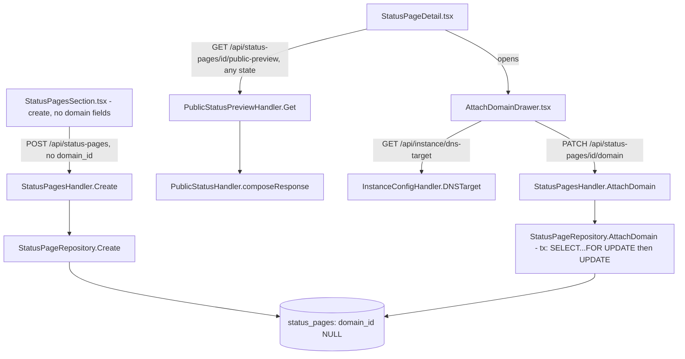

# Status Page Domain Attach Design

**Spec**: `.specs/features/status-page-domain-attach/spec.md`
**Status**: Draft

---

## Architecture Overview

`status_pages.domain_id`/`subdomain` become nullable. `POST /api/status-pages` keeps working with or without them (backward compatible with today's create-with-domain flow, per Out of Scope). A new `PATCH /api/status-pages/{id}/domain` sets both fields exactly once on a currently domain-less page, using a row-locked read-then-write transaction so a not-found, already-attached, invalid-domain, and duplicate-pair outcome are each distinguishable and race-safe. The preview endpoint drops its `state == "published"` gate entirely - it always composes, regardless of domain/state. A new tiny read endpoint surfaces the operator-configured DNS target string for the "attach domain" screen.



---

## Code Reuse Analysis

### Existing Components to Leverage

| Component | Location | How to Use |
| --------- | -------- | ---------- |
| `pgerrcode.UniqueViolation`/`ForeignKeyViolation` mapping pattern | `internal/db/domain_repository.go:36-49` (`ErrDuplicateHostname`) | Same `errors.As(err, &pgErr)` pattern for the new `ErrDomainAlreadyAttached`/`ErrInvalidDomain`/`ErrDuplicateDomainSubdomain`. |
| Migration numbering + runner | `internal/db/migrations/0012_company_settings.*.sql` (most recent), `internal/db/migrate.go` | New `0013_status_pages_nullable_domain.up/down.sql`. |
| `config.Config` optional env var pattern | `internal/config/config.go:64-67` (`LogLevel`), `:75-78` (`UploadsDir`) | `PublicDNSTarget` added the same way - `os.Getenv`, default `""` (empty = "not configured"), no `requireString`. |
| `writeRoles` RBAC group | `internal/cli/routes.go:48` | Reused verbatim for both new routes - no new RBAC code. |
| `PublicStatusHandler.composeResponse` (already company-settings-aware) | `internal/api/public_status_handler.go:122` | Unchanged - only the preview handler's caller-side gate is removed. |
| `Drawer` component | `web/src/components/ui/Drawer.tsx` (used for "Criar status page"/"Criar incidente") | Reused for the new "Anexar domínio" screen - same pattern the project already committed to for side-panel forms. |
| `useDomains` hook | `web/src/features/domains/hooks.ts` | Reused in the new attach-domain drawer to populate the domain picker - already used by `StatusPageDetail.tsx`/`StatusPagesSection.tsx`. |

### Integration Points

| System | Integration Method |
| ------ | ------------------- |
| `internal/cli/routes.go` (`buildAdminRouter`) | Registers `PATCH /api/status-pages/{id}/domain` (`writeRoles`) and `GET /api/instance/dns-target` (`writeRoles`). |
| PostgreSQL | `0013_status_pages_nullable_domain` migration: drops `NOT NULL` on `domain_id`/`subdomain`, adds partial unique index `(domain_id, subdomain) WHERE domain_id IS NOT NULL`. |
| `internal/api/public_status_preview_handler.go` | Removes the `state != "published"` early-return; keeps the `404` on unknown ID unchanged. |
| Frontend types (`types/api.ts`) | `StatusPage.domain_id`/`subdomain` become `string | null`. |

---

## Components

### `db.StatusPageRepository.AttachDomain` (new method)

- **Purpose**: Set `domain_id`/`subdomain` exactly once on a status page, race-safe, with distinguishable failure reasons.
- **Location**: `internal/db/status_page_repository.go`
- **Interfaces**:
  - `AttachDomain(ctx context.Context, id, domainID, subdomain string) (*StatusPage, error)` - opens a transaction, `SELECT domain_id FROM status_pages WHERE id = $1 FOR UPDATE`: no rows → `ErrNotFound`; non-null `domain_id` → `ErrDomainAlreadyAttached`; else `UPDATE status_pages SET domain_id = $1, subdomain = $2 WHERE id = $3`, mapping `ForeignKeyViolation` → `ErrInvalidDomain` (SPD-07) and `UniqueViolation` on the new partial index → `ErrDuplicateDomainSubdomain` (SPD-09); commits and returns the updated row on success.
- **Dependencies**: `*db.Pool`.
- **Reuses**: `pgerrcode` mapping pattern from `domain_repository.go`.

### `api.StatusPagesHandler.AttachDomain` (new handler method on the existing struct)

- **Purpose**: HTTP surface for `PATCH /api/status-pages/{id}/domain`.
- **Location**: `internal/api/status_pages_handler.go`
- **Interfaces**:
  - `AttachDomain(w http.ResponseWriter, r *http.Request)` - decodes `{domain_id, subdomain}`, `422` if `subdomain` empty or `domain_id` empty, maps repository errors: `ErrNotFound → 404`, `ErrDomainAlreadyAttached → 409`, `ErrInvalidDomain → 422`, `ErrDuplicateDomainSubdomain → 409`, else `200` + updated `statusPageResponse`.
- **Dependencies**: extends the existing `statusPageCreatorLister` interface with `AttachDomain(...)`.
- **Reuses**: existing `statusPageResponse` struct (now with nullable `domain_id`/`subdomain`), `writeInternalError`.

### `api.InstanceConfigHandler` (new, small)

- **Purpose**: Expose the operator-configured DNS target string.
- **Location**: `internal/api/instance_config_handler.go`
- **Interfaces**:
  - `DNSTarget(w http.ResponseWriter, r *http.Request)` - `200` + `{"target": "<value>"}` or `{"target": null}` when `config.PublicDNSTarget == ""`.
- **Dependencies**: the configured string, injected at construction (`NewInstanceConfigHandler(dnsTarget string, logger *zap.Logger)`).
- **Reuses**: nothing existing - smallest possible new handler, no DB dependency at all.

### `web/src/features/status-pages/AttachDomainDrawer.tsx` (new)

- **Purpose**: Side-panel form to pick an existing `Domain` + type a `subdomain`, showing the DNS target instructions.
- **Location**: `web/src/features/status-pages/AttachDomainDrawer.tsx`
- **Interfaces**: `<AttachDomainDrawer statusPageId={id} open={...} onOpenChange={...} />` - internally calls `useDomains()`, `useDNSTarget()`, `useAttachDomain()`.
- **Dependencies**: `Drawer` component, `useDomains`, new `useDNSTarget`/`useAttachDomain` hooks.
- **Reuses**: `Drawer` pattern already established for "Criar status page"/"Criar incidente".

---

## Data Models

### `db.StatusPage` (modified)

```go
type StatusPage struct {
    ID           string
    Name         string
    Subdomain    *string // was string - now nullable
    DomainID     *string // was string - now nullable
    State        string
    TLSLastError *string
    CreatedAt    time.Time
}
```

**Relationships**: unchanged FK to `domains(id)`, now nullable.

### New errors (`internal/db/status_page_repository.go`)

```go
var ErrDomainAlreadyAttached = errors.New("db: status page already has a domain attached")
var ErrInvalidDomain = errors.New("db: domain_id does not reference an existing domain")
var ErrDuplicateDomainSubdomain = errors.New("db: this domain/subdomain pair is already in use")
```

### Migration `0013_status_pages_nullable_domain`

```sql
-- up
ALTER TABLE status_pages ALTER COLUMN domain_id DROP NOT NULL;
ALTER TABLE status_pages ALTER COLUMN subdomain DROP NOT NULL;
CREATE UNIQUE INDEX status_pages_domain_subdomain_idx
    ON status_pages (domain_id, subdomain) WHERE domain_id IS NOT NULL;

-- down
DROP INDEX status_pages_domain_subdomain_idx;
ALTER TABLE status_pages ALTER COLUMN subdomain SET NOT NULL;
ALTER TABLE status_pages ALTER COLUMN domain_id SET NOT NULL;
```

### `config.Config` (modified)

Adds `PublicDNSTarget string`, read from `PUBLIC_DNS_TARGET`, default `""` (unset = not configured), same optional-var pattern as `UploadsDir`.

---

## Error Handling Strategy

| Error Scenario | Handling | User Impact |
| --------------- | -------- | ------------ |
| Attach on a page that doesn't exist | `404` | Drawer shows "página não encontrada" (should not normally happen - id comes from the already-loaded page) |
| Attach on a page that already has a domain | `409` (`ErrDomainAlreadyAttached`) | Inline error - "esta página já tem um domínio" (UI should not normally let this happen since the drawer only opens for domain-less pages, but the guard is server-side, not just client-side) |
| `domain_id` doesn't reference a real `Domain` | `422` (`ErrInvalidDomain`) | Inline error, though the picker only offers real domains so this mostly guards against stale client state |
| Empty `subdomain` | `422` (pre-DB validation) | Inline field error |
| `(domain_id, subdomain)` pair already used by another page | `409` (`ErrDuplicateDomainSubdomain`) | Inline error - "este subdomínio já está em uso neste domínio" |
| Two concurrent attach requests on the same page | One `200`, one `409` (`ErrDomainAlreadyAttached`), guaranteed by `SELECT ... FOR UPDATE` row lock | Second admin's UI shows the same "já tem domínio" error, refetches to see the winner's result |
| `PUBLIC_DNS_TARGET` never configured | `200` with `target: null` | Drawer shows a note that the operator hasn't configured this value yet; submission is not blocked |
| Preview requested for a nonexistent status page ID | `404` (unchanged) | Same as today |

---

## Risks & Concerns

| Concern | Location (file:line) | Impact | Mitigation |
| ------- | --------------------- | ------ | ---------- |
| `StatusPagesSection.tsx`/`StatusPageDetail.tsx` and `types/api.ts` currently type `domain_id`/`subdomain` as non-nullable `string`, and dereference them directly (`domains?.find((d) => d.id === page.domain_id)`, `` `https://${page.subdomain}.${hostname}` ``). | `web/src/features/status-pages/StatusPageDetail.tsx:14-15`, `StatusPagesSection.tsx:16,61` | Left untouched, these break at runtime (or silently render `"https://null.undefined"`) once the backend can return `null` for either field. | Tasks phase MUST update every read site to a null-safe branch before this ships - not a follow-up, a same-feature task (this is the reason SPD-01/SPD-02 exist). |
| Removing `state != "published"` from `public_status_preview_handler.go:68` also removes the comment block asserting it "mirrors `router.HostRouter`'s own gate" - that comment is now false once the code changes. | `internal/api/public_status_preview_handler.go:44-53` | A future reader trusts a stale comment describing behavior that no longer exists. | Task rewrites the comment to state the new, deliberate divergence and points at the new `AD-008` decision instead of the old "mirrors production" rationale. |
| `StatusPagesHandler.Create`'s existing with-domain path has no FK-violation or uniqueness mapping today (an invalid `domain_id` or a colliding `(domain_id, subdomain)` both fall through to a raw `500` via `writeInternalError`). | `internal/api/status_pages_handler.go:66-70`, `internal/db/status_page_repository.go:38-53` | Pre-existing gap (Out of Scope, not introduced by this feature) - stays exactly as broken as it is today for the with-domain create path. | Explicitly not fixed here; if this bites later, it becomes its own backlog item, not folded silently into this feature's scope. |
| Two callers of `NewStatusPageRepository`'s `Create` (`routes.go`, tests) and `NewPublicStatusPreviewHandler`'s dependency chain are unaffected by this design - confirmed no third call site exists for either. | `internal/cli/routes.go:44-45` | None - listed for completeness, not a real risk. | N/A. |

---

## Tech Decisions (only non-obvious ones)

| Decision | Choice | Rationale |
| -------- | ------ | --------- |
| Race-safety mechanism for attach | `SELECT ... FOR UPDATE` inside an explicit transaction, not a conditional `UPDATE ... WHERE domain_id IS NULL` | The conditional-`UPDATE` approach can't distinguish "row doesn't exist" from "already attached" (`0` rows affected either way) - the row lock lets a single query resolve which case applies before deciding, giving 4 distinguishable outcomes instead of 2. |
| Collision guard for `(domain_id, subdomain)` | A partial unique index (`WHERE domain_id IS NOT NULL`), not an application-level check-then-write | DB-level constraint is race-proof by construction; an app-level `SELECT` check first would reintroduce exactly the race this design avoids. Partial (not full-table) because many rows can share `domain_id IS NULL`. |
| Frontend create form | Removes the domain/subdomain fields entirely - the SPA always creates domain-less now, even though the backend still accepts the with-domain shape for API compatibility | Matches the user's requested flow literally ("depois, em tela separada") and removes client-side "both-or-neither" validation complexity the backend still needs to keep for backward compatibility. |
| DNS target exposure | New tiny dependency-free handler (`InstanceConfigHandler`), not folded into `company-settings` or `domains` | Keeps a single-purpose, trivially testable handler instead of overloading an unrelated resource's response shape. |
| `AD-008` (new project decision - append to `.specs/STATE.md`) | Preview endpoint (`public-preview`) no longer mirrors production's `state == "published"` gate - it always composes for any status page state, since it is authenticated/admin-only and was never the real public path | Supersedes part of `AD-007`'s item 2 rationale ("mirrors HostRouter's gate" was the explicit prior design choice). The prior choice's own stated goal - "so the SPA's preview and the eventual production page never disagree on what counts as visible" - is exactly what caused the reported bug: an admin who wants to preview *before* going live has no path to do so if preview insists on matching a not-yet-live production state. |

> **Project-level decision**: `AD-008` above gets appended to `.specs/STATE.md` `## Decisions` before Tasks starts, marking it distinct from (not a full reversal of) `AD-007`.

---

## Tips (n/a - implementation notes above are exhaustive for this feature's scope)
