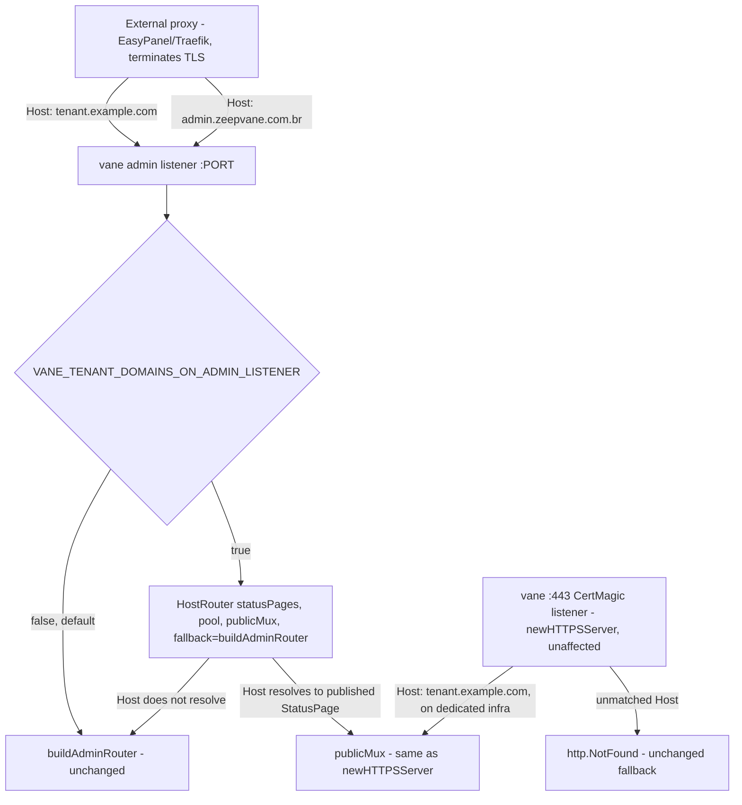

# Tenant Custom Domain Behind a Shared Reverse Proxy Design

**Spec**: `.specs/features/tenant-domain-shared-listener/spec.md`
**Status**: Draft

---

## Architecture Overview

`router.HostRouter` gains a fourth parameter, `fallback http.Handler`, called for any `Host` header it does not resolve to a published status page - replacing today's hard-coded `http.NotFound`. `newHTTPSServer`'s existing call site passes an explicit `http.HandlerFunc(http.NotFound)` as that fallback, so its behavior is byte-for-byte unchanged. A new opt-in config flag, `VANE_TENANT_DOMAINS_ON_ADMIN_LISTENER` (default `false`), controls a second `HostRouter` wrap applied to the admin listener's own `http.Server.Handler` in `RunE`: when enabled, the admin listener's handler becomes `HostRouter(statusPages, pool, publicMux, buildAdminRouter(...))` instead of `buildAdminRouter(...)` directly - a tenant-domain `Host` header serves the same public mux `newHTTPSServer` already builds, any other `Host` header falls through to the admin router exactly as it does today. The public mux construction (`/uploads/`, `/api/public-status`, `/` → SPA) is extracted into a small shared helper so both listeners build it identically instead of duplicating those three lines.



---

## Code Reuse Analysis

### Existing Components to Leverage

| Component | Location | How to Use |
| --------- | -------- | ---------- |
| `router.HostRouter` | `internal/router/host_router.go:92` | Reused verbatim for the new call site - only its signature gains one parameter, its resolution/RLS-scoping logic (`GetByHostname`, `BeginTenantTx`, `WithStatusPageID`/`WithTenantID`) is untouched. |
| Public mux construction (`/uploads/`, `/api/public-status`, `/`) | `internal/cli/serve.go:240-243` (inside `newHTTPSServer`) | Extracted into `newPublicStatusMux(pool *db.Pool) *http.ServeMux`, called from both `newHTTPSServer` and the new admin-listener wrap - no duplicated construction. |
| `db.NewStatusPageRepository` | `internal/db/status_page_repository.go` | Same repository type already satisfies `statusPageHostLookup`; a second instance is constructed for the admin-listener wrap (stateless wrapper over `*db.Pool`, cheap, no shared-mutable-state concern). |
| `config.Config` boolean-flag pattern | `internal/config/config.go` (`httpsEnabled := os.Getenv("VANE_HTTPS_ENABLED") != "false"`, `secureCookies` same shape) | New flag follows the *opposite* default polarity (`opt-in`, not `opt-out`): `os.Getenv("VANE_TENANT_DOMAINS_ON_ADMIN_LISTENER") == "true"`, default `false`. |
| `buildAdminRouter` | `internal/cli/routes.go:48` | Unchanged - becomes the `fallback` argument to `HostRouter` when the flag is enabled, otherwise still assigned directly to `srv.Handler` exactly as today. |

### Integration Points

| System | Integration Method |
| ------ | ------------------- |
| `internal/router/host_router.go` | `HostRouter` signature: `func HostRouter(statusPages statusPageHostLookup, pool tenantTxBeginner, publicHandler, fallback http.Handler) http.Handler`. |
| `internal/cli/serve.go` (`newHTTPSServer`) | Its `HostRouter(...)` call adds `http.HandlerFunc(http.NotFound)` as the new 4th argument - only change needed there. Its public-mux construction moves into the new shared helper. |
| `internal/cli/serve.go` (`RunE`) | `srv.Handler` assignment (currently `buildAdminRouter(pool, cfg, logger, pollerManager)`, line 123) becomes conditional on `cfg.TenantDomainsOnAdminListener`. |
| `internal/config/config.go` | New `TenantDomainsOnAdminListener bool` field, loaded the same way as `HTTPSEnabled`/`SecureCookies`. |
| `internal/router/host_router_tenant_test.go` | Every existing `HostRouter(statusPages, beginner, publicHandler)` call site (3 call sites, per the earlier grep) gets the new 4th argument, `http.HandlerFunc(http.NotFound)` - preserves each test's existing assertions unchanged, since that's exactly the fallback `newHTTPSServer` already used implicitly. |

---

## Components

### `router.HostRouter` (modified signature)

- **Purpose**: Dispatch by `Host` header to either the public status mux or, now, an operator-chosen fallback instead of an unconditional `404`.
- **Location**: `internal/router/host_router.go`
- **Interfaces**:
  - `HostRouter(statusPages statusPageHostLookup, pool tenantTxBeginner, publicHandler, fallback http.Handler) http.Handler` - unresolved hostname or `state != "published"` now calls `fallback.ServeHTTP(w, r)` (original `r`, untouched context) instead of `http.NotFound(w, r)`.
- **Dependencies**: unchanged (`statusPageHostLookup`, `tenantTxBeginner`).
- **Reuses**: its own existing resolution/RLS logic entirely - only the two `http.NotFound(w, r)` call sites (`host_router.go:98`, `:103`) become `fallback.ServeHTTP(w, r)`.

### `cli.newPublicStatusMux` (new, extracted helper)

- **Purpose**: Build the 3-route public mux (`/uploads/`, `/api/public-status`, `/`) once, shared by both listeners.
- **Location**: `internal/cli/serve.go`
- **Interfaces**:
  - `newPublicStatusMux(pool *db.Pool, logger *zap.Logger) *http.ServeMux` - lifted verbatim from `newHTTPSServer`'s current body (`services`, `intervals`, `incidents`, `tenants`, `publicHandler`, `logoFileHandler` construction + the 3 `Handle`/`HandleFunc` calls).
- **Dependencies**: `*db.Pool`, `*zap.Logger`.
- **Reuses**: `api.NewPublicStatusHandler`, `api.NewLogoFileHandler`, `web.StaticHandler` - all unchanged, just relocated into their own constructor function.

### `cli.RunE` (modified)

- **Purpose**: Conditionally wrap the admin listener's handler with `HostRouter` when the new flag is enabled.
- **Location**: `internal/cli/serve.go`, around line 123.
- **Interfaces**: no new exported surface - inline logic:
  ```go
  adminHandler := buildAdminRouter(pool, cfg, logger, pollerManager)
  if cfg.TenantDomainsOnAdminListener {
      statusPages := db.NewStatusPageRepository(pool)
      publicMux := newPublicStatusMux(pool, logger)
      adminHandler = router.HostRouter(statusPages, pool, publicMux, adminHandler)
  }
  srv := &http.Server{Addr: addr, Handler: adminHandler}
  ```
- **Dependencies**: `db.NewStatusPageRepository`, `newPublicStatusMux`, `router.HostRouter`.
- **Reuses**: everything above - this is pure wiring, no new logic.

---

## Data Models

No schema change. No new migration. `config.Config` gains one field:

```go
type Config struct {
    // ...unchanged...
    TenantDomainsOnAdminListener bool
}
```

Loaded in `config.Load()` immediately after `secureCookies`:

```go
tenantDomainsOnAdminListener := os.Getenv("VANE_TENANT_DOMAINS_ON_ADMIN_LISTENER") == "true"
```

---

## Error Handling Strategy

| Error Scenario | Handling | User Impact |
| --------------- | -------- | ------------ |
| Flag disabled (default) | No behavior change at all - `HostRouter` is never constructed for the admin listener, zero added Postgres round-trips | None - identical to pre-feature behavior. |
| Flag enabled, `Host` header resolves to a published status page | Served by the shared `publicMux`, same tenant-scoped RLS transaction as `newHTTPSServer` today | Tenant's custom domain works through the shared listener. |
| Flag enabled, `Host` header does not resolve (unregistered, draft, or the admin's own domain) | Falls through to `buildAdminRouter` unchanged | Admin API/SPA keeps working exactly as today - this is the change under the most scrutiny, since a regression here breaks the admin panel for every deployment that enables the flag. |
| Flag enabled, Postgres unreachable when `HostRouter` tries `BeginTenantTx` for what turns out to be a tenant-domain request | `503` (unchanged from `newHTTPSServer`'s existing behavior - `host_router.go:110-115`) | Tenant domain visitor sees a plain 503; admin domain traffic on the same listener is unaffected (the `BeginTenantTx` call only happens after `GetByHostname` already resolved a matching row - an admin-domain request never reaches that code path in the first place, since it's Host-based). |
| `newHTTPSServer`'s own existing unmatched-host case (its `fallback` is a literal `http.NotFound`) | Unchanged - still `404` | No behavior change for the dedicated `:443` listener. |

---

## Risks & Concerns

| Concern | Location (file:line) | Impact | Mitigation |
| ------- | --------------------- | ------ | ---------- |
| `host_router_tenant_test.go` has 3+ direct `HostRouter(statusPages, beginner, publicHandler)` call sites that break to compile once the signature gains a 4th required parameter. | `internal/router/host_router_tenant_test.go:263,320,400` (and any others found at Tasks time via a fresh grep) | Compile failure across the whole package if missed. | Same-feature Tasks item, not a follow-up: every existing call site gets `http.HandlerFunc(http.NotFound)` as its 4th argument, preserving each test's current assertions exactly (they were all implicitly testing "unmatched host was falling to a literal 404" whether or not that was written down before this feature). |
| Enabling the flag on a deployment that has **not** actually put an external proxy in front of the admin listener (e.g. a self-hosted install with no reverse proxy at all) adds a `GetByHostname` Postgres round-trip to every single admin request. | New code path in `RunE` | Latency regression, self-inflicted misconfiguration - not a correctness bug, since the fallback still serves the admin router correctly either way, just slower. | Documented as opt-in and SaaS-specific in README's config table (Tasks phase) - default stays `false`; nothing about this flag is auto-detected, matching the existing `PUBLIC_DNS_TARGET`/`VANE_ADMIN_BASE_URL` precedent of trusting operator-supplied config. |
| `HostRouter`'s doc comment (`host_router.go:70-74`) already asserts, in prose, that "any other hostname gets a 404" and that admin dispatch-by-host "is a design.md placeholder, not implemented here" - both statements become false once this feature ships. | `internal/router/host_router.go:70-74` | A future reader trusts a comment describing behavior that no longer exists - the same failure mode called out in `status-page-domain-attach/design.md`'s own Risks table for a different stale comment. | Task rewrites this comment block to describe the `fallback` parameter and point at this feature's `AD-038` instead of calling the admin-dispatch case unimplemented. |
| The two listeners (`newHTTPSServer` on `:443` and the admin listener with the flag enabled) can both be active simultaneously and could, in principle, both claim to serve the same tenant hostname if an operator misconfigures DNS/proxy routing for one tenant domain to point at the wrong listener. | `internal/cli/serve.go` (both listeners) | Confusing but not unsafe - both paths enforce the identical `tls.HostPolicy`-equivalent gate (`state == "published"` via the same `GetByHostname`/`statusPageHostLookup`) and the identical RLS tenant-scoping; worst case is "wrong listener, same correct data", never a cross-tenant leak. | Not mitigated in code - flagged in the README runbook (spec's P2 story) as an operator responsibility: point a given tenant domain at exactly one of the two listeners, never both. |

---

## Tech Decisions (only non-obvious ones)

| Decision | Choice | Rationale |
| -------- | ------ | --------- |
| How `HostRouter` learns "fall through instead of 404" | New required `fallback http.Handler` parameter, not a `nil`-checked optional one | A required parameter forces every call site (including `newHTTPSServer`'s) to be explicit about its fallback intent at compile time, rather than silently defaulting - matches the spec's Assumptions row that already chose this shape over alternatives (e.g. two separate `chi` routes) as the smallest change preserving the matched-case contract. |
| Flag polarity | Opt-in (`false` default), not opt-out | Zero behavior/latency change for every deployment that doesn't need this (self-hosted default, SaaS-with-dedicated-`:443` deployments) - matches the spec's Assumptions row and the existing precedent of `VANE_DEPLOYMENT_MODE` defaulting to the safer, narrower behavior. |
| Whether the two listeners are made mutually exclusive | Not enforced - both can run simultaneously (`VANE_HTTPS_ENABLED=true` and `VANE_TENANT_DOMAINS_ON_ADMIN_LISTENER=true` at once is valid) | No stated requirement to forbid a mixed deployment (some tenant domains on dedicated infra routed to `:443`, others behind the shared proxy) - see the spec's Assumptions row; the Risks table above documents the only real consequence (operator must not double-route one domain to both). |
| `AD-038` (new project decision - append to `.specs/STATE.md`) | `router.HostRouter` supports a caller-supplied fallback instead of a hard-coded `404`, and the admin listener can optionally reuse it (`VANE_TENANT_DOMAINS_ON_ADMIN_LISTENER`) to serve tenant custom domains without dedicating ports 80/443 to `vane` directly - needed because a shared external reverse proxy (EasyPanel/Traefik) already owns those ports on a SaaS deployment | Confirmed this session: EasyPanel's Traefik already terminates TLS for the admin domain on the same host, and provides no built-in way to also raw-passthrough ports 80/443 to `vane`'s own CertMagic listener without either a second dedicated IP or hand-written custom Traefik TCP-passthrough config (both real infra burdens, no code alternative existed before this feature). |

> **Project-level decision**: `AD-038` above gets appended to `.specs/STATE.md` `## Decisions` before Tasks starts.

---

## Tips

- Grep for every `HostRouter(` call site fresh at Tasks time (not just the ones already listed above) before changing the signature - a stale count here would leave a compile error undiscovered until `go build`.
- `newPublicStatusMux`'s extraction is a pure refactor with no behavior change - safe to do as its own first task, verified by `newHTTPSServer`'s existing tests (if any construct it indirectly) continuing to pass unchanged before the new admin-listener wiring is added on top.
