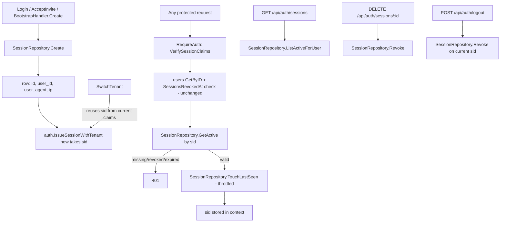

# Per-Device User Sessions Design

**Spec**: `.specs/features/user-sessions/spec.md`
**Status**: Draft

---

## Architecture Overview

Every issued session token gains a `sid` claim identifying a real `sessions` row. `RequireAuth` becomes the single enforcement point that resolves `sid` → row on every authenticated request, exactly the same shape it already uses for `SessionsRevokedAt`. All four existing token-issuing call sites (`Login`, `SwitchTenant`, `AdminsHandler.AcceptInvite`, `BootstrapHandler.Create`) create (or, for `SwitchTenant`, reuse) a row before signing.



---

## Code Reuse Analysis

### Existing Components to Leverage

| Component | Location | How to Use |
| --- | --- | --- |
| `RequireAuth`'s existing `SessionsRevokedAt` check | `internal/api/middleware.go:87-134` | The new `sid` lookup slots in right after it, same fail-closed `401` shape, same "check DB state the JWT alone can't express" pattern. |
| `sessionClaims`/`IssueSessionWithTenant` | `internal/auth/session.go` | Extended, not replaced — `TenantID` stays; `sid` (`SessionID`) is a new required field alongside it. |
| `db.ErrNotFound` | `internal/db` | `SessionRepository.GetActive` returns it exactly like every other repository's not-found case. |
| Anti-enumeration 404 convention | e.g. `domains_handler.go`'s `Delete` (`db.ErrNotFound` → `http.NotFound`) | `DELETE /api/auth/sessions/{id}` for a nonexistent-or-not-mine row returns the same 404 shape, never a 403 that would confirm existence. |
| `checkVerifyCooldown`'s "throttle without a scheduled job" shape | `internal/api/domains_handler.go:165-174` | Conceptually similar throttling need, but `last_seen_at`'s throttle is per-row and best done as a single `WHERE last_seen_at < now() - interval` guard directly in the `UPDATE`, not an in-process map — no in-memory state needed since the row itself carries the last-write timestamp. |

### Integration Points

| System | Integration Method |
| --- | --- |
| Postgres | New `sessions` table (migration). |
| `internal/auth` | `sessionClaims` gains `Sid` (JWT `sid` claim); `IssueSessionWithTenant`'s signature gains a `sessionID string` parameter. |
| `internal/api/middleware.go` | `RequireAuth` gains a `sessions sessionValidator` dependency; a new `sessionIDContextKey` context value. |
| 4 call sites | `AuthHandler.Login`, `AuthHandler.SwitchTenant`, `AdminsHandler.AcceptInvite`, `BootstrapHandler.Create` — each gains a `sessions sessionCreator` (or equivalent) dependency. |

---

## Components

### `SessionRepository` (`internal/db/session_repository.go`, new)

- **Purpose**: Own the `sessions` table — the single source of truth for which tokens are still valid.
- **Interfaces**:
  - `Create(ctx, userID string, userAgent, ip *string) (*Session, error)` — inserts a row, `created_at`/`last_seen_at` both `now()`, returns the generated ID.
  - `GetActive(ctx, id string) (*Session, error)` — `db.ErrNotFound` if the row doesn't exist, `revoked_at` is set, or `created_at` is older than `auth.SessionTTL` (computed as a Go-side cutoff passed as a bound parameter, not a SQL interval literal — avoids a second place encoding the 24h TTL that could drift from `auth.SessionTTL`).
  - `TouchLastSeen(ctx, id string) error` — `UPDATE sessions SET last_seen_at = now() WHERE id = $1 AND last_seen_at < now() - interval '5 minutes'`; the `WHERE` guard is the entire throttle — no rows affected means "already touched recently enough", not an error.
  - `ListActiveForUser(ctx, userID string) ([]Session, error)` — same "active" predicate as `GetActive` (not revoked, not TTL-expired), ordered `created_at DESC`.
  - `Revoke(ctx, id, userID string) (bool, error)` — `UPDATE sessions SET revoked_at = now() WHERE id = $1 AND user_id = $2 AND revoked_at IS NULL RETURNING id`; `bool` reports whether a row was found *for that user* at all (existence+ownership), independent of whether it was already revoked — the handler queries existence separately only when it needs to distinguish 404 from a no-op on an already-revoked row (see Error Handling).
- **Dependencies**: `*db.Pool`.
- **Reuses**: Standard repository shape already used by every other table this cycle (`PollerLeadershipRepository`, `DomainRepository`).

### `internal/auth/session.go` changes (edit)

- **Purpose**: Carry `sid` through the token.
- **Change**: `sessionClaims` gains `SessionID string \`json:"sid"\``. `IssueSessionWithTenant(userID, tenantID, sessionID, secret string) (string, error)` — new required parameter, inserted before `secret` to match the existing `(userID, tenantID, secret)` ordering convention. `IssueSession` (the tenant-agnostic original) is **not** extended — it has no known caller left after `multi-tenancy-core` (confirmed by re-grepping call sites during Execute); if a caller remains, it gains the same parameter.
- **`SessionClaims`/`VerifySessionClaims`**: gains `SessionID string` in the returned struct, read from the `sid` claim. A token signed before this feature ships (none should exist in production given `SessionTTL` is 24h and this is a code deploy, not a rolling migration across a long-lived token population) would have `SessionID == ""` — `RequireAuth`'s new lookup treats an empty `sid` as "no matching row" → `401`, which is the correct fail-closed behavior for a token this feature doesn't recognize.
- **Reuses**: Existing `sessionClaims`/`jwt.RegisteredClaims` structure — purely additive field.

### `RequireAuth` changes (`internal/api/middleware.go`, edit)

- **Purpose**: Enforce the `sid` → row check on every authenticated request.
- **New interface**: `sessionValidator` — `GetActive(ctx, id string) (*db.Session, error)`, `TouchLastSeen(ctx, id string) error` (the narrowed subset of `*db.SessionRepository` this middleware needs, same convention as `userLoader`).
- **Change**: `RequireAuth(secret string, users userLoader, sessions sessionValidator) func(...)`. After the existing `SessionsRevokedAt` check, call `sessions.GetActive(ctx, claims.SessionID)`; `401` on error. On success, call `sessions.TouchLastSeen(ctx, claims.SessionID)` — logged, non-fatal on error (matches this codebase's existing "best-effort side effect" posture, e.g. `ChangePassword`'s `RevokeSessions` call). Store `claims.SessionID` in context via a new `sessionIDContextKey`, exposed as `SessionIDFromContext(ctx) (string, bool)`.
- **Reuses**: Exact same fail-closed shape and ordering as the existing revocation check right above it.

### `AuthHandler` changes (`internal/api/auth_handler.go`, edit)

- **Purpose**: Wire session-row creation/reuse/revocation into the four relevant handlers, plus the two new endpoints.
- **New interface**: `sessionStore` — `Create(ctx, userID string, userAgent, ip *string) (*db.Session, error)`, `ListActiveForUser(ctx, userID string) ([]db.Session, error)`, `Revoke(ctx, id, userID string) (bool, error)`.
- **`Login`**: after tenant resolution, call `h.sessions.Create(ctx, user.ID, userAgentPtr(r), remoteIPPtr(r))`, pass the returned `session.ID` into `IssueSessionWithTenant`.
- **`SwitchTenant`**: reuses `claims.SessionID` from the request's own already-verified token (read via `SessionIDFromContext` — `RequireAuth` already ran) — no `sessions.Create` call.
- **`Logout`**: reads `SessionIDFromContext`, calls `h.sessions.Revoke(ctx, sid, user.ID)` (best-effort — logged, not fatal, matching `ChangePassword`'s posture) before clearing the cookie.
- **New `Sessions(w, r)`** — `GET /api/auth/sessions`: calls `ListActiveForUser`, marks the row whose `ID == currentSid` (from context) as `current: true`.
- **New `RevokeSession(w, r)`** — `DELETE /api/auth/sessions/{id}`: if `{id} == currentSid` respond `409` without querying; otherwise call `Revoke(ctx, id, user.ID)`, `404` if no row found for that user.
- **Dependencies**: new `sessions sessionStore` field.

### `AdminsHandler.AcceptInvite` / `BootstrapHandler.Create` changes (edit)

- **Purpose**: These are the other two token-issuing call sites (`internal/api/admins.go:376`, `internal/api/bootstrap_handler.go:184`) — both gain the identical `sessions.Create` → `IssueSessionWithTenant(..., session.ID, ...)` sequence `Login` uses. No behavioral change to either handler beyond that.
- **Reuses**: Same `SessionRepository.Create` call, same `userAgentPtr`/`remoteIPPtr` helpers (new small package-level functions in `internal/api`, since all four call sites need identical `*http.Request` → `*string` extraction).

---

## Data Models

### `sessions`

```sql
CREATE TABLE sessions (
    id UUID PRIMARY KEY DEFAULT gen_random_uuid(),
    user_id UUID NOT NULL REFERENCES users(id) ON DELETE CASCADE,
    user_agent TEXT NULL,
    ip TEXT NULL,
    created_at TIMESTAMPTZ NOT NULL DEFAULT now(),
    last_seen_at TIMESTAMPTZ NOT NULL DEFAULT now(),
    revoked_at TIMESTAMPTZ NULL
);
CREATE INDEX idx_sessions_user_id ON sessions (user_id);
```

**Relationships**: many rows per user (one per device/login); `ON DELETE CASCADE` matches how a deleted user's other owned rows already behave elsewhere in this schema (no orphaned session rows to clean up separately).

---

## Error Handling Strategy

| Error Scenario | Handling | User Impact |
| --- | --- | --- |
| Token's `sid` has no matching row (revoked, expired, or never existed — including pre-feature tokens with empty `sid`) | `401`, same body as every other `RequireAuth` rejection | Indistinguishable from an expired/invalid token — no oracle for "does this session ID exist". |
| `DELETE /api/auth/sessions/{id}` for someone else's session, or a nonexistent one | `404` | Matches the anti-enumeration convention already used elsewhere (`domains_handler.go`'s `Delete`). |
| `DELETE /api/auth/sessions/{id}` targeting the caller's own current session | `409`, no mutation | Matches spec AC — `Logout` is the correct action for that case. |
| `TouchLastSeen` write fails (e.g. transient DB error) | Logged, request proceeds | A missed `last_seen_at` update is a cosmetic staleness in the sessions list, never a reason to reject an otherwise-valid request. |
| `Revoke` on `Logout` fails | Logged, cookie still cleared | Matches existing `ChangePassword`/`RevokeSessions` non-fatal posture — worst case a stale token remains valid until its 24h TTL, the exact pre-existing behavior this feature is improving, not regressing. |

---

## Risks & Concerns

| Concern | Location (file:line) | Impact | Mitigation |
| --- | --- | --- | --- |
| `RequireAuth` now does one additional indexed lookup (`GetActive`) plus a conditional write (`TouchLastSeen`) on every single authenticated request — the hottest path in the whole API | `internal/api/middleware.go:87` | Added latency/DB load per request. | `GetActive` is a primary-key lookup (cheapest possible query shape); `TouchLastSeen`'s `WHERE last_seen_at < now() - interval '5 minutes'` guard means the write only fires at most once per 5 minutes per session, not per request — matches the spec's own throttle requirement (SESS-04), already sized for this concern. |
| Four separate call sites (`Login`, `SwitchTenant`, `AcceptInvite`, `BootstrapHandler.Create`) must all stay consistent about creating vs. reusing a session row | `internal/api/auth_handler.go`, `internal/api/admins.go:376`, `internal/api/bootstrap_handler.go:184` | A future auth call site added without wiring `sessions.Create` would silently issue a token with `sid == ""`, which `RequireAuth` would then reject as unauthenticated — fails closed, not open, but still a broken login for that path. | Flagged here explicitly for Execute's task list: each of the 3 non-`Login` call sites gets its own task with an explicit test asserting a `sessions` row is created (or reused) by that specific handler — not just inferred from `Login`'s coverage. |
| `sessions.ip` stores the raw `RemoteAddr`, which for a deployment behind a reverse proxy (not covered by `X-Forwarded-For`, per this codebase's existing rate-limiting rule) will show the proxy's IP for every session | `internal/api/auth_handler.go` (new `remoteIPPtr` helper) | The "Sessões ativas" list's IP column is not useful behind certain proxy setups. | Explicitly out of scope per spec (same `RemoteAddr`-only rule the rate limiter already uses, AGENTS.md §4) — not a regression this feature introduces, and changing IP-sourcing trust rules is a separate, security-sensitive decision this spec doesn't touch. |

---

## Tech Decisions (only non-obvious ones)

| Decision | Choice | Rationale |
| --- | --- | --- |
| `last_seen_at` throttle mechanism | A single `WHERE`-guarded `UPDATE`, not an in-process map (unlike `domains_handler.go`'s `checkVerifyCooldown`) | The throttle here is per-row and the row already carries the timestamp needed to gate on — no in-memory state to keep in sync across replicas (this codebase runs multi-replica per `AD-013`), whereas `checkVerifyCooldown`'s in-process map is a known, accepted per-replica approximation for a much lower-stakes cooldown. A DB-side guard is strictly more correct here for the same cost. |
| `sessions.id` generation | `gen_random_uuid()` (Postgres-side), matching `two_factor_recovery_codes`/other UUID-PK tables in this schema | Consistency with existing migrations; no reason to generate client-side. |
| `IssueSession` (tenant-agnostic variant) | Left unextended unless a live caller is found at Execute time | Keeps the diff minimal; re-verified via grep rather than assumed, per this cycle's established discipline of confirming call sites against actual code. |

> No new `AD-NNN` — this feature operates entirely within `AD-004`'s existing session/cookie posture, extending the token's claim set rather than changing its transport or storage location.
